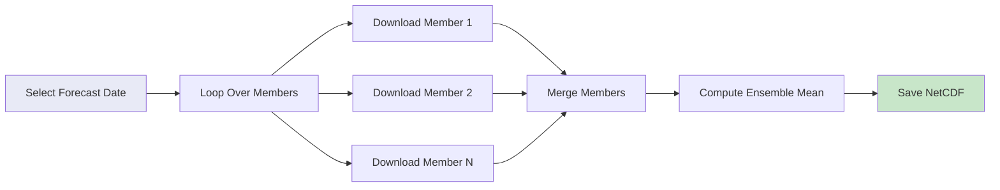

# 🌧️ Downloading ECMWF S2S Ensemble Precipitation Forecasts

## Overview

**ECMWF S2S Ensemble** provides probabilistic precipitation forecasts with up to 51 ensemble members. This tutorial guides you through downloading multiple ensemble members, computing the ensemble mean, and creating probabilistic products for extended-range forecasting.

<div class="grid cards" markdown>

-   :material-weather-pouring: **Dataset**
    
    ---
    
    ECMWF S2S Ensemble Precipitation
    
    **Variable:** Total Precipitation (tp)  
    **Resolution:** ~1.5° (native) or custom  
    **Output:** Daily totals (mm/day)  
    **Forecast Range:** 1–46 days

-   :material-chart-bell-curve: **Ensemble**
    
    ---
    
    **Members:** 51 total  
    **Control:** 1 (unperturbed)  
    **Perturbed:** 50 members  
    **Products:** Mean, spread, percentiles

-   :material-update: **Update Frequency**
    
    ---
    
    **Cycles:** Monday & Thursday  
    **Latency:** ~1-2 days after init  
    **Retention:** ~3 weeks

-   :material-file-download: **Access**
    
    ---
    
    **Source:** ECMWF MARS  
    **Method:** ecmwfapi Python  
    **Authentication:** Required (free)  
    **Format:** NetCDF or GRIB

</div>

---

## 🎯 What This Script Does



The script performs the following operations:

1. **Downloads** daily precipitation for each ensemble member
2. **Validates** each member file for completeness
3. **Stacks** all members along a new dimension
4. **Computes** the ensemble mean
5. **Saves** the result as a single NetCDF file

---

## 🚀 Quick Start Guide

### Prerequisites

!!! warning "ECMWF Account Required"
    You need a free ECMWF account to access S2S data:
    
    1. **Register:** [https://apps.ecmwf.int/registration/](https://apps.ecmwf.int/registration/)
    2. **Get API key:** [https://api.ecmwf.int/v1/key/](https://api.ecmwf.int/v1/key/)
    3. **Configure:** Create `~/.ecmwfapirc` with your credentials

!!! info "Required Python Packages"
    ```bash
    pip install ecmwf-api-client xarray netCDF4
    ```

### API Configuration

Create a file `~/.ecmwfapirc` (Linux/Mac) or `%USERPROFILE%\.ecmwfapirc` (Windows):

```json
{
    "url"   : "https://api.ecmwf.int/v1",
    "key"   : "YOUR-API-KEY-HERE",
    "email" : "your.email@example.com"
}
```

### Basic Usage

=== "10 Members (Quick)"
    ```bash
    python download_ecmwf_s2s_tp_ensemble.py \
        --outdir data/s2s_ensemble \
        --outfile s2s_ensmean_tp_ethiopia.nc \
        --date 2025-01-13 \
        --lead-days 30 \
        --members 10 \
        --lat-min 3 --lat-max 15 \
        --lon-min 33 --lon-max 48
    ```

=== "All 50 Members"
    ```bash
    python download_ecmwf_s2s_tp_ensemble.py \
        --outdir data/s2s_ensemble \
        --outfile s2s_ensmean_tp_ethiopia_full.nc \
        --date 2025-01-13 \
        --lead-days 30 \
        --members 50 \
        --lat-min 3 --lat-max 15 \
        --lon-min 33 --lon-max 48
    ```

=== "Custom Grid"
    ```bash
    python download_ecmwf_s2s_tp_ensemble.py \
        --outdir data/s2s_ensemble \
        --outfile s2s_ensmean_tp_ethiopia_0p5.nc \
        --date 2025-01-13 \
        --lead-days 30 \
        --members 20 \
        --lat-min 3 --lat-max 15 \
        --lon-min 33 --lon-max 48 \
        --grid 0.5/0.5
    ```

---

## 📋 The Complete Script

### Python Download Script

Save this as `download_ecmwf_s2s_tp_ensemble.py`:

```python
#!/usr/bin/env python
"""
Download ECMWF S2S realtime **daily total precipitation (24h accumulations)**
for multiple ensemble members and compute the ensemble mean.

Example:
python download_ecmwf_s2s_tp_ensemble_dailymean.py \
  --outdir data/s2s_ecmwf \
  --outfile s2s_ecmwf_ensmean_tp_2025-11-03_ea.nc \
  --date 2025-11-03 \
  --lead-days 14 \
  --members 10 \
  --lat-min 3 --lat-max 15 --lon-min 33 --lon-max 48
"""

import argparse
import os
from datetime import datetime
from typing import List

import xarray as xr
from ecmwfapi import ECMWFDataServer


# --------------------------------------------------------------------------- #
# Helpers
# --------------------------------------------------------------------------- #

def build_daily_step_string(lead_days: int) -> str:
    """
    Build a MARS step string for 24-hour lead times.

    For lead_days = 5 → "24/48/72/96/120"
    (i.e. end of each 24-hour accumulation period).
    """
    if lead_days < 1:
        raise ValueError("lead_days must be >= 1")

    steps = [str(24 * (i + 1)) for i in range(lead_days)]
    return "/".join(steps)


def retrieve_s2s_tp_daily_member(
    date_str: str,
    lead_days: int,
    lat_min: float,
    lat_max: float,
    lon_min: float,
    lon_max: float,
    member: int,
    out_path: str,
    grid: str | None = None,
    fmt: str = "netcdf",
) -> bool:
    """
    Submit an ECMWF S2S request for **daily total precipitation** for ONE
    ensemble member (perturbed forecast, type=pf, number=member).

    Returns True if request appears to succeed, False if ECMWF returns an error
    (e.g. "data not found" or empty GRIB/NetCDF).
    """
    if lead_days < 1 or lead_days > 46:
        raise ValueError("lead_days must be between 1 and 46 for ECMWF S2S.")

    server = ECMWFDataServer()
    steps = build_daily_step_string(lead_days)

    # ECMWF area string is N/W/S/E
    area = f"{lat_max}/{lon_min}/{lat_min}/{lon_max}"

    request = {
        "class": "s2",
        "dataset": "s2s",
        "expver": "prod",
        "origin": "ecmf",
        "model": "glob",
        "levtype": "sfc",
        "stream": "enfo",
        "type": "pf",          # perturbed forecast (ensemble members)
        "number": str(member),
        "param": "tp",         # daily total precip (paramId 228228 internally)
        "date": date_str,      # YYYY-MM-DD, forecast start date
        "time": "00:00:00",
        "step": steps,         # e.g. "24/48/72/..."
        "area": area,
        "format": fmt,
        "target": out_path,
        # Avoid failing with "Expected N, got M" if some steps are missing
        "expect": "any",
    }

    if grid is not None:
        request["grid"] = grid  # e.g. "1.5/1.5" or "0.5/0.5"

    print(f"[info] Submitting S2S daily TP request to ECMWF for member={member}...")
    print("[info] Request:", request)

    try:
        server.retrieve(request)
    except Exception as exc:
        print(f"[warn] ECMWF request failed for member={member}: {exc}")
        return False

    # Quick file sanity check (sometimes an empty file is created)
    if (not os.path.exists(out_path)) or (os.path.getsize(out_path) < 500):
        print(f"[warn] Output for member={member} looks empty or too small: {out_path}")
        return False

    print(f"[info] Download finished for member={member}: {out_path}")
    return True


def compute_ensemble_mean_tp(
    member_files: List[str],
    out_path: str,
) -> None:
    """
    Read all member NetCDFs, stack along 'member', optionally convert TP to
    mm/day (if still in m or kg m**-2), and write ensemble mean to out_path.
    """
    datasets = []
    member_ids = []

    for m, fpath in enumerate(member_files, start=1):
        if not os.path.exists(fpath):
            print(f"[warn] Member file missing, skipping: {fpath}")
            continue

        try:
            ds = xr.open_dataset(fpath)
        except Exception as exc:
            print(f"[warn] Failed to open {fpath}: {exc}")
            continue

        if "tp" not in ds:
            print(f"[warn] No 'tp' variable in {fpath}, skipping.")
            continue

        da = ds["tp"]

        units = str(da.attrs.get("units", "")).lower()

        # Convert only if still in m or kg m**-2
        if (
            "kg m-2" in units
            or "kg m**-2" in units
            or units.strip() == "m"
            or "m of water" in units
        ):
            da.attrs["units"] = "mm/day"
            print(f"[info] Converted TP from '{units}' to 'mm/day' for member {m}")
        elif "mm" in units:
            # Already in mm or mm/day → leave as is
            print(f"[info] TP already in mm units ('{units}') for member {m}, no scaling.")
        else:
            print(
                f"[warn] Unrecognized TP units '{units}' in {fpath}, "
                "leaving values unchanged."
            )

        # Add member dimension
        da = da.expand_dims({"member": [m]})
        datasets.append(da)
        member_ids.append(m)

    if not datasets:
        raise RuntimeError("No valid member files found to build ensemble mean.")

    tp_all = xr.concat(datasets, dim="member")
    tp_all["member"] = member_ids

    ens_mean = tp_all.mean(dim="member", skipna=True)
    ens_ds = ens_mean.to_dataset(name="tp")

    # Make sure units label is sensible
    if "units" not in ens_ds["tp"].attrs:
        ens_ds["tp"].attrs["units"] = "mm/day"

    ens_ds.to_netcdf(out_path)
    print(f"[info] Ensemble mean written to: {out_path}")
    print("[info] Variable: 'tp' (dims: time, lat, lon)")


# --------------------------------------------------------------------------- #
# CLI
# --------------------------------------------------------------------------- #

def parse_args() -> argparse.Namespace:
    p = argparse.ArgumentParser(
        description=(
            "Download ECMWF S2S realtime daily total precipitation (24h accum) "
            "for multiple ensemble members and compute ensemble mean."
        )
    )
    p.add_argument("--outdir", required=True, help="Output directory")
    p.add_argument("--outfile", required=True, help="Final ensemble-mean filename (NetCDF)")
    p.add_argument(
        "--date",
        required=True,
        help="Forecast initial date (YYYY-MM-DD) for S2S start (use valid S2S start, e.g. Monday/Thursday).",
    )
    p.add_argument(
        "--lead-days",
        type=int,
        required=True,
        help="Number of lead days (1–46) of daily totals to retrieve",
    )
    p.add_argument(
        "--members",
        type=int,
        required=True,
        help="Number of ensemble members (perturbed forecasts) to request (e.g. 10, 20, 50).",
    )
    p.add_argument("--lat-min", type=float, required=True)
    p.add_argument("--lat-max", type=float, required=True)
    p.add_argument("--lon-min", type=float, required=True)
    p.add_argument("--lon-max", type=float, required=True)
    p.add_argument(
        "--grid",
        default=None,
        help="Optional output grid resolution 'lat/lon', e.g. '1.5/1.5' or '0.5/0.5'",
    )
    p.add_argument(
        "--fmt",
        default="netcdf",
        choices=["netcdf", "grib"],
        help="Output format for member files (default: netcdf).",
    )
    return p.parse_args()


def main() -> None:
    args = parse_args()

    # Ensure output directory exists
    os.makedirs(args.outdir, exist_ok=True)
    ens_out_path = os.path.join(args.outdir, args.outfile)

    # Basic date sanity check
    try:
        datetime.strptime(args.date, "%Y-%m-%d")
    except ValueError as exc:
        raise SystemExit(f"Invalid --date '{args.date}', expected YYYY-MM-DD") from exc

    # Base path for member files (same prefix as final ensemble file)
    base_prefix = os.path.splitext(ens_out_path)[0]

    member_files: List[str] = []

    for m in range(1, args.members + 1):
        member_path = f"{base_prefix}_member{m:02d}.nc"
        ok = retrieve_s2s_tp_daily_member(
            date_str=args.date,
            lead_days=args.lead_days,
            lat_min=args.lat_min,
            lat_max=args.lat_max,
            lon_min=args.lon_min,
            lon_max=args.lon_max,
            member=m,
            out_path=member_path,
            grid=args.grid,
            fmt=args.fmt,
        )
        if ok:
            member_files.append(member_path)
        else:
            print(f"[warn] Skipping member={m} due to retrieval/conversion issues.")

    if not member_files:
        raise SystemExit("No member files were successfully downloaded. Aborting.")

    # Compute ensemble mean from the successfully downloaded members
    compute_ensemble_mean_tp(member_files, ens_out_path)


if __name__ == "__main__":
    main()
```

---

## 🔧 Command-Line Arguments

### Required Arguments

| Argument | Type | Description | Example |
|----------|------|-------------|---------|
| `--outdir` | String | Output directory path | `data/s2s_ensemble` |
| `--outfile` | String | Final ensemble mean filename | `s2s_ensmean_tp.nc` |
| `--date` | Date (YYYY-MM-DD) | Forecast initialization date | `2025-01-13` |
| `--lead-days` | Integer | Number of forecast days (1–46) | `30` |
| `--members` | Integer | Number of ensemble members (1–50) | `10` |
| `--lat-min` | Float | Minimum latitude (south) | `3` |
| `--lat-max` | Float | Maximum latitude (north) | `15` |
| `--lon-min` | Float | Minimum longitude (west) | `33` |
| `--lon-max` | Float | Maximum longitude (east) | `48` |

### Optional Arguments

| Argument | Type | Description | Default |
|----------|------|-------------|---------|
| `--grid` | String | Output grid resolution | Native (~1.5°) |
| `--fmt` | String | Output format (netcdf/grib) | `netcdf` |

---

## 📊 Understanding Ensemble Forecasts

### What is an Ensemble?

An **ensemble forecast** runs the same model multiple times with slightly different initial conditions or model physics. This provides:

| Product | Description | Use Case |
|---------|-------------|----------|
| **Ensemble Mean** | Average of all members | Best single estimate |
| **Ensemble Spread** | Standard deviation | Forecast uncertainty |
| **Percentiles** | 10th, 25th, 50th, 75th, 90th | Probability ranges |
| **Exceedance Probability** | P(precip > threshold) | Risk assessment |

### ECMWF S2S Ensemble Structure

```
Ensemble (51 members total)
├── Control (cf, number=0)     → Unperturbed initial conditions
└── Perturbed (pf, number=1-50) → Perturbed initial conditions
    ├── Member 1
    ├── Member 2
    ├── ...
    └── Member 50
```

!!! info "Control vs Perturbed"
    - **Control (cf):** Single deterministic forecast, unperturbed
    - **Perturbed (pf):** 50 members with perturbed initial conditions
    - The script downloads perturbed members (type=pf)

---

## 📈 Choosing Number of Members

| Members | Download Time | Accuracy | Use Case |
|---------|--------------|----------|----------|
| **5-10** | ~10-20 min | Basic | Quick testing, development |
| **20** | ~30-40 min | Good | Operational forecasting |
| **50** | ~1-2 hours | Best | Research, probabilistic products |

!!! tip "Recommendation"
    - Start with **10 members** for testing
    - Use **20 members** for operational work
    - Use **all 50 members** for probabilistic products (percentiles, spread)

---

## 📍 Regional Bounding Boxes

Use these coordinates with the `--lat-min`, `--lat-max`, `--lon-min`, `--lon-max` arguments:

=== "Ethiopia"
    ```bash
    --lat-min 3 --lat-max 15 --lon-min 33 --lon-max 48
    ```
    **Coverage:** Entire Ethiopia

=== "East Africa"
    ```bash
    --lat-min -5 --lat-max 12 --lon-min 28 --lon-max 42
    ```
    **Coverage:** Kenya, Uganda, Tanzania, Rwanda, Burundi

=== "Horn of Africa"
    ```bash
    --lat-min -5 --lat-max 18 --lon-min 32 --lon-max 52
    ```
    **Coverage:** Ethiopia, Somalia, Eritrea, Djibouti, Kenya

=== "Greater Horn of Africa"
    ```bash
    --lat-min -12 --lat-max 23 --lon-min 21 --lon-max 52
    ```
    **Coverage:** Extended region including Sudan, South Sudan

---

## 💡 Usage Examples

### Example 1: Quick 10-Member Ensemble

```bash
python download_ecmwf_s2s_tp_ensemble.py \
    --outdir data/s2s_ensemble \
    --outfile s2s_ensmean_tp_ethiopia_10m.nc \
    --date 2025-01-13 \
    --lead-days 30 \
    --members 10 \
    --lat-min 3 --lat-max 15 \
    --lon-min 33 --lon-max 48
```

**What it does:**

- Downloads 10 ensemble members
- Computes ensemble mean
- ~15-20 minutes download time
- Good for initial testing

---

### Example 2: Full 50-Member Ensemble

```bash
python download_ecmwf_s2s_tp_ensemble.py \
    --outdir data/s2s_ensemble \
    --outfile s2s_ensmean_tp_ethiopia_50m.nc \
    --date 2025-01-13 \
    --lead-days 30 \
    --members 50 \
    --lat-min 3 --lat-max 15 \
    --lon-min 33 --lon-max 48
```

**What it does:**

- Downloads all 50 perturbed members
- Best probabilistic information
- ~1-2 hours download time
- Recommended for research

---

### Example 3: Short-Range with Higher Resolution

```bash
python download_ecmwf_s2s_tp_ensemble.py \
    --outdir data/s2s_ensemble \
    --outfile s2s_ensmean_tp_ethiopia_2week.nc \
    --date 2025-01-13 \
    --lead-days 14 \
    --members 20 \
    --lat-min 3 --lat-max 15 \
    --lon-min 33 --lon-max 48 \
    --grid 0.5/0.5
```

**What it does:**

- 2-week forecast (higher skill)
- 20 members (good balance)
- 0.5° resolution output
- Faster download

---

### Example 4: Operational Weekly Script

```bash
#!/bin/bash
# weekly_s2s_ensemble_download.sh

# Find the most recent Monday or Thursday
TODAY=$(date -u +%Y-%m-%d)
DOW=$(date -u +%u)

if [ $DOW -ge 1 ] && [ $DOW -le 3 ]; then
    DAYS_BACK=$((DOW - 1))
elif [ $DOW -ge 4 ] && [ $DOW -le 6 ]; then
    DAYS_BACK=$((DOW - 4))
else
    DAYS_BACK=3
fi

S2S_DATE=$(date -u -d "$TODAY - $DAYS_BACK days" +%Y-%m-%d)

OUTDIR="data/s2s_operational"
OUTFILE="s2s_ensmean_tp_eth_${S2S_DATE}.nc"

python download_ecmwf_s2s_tp_ensemble.py \
    --outdir "$OUTDIR" \
    --outfile "$OUTFILE" \
    --date "$S2S_DATE" \
    --lead-days 30 \
    --members 20 \
    --lat-min 3 --lat-max 15 \
    --lon-min 33 --lon-max 48

echo "Downloaded S2S ensemble mean for $S2S_DATE"
```

---

## 📂 Output Directory Structure

After running the script, your output directory will contain:

```
data/s2s_ensemble/
├── s2s_ensmean_tp_ethiopia_member01.nc    # Member 1
├── s2s_ensmean_tp_ethiopia_member02.nc    # Member 2
├── s2s_ensmean_tp_ethiopia_member03.nc    # Member 3
├── ...
├── s2s_ensmean_tp_ethiopia_member10.nc    # Member 10
└── s2s_ensmean_tp_ethiopia.nc             # Ensemble mean (final output)
```

!!! tip "Cleaning Up Member Files"
    After computing the ensemble mean, you can delete individual member files:
    ```bash
    rm data/s2s_ensemble/*_member*.nc
    ```

---

## 🔍 Verifying Your Download

After downloading, verify your data using Python:

```python
import xarray as xr
import matplotlib.pyplot as plt
import numpy as np

# Open the ensemble mean file
ds = xr.open_dataset('data/s2s_ensemble/s2s_ensmean_tp_ethiopia.nc')

# Display dataset information
print(ds)

# Check dimensions
print(f"Lead times: {len(ds.time) if 'time' in ds.dims else 'N/A'}")
print(f"Latitude range: {float(ds.latitude.min()):.2f} to {float(ds.latitude.max()):.2f}")
print(f"Longitude range: {float(ds.longitude.min()):.2f} to {float(ds.longitude.max()):.2f}")

# Check precipitation range
print(f"Precipitation range: {float(ds.tp.min()):.1f} to {float(ds.tp.max()):.1f} mm/day")

# Plot Week 1 ensemble mean precipitation
fig, ax = plt.subplots(figsize=(10, 8))
week1_mean = ds.tp.isel(time=slice(0, 7)).mean(dim='time')
week1_mean.plot(ax=ax, cmap='Blues', vmin=0, vmax=20)
ax.set_title('S2S Ensemble Mean: Week 1 Daily Precipitation')
plt.savefig('s2s_ensemble_week1.png', dpi=150, bbox_inches='tight')
plt.show()

# Time series for a point
lat_point, lon_point = 9.0, 38.7  # Addis Ababa
point_data = ds.tp.sel(latitude=lat_point, longitude=lon_point, method='nearest')
point_data.plot(marker='o', figsize=(12, 4), color='steelblue')
plt.title(f'S2S Ensemble Mean Precipitation for Addis Ababa')
plt.ylabel('Precipitation (mm/day)')
plt.xlabel('Lead Time')
plt.grid(True, alpha=0.3)
plt.savefig('s2s_ensemble_timeseries.png', dpi=150, bbox_inches='tight')
plt.show()
```

---

## 📊 Computing Probabilistic Products

### Extended Analysis Script

For full probabilistic analysis, modify the script to keep all members:

```python
import xarray as xr
import numpy as np
import glob

# Load all member files
member_files = sorted(glob.glob('data/s2s_ensemble/*_member*.nc'))
print(f"Found {len(member_files)} member files")

# Stack all members
datasets = []
for i, f in enumerate(member_files, 1):
    ds = xr.open_dataset(f)
    ds = ds.expand_dims({'member': [i]})
    datasets.append(ds)

# Combine all members
ds_all = xr.concat(datasets, dim='member')
print(ds_all)

# Compute ensemble statistics
ens_mean = ds_all.tp.mean(dim='member')
ens_std = ds_all.tp.std(dim='member')
ens_median = ds_all.tp.median(dim='member')
ens_p10 = ds_all.tp.quantile(0.1, dim='member')
ens_p25 = ds_all.tp.quantile(0.25, dim='member')
ens_p75 = ds_all.tp.quantile(0.75, dim='member')
ens_p90 = ds_all.tp.quantile(0.9, dim='member')

# Compute probability of exceeding threshold
threshold = 10  # mm/day
prob_exceed = (ds_all.tp > threshold).mean(dim='member') * 100  # percentage

# Create output dataset
ds_out = xr.Dataset({
    'tp_mean': ens_mean,
    'tp_std': ens_std,
    'tp_median': ens_median,
    'tp_p10': ens_p10,
    'tp_p25': ens_p25,
    'tp_p75': ens_p75,
    'tp_p90': ens_p90,
    'prob_exceed_10mm': prob_exceed,
})

# Add attributes
ds_out.tp_mean.attrs = {'units': 'mm/day', 'long_name': 'Ensemble mean precipitation'}
ds_out.tp_std.attrs = {'units': 'mm/day', 'long_name': 'Ensemble standard deviation'}
ds_out.prob_exceed_10mm.attrs = {'units': '%', 'long_name': 'Probability of exceeding 10 mm/day'}

# Save
ds_out.to_netcdf('data/s2s_ensemble/s2s_probabilistic_tp.nc')
print("Saved probabilistic products")

# Visualize probability of exceeding threshold
import matplotlib.pyplot as plt

fig, axes = plt.subplots(1, 4, figsize=(16, 4))

# Week 1-4 probability maps
for i, week in enumerate([0, 7, 14, 21]):
    if week + 7 <= len(prob_exceed.time):
        weekly_prob = prob_exceed.isel(time=slice(week, week+7)).mean(dim='time')
        im = weekly_prob.plot(ax=axes[i], cmap='YlOrRd', vmin=0, vmax=100, add_colorbar=False)
        axes[i].set_title(f'Week {i+1}')
        axes[i].set_xlabel('')
        axes[i].set_ylabel('')

plt.suptitle('Probability of Precipitation > 10 mm/day (%)')
plt.tight_layout()
plt.savefig('s2s_probability_map.png', dpi=150, bbox_inches='tight')
plt.show()
```

---

## ⚠️ Troubleshooting

### Common Issues and Solutions

=== "Authentication Error"

    **Problem:** API key not configured
    
    ```
    APIKeyFetchError: Could not get API key
    ```
    
    **Solutions:**
    
    1. **Create API key file:**
        ```bash
        nano ~/.ecmwfapirc
        ```
    
    2. **Add credentials:**
        ```json
        {
            "url"   : "https://api.ecmwf.int/v1",
            "key"   : "YOUR-API-KEY",
            "email" : "your.email@example.com"
        }
        ```

=== "Some Members Failed"

    **Problem:** Not all members downloaded successfully
    
    ```
    [warn] Skipping member=15 due to retrieval/conversion issues.
    ```
    
    **Solutions:**
    
    1. **Script handles this:** Continues with available members
    2. **Retry:** Run again for missing members
    3. **Check date:** Ensure Monday/Thursday S2S date
    4. **Reduce members:** Try fewer members first

=== "Slow Download"

    **Problem:** Downloads taking too long
    
    **Solutions:**
    
    1. **Reduce members:** Start with 10 instead of 50
    2. **Reduce lead_days:** Try 14 instead of 30
    3. **Smaller region:** Reduce bounding box
    4. **Off-peak hours:** Try early morning UTC

=== "Empty Member Files"

    **Problem:** Some files are empty or too small
    
    ```
    [warn] Output for member=5 looks empty or too small
    ```
    
    **Solutions:**
    
    1. **Check date validity:** Must be Monday or Thursday
    2. **Wait for availability:** Data may not be ready yet
    3. **Re-run script:** Temporary server issues

=== "Memory Error"

    **Problem:** Out of memory when computing ensemble mean
    
    **Solutions:**
    
    1. **Process in chunks:** Modify script to process time chunks
    2. **Reduce region size:** Smaller bounding box
    3. **Use Dask:** Enable lazy loading
    4. **More RAM:** Use a machine with more memory

---

## 🎓 Data Quality Notes

!!! success "Strengths"
    - **Probabilistic information** - uncertainty quantification
    - **51 members** - robust ensemble statistics
    - **Extended range** - up to 46 days ahead
    - **Global coverage** - worldwide forecasts
    - **Free access** - with ECMWF account

!!! warning "Limitations"
    - **Download time** - 50 members takes 1-2 hours
    - **Lower resolution** (~1.5°) compared to HRES
    - **Reduced skill** after week 2
    - **Storage requirements** - 50 member files
    - **Processing time** - computing statistics

!!! tip "Best Practices"
    - **Start small:** Test with 10 members first
    - **Use ensemble mean** for best single estimate
    - **Compute spread** for uncertainty
    - **Calculate percentiles** for probabilistic products
    - **Clean up member files** after processing
    - **Archive ensemble statistics** not raw members

---

## 📖 Additional Resources

### Official Documentation

- **S2S Database:** [https://apps.ecmwf.int/datasets/data/s2s/](https://apps.ecmwf.int/datasets/data/s2s/)
- **S2S Project:** [https://s2sprediction.net/](https://s2sprediction.net/)
- **Ensemble Forecasting:** [ECMWF Ensemble Guide](https://www.ecmwf.int/en/forecasts/documentation-and-support/medium-range-forecasts)

### Related Tutorials

- [S2S Control Precipitation](16-download_ecmwf_s2s_tp_daily.md) - Single control forecast
- [S2S Temperature](17-download_ecmwf_s2s_t2m_daily.md) - Temperature forecasts
- [ECMWF HRES](15-download_ecmwf_hres_precip.md) - Short-range deterministic

---

## 🚀 Next Steps

<div class="grid cards" markdown>

-   :material-chart-bell-curve: **Probabilistic Analysis**
    
    ---
    
    Compute percentiles and spread  
    Create probability maps  
    
    → [Xarray Tutorial](06-Xarray_for_Climate_and_Meteorology_Workshop.md)

-   :material-map: **Visualize Uncertainty**
    
    ---
    
    Plot ensemble spaghetti  
    Probability exceedance maps  
    
    → [Matplotlib Tutorial](05-Matplotlib_for_Climate_and_Meteorology_Workshop.md)

-   :material-thermometer: **Temperature Ensemble**
    
    ---
    
    Download T2M ensemble  
    Combined probabilistic products  
    
    → [S2S Temperature](17-download_ecmwf_s2s_t2m_daily.md)

-   :material-bug: **VECTRI Probabilistic**
    
    ---
    
    Probabilistic malaria risk  
    Ensemble-based early warning  
    
    → [VECTRI Model](../day1/06-vectri_model_components_larvae_to_hydrology.md)

</div>

---

!!! example "Need Help?"
    If you encounter issues or have questions:
    
    - Check the [Troubleshooting](#troubleshooting) section
    - Review [ECMWF S2S documentation](https://apps.ecmwf.int/datasets/data/s2s/)
    - Visit [ECMWF Support Portal](https://confluence.ecmwf.int/)
    - Contact workshop instructors

---

<div style="background: linear-gradient(135deg, #7b1fa2 0%, #512da8 100%); color: white; padding: 2rem; border-radius: 8px; text-align: center; margin-top: 2rem;">
  <h3 style="margin: 0 0 1rem 0;">🌧️ Ready for Probabilistic Forecasting!</h3>
  <p style="margin: 0; opacity: 0.95;">You now have everything you need to download ECMWF S2S ensemble precipitation forecasts for probabilistic prediction and uncertainty quantification.</p>
</div>
