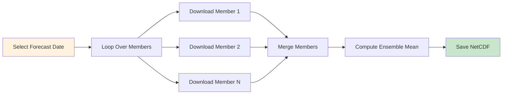

# 🌡️ Downloading ECMWF S2S Ensemble Temperature Forecasts

## Overview

**ECMWF S2S Ensemble** provides probabilistic temperature forecasts with up to 51 ensemble members. This tutorial guides you through downloading multiple ensemble members, computing the ensemble mean, and creating probabilistic products for extended-range temperature forecasting.

<div class="grid cards" markdown>

-   :material-thermometer: **Dataset**
    
    ---
    
    ECMWF S2S Ensemble Temperature
    
    **Variable:** 2m Temperature (2t)  
    **Resolution:** ~1.5° (native) or custom  
    **Output:** Daily means (°C or K)  
    **Forecast Range:** 1–46 days

-   :material-chart-bell-curve: **Ensemble**
    
    ---
    
    **Members:** 51 total  
    **Control:** 1 (unperturbed)  
    **Perturbed:** 50 members  
    **Products:** Mean, spread, percentiles

-   :material-update: **Update Frequency**
    
    ---
    
    **Cycles:** Monday & Thursday  
    **Latency:** ~1-2 days after init  
    **Retention:** ~3 weeks

-   :material-file-download: **Access**
    
    ---
    
    **Source:** ECMWF MARS  
    **Method:** ecmwfapi Python  
    **Authentication:** Required (free)  
    **Format:** NetCDF or GRIB

</div>

---

## 🎯 What This Script Does



The script performs the following operations:

1. **Downloads** daily-averaged temperature for each ensemble member
2. **Validates** each member file for completeness
3. **Stacks** all members along a new dimension
4. **Computes** the ensemble mean
5. **Saves** the result as a single NetCDF file

---

## 🚀 Quick Start Guide

### Prerequisites

!!! warning "ECMWF Account Required"
    You need a free ECMWF account to access S2S data:
    
    1. **Register:** [https://apps.ecmwf.int/registration/](https://apps.ecmwf.int/registration/)
    2. **Get API key:** [https://api.ecmwf.int/v1/key/](https://api.ecmwf.int/v1/key/)
    3. **Configure:** Create `~/.ecmwfapirc` with your credentials

!!! info "Required Python Packages"
    ```bash
    pip install ecmwf-api-client xarray netCDF4 numpy
    ```

### API Configuration

Create a file `~/.ecmwfapirc` (Linux/Mac) or `%USERPROFILE%\.ecmwfapirc` (Windows):

```json
{
    "url"   : "https://api.ecmwf.int/v1",
    "key"   : "YOUR-API-KEY-HERE",
    "email" : "your.email@example.com"
}
```

### Basic Usage

=== "10 Members (Quick)"
    ```bash
    python download_ecmwf_s2s_t2m_ensemble.py \
        --outdir data/s2s_ensemble \
        --outfile s2s_ensmean_t2m_ethiopia.nc \
        --date 2025-01-13 \
        --lead-days 30 \
        --members 10 \
        --lat-min 3 --lat-max 15 \
        --lon-min 33 --lon-max 48
    ```

=== "All 50 Members"
    ```bash
    python download_ecmwf_s2s_t2m_ensemble.py \
        --outdir data/s2s_ensemble \
        --outfile s2s_ensmean_t2m_ethiopia_full.nc \
        --date 2025-01-13 \
        --lead-days 30 \
        --members 50 \
        --lat-min 3 --lat-max 15 \
        --lon-min 33 --lon-max 48
    ```

=== "Custom Grid"
    ```bash
    python download_ecmwf_s2s_t2m_ensemble.py \
        --outdir data/s2s_ensemble \
        --outfile s2s_ensmean_t2m_ethiopia_0p5.nc \
        --date 2025-01-13 \
        --lead-days 30 \
        --members 20 \
        --lat-min 3 --lat-max 15 \
        --lon-min 33 --lon-max 48 \
        --grid 0.5/0.5
    ```

---

## 📋 The Complete Script

### Python Download Script

Save this as `download_ecmwf_s2s_t2m_ensemble.py`:

```python
#!/usr/bin/env python
"""
Download ECMWF S2S realtime daily-averaged 2m temperature (T2M)
for multiple ensemble members and compute the ensemble mean.

Example:
python download_ecmwf_s2s_t2m_ensemble_dailymean.py \
  --outdir data/s2s_ecmwf \
  --outfile s2s_ecmwf_t2m_ensmean_2025-12-01_ea.nc \
  --date 2025-12-01 \
  --lead-days 30 \
  --members 10 \
  --lat-min 3 --lat-max 15 --lon-min 33 --lon-max 48
"""

import argparse
import os
from datetime import datetime
from ecmwfapi import ECMWFDataServer
import xarray as xr
import numpy as np


def build_daily_step_string(lead_days: int) -> str:
    """Build ECMWF S2S daily step string: '0-24/24-48/48-72/...'"""
    periods = [f"{i*24}-{(i+1)*24}" for i in range(lead_days)]
    return "/".join(periods)


def retrieve_member_t2m_daily(
    date_str: str,
    lead_days: int,
    lat_min: float,
    lat_max: float,
    lon_min: float,
    lon_max: float,
    member: int,
    out_path: str,
    grid: str | None = None,
    fmt: str = "netcdf",
) -> bool:
    """
    Retrieve ECMWF S2S daily-averaged 2m temperature for one ensemble member.
    
    Returns True if successful, False otherwise.
    """
    server = ECMWFDataServer()
    if lead_days < 1 or lead_days > 46:
        raise ValueError("lead_days must be between 1 and 46 for ECMWF S2S.")

    steps = build_daily_step_string(lead_days)
    area = f"{lat_max}/{lon_min}/{lat_min}/{lon_max}"

    req = {
        "class": "s2",
        "dataset": "s2s",
        "expver": "prod",
        "origin": "ecmf",
        "model": "glob",
        "levtype": "sfc",
        "stream": "enfo",
        "type": "pf",           # perturbed forecast
        "number": str(member),  # ensemble member id (1..N)
        "param": "2t",
        "date": date_str,
        "time": "00:00:00",
        "step": steps,
        "area": area,
        "format": fmt,
        "target": out_path,
        "expect": "any",
    }
    if grid is not None:
        req["grid"] = grid

    print(f"[info] Requesting member={member}...")
    
    try:
        server.retrieve(req)
    except Exception as exc:
        print(f"[warn] ECMWF request failed for member={member}: {exc}")
        return False
    
    # Check file validity
    if (not os.path.exists(out_path)) or (os.path.getsize(out_path) < 500):
        print(f"[warn] Output for member={member} looks empty or too small")
        return False
    
    print(f"[done] Member {member} → {out_path}")
    return True


def compute_ensemble_mean(member_files, out_path, to_celsius=True):
    """
    Compute ensemble mean across member files (preserving lead days).
    
    Parameters
    ----------
    member_files : list
        List of paths to member NetCDF files
    out_path : str
        Output path for ensemble mean
    to_celsius : bool
        Convert from Kelvin to Celsius (default True)
    """
    print(f"[info] Merging {len(member_files)} members...")
    
    datasets = []
    valid_members = []
    
    for i, f in enumerate(member_files, 1):
        if not os.path.exists(f):
            print(f"[warn] Member file missing: {f}")
            continue
        try:
            ds = xr.open_dataset(f)
            # Handle different variable names
            if 't2m' in ds:
                da = ds['t2m']
            elif '2t' in ds:
                da = ds['2t']
            else:
                print(f"[warn] No temperature variable in {f}")
                continue
            datasets.append(da)
            valid_members.append(i)
        except Exception as exc:
            print(f"[warn] Failed to open {f}: {exc}")
            continue
    
    if not datasets:
        raise RuntimeError("No valid member files found")
    
    # Stack along member dimension
    da_stack = xr.concat(
        datasets,
        dim=xr.DataArray(valid_members, dims="member"),
    )
    
    # Compute ensemble mean
    ens_mean = da_stack.mean("member")
    
    # Convert to Celsius if needed
    if to_celsius and float(ens_mean.max()) > 200:  # Likely Kelvin
        ens_mean = ens_mean - 273.15
        ens_mean.attrs["units"] = "degC"
        print("[info] Converted temperature from Kelvin to Celsius")
    
    ens_mean.attrs["long_name"] = "Ensemble mean daily 2m temperature"
    ens_mean.name = "t2m"
    
    # Save to NetCDF
    ds_out = ens_mean.to_dataset(name="t2m")
    ds_out.attrs["title"] = "ECMWF S2S Ensemble Mean 2m Temperature"
    ds_out.attrs["source"] = "ECMWF S2S (param=2t, perturbed forecasts)"
    ds_out.attrs["n_members"] = len(valid_members)
    
    ds_out.to_netcdf(out_path)
    print(f"[done] Ensemble mean saved → {out_path}")


def compute_ensemble_statistics(member_files, out_path, to_celsius=True):
    """
    Compute full ensemble statistics (mean, std, percentiles).
    
    Use this for probabilistic products.
    """
    print(f"[info] Computing ensemble statistics from {len(member_files)} members...")
    
    datasets = []
    valid_members = []
    
    for i, f in enumerate(member_files, 1):
        if not os.path.exists(f):
            continue
        try:
            ds = xr.open_dataset(f)
            da = ds['t2m'] if 't2m' in ds else ds['2t']
            datasets.append(da)
            valid_members.append(i)
        except:
            continue
    
    if not datasets:
        raise RuntimeError("No valid member files found")
    
    # Stack along member dimension
    da_stack = xr.concat(datasets, dim=xr.DataArray(valid_members, dims="member"))
    
    # Convert to Celsius if needed
    if to_celsius and float(da_stack.max()) > 200:
        da_stack = da_stack - 273.15
    
    # Compute statistics
    ens_mean = da_stack.mean("member")
    ens_std = da_stack.std("member")
    ens_min = da_stack.min("member")
    ens_max = da_stack.max("member")
    ens_p10 = da_stack.quantile(0.1, dim="member")
    ens_p25 = da_stack.quantile(0.25, dim="member")
    ens_median = da_stack.quantile(0.5, dim="member")
    ens_p75 = da_stack.quantile(0.75, dim="member")
    ens_p90 = da_stack.quantile(0.9, dim="member")
    
    # Create output dataset
    ds_out = xr.Dataset({
        't2m_mean': ens_mean,
        't2m_std': ens_std,
        't2m_min': ens_min,
        't2m_max': ens_max,
        't2m_p10': ens_p10,
        't2m_p25': ens_p25,
        't2m_median': ens_median,
        't2m_p75': ens_p75,
        't2m_p90': ens_p90,
    })
    
    # Add attributes
    units = "degC" if to_celsius else "K"
    for var in ds_out.data_vars:
        ds_out[var].attrs["units"] = units
    
    ds_out.attrs["title"] = "ECMWF S2S Ensemble Temperature Statistics"
    ds_out.attrs["n_members"] = len(valid_members)
    
    ds_out.to_netcdf(out_path)
    print(f"[done] Ensemble statistics saved → {out_path}")


def main():
    p = argparse.ArgumentParser(
        description="Download ECMWF S2S ensemble daily-mean 2m temperature (T2M)."
    )
    p.add_argument("--outdir", required=True, help="Output directory")
    p.add_argument("--outfile", required=True, help="Final ensemble-mean filename")
    p.add_argument("--date", required=True, help="Forecast date (YYYY-MM-DD)")
    p.add_argument("--lead-days", type=int, required=True, help="Lead days (1-46)")
    p.add_argument("--members", type=int, default=10, help="Number of members (1-50)")
    p.add_argument("--lat-min", type=float, required=True)
    p.add_argument("--lat-max", type=float, required=True)
    p.add_argument("--lon-min", type=float, required=True)
    p.add_argument("--lon-max", type=float, required=True)
    p.add_argument("--grid", default=None, help="Output grid (e.g., '0.5/0.5')")
    p.add_argument("--fmt", default="netcdf", choices=["netcdf", "grib"])
    p.add_argument("--keep-kelvin", action="store_true", 
                   help="Keep temperature in Kelvin (default: convert to Celsius)")
    p.add_argument("--full-stats", action="store_true",
                   help="Compute full statistics (mean, std, percentiles)")
    args = p.parse_args()

    # Validate date
    try:
        datetime.strptime(args.date, "%Y-%m-%d")
    except ValueError:
        raise SystemExit(f"Invalid date format: {args.date}")

    os.makedirs(args.outdir, exist_ok=True)
    member_files = []

    # Download each member
    for m in range(1, args.members + 1):
        fpath = os.path.join(args.outdir, f"t2m_member{m:02d}.nc")
        ok = retrieve_member_t2m_daily(
            args.date,
            args.lead_days,
            args.lat_min, args.lat_max,
            args.lon_min, args.lon_max,
            member=m,
            out_path=fpath,
            grid=args.grid,
            fmt=args.fmt,
        )
        if ok:
            member_files.append(fpath)
        else:
            print(f"[warn] Skipping member={m}")

    if not member_files:
        raise SystemExit("No member files downloaded successfully")

    # Compute ensemble mean or full statistics
    out_nc = os.path.join(args.outdir, args.outfile)
    
    if args.full_stats:
        compute_ensemble_statistics(
            member_files, out_nc, 
            to_celsius=not args.keep_kelvin
        )
    else:
        compute_ensemble_mean(
            member_files, out_nc,
            to_celsius=not args.keep_kelvin
        )


if __name__ == "__main__":
    main()
```

---

## 🔧 Command-Line Arguments

### Required Arguments

| Argument | Type | Description | Example |
|----------|------|-------------|---------|
| `--outdir` | String | Output directory path | `data/s2s_ensemble` |
| `--outfile` | String | Final ensemble mean filename | `s2s_ensmean_t2m.nc` |
| `--date` | Date (YYYY-MM-DD) | Forecast initialization date | `2025-01-13` |
| `--lead-days` | Integer | Number of forecast days (1–46) | `30` |
| `--lat-min` | Float | Minimum latitude (south) | `3` |
| `--lat-max` | Float | Maximum latitude (north) | `15` |
| `--lon-min` | Float | Minimum longitude (west) | `33` |
| `--lon-max` | Float | Maximum longitude (east) | `48` |

### Optional Arguments

| Argument | Type | Description | Default |
|----------|------|-------------|---------|
| `--members` | Integer | Number of ensemble members (1–50) | `10` |
| `--grid` | String | Output grid resolution | Native (~1.5°) |
| `--fmt` | String | Output format (netcdf/grib) | `netcdf` |
| `--keep-kelvin` | Flag | Keep temperature in Kelvin | False (°C) |
| `--full-stats` | Flag | Compute full statistics | False (mean only) |

---

## 📊 Understanding Temperature Ensemble

### Ensemble Products

| Product | Description | Use Case |
|---------|-------------|----------|
| **Ensemble Mean** | Average of all members | Best single estimate |
| **Ensemble Spread** | Standard deviation | Forecast uncertainty |
| **Percentiles** | 10th, 25th, 50th, 75th, 90th | Probability ranges |
| **Min/Max** | Extreme members | Worst-case scenarios |

### Temperature vs Precipitation Ensembles

| Aspect | Temperature | Precipitation |
|--------|-------------|---------------|
| **Skill** | Generally higher | Lower, especially extended |
| **Spread** | Narrower | Wider |
| **Distribution** | More Gaussian | Often skewed |
| **Predictability** | Weeks 2-4 useful | Weeks 2-3 useful |

!!! tip "Temperature Ensemble Advantages"
    - Temperature forecasts have higher skill than precipitation
    - Ensemble spread is typically narrower
    - Useful for heat wave/cold spell prediction
    - Important for malaria transmission (temperature-dependent)

---

## 📈 Choosing Number of Members

| Members | Download Time | Accuracy | Use Case |
|---------|--------------|----------|----------|
| **5-10** | ~10-20 min | Basic | Quick testing, development |
| **20** | ~30-40 min | Good | Operational forecasting |
| **50** | ~1-2 hours | Best | Research, probabilistic products |

!!! tip "Recommendation"
    - Start with **10 members** for testing
    - Use **20 members** for operational work
    - Use **all 50 members** for probabilistic products

---

## 📍 Regional Bounding Boxes

Use these coordinates with the `--lat-min`, `--lat-max`, `--lon-min`, `--lon-max` arguments:

=== "Ethiopia"
    ```bash
    --lat-min 3 --lat-max 15 --lon-min 33 --lon-max 48
    ```
    **Coverage:** Entire Ethiopia

=== "East Africa"
    ```bash
    --lat-min -5 --lat-max 12 --lon-min 28 --lon-max 42
    ```
    **Coverage:** Kenya, Uganda, Tanzania, Rwanda, Burundi

=== "Horn of Africa"
    ```bash
    --lat-min -5 --lat-max 18 --lon-min 32 --lon-max 52
    ```
    **Coverage:** Ethiopia, Somalia, Eritrea, Djibouti, Kenya

=== "Greater Horn of Africa"
    ```bash
    --lat-min -12 --lat-max 23 --lon-min 21 --lon-max 52
    ```
    **Coverage:** Extended region including Sudan, South Sudan

---

## 💡 Usage Examples

### Example 1: Quick 10-Member Ensemble

```bash
python download_ecmwf_s2s_t2m_ensemble.py \
    --outdir data/s2s_ensemble \
    --outfile s2s_ensmean_t2m_ethiopia_10m.nc \
    --date 2025-01-13 \
    --lead-days 30 \
    --members 10 \
    --lat-min 3 --lat-max 15 \
    --lon-min 33 --lon-max 48
```

**What it does:**

- Downloads 10 ensemble members
- Computes ensemble mean in °C
- ~15-20 minutes download time
- Good for initial testing

---

### Example 2: Full Statistics with 50 Members

```bash
python download_ecmwf_s2s_t2m_ensemble.py \
    --outdir data/s2s_ensemble \
    --outfile s2s_stats_t2m_ethiopia_50m.nc \
    --date 2025-01-13 \
    --lead-days 30 \
    --members 50 \
    --lat-min 3 --lat-max 15 \
    --lon-min 33 --lon-max 48 \
    --full-stats
```

**What it does:**

- Downloads all 50 perturbed members
- Computes mean, std, min, max, and percentiles
- Best probabilistic information
- ~1-2 hours download time

---

### Example 3: Keep Temperature in Kelvin

```bash
python download_ecmwf_s2s_t2m_ensemble.py \
    --outdir data/s2s_ensemble \
    --outfile s2s_ensmean_t2m_ethiopia_K.nc \
    --date 2025-01-13 \
    --lead-days 30 \
    --members 20 \
    --lat-min 3 --lat-max 15 \
    --lon-min 33 --lon-max 48 \
    --keep-kelvin
```

**What it does:**

- Outputs temperature in Kelvin (K)
- Useful for direct model input (e.g., VECTRI)
- No unit conversion applied

---

### Example 4: Combined Temperature and Precipitation Ensemble

Download both variables for complete probabilistic forecasts:

```bash
#!/bin/bash
# download_s2s_ensemble_both.sh

S2S_DATE="2025-01-13"
OUTDIR="data/s2s_ensemble"
MEMBERS=20

# Download precipitation ensemble
python download_ecmwf_s2s_tp_ensemble.py \
    --outdir "$OUTDIR" \
    --outfile "s2s_ensmean_tp_eth_${S2S_DATE}.nc" \
    --date "$S2S_DATE" \
    --lead-days 30 \
    --members $MEMBERS \
    --lat-min 3 --lat-max 15 \
    --lon-min 33 --lon-max 48

# Download temperature ensemble
python download_ecmwf_s2s_t2m_ensemble.py \
    --outdir "$OUTDIR" \
    --outfile "s2s_ensmean_t2m_eth_${S2S_DATE}.nc" \
    --date "$S2S_DATE" \
    --lead-days 30 \
    --members $MEMBERS \
    --lat-min 3 --lat-max 15 \
    --lon-min 33 --lon-max 48

echo "Downloaded S2S ensemble forecasts for $S2S_DATE"
```

---

### Example 5: Operational Weekly Script

```bash
#!/bin/bash
# weekly_s2s_t2m_ensemble.sh

# Find the most recent Monday or Thursday
TODAY=$(date -u +%Y-%m-%d)
DOW=$(date -u +%u)

if [ $DOW -ge 1 ] && [ $DOW -le 3 ]; then
    DAYS_BACK=$((DOW - 1))
elif [ $DOW -ge 4 ] && [ $DOW -le 6 ]; then
    DAYS_BACK=$((DOW - 4))
else
    DAYS_BACK=3
fi

S2S_DATE=$(date -u -d "$TODAY - $DAYS_BACK days" +%Y-%m-%d)

OUTDIR="data/s2s_operational"
OUTFILE="s2s_ensmean_t2m_eth_${S2S_DATE}.nc"

python download_ecmwf_s2s_t2m_ensemble.py \
    --outdir "$OUTDIR" \
    --outfile "$OUTFILE" \
    --date "$S2S_DATE" \
    --lead-days 30 \
    --members 20 \
    --lat-min 3 --lat-max 15 \
    --lon-min 33 --lon-max 48

echo "Downloaded S2S temperature ensemble for $S2S_DATE"
```

---

## 📂 Output Directory Structure

After running the script, your output directory will contain:

```
data/s2s_ensemble/
├── t2m_member01.nc                    # Member 1
├── t2m_member02.nc                    # Member 2
├── t2m_member03.nc                    # Member 3
├── ...
├── t2m_member10.nc                    # Member 10
└── s2s_ensmean_t2m_ethiopia.nc        # Ensemble mean (final output)
```

!!! tip "Cleaning Up Member Files"
    After computing the ensemble mean, you can delete individual member files:
    ```bash
    rm data/s2s_ensemble/t2m_member*.nc
    ```

---

## 🔍 Verifying Your Download

After downloading, verify your data using Python:

```python
import xarray as xr
import matplotlib.pyplot as plt
import numpy as np

# Open the ensemble mean file
ds = xr.open_dataset('data/s2s_ensemble/s2s_ensmean_t2m_ethiopia.nc')

# Display dataset information
print(ds)

# Check dimensions
print(f"Lead times: {len(ds.time) if 'time' in ds.dims else 'N/A'}")
print(f"Temperature units: {ds.t2m.attrs.get('units', 'unknown')}")

# Check temperature range
print(f"Temperature range: {float(ds.t2m.min()):.1f} to {float(ds.t2m.max()):.1f}")

# Plot Week 1 ensemble mean temperature
fig, ax = plt.subplots(figsize=(10, 8))
week1_mean = ds.t2m.isel(time=slice(0, 7)).mean(dim='time')
week1_mean.plot(ax=ax, cmap='RdYlBu_r', vmin=15, vmax=35)
ax.set_title('S2S Ensemble Mean: Week 1 Daily Temperature')
plt.savefig('s2s_t2m_ensemble_week1.png', dpi=150, bbox_inches='tight')
plt.show()

# Time series for a point
lat_point, lon_point = 9.0, 38.7  # Addis Ababa
point_data = ds.t2m.sel(latitude=lat_point, longitude=lon_point, method='nearest')
point_data.plot(marker='o', figsize=(12, 4), color='orangered')
plt.title(f'S2S Ensemble Mean Temperature for Addis Ababa')
plt.ylabel('Temperature (°C)')
plt.xlabel('Lead Time')
plt.grid(True, alpha=0.3)
plt.axhline(y=point_data.mean(), color='gray', linestyle='--', label='Mean')
plt.legend()
plt.savefig('s2s_t2m_ensemble_timeseries.png', dpi=150, bbox_inches='tight')
plt.show()
```

---

## 📊 Computing Probabilistic Products

### Extended Analysis Script

For full probabilistic analysis with all members:

```python
import xarray as xr
import numpy as np
import matplotlib.pyplot as plt
import glob

# Load all member files
member_files = sorted(glob.glob('data/s2s_ensemble/t2m_member*.nc'))
print(f"Found {len(member_files)} member files")

# Stack all members
datasets = []
for i, f in enumerate(member_files, 1):
    ds = xr.open_dataset(f)
    da = ds['t2m'] if 't2m' in ds else ds['2t']
    # Convert to Celsius if needed
    if da.max() > 200:
        da = da - 273.15
    ds_exp = da.expand_dims({'member': [i]})
    datasets.append(ds_exp)

# Combine all members
t2m_all = xr.concat(datasets, dim='member')
print(t2m_all)

# Compute ensemble statistics
ens_mean = t2m_all.mean(dim='member')
ens_std = t2m_all.std(dim='member')
ens_p10 = t2m_all.quantile(0.1, dim='member')
ens_p90 = t2m_all.quantile(0.9, dim='member')

# Compute probability of warm anomaly (e.g., > 25°C)
threshold = 25  # °C
prob_warm = (t2m_all > threshold).mean(dim='member') * 100

# Create output dataset
ds_out = xr.Dataset({
    't2m_mean': ens_mean,
    't2m_std': ens_std,
    't2m_p10': ens_p10,
    't2m_p90': ens_p90,
    'prob_above_25C': prob_warm,
})

# Save
ds_out.to_netcdf('data/s2s_ensemble/s2s_t2m_probabilistic.nc')
print("Saved probabilistic temperature products")

# Visualize ensemble spread
fig, axes = plt.subplots(1, 4, figsize=(16, 4))

for i, week in enumerate([0, 7, 14, 21]):
    if week + 7 <= len(ens_std.time):
        weekly_std = ens_std.isel(time=slice(week, week+7)).mean(dim='time')
        im = weekly_std.plot(ax=axes[i], cmap='YlOrRd', vmin=0, vmax=3, add_colorbar=False)
        axes[i].set_title(f'Week {i+1}')
        axes[i].set_xlabel('')
        axes[i].set_ylabel('')

plt.suptitle('Ensemble Spread (Standard Deviation) in °C')
plt.tight_layout()
plt.savefig('s2s_t2m_spread.png', dpi=150, bbox_inches='tight')
plt.show()

# Spaghetti plot for a single point
lat_point, lon_point = 9.0, 38.7
point_all = t2m_all.sel(latitude=lat_point, longitude=lon_point, method='nearest')

plt.figure(figsize=(12, 5))
for m in range(len(member_files)):
    plt.plot(point_all.isel(member=m), color='gray', alpha=0.3, linewidth=0.5)
plt.plot(ens_mean.sel(latitude=lat_point, longitude=lon_point, method='nearest'), 
         color='red', linewidth=2, label='Ensemble Mean')
plt.fill_between(
    range(len(ens_mean.time)),
    ens_p10.sel(latitude=lat_point, longitude=lon_point, method='nearest'),
    ens_p90.sel(latitude=lat_point, longitude=lon_point, method='nearest'),
    color='red', alpha=0.2, label='10th-90th percentile'
)
plt.xlabel('Lead Day')
plt.ylabel('Temperature (°C)')
plt.title(f'S2S Temperature Ensemble for Addis Ababa')
plt.legend()
plt.grid(True, alpha=0.3)
plt.savefig('s2s_t2m_spaghetti.png', dpi=150, bbox_inches='tight')
plt.show()
```

---

## ⚠️ Troubleshooting

### Common Issues and Solutions

=== "Authentication Error"

    **Problem:** API key not configured
    
    ```
    APIKeyFetchError: Could not get API key
    ```
    
    **Solutions:**
    
    1. **Create API key file:**
        ```bash
        nano ~/.ecmwfapirc
        ```
    
    2. **Add credentials:**
        ```json
        {
            "url"   : "https://api.ecmwf.int/v1",
            "key"   : "YOUR-API-KEY",
            "email" : "your.email@example.com"
        }
        ```

=== "Some Members Failed"

    **Problem:** Not all members downloaded successfully
    
    **Solutions:**
    
    1. **Script handles this:** Continues with available members
    2. **Retry:** Run again for missing members
    3. **Check date:** Ensure Monday/Thursday S2S date

=== "Temperature Values Wrong"

    **Problem:** Values around 280-300 instead of expected °C
    
    **Cause:** Data is in Kelvin, not Celsius
    
    **Solutions:**
    
    1. **Re-run without `--keep-kelvin`**
    2. **Manual conversion:**
        ```python
        temp_celsius = temp_kelvin - 273.15
        ```

=== "Memory Error"

    **Problem:** Out of memory when computing statistics
    
    **Solutions:**
    
    1. **Reduce members:** Start with fewer members
    2. **Reduce region:** Smaller bounding box
    3. **Process in chunks:** Modify script for chunked processing

---

## 🔗 Combining Temperature and Precipitation

For malaria modeling with VECTRI, combine both ensemble products:

```python
import xarray as xr

# Load ensemble means
ds_temp = xr.open_dataset('data/s2s_ensemble/s2s_ensmean_t2m_ethiopia.nc')
ds_precip = xr.open_dataset('data/s2s_ensemble/s2s_ensmean_tp_ethiopia.nc')

# Merge datasets
ds_combined = xr.merge([ds_temp, ds_precip])

# Verify
print(ds_combined)
# Variables: t2m, tp

# Save combined file
ds_combined.to_netcdf('data/s2s_ensemble/s2s_combined_ethiopia.nc')
print("Saved combined ensemble mean dataset")
```

---

## 🎓 Data Quality Notes

!!! success "Strengths"
    - **Higher skill** than precipitation for extended range
    - **51 members** for robust statistics
    - **Extended range** - up to 46 days
    - **Narrower spread** - more confident forecasts
    - **Free access** - with ECMWF account

!!! warning "Limitations"
    - **Download time** - 50 members takes 1-2 hours
    - **Lower resolution** (~1.5°) compared to HRES
    - **Skill degrades** after week 3-4
    - **Storage requirements** - 50 member files

!!! tip "Best Practices"
    - **Use ensemble mean** for best single estimate
    - **Compute spread** for uncertainty
    - **Calculate anomalies** relative to climatology
    - **Clean up member files** after processing
    - **Combine with precipitation** for complete forecasts

---

## 📖 Additional Resources

### Official Documentation

- **S2S Database:** [https://apps.ecmwf.int/datasets/data/s2s/](https://apps.ecmwf.int/datasets/data/s2s/)
- **S2S Project:** [https://s2sprediction.net/](https://s2sprediction.net/)
- **Ensemble Forecasting:** [ECMWF Ensemble Guide](https://www.ecmwf.int/en/forecasts/documentation-and-support)

### Related Tutorials

- [S2S Precipitation Ensemble](18-download_ecmwf_s2s_tp_daily_ensemble.md) - Precipitation ensemble
- [S2S Control Temperature](17-download_ecmwf_s2s_t2m_daily.md) - Single control forecast
- [ECMWF HRES Temperature](15-download_ecmwf_hres_temp.md) - Short-range deterministic

---

## 🚀 Next Steps

<div class="grid cards" markdown>

-   :material-chart-bell-curve: **Probabilistic Analysis**
    
    ---
    
    Compute percentiles and spread  
    Create probability maps  
    
    → [Xarray Tutorial](06-Xarray_for_Climate_and_Meteorology_Workshop.md)

-   :material-map: **Visualize Uncertainty**
    
    ---
    
    Plot ensemble spaghetti  
    Spread evolution maps  
    
    → [Matplotlib Tutorial](05-Matplotlib_for_Climate_and_Meteorology_Workshop.md)

-   :material-weather-pouring: **Precipitation Ensemble**
    
    ---
    
    Download TP ensemble  
    Combined probabilistic products  
    
    → [S2S Precipitation Ensemble](18-download_ecmwf_s2s_tp_daily_ensemble.md)

-   :material-bug: **VECTRI Probabilistic**
    
    ---
    
    Temperature-dependent transmission  
    Ensemble-based malaria risk  
    
    → [VECTRI Model](../day1/06-vectri_model_components_larvae_to_hydrology.md)

</div>

---

!!! example "Need Help?"
    If you encounter issues or have questions:
    
    - Check the [Troubleshooting](#troubleshooting) section
    - Review [ECMWF S2S documentation](https://apps.ecmwf.int/datasets/data/s2s/)
    - Visit [ECMWF Support Portal](https://confluence.ecmwf.int/)
    - Contact workshop instructors

---

<div style="background: linear-gradient(135deg, #ff6b35 0%, #f7931e 100%); color: white; padding: 2rem; border-radius: 8px; text-align: center; margin-top: 2rem;">
  <h3 style="margin: 0 0 1rem 0;">🌡️ Ready for Probabilistic Temperature Forecasting!</h3>
  <p style="margin: 0; opacity: 0.95;">You now have everything you need to download ECMWF S2S ensemble temperature forecasts for probabilistic prediction and uncertainty quantification.</p>
</div>
