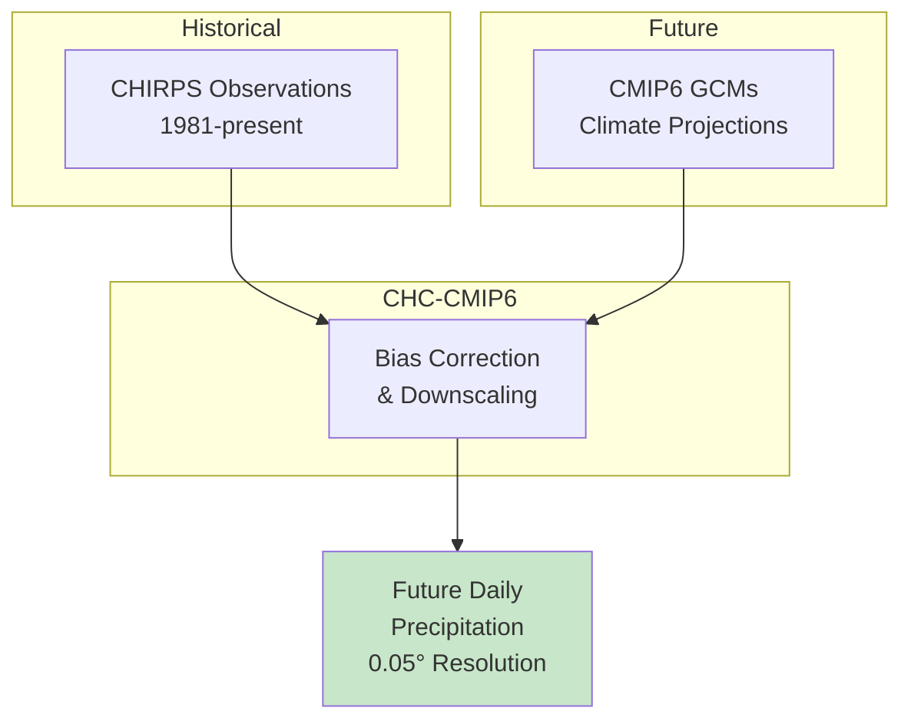

# 🌧️ Downloading CHC-CMIP6 Daily Precipitation

## Overview

**CHC-CMIP6** provides climate change-adjusted daily precipitation data based on CHIRPS observations and CMIP6 model projections. This dataset is ideal for studying future climate scenarios and their impacts on rainfall patterns in Africa.

<div class="grid cards" markdown>

-   :material-weather-rainy: **Dataset**
    
    ---
    
    CHC-CMIP6 Daily Precipitation
    
    **Base:** CHIRPS v2.0  
    **Resolution:** 0.05° (~5 km)  
    **Coverage:** Africa & global tropics  
    **Format:** GeoTIFF → NetCDF

-   :material-chart-timeline-variant: **Scenarios**
    
    ---
    
    **SSP245:** Middle of the road  
    **SSP585:** High emissions  
    **Periods:** 2030, 2050, 2070  
    **Baseline:** Historical CHIRPS

-   :material-calendar-range: **Temporal**
    
    ---
    
    **Range:** 1983–present  
    **Frequency:** Daily  
    **Units:** mm/day  
    **Structure:** One file per day

-   :material-download: **Access**
    
    ---
    
    **Source:** CHC Data Portal  
    **Method:** HTTP download  
    **Auth:** None required  
    **Size:** ~50 MB/year (Ethiopia)

</div>

---

## 🎯 What This Script Does


The script performs the following operations:

1. **Downloads** daily GeoTIFF files from CHC data portal
2. **Clips** each file to your region of interest
3. **Standardizes** variable names and units
4. **Merges** daily files into annual NetCDF
5. **Cleans up** temporary files automatically

---

## 🌍 Understanding CHC-CMIP6

### What is CHC-CMIP6?

CHC-CMIP6 combines:

- **CHIRPS observations** - High-resolution historical rainfall
- **CMIP6 projections** - Climate model future scenarios
- **Statistical downscaling** - Preserves local patterns



### Available Scenarios

| Scenario | Period | Description | Warming Level |
|----------|--------|-------------|---------------|
| **2030_SSP245** | 2020–2039 | Near-term, moderate | ~1.5°C |
| **2030_SSP585** | 2020–2039 | Near-term, high | ~1.7°C |
| **2050_SSP245** | 2040–2059 | Mid-century, moderate | ~2.0°C |
| **2050_SSP585** | 2040–2059 | Mid-century, high | ~2.5°C |
| **2070_SSP245** | 2060–2079 | Late-century, moderate | ~2.5°C |
| **2070_SSP585** | 2060–2079 | Late-century, high | ~3.5°C |

!!! info "SSP Pathways Explained"
    - **SSP245:** "Middle of the Road" - Moderate emissions, some mitigation
    - **SSP585:** "Fossil-fueled Development" - High emissions, no mitigation
    
    These represent different socioeconomic and emissions trajectories for the 21st century.

---

## 🚀 Quick Start Guide

### Prerequisites

!!! info "Required Python Packages"
    ```bash
    pip install requests xarray rioxarray netCDF4 numpy
    ```

### Basic Usage

=== "Single Scenario"
    ```bash
    python download_chc_cmip6_precip_daily.py \
        --period-tags 2030_SSP245 \
        --start-year 1983 --end-year 1984 \
        --outdir data/CHC_CMIP6 \
        --lat-min 3 --lat-max 15 \
        --lon-min 33 --lon-max 48
    ```

=== "Multiple Scenarios"
    ```bash
    python download_chc_cmip6_precip_daily.py \
        --period-tags 2030_SSP245 2030_SSP585 2050_SSP245 2050_SSP585 \
        --start-year 1983 --end-year 2020 \
        --outdir data/CHC_CMIP6 \
        --lat-min 3 --lat-max 15 \
        --lon-min 33 --lon-max 48
    ```

=== "Quick Test"
    ```bash
    python download_chc_cmip6_precip_daily.py \
        --period-tags 2030_SSP245 \
        --start-year 1983 --end-year 1983 \
        --outdir data/CHC_CMIP6 \
        --lat-min 3 --lat-max 15 \
        --lon-min 33 --lon-max 48
    ```

---

## 📋 The Complete Script

### Python Download Script

Save this as `download_chc_cmip6_precip_daily.py`:

```python
#!/usr/bin/env python
"""
Download CHC-CMIP6 daily precipitation GeoTIFFs (CHIRPS-based),
clip to Ethiopia, convert to NetCDF, and fix units/variable names.

Example:
python download_chc_cmip6_precip_daily_to_netcdf.py \
  --period-tags 2030_SSP245 2030_SSP585 \
  --start-year 1983 --end-year 1984 \
  --outdir data/CHC_CMIP6 \
  --lat-min 3 --lat-max 15 --lon-min 33 --lon-max 48
"""

import argparse
import calendar
import os
from typing import Iterable, Tuple

import numpy as np
import requests
import rioxarray
import xarray as xr

BASE_URL = "https://data.chc.ucsb.edu/products/CHC_CMIP6"


# -----------------------------------------------------------------------------#
# Utilities
# -----------------------------------------------------------------------------#

def iter_dates(year: int) -> Iterable[Tuple[int, int, int]]:
    """Yield (year, month, day) for every day in a given year."""
    for month in range(1, 13):
        ndays = calendar.monthrange(year, month)[1]
        for day in range(1, ndays + 1):
            yield year, month, day


def download_file(url: str, dest_path: str, verbose: bool = False) -> bool:
    """
    Download file from URL to dest_path. 
    
    Returns True on success, False otherwise.
    """
    try:
        r = requests.get(url, stream=True, timeout=60)
        if r.status_code == 200:
            with open(dest_path, "wb") as f:
                for chunk in r.iter_content(1024 * 1024):
                    f.write(chunk)
            if verbose:
                print(f"[ok] Downloaded {os.path.basename(dest_path)}")
            return True
        else:
            if verbose:
                print(f"[warn] HTTP {r.status_code} for {url}")
            return False
    except Exception as exc:
        print(f"[err] Failed to download {url}: {exc}")
        return False


def subset_region(
    da: xr.DataArray,
    lat_min: float,
    lat_max: float,
    lon_min: float,
    lon_max: float,
) -> xr.DataArray:
    """
    Subset DataArray to a bounding box.
    
    Handles CHIRPS coordinate conventions (y descending).
    """
    # CHIRPS is in EPSG:4326
    da = da.rio.write_crs("EPSG:4326", inplace=True)
    
    # CHIRPS y is usually descending (north -> south), so use slice(lat_max, lat_min)
    return da.sel(y=slice(lat_max, lat_min), x=slice(lon_min, lon_max))


def fix_units_and_name(da: xr.DataArray) -> xr.DataArray:
    """Standardise variable to pr [mm/day]."""
    da.name = "pr"
    da.attrs["long_name"] = "Daily precipitation"
    da.attrs["units"] = "mm/day"
    da.attrs["standard_name"] = "precipitation_flux"
    return da


def combine_and_save(daily_arrays: list, out_path: str, compress: bool = True):
    """
    Combine daily DataArrays into a single NetCDF file.
    
    Parameters
    ----------
    daily_arrays : list
        List of xr.DataArray objects with time dimension
    out_path : str
        Output NetCDF file path
    compress : bool
        Enable zlib compression (default True)
    """
    if not daily_arrays:
        print(f"[warn] No data to save for {out_path}")
        return
    
    # Concatenate along time dimension
    ds = xr.concat(daily_arrays, dim="time")
    ds = ds.sortby("time")
    
    # Add metadata
    if isinstance(ds, xr.DataArray):
        ds = ds.to_dataset(name="pr")
    
    ds.attrs["title"] = "CHC-CMIP6 Daily Precipitation"
    ds.attrs["source"] = "Climate Hazards Center, UC Santa Barbara"
    ds.attrs["institution"] = "CHC-UCSB"
    ds.attrs["references"] = "https://data.chc.ucsb.edu/products/CHC_CMIP6"
    
    # Encoding for compression
    encoding = {}
    if compress:
        encoding = {"pr": {"zlib": True, "complevel": 4, "dtype": "float32"}}
    
    # Save
    ds.to_netcdf(out_path, encoding=encoding)
    print(f"[ok] Saved NetCDF → {out_path}")


# -----------------------------------------------------------------------------#
# Core processing
# -----------------------------------------------------------------------------#

def process_period(
    period_tag: str,
    start_year: int,
    end_year: int,
    outdir: str,
    lat_min: float,
    lat_max: float,
    lon_min: float,
    lon_max: float,
    verbose: bool = False,
):
    """
    Process a single CHC-CMIP6 period/scenario.
    
    Downloads daily GeoTIFFs, clips to region, converts to annual NetCDF.
    """
    dataset_dir = "chirps-v2"
    file_tag = "CHIRPS"

    # Temp directory for GeoTIFFs (inside outdir so it's easy to inspect/clean)
    tmp_root = os.path.join(outdir, "_tmp_chc_cmip6")
    os.makedirs(tmp_root, exist_ok=True)

    for year in range(start_year, end_year + 1):
        print(f"\n{'='*60}")
        print(f"[info] Processing {period_tag} {year}")
        print(f"{'='*60}")
        
        daily_list = []
        success_count = 0
        fail_count = 0

        year_url = f"{BASE_URL}/{period_tag}/{dataset_dir}/{year}"

        for y, m, d in iter_dates(year):
            fname = f"{period_tag}.{file_tag}.{y}.{m:02d}.{d:02d}.tif"
            url = f"{year_url}/{fname}"
            tmp_path = os.path.join(tmp_root, fname)

            # Download
            if not download_file(url, tmp_path, verbose=verbose):
                fail_count += 1
                continue

            try:
                # Open GeoTIFF
                da = rioxarray.open_rasterio(tmp_path).squeeze(drop=True)

                # Subset + standardise metadata
                da = subset_region(da, lat_min, lat_max, lon_min, lon_max)
                da = fix_units_and_name(da)

                # Load data into memory so we can safely close/delete the file
                da = da.load()

                # Add time dimension
                time_val = np.datetime64(f"{y:04d}-{m:02d}-{d:02d}")
                da = da.expand_dims(time=[time_val])

                daily_list.append(da)
                success_count += 1

                # Explicitly close raster handle
                try:
                    da.rio.close()
                except Exception:
                    pass

            except Exception as exc:
                print(f"[warn] Failed to process {fname}: {exc}")
                fail_count += 1

            finally:
                # Clean up temp file
                try:
                    if os.path.exists(tmp_path):
                        os.remove(tmp_path)
                except Exception as exc_rm:
                    print(f"[warn] Could not remove temp file {tmp_path}: {exc_rm}")

        # Summary for year
        total_days = 366 if calendar.isleap(year) else 365
        print(f"\n[summary] {period_tag} {year}: {success_count}/{total_days} days downloaded")
        
        if not daily_list:
            print(f"[warn] No valid data for {period_tag} {year}")
            continue

        # Output one NetCDF per year & scenario
        out_path = os.path.join(
            outdir,
            period_tag,
            f"{period_tag}_CHIRPS_{year}_daily.nc",
        )
        os.makedirs(os.path.dirname(out_path), exist_ok=True)
        combine_and_save(daily_list, out_path)


def process_all_periods(
    period_tags: list,
    start_year: int,
    end_year: int,
    outdir: str,
    lat_min: float,
    lat_max: float,
    lon_min: float,
    lon_max: float,
    verbose: bool = False,
):
    """Process multiple CHC-CMIP6 periods/scenarios."""
    print(f"\n{'#'*60}")
    print(f"# CHC-CMIP6 Daily Precipitation Download")
    print(f"# Scenarios: {', '.join(period_tags)}")
    print(f"# Years: {start_year} to {end_year}")
    print(f"# Region: lat [{lat_min}, {lat_max}], lon [{lon_min}, {lon_max}]")
    print(f"{'#'*60}\n")
    
    for tag in period_tags:
        process_period(
            period_tag=tag,
            start_year=start_year,
            end_year=end_year,
            outdir=outdir,
            lat_min=lat_min,
            lat_max=lat_max,
            lon_min=lon_min,
            lon_max=lon_max,
            verbose=verbose,
        )
    
    print(f"\n{'#'*60}")
    print(f"# Download complete!")
    print(f"# Output directory: {outdir}")
    print(f"{'#'*60}\n")


# -----------------------------------------------------------------------------#
# CLI
# -----------------------------------------------------------------------------#

def parse_args():
    p = argparse.ArgumentParser(
        description=(
            "Download CHC-CMIP6 CHIRPS-based daily precipitation, "
            "subset to region, convert to NetCDF."
        ),
        formatter_class=argparse.RawDescriptionHelpFormatter,
        epilog="""
Examples:
  # Single scenario, single year (quick test)
  python download_chc_cmip6_precip_daily.py \\
      --period-tags 2030_SSP245 \\
      --start-year 1983 --end-year 1983 \\
      --outdir data/CHC_CMIP6 \\
      --lat-min 3 --lat-max 15 --lon-min 33 --lon-max 48

  # Multiple scenarios, multiple years
  python download_chc_cmip6_precip_daily.py \\
      --period-tags 2030_SSP245 2030_SSP585 2050_SSP245 \\
      --start-year 1983 --end-year 2020 \\
      --outdir data/CHC_CMIP6 \\
      --lat-min 3 --lat-max 15 --lon-min 33 --lon-max 48
        """
    )
    p.add_argument(
        "--period-tags",
        nargs="+",
        required=True,
        help="Period tags: 2030_SSP245 2030_SSP585 2050_SSP245 2050_SSP585 etc.",
    )
    p.add_argument(
        "--start-year", 
        type=int, 
        default=1983,
        help="Start year (default: 1983)"
    )
    p.add_argument(
        "--end-year", 
        type=int, 
        default=1983,
        help="End year (default: 1983)"
    )
    p.add_argument(
        "--outdir", 
        required=True,
        help="Output directory for NetCDF files"
    )
    p.add_argument("--lat-min", type=float, default=3.0, help="Min latitude")
    p.add_argument("--lat-max", type=float, default=15.0, help="Max latitude")
    p.add_argument("--lon-min", type=float, default=33.0, help="Min longitude")
    p.add_argument("--lon-max", type=float, default=48.0, help="Max longitude")
    p.add_argument(
        "--verbose", "-v",
        action="store_true",
        help="Print verbose download messages"
    )
    return p.parse_args()


def main():
    args = parse_args()
    
    process_all_periods(
        period_tags=args.period_tags,
        start_year=args.start_year,
        end_year=args.end_year,
        outdir=args.outdir,
        lat_min=args.lat_min,
        lat_max=args.lat_max,
        lon_min=args.lon_min,
        lon_max=args.lon_max,
        verbose=args.verbose,
    )


if __name__ == "__main__":
    main()
```

---

## 🔧 Command-Line Arguments

### Required Arguments

| Argument | Type | Description | Example |
|----------|------|-------------|---------|
| `--period-tags` | String(s) | SSP scenario period(s) | `2030_SSP245 2030_SSP585` |
| `--outdir` | String | Output directory path | `data/CHC_CMIP6` |

### Optional Arguments

| Argument | Type | Description | Default |
|----------|------|-------------|---------|
| `--start-year` | Integer | First year to download | `1983` |
| `--end-year` | Integer | Last year to download | `1983` |
| `--lat-min` | Float | Minimum latitude | `3.0` |
| `--lat-max` | Float | Maximum latitude | `15.0` |
| `--lon-min` | Float | Minimum longitude | `33.0` |
| `--lon-max` | Float | Maximum longitude | `48.0` |
| `--verbose`, `-v` | Flag | Print download details | False |

---

## 📊 Available Period Tags

### SSP245 Scenarios (Moderate Emissions)

| Period Tag | Time Period | Description |
|------------|-------------|-------------|
| `2030_SSP245` | 2020–2039 | Near-term moderate |
| `2050_SSP245` | 2040–2059 | Mid-century moderate |
| `2070_SSP245` | 2060–2079 | Late-century moderate |

### SSP585 Scenarios (High Emissions)

| Period Tag | Time Period | Description |
|------------|-------------|-------------|
| `2030_SSP585` | 2020–2039 | Near-term high |
| `2050_SSP585` | 2040–2059 | Mid-century high |
| `2070_SSP585` | 2060–2079 | Late-century high |

!!! tip "Choosing Scenarios"
    - **SSP245** represents moderate mitigation efforts
    - **SSP585** represents "business as usual" high emissions
    - Compare both to bracket the range of possible futures

---

## 📍 Regional Bounding Boxes

Use these coordinates with the `--lat-min`, `--lat-max`, `--lon-min`, `--lon-max` arguments:

=== "Ethiopia"
    ```bash
    --lat-min 3 --lat-max 15 --lon-min 33 --lon-max 48
    ```
    **Coverage:** Entire Ethiopia

=== "East Africa"
    ```bash
    --lat-min -5 --lat-max 12 --lon-min 28 --lon-max 42
    ```
    **Coverage:** Kenya, Uganda, Tanzania, Rwanda, Burundi

=== "Horn of Africa"
    ```bash
    --lat-min -5 --lat-max 18 --lon-min 32 --lon-max 52
    ```
    **Coverage:** Ethiopia, Somalia, Eritrea, Djibouti, Kenya

=== "West Africa"
    ```bash
    --lat-min 4 --lat-max 18 --lon-min -18 --lon-max 16
    ```
    **Coverage:** Sahel and coastal West Africa

=== "Southern Africa"
    ```bash
    --lat-min -35 --lat-max -10 --lon-min 10 --lon-max 45
    ```
    **Coverage:** South Africa, Zimbabwe, Mozambique, etc.

---

## 💡 Usage Examples

### Example 1: Quick Test (Single Year)

```bash
python download_chc_cmip6_precip_daily.py \
    --period-tags 2030_SSP245 \
    --start-year 1983 --end-year 1983 \
    --outdir data/CHC_CMIP6 \
    --lat-min 3 --lat-max 15 \
    --lon-min 33 --lon-max 48 \
    --verbose
```

**What it does:**

- Downloads 365 daily GeoTIFFs for 1983
- Clips to Ethiopia bounding box
- Creates single annual NetCDF
- ~5-10 minutes download time

---

### Example 2: Compare Two Scenarios

```bash
python download_chc_cmip6_precip_daily.py \
    --period-tags 2050_SSP245 2050_SSP585 \
    --start-year 1983 --end-year 2020 \
    --outdir data/CHC_CMIP6 \
    --lat-min 3 --lat-max 15 \
    --lon-min 33 --lon-max 48
```

**What it does:**

- Downloads both moderate and high emission scenarios
- 38 years of daily data for each
- Useful for climate impact studies
- ~1-2 days download time (large dataset)

---

### Example 3: Full Climate Analysis Suite

```bash
#!/bin/bash
# download_all_scenarios.sh

OUTDIR="data/CHC_CMIP6"
LAT_MIN=3
LAT_MAX=15
LON_MIN=33
LON_MAX=48

# All available scenarios
SCENARIOS=(
    "2030_SSP245"
    "2030_SSP585"
    "2050_SSP245"
    "2050_SSP585"
    "2070_SSP245"
    "2070_SSP585"
)

for scenario in "${SCENARIOS[@]}"; do
    echo "Processing $scenario..."
    python download_chc_cmip6_precip_daily.py \
        --period-tags "$scenario" \
        --start-year 1983 --end-year 2020 \
        --outdir "$OUTDIR" \
        --lat-min $LAT_MIN --lat-max $LAT_MAX \
        --lon-min $LON_MIN --lon-max $LON_MAX
done

echo "All scenarios downloaded!"
```

---

### Example 4: Decade-by-Decade Download

```bash
#!/bin/bash
# download_by_decade.sh

SCENARIO="2050_SSP245"
OUTDIR="data/CHC_CMIP6"

# Download decade by decade
for START in 1983 1990 2000 2010; do
    END=$((START + 9))
    if [ $END -gt 2020 ]; then END=2020; fi
    
    echo "Downloading $SCENARIO: $START-$END"
    python download_chc_cmip6_precip_daily.py \
        --period-tags "$SCENARIO" \
        --start-year $START --end-year $END \
        --outdir "$OUTDIR" \
        --lat-min 3 --lat-max 15 \
        --lon-min 33 --lon-max 48
done
```

---

## 📂 Output Directory Structure

After running the script, your output directory will contain:

```
data/CHC_CMIP6/
├── 2030_SSP245/
│   ├── 2030_SSP245_CHIRPS_1983_daily.nc
│   ├── 2030_SSP245_CHIRPS_1984_daily.nc
│   ├── ...
│   └── 2030_SSP245_CHIRPS_2020_daily.nc
├── 2030_SSP585/
│   ├── 2030_SSP585_CHIRPS_1983_daily.nc
│   ├── ...
│   └── 2030_SSP585_CHIRPS_2020_daily.nc
├── 2050_SSP245/
│   └── ...
├── 2050_SSP585/
│   └── ...
└── _tmp_chc_cmip6/           # Temporary (cleaned automatically)
```

!!! tip "File Naming Convention"
    `{scenario}_{dataset}_{year}_daily.nc`
    
    Example: `2030_SSP245_CHIRPS_1983_daily.nc`

---

## 🔍 Verifying Your Download

After downloading, verify your data using Python:

```python
import xarray as xr
import matplotlib.pyplot as plt

# Open a downloaded file
ds = xr.open_dataset('data/CHC_CMIP6/2030_SSP245/2030_SSP245_CHIRPS_1983_daily.nc')

# Display dataset information
print(ds)
print(f"\nDimensions: {dict(ds.dims)}")
print(f"Variables: {list(ds.data_vars)}")
print(f"Time range: {ds.time.values[0]} to {ds.time.values[-1]}")
print(f"Precipitation range: {float(ds.pr.min()):.2f} to {float(ds.pr.max()):.2f} mm/day")

# Plot annual mean precipitation
annual_mean = ds.pr.mean(dim='time')

fig, ax = plt.subplots(figsize=(10, 8))
annual_mean.plot(ax=ax, cmap='Blues', cbar_kwargs={'label': 'mm/day'})
ax.set_title('CHC-CMIP6 (2030_SSP245) Annual Mean Precipitation 1983')
plt.savefig('chc_cmip6_annual_mean.png', dpi=150, bbox_inches='tight')
plt.show()

# Monthly climatology
monthly_mean = ds.pr.groupby('time.month').mean(dim='time')

fig, axes = plt.subplots(3, 4, figsize=(16, 12))
for i, month in enumerate(range(1, 13)):
    ax = axes.flatten()[i]
    monthly_mean.sel(month=month).plot(ax=ax, cmap='Blues', add_colorbar=False, vmin=0, vmax=10)
    ax.set_title(f'Month {month}')
    ax.set_xlabel('')
    ax.set_ylabel('')
plt.suptitle('CHC-CMIP6 Monthly Mean Precipitation (mm/day)')
plt.tight_layout()
plt.savefig('chc_cmip6_monthly.png', dpi=150, bbox_inches='tight')
plt.show()
```

---

## 📊 Comparing Scenarios

### Scenario Comparison Script

```python
import xarray as xr
import matplotlib.pyplot as plt
import numpy as np

# Load two scenarios
ds_ssp245 = xr.open_dataset('data/CHC_CMIP6/2050_SSP245/2050_SSP245_CHIRPS_2000_daily.nc')
ds_ssp585 = xr.open_dataset('data/CHC_CMIP6/2050_SSP585/2050_SSP585_CHIRPS_2000_daily.nc')

# Compute annual means
mean_ssp245 = ds_ssp245.pr.mean(dim='time')
mean_ssp585 = ds_ssp585.pr.mean(dim='time')

# Compute difference (SSP585 - SSP245)
diff = mean_ssp585 - mean_ssp245

# Plot comparison
fig, axes = plt.subplots(1, 3, figsize=(18, 5))

# SSP245
mean_ssp245.plot(ax=axes[0], cmap='Blues', vmin=0, vmax=8, 
                  cbar_kwargs={'label': 'mm/day'})
axes[0].set_title('2050_SSP245 Annual Mean')

# SSP585
mean_ssp585.plot(ax=axes[1], cmap='Blues', vmin=0, vmax=8,
                  cbar_kwargs={'label': 'mm/day'})
axes[1].set_title('2050_SSP585 Annual Mean')

# Difference
diff.plot(ax=axes[2], cmap='RdBu', center=0, vmin=-2, vmax=2,
          cbar_kwargs={'label': 'mm/day difference'})
axes[2].set_title('Difference (SSP585 - SSP245)')

plt.tight_layout()
plt.savefig('scenario_comparison.png', dpi=150, bbox_inches='tight')
plt.show()

# Print statistics
print(f"SSP245 mean: {float(mean_ssp245.mean()):.2f} mm/day")
print(f"SSP585 mean: {float(mean_ssp585.mean()):.2f} mm/day")
print(f"Difference: {float(diff.mean()):.2f} mm/day")
```

---

## 📈 Climate Trend Analysis

### Multi-Year Trend Script

```python
import xarray as xr
import matplotlib.pyplot as plt
import numpy as np
import glob

# Load all years for a scenario
scenario = "2050_SSP245"
files = sorted(glob.glob(f'data/CHC_CMIP6/{scenario}/*.nc'))

# Open as multi-file dataset
ds = xr.open_mfdataset(files, combine='by_coords')
print(ds)

# Compute annual totals
annual_total = ds.pr.resample(time='YE').sum()

# Spatial mean time series
spatial_mean = annual_total.mean(dim=['y', 'x'])

# Plot time series
plt.figure(figsize=(12, 5))
spatial_mean.plot(marker='o', linewidth=2, color='steelblue')
plt.axhline(y=float(spatial_mean.mean()), color='red', linestyle='--', 
            label=f'Mean: {float(spatial_mean.mean()):.0f} mm/year')
plt.xlabel('Year')
plt.ylabel('Annual Precipitation (mm)')
plt.title(f'{scenario} Annual Precipitation Trend - Ethiopia')
plt.legend()
plt.grid(True, alpha=0.3)
plt.savefig('precipitation_trend.png', dpi=150, bbox_inches='tight')
plt.show()

# Compute linear trend
years = np.arange(len(spatial_mean))
coeffs = np.polyfit(years, spatial_mean.values, 1)
trend_mm_per_decade = coeffs[0] * 10

print(f"Linear trend: {trend_mm_per_decade:.1f} mm/decade")
```

---

## ⚠️ Troubleshooting

### Common Issues and Solutions

=== "HTTP 404 Error"

    **Problem:** File not found on server
    
    ```
    [warn] HTTP 404 for https://data.chc.ucsb.edu/...
    ```
    
    **Causes:**
    
    - Data not yet available for requested date
    - Incorrect period tag
    - Server maintenance
    
    **Solutions:**
    
    1. **Check period tag:** Ensure valid format (e.g., `2030_SSP245`)
    2. **Check year range:** Data starts from 1983
    3. **Try later:** Server may be updating

=== "Memory Error"

    **Problem:** Out of memory when processing
    
    **Solutions:**
    
    1. **Process fewer years:** Use smaller year ranges
    2. **Reduce region:** Smaller bounding box
    3. **Close other applications**

=== "rioxarray Import Error"

    **Problem:** `ModuleNotFoundError: No module named 'rioxarray'`
    
    **Solution:**
    
    ```bash
    pip install rioxarray
    ```
    
    Note: rioxarray requires GDAL, which may need system-level installation.

=== "Slow Download"

    **Problem:** Downloads are very slow
    
    **Solutions:**
    
    1. **Use off-peak hours:** CHC servers may be busy
    2. **Download in batches:** Process year by year
    3. **Check network:** Ensure stable connection

=== "Temporary Files Not Deleted"

    **Problem:** `_tmp_chc_cmip6` folder has leftover files
    
    **Solution:**
    
    ```bash
    rm -rf data/CHC_CMIP6/_tmp_chc_cmip6/
    ```
    
    Files are normally cleaned automatically, but may remain if script is interrupted.

---

## 🎓 Data Quality Notes

!!! success "Strengths"
    - **High resolution** - 0.05° (~5 km)
    - **Long record** - 1983 to present
    - **Consistent methodology** - CHIRPS-based
    - **Multiple scenarios** - SSP245 and SSP585
    - **Free access** - No registration required

!!! warning "Limitations"
    - **Bias-corrected** - Not raw GCM output
    - **Statistical downscaling** - May miss extreme events
    - **Single ensemble** - No uncertainty quantification
    - **Daily only** - No sub-daily data

!!! tip "Best Practices"
    - **Compare scenarios** - Use both SSP245 and SSP585
    - **Validate locally** - Compare with observations
    - **Consider uncertainty** - Use multiple periods
    - **Document sources** - Cite CHC-CMIP6 properly

---

## 📖 Additional Resources

### Official Documentation

- **CHC Data Portal:** [https://data.chc.ucsb.edu/products/CHC_CMIP6](https://data.chc.ucsb.edu/products/CHC_CMIP6)
- **CHIRPS:** [https://www.chc.ucsb.edu/data/chirps](https://www.chc.ucsb.edu/data/chirps)
- **CMIP6 Overview:** [https://www.wcrp-climate.org/wgcm-cmip/wgcm-cmip6](https://www.wcrp-climate.org/wgcm-cmip/wgcm-cmip6)

### SSP Scenarios

- **SSP Database:** [https://tntcat.iiasa.ac.at/SspDb](https://tntcat.iiasa.ac.at/SspDb)
- **IPCC AR6:** [https://www.ipcc.ch/report/ar6/wg1/](https://www.ipcc.ch/report/ar6/wg1/)

### Related Tutorials

- [CHIRPS Historical Data](10-download_chirps.md) - Observed precipitation
- [Climate Data Access](09-climate_data_access_and_extraction.md) - Overview of sources

---

## 🚀 Next Steps

<div class="grid cards" markdown>

-   :material-chart-line: **Trend Analysis**
    
    ---
    
    Compute precipitation trends  
    Compare scenarios  
    
    → [Xarray Tutorial](06-Xarray_for_Climate_and_Meteorology_Workshop.md)

-   :material-map: **Visualize Changes**
    
    ---
    
    Map future projections  
    Difference plots  
    
    → [Matplotlib Tutorial](05-Matplotlib_for_Climate_and_Meteorology_Workshop.md)

-   :material-thermometer: **Temperature Projections**
    
    ---
    
    Download CHC-CMIP6 temperature  
    Combined climate analysis  
    
    → [CHC-CMIP6 Temperature](21-download_chc_cmip6_temp_daily.md)

-   :material-bug: **VECTRI Projections**
    
    ---
    
    Future malaria scenarios  
    Climate impact modeling  
    
    → [VECTRI Model](../day1/06-vectri_model_components_larvae_to_hydrology.md)

</div>

---

!!! example "Need Help?"
    If you encounter issues or have questions:
    
    - Check the [Troubleshooting](#troubleshooting) section
    - Review [CHC Data Portal](https://data.chc.ucsb.edu/products/CHC_CMIP6)
    - Contact workshop instructors

---

<div style="background: linear-gradient(135deg, #1976d2 0%, #42a5f5 100%); color: white; padding: 2rem; border-radius: 8px; text-align: center; margin-top: 2rem;">
  <h3 style="margin: 0 0 1rem 0;">🌧️ Ready for Climate Projections!</h3>
  <p style="margin: 0; opacity: 0.95;">You now have everything you need to download CHC-CMIP6 daily precipitation for future climate scenario analysis.</p>
</div>
