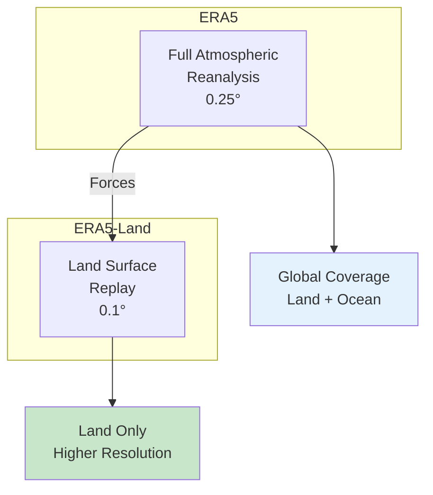

# 🌡️ Downloading ERA5 Daily Temperature

## Overview

**ERA5** is ECMWF's flagship global atmospheric reanalysis, providing hourly data at 0.25° resolution. This tutorial shows how to download hourly 2m temperature and convert it to daily means for climate analysis, validation, and modeling applications.

<div class="grid cards" markdown>

-   :material-thermometer: **Dataset**
    
    ---
    
    ERA5 Atmospheric Reanalysis
    
    **Variable:** 2m Temperature (t2m)  
    **Resolution:** 0.25° (~31 km)  
    **Coverage:** Global (land + ocean)  
    **Format:** NetCDF

-   :material-clock-outline: **Temporal**
    
    ---
    
    **Range:** 1940–present  
    **Native:** Hourly  
    **Output:** Daily means  
    **Latency:** ~5 days

-   :material-earth: **Coverage**
    
    ---
    
    **Domain:** Global  
    **Quality:** High (reanalysis)  
    **Consistency:** Homogeneous  
    **Levels:** Single + pressure levels

-   :material-download: **Access**
    
    ---
    
    **Source:** Copernicus CDS  
    **Method:** cdsapi Python  
    **Auth:** Required (free)  
    **Size:** ~100 MB/month

</div>

---

## 🎯 What This Script Does


The script performs the following operations:

1. **Downloads** hourly 2m temperature from CDS (month-by-month)
2. **Converts** hourly data to daily means
3. **Optionally converts** Kelvin to Celsius
4. **Merges** monthly files into a single NetCDF
5. **Cleans up** intermediate files

---

## 🌍 ERA5 vs ERA5-Land

### Key Differences

| Feature | ERA5 | ERA5-Land |
|---------|------|-----------|
| **Resolution** | 0.25° (~31 km) | 0.1° (~9 km) |
| **Coverage** | Global (land + ocean) | Land only |
| **Variables** | 100+ atmospheric | Land surface only |
| **Period** | 1940–present | 1950–present |
| **Best for** | Global analysis, ocean | High-res land studies |



!!! tip "When to Use ERA5 vs ERA5-Land"
    - **ERA5:** Global studies, ocean areas, pressure levels, more variables
    - **ERA5-Land:** Africa/land-focused, higher resolution, land surface variables

---

## 🚀 Quick Start Guide

### Prerequisites

!!! warning "CDS Account Required"
    You need a free Copernicus Climate Data Store account:
    
    1. **Register:** [https://cds.climate.copernicus.eu/](https://cds.climate.copernicus.eu/)
    2. **Get API key:** Profile → API Key
    3. **Configure:** Create `~/.cdsapirc` with your credentials

!!! info "Required Python Packages"
    ```bash
    pip install cdsapi xarray netCDF4 numpy
    ```

### API Configuration

Create a file `~/.cdsapirc` (Linux/Mac) or `%USERPROFILE%\.cdsapirc` (Windows):

```
url: https://cds.climate.copernicus.eu/api
key: YOUR-UID:YOUR-API-KEY
```

### Basic Usage

=== "Single Year"
    ```bash
    python download_era5_temp_daily.py \
        --start-year 2020 --end-year 2020 \
        --lat-min 3 --lat-max 15 \
        --lon-min 33 --lon-max 48 \
        --outdir data/era5 \
        --merge-outfile era5_t2m_2020.nc \
        --to-celsius --delete-hourly
    ```

=== "Multi-Year"
    ```bash
    python download_era5_temp_daily.py \
        --start-year 2015 --end-year 2023 \
        --lat-min 3 --lat-max 15 \
        --lon-min 33 --lon-max 48 \
        --outdir data/era5 \
        --merge-outfile era5_t2m_2015-2023.nc \
        --to-celsius --delete-hourly
    ```

=== "Keep All Files"
    ```bash
    python download_era5_temp_daily.py \
        --start-year 2020 --end-year 2020 \
        --lat-min 3 --lat-max 15 \
        --lon-min 33 --lon-max 48 \
        --outdir data/era5 \
        --keep-hourly --keep-monthly-daily
    ```

---

## 📋 The Complete Script

### Python Download Script

Save this as `download_era5_temp_daily.py`:

```python
#!/usr/bin/env python3
"""
Download ERA5 hourly 2m temperature (t2m) from CDS and compute daily means.

Key features
------------
- Monthly hourly download to avoid CDS "cost limits exceeded"
- Computes daily mean per month
- Optional unit conversion to Celsius
- Region bounding box support (N/W/S/E)
- Optional cleanup of hourly files
- Optional merge of all daily files into one NetCDF

Examples
--------
1) Download 2020 only (Ethiopia box), compute daily mean, convert to Celsius,
   delete hourly files, merge into one file:
python download_era5_temp_daily.py \
  --start-year 2020 --end-year 2020 \
  --lat-min 3 --lat-max 15 --lon-min 33 --lon-max 48 \
  --outdir data/era5_t2m \
  --merge-outfile era5_t2m_daily_2020.nc \
  --to-celsius --delete-hourly

2) Keep hourly monthly files:
python download_era5_temp_daily.py \
  --start-year 2020 --end-year 2021 \
  --lat-min 3 --lat-max 15 --lon-min 33 --lon-max 48 \
  --outdir data/era5_t2m \
  --keep-hourly

Notes
-----
Dataset used:
  reanalysis-era5-single-levels

Variable:
  2m_temperature (saved as t2m in NetCDF by CDS)
"""

import argparse
import os
import glob
from datetime import datetime

import numpy as np
import xarray as xr
import cdsapi


# --------------------------------------------------------------------------- #
# Helpers: time handling (robust to CDS variations)
# --------------------------------------------------------------------------- #

def find_time_dim(ds: xr.Dataset) -> str:
    """
    Find the most likely time dimension/coordinate in a CDS ERA5 file.
    Handles cases where time is named 'valid_time' or missing as a coord.
    """
    # 1) Common names first
    for cand in ("time", "valid_time"):
        if cand in ds.coords or cand in ds.dims:
            return cand

    # 2) Any coord that looks like time
    for name, coord in ds.coords.items():
        if "time" in name.lower():
            return name
        try:
            if np.issubdtype(coord.dtype, np.datetime64):
                return name
        except Exception:
            pass

    # 3) Any dim with CF-style time units
    for dim in ds.dims:
        if dim in ds.variables:
            units = str(ds[dim].attrs.get("units", ""))
            if "since" in units:
                return dim

    raise KeyError(
        "Could not find a time dimension/coordinate. "
        f"coords={list(ds.coords)}, dims={list(ds.dims)}"
    )


def standardise_time_for_resample(ds: xr.Dataset) -> xr.Dataset:
    """
    Ensure the dataset has a usable coordinate named 'time'
    so that ds['t2m'].resample(time='1D') works reliably.
    """
    time_dim = find_time_dim(ds)

    # If it's a dim but not a coord, attach it as a coord
    if time_dim in ds.dims and time_dim not in ds.coords:
        if time_dim in ds.variables:
            ds = ds.assign_coords({time_dim: ds[time_dim]})

    # Normalize to 'time'
    if time_dim != "time":
        ds = ds.rename({time_dim: "time"})

    # Ensure time is decoded if needed
    if "time" in ds.coords:
        if not np.issubdtype(ds["time"].dtype, np.datetime64):
            try:
                ds = xr.decode_cf(ds)
            except Exception:
                pass

    return ds


# --------------------------------------------------------------------------- #
# ERA5 retrieval and processing
# --------------------------------------------------------------------------- #

def build_monthly_request(year: int, month: int, area: list) -> dict:
    """
    Build a CDS request for ERA5 hourly 2m temperature for a given year+month.
    
    Parameters
    ----------
    year : int
        Year to download
    month : int
        Month to download (1-12)
    area : list
        Bounding box [N, W, S, E]
    
    Returns
    -------
    dict
        CDS API request dictionary
    """
    year_str = f"{year:04d}"
    month_str = f"{month:02d}"

    days = [f"{d:02d}" for d in range(1, 32)]
    times = [f"{h:02d}:00" for h in range(0, 24)]

    return {
        "product_type": "reanalysis",
        "variable": "2m_temperature",
        "year": year_str,
        "month": month_str,
        "day": days,
        "time": times,
        "area": area,  # [N, W, S, E]
        "format": "netcdf",
    }


def retrieve_hourly_t2m_month(year: int, month: int, out_path: str, area: list) -> None:
    """
    Download ERA5 hourly 2m temperature for a specific month.
    
    Parameters
    ----------
    year : int
        Year to download
    month : int
        Month to download (1-12)
    out_path : str
        Output file path
    area : list
        Bounding box [N, W, S, E]
    """
    client = cdsapi.Client()

    request = build_monthly_request(year, month, area)

    print(f"[info] Requesting ERA5 hourly T2M for {year:04d}-{month:02d}...")
    print(f"[info] Target: {out_path}")

    result = client.retrieve("reanalysis-era5-single-levels", request)
    result.download(out_path)
    
    print(f"[info] Downloaded → {out_path}")


def compute_daily_mean_t2m(hourly_path: str, daily_path: str, to_celsius: bool) -> None:
    """
    Open an hourly ERA5 file and write a daily-mean file.
    
    Robust to CDS files where time is named 'valid_time'
    or not attached as a coordinate.
    
    Parameters
    ----------
    hourly_path : str
        Input hourly NetCDF file
    daily_path : str
        Output daily NetCDF file
    to_celsius : bool
        Convert from Kelvin to Celsius
    """
    ds = xr.open_dataset(hourly_path)

    if "t2m" not in ds:
        available = list(ds.data_vars)
        ds.close()
        raise KeyError(f"'t2m' not found in {hourly_path}. Found: {available}")

    ds = standardise_time_for_resample(ds)

    # Compute daily mean
    t2m_daily = ds["t2m"].resample(time="1D").mean()

    ds_daily = t2m_daily.to_dataset(name="t2m")

    # Units
    if to_celsius:
        ds_daily["t2m"] = ds_daily["t2m"] - 273.15
        ds_daily["t2m"].attrs["units"] = "degC"
        ds_daily["t2m"].attrs["long_name"] = "2m temperature (daily mean)"
    else:
        ds_daily["t2m"].attrs.setdefault("units", "K")
        ds_daily["t2m"].attrs.setdefault("long_name", "2m temperature (daily mean)")

    # Add metadata
    ds_daily.attrs["title"] = "ERA5 Daily Mean 2m Temperature"
    ds_daily.attrs["source"] = "ECMWF ERA5 Reanalysis (CDS)"
    ds_daily.attrs["institution"] = "ECMWF"
    ds_daily.attrs["processing"] = "Monthly hourly download; daily mean computed with xarray"

    encoding = {"t2m": {"zlib": True, "complevel": 4}}
    ds_daily.to_netcdf(daily_path, encoding=encoding)

    ds.close()
    ds_daily.close()
    
    print(f"[info] Saved daily file → {daily_path}")


def merge_daily_files(daily_files: list, out_path: str, to_celsius: bool) -> None:
    """
    Merge multiple daily NetCDF files into one.
    
    Parameters
    ----------
    daily_files : list
        List of daily NetCDF file paths
    out_path : str
        Output merged file path
    to_celsius : bool
        Whether units are in Celsius
    """
    if not daily_files:
        raise FileNotFoundError("No daily files found to merge.")

    print(f"[info] Merging {len(daily_files)} daily files...")

    ds = xr.open_mfdataset(daily_files, combine="by_coords")

    # Ensure sorted time
    if "time" in ds.coords:
        ds = ds.sortby("time")

    # Ensure units metadata is consistent
    if "t2m" in ds:
        if to_celsius:
            ds["t2m"].attrs["units"] = "degC"
        else:
            ds["t2m"].attrs.setdefault("units", "K")

    # Add metadata
    ds.attrs["title"] = "ERA5 Daily Mean 2m Temperature (Merged)"
    ds.attrs["source"] = "ECMWF ERA5 Reanalysis"

    encoding = {"t2m": {"zlib": True, "complevel": 4}}
    ds.to_netcdf(out_path, encoding=encoding)
    ds.close()
    
    print(f"[info] Merged file saved → {out_path}")


# --------------------------------------------------------------------------- #
# CLI
# --------------------------------------------------------------------------- #

def parse_args() -> argparse.Namespace:
    p = argparse.ArgumentParser(
        description="Download ERA5 hourly 2m temperature and compute daily means.",
        formatter_class=argparse.RawDescriptionHelpFormatter,
        epilog="""
Examples:
  # Single year, convert to Celsius, delete hourly
  python download_era5_temp_daily.py \\
      --start-year 2020 --end-year 2020 \\
      --lat-min 3 --lat-max 15 --lon-min 33 --lon-max 48 \\
      --outdir data/era5 --to-celsius --delete-hourly \\
      --merge-outfile era5_t2m_2020.nc

  # Multi-year, keep all files
  python download_era5_temp_daily.py \\
      --start-year 2015 --end-year 2023 \\
      --lat-min 3 --lat-max 15 --lon-min 33 --lon-max 48 \\
      --outdir data/era5 --keep-hourly --keep-monthly-daily
        """
    )

    p.add_argument("--start-year", type=int, required=True, help="Start year")
    p.add_argument("--end-year", type=int, required=True, help="End year")

    p.add_argument("--lat-min", type=float, required=True, help="Min latitude")
    p.add_argument("--lat-max", type=float, required=True, help="Max latitude")
    p.add_argument("--lon-min", type=float, required=True, help="Min longitude")
    p.add_argument("--lon-max", type=float, required=True, help="Max longitude")

    p.add_argument("--outdir", required=True, help="Output directory")

    p.add_argument(
        "--merge-outfile",
        default=None,
        help="Merged daily NetCDF filename (stored in outdir)",
    )

    p.add_argument(
        "--to-celsius",
        action="store_true",
        help="Convert daily mean t2m from K to C",
    )

    # Hourly retention policy
    p.add_argument(
        "--keep-hourly",
        action="store_true",
        help="Keep downloaded hourly monthly files",
    )
    p.add_argument(
        "--delete-hourly",
        action="store_true",
        help="Delete hourly monthly files after daily computation (default)",
    )

    # Daily monthly retention policy
    p.add_argument(
        "--keep-monthly-daily",
        action="store_true",
        help="Keep per-month daily files even if merging",
    )

    return p.parse_args()


def main() -> None:
    args = parse_args()

    if args.start_year > args.end_year:
        raise SystemExit("--start-year must be <= --end-year")

    if args.keep_hourly and args.delete_hourly:
        raise SystemExit("Choose only one of --keep-hourly or --delete-hourly")

    print(f"\n{'#'*60}")
    print(f"# ERA5 Daily Temperature Download")
    print(f"# Years: {args.start_year} to {args.end_year}")
    print(f"# Region: lat [{args.lat_min}, {args.lat_max}], lon [{args.lon_min}, {args.lon_max}]")
    print(f"# Output: {'Celsius' if args.to_celsius else 'Kelvin'}")
    print(f"{'#'*60}\n")

    os.makedirs(args.outdir, exist_ok=True)

    # CDS area is [N, W, S, E]
    area = [args.lat_max, args.lon_min, args.lat_min, args.lon_max]

    hourly_dir = os.path.join(args.outdir, "hourly_monthly")
    daily_dir = os.path.join(args.outdir, "daily_monthly")
    os.makedirs(hourly_dir, exist_ok=True)
    os.makedirs(daily_dir, exist_ok=True)

    daily_files = []

    for year in range(args.start_year, args.end_year + 1):
        print(f"\n{'='*50}")
        print(f"Processing year {year}")
        print(f"{'='*50}")
        
        for month in range(1, 13):
            hourly_path = os.path.join(hourly_dir, f"era5_t2m_hourly_{year:04d}_{month:02d}.nc")
            daily_path = os.path.join(daily_dir, f"era5_t2m_daily_{year:04d}_{month:02d}.nc")

            # Download hourly if needed
            if not os.path.exists(hourly_path):
                retrieve_hourly_t2m_month(year, month, hourly_path, area)
            else:
                print(f"[info] Hourly file exists, skipping download: {os.path.basename(hourly_path)}")

            # Compute daily mean
            if not os.path.exists(daily_path):
                print(f"[info] Computing daily mean for {year:04d}-{month:02d}...")
                compute_daily_mean_t2m(hourly_path, daily_path, args.to_celsius)
            else:
                print(f"[info] Daily file exists, skipping: {os.path.basename(daily_path)}")

            daily_files.append(daily_path)

            # Hourly cleanup policy
            if args.delete_hourly or (not args.keep_hourly and not args.delete_hourly):
                # Default behavior: delete hourly to save space
                try:
                    if os.path.exists(hourly_path):
                        os.remove(hourly_path)
                        print(f"[info] Deleted hourly file → {os.path.basename(hourly_path)}")
                except OSError:
                    pass

    # Merge all monthly daily files if requested
    if args.merge_outfile:
        merged_path = os.path.join(args.outdir, args.merge_outfile)
        merge_daily_files(daily_files, merged_path, args.to_celsius)

        # Optionally delete monthly daily files after merge
        if not args.keep_monthly_daily:
            for f in daily_files:
                try:
                    if os.path.exists(f):
                        os.remove(f)
                except OSError:
                    pass
            print("[info] Deleted monthly daily files after merge")

    print(f"\n{'#'*60}")
    print(f"# Download complete!")
    print(f"# Output directory: {args.outdir}")
    print(f"{'#'*60}\n")


if __name__ == "__main__":
    main()
```

---

## 🔧 Command-Line Arguments

### Required Arguments

| Argument | Type | Description | Example |
|----------|------|-------------|---------|
| `--start-year` | Integer | Start year (1940+) | `2020` |
| `--end-year` | Integer | End year | `2023` |
| `--lat-min` | Float | Minimum latitude | `3` |
| `--lat-max` | Float | Maximum latitude | `15` |
| `--lon-min` | Float | Minimum longitude | `33` |
| `--lon-max` | Float | Maximum longitude | `48` |
| `--outdir` | String | Output directory | `data/era5` |

### Optional Arguments

| Argument | Type | Description | Default |
|----------|------|-------------|---------|
| `--merge-outfile` | String | Merged output filename | None |
| `--to-celsius` | Flag | Convert K to °C | False (Kelvin) |
| `--keep-hourly` | Flag | Keep hourly files | False |
| `--delete-hourly` | Flag | Delete hourly files | True (default) |
| `--keep-monthly-daily` | Flag | Keep monthly daily files | False |

---

## 📊 Understanding the Data

### ERA5 Single Levels Dataset

The script uses `reanalysis-era5-single-levels`, which provides:

- **2m temperature (t2m):** Air temperature at 2 meters above surface
- **Hourly temporal resolution:** 24 values per day
- **Global coverage:** Land and ocean

### Temperature Units

| Unit | Description | Conversion |
|------|-------------|------------|
| **Kelvin (K)** | Default ERA5 output | Native |
| **Celsius (°C)** | With `--to-celsius` | K - 273.15 |

### Hourly to Daily Conversion

The script computes daily means from 24 hourly values:

$$
T_{daily} = \frac{1}{24} \sum_{h=0}^{23} T_h
$$

---

## 📍 Regional Bounding Boxes

Use these coordinates with the `--lat-min`, `--lat-max`, `--lon-min`, `--lon-max` arguments:

=== "Ethiopia"
    ```bash
    --lat-min 3 --lat-max 15 --lon-min 33 --lon-max 48
    ```
    **Coverage:** Entire Ethiopia

=== "East Africa"
    ```bash
    --lat-min -5 --lat-max 12 --lon-min 28 --lon-max 42
    ```
    **Coverage:** Kenya, Uganda, Tanzania, Rwanda, Burundi

=== "Horn of Africa"
    ```bash
    --lat-min -5 --lat-max 18 --lon-min 32 --lon-max 52
    ```
    **Coverage:** Ethiopia, Somalia, Eritrea, Djibouti, Kenya

=== "Africa"
    ```bash
    --lat-min -35 --lat-max 37 --lon-min -18 --lon-max 52
    ```
    **Coverage:** Entire African continent

=== "Global Small Test"
    ```bash
    --lat-min 8 --lat-max 10 --lon-min 38 --lon-max 40
    ```
    **Coverage:** Small test region (fast download)

---

## 💡 Usage Examples

### Example 1: Quick Test (Single Month Equivalent)

```bash
python download_era5_temp_daily.py \
    --start-year 2023 --end-year 2023 \
    --lat-min 8 --lat-max 10 \
    --lon-min 38 --lon-max 40 \
    --outdir data/era5_test \
    --merge-outfile test_2023.nc \
    --to-celsius --delete-hourly
```

**What it does:**

- Downloads small region for testing
- Converts to Celsius
- ~5-10 minutes per month

---

### Example 2: Full Year for Ethiopia

```bash
python download_era5_temp_daily.py \
    --start-year 2023 --end-year 2023 \
    --lat-min 3 --lat-max 15 \
    --lon-min 33 --lon-max 48 \
    --outdir data/era5_ethiopia \
    --merge-outfile era5_t2m_ethiopia_2023.nc \
    --to-celsius --delete-hourly
```

**What it does:**

- Downloads all 12 months of 2023
- Converts to Celsius
- Deletes hourly files to save space
- ~1-2 hours total

---

### Example 3: Long Historical Record

```bash
python download_era5_temp_daily.py \
    --start-year 1980 --end-year 2023 \
    --lat-min 3 --lat-max 15 \
    --lon-min 33 --lon-max 48 \
    --outdir data/era5_ethiopia \
    --merge-outfile era5_t2m_ethiopia_1980-2023.nc \
    --to-celsius --delete-hourly
```

**What it does:**

- Downloads 44 years of data
- Merges into single file
- ~2-3 days total (CDS queue dependent)

---

### Example 4: Batch Download Script

```bash
#!/bin/bash
# download_era5_decades.sh

OUTDIR="data/era5_ethiopia"
LAT_MIN=3
LAT_MAX=15
LON_MIN=33
LON_MAX=48

# Download by decade
for DECADE_START in 1980 1990 2000 2010 2020; do
    DECADE_END=$((DECADE_START + 9))
    if [ $DECADE_END -gt 2023 ]; then DECADE_END=2023; fi
    
    echo "Downloading $DECADE_START-$DECADE_END..."
    python download_era5_temp_daily.py \
        --start-year $DECADE_START --end-year $DECADE_END \
        --lat-min $LAT_MIN --lat-max $LAT_MAX \
        --lon-min $LON_MIN --lon-max $LON_MAX \
        --outdir "$OUTDIR" \
        --merge-outfile "era5_t2m_eth_${DECADE_START}-${DECADE_END}.nc" \
        --to-celsius --delete-hourly
done

echo "All decades downloaded!"
```

---

### Example 5: Keep All Intermediate Files

```bash
python download_era5_temp_daily.py \
    --start-year 2020 --end-year 2020 \
    --lat-min 3 --lat-max 15 \
    --lon-min 33 --lon-max 48 \
    --outdir data/era5_debug \
    --keep-hourly --keep-monthly-daily \
    --to-celsius
```

**What it does:**

- Keeps hourly files (for debugging/analysis)
- Keeps monthly daily files
- Useful for inspecting intermediate steps

---

## 📂 Output Directory Structure

After running the script, your output directory will contain:

```
data/era5_ethiopia/
├── hourly_monthly/                         # (if --keep-hourly)
│   ├── era5_t2m_hourly_2020_01.nc
│   ├── era5_t2m_hourly_2020_02.nc
│   └── ...
├── daily_monthly/                          # (if --keep-monthly-daily)
│   ├── era5_t2m_daily_2020_01.nc
│   ├── era5_t2m_daily_2020_02.nc
│   └── ...
└── era5_t2m_ethiopia_2020.nc               # Final merged output
```

---

## 🔍 Verifying Your Download

After downloading, verify your data using Python:

```python
import xarray as xr
import matplotlib.pyplot as plt

# Open merged file
ds = xr.open_dataset('data/era5_ethiopia/era5_t2m_ethiopia_2020.nc')

# Display dataset information
print(ds)
print(f"\nDimensions: {dict(ds.dims)}")
print(f"Time range: {ds.time.values[0]} to {ds.time.values[-1]}")
print(f"Temperature range: {float(ds.t2m.min()):.1f} to {float(ds.t2m.max()):.1f}")
print(f"Units: {ds.t2m.attrs.get('units', 'unknown')}")

# Plot annual mean
annual_mean = ds.t2m.mean(dim='time')

fig, ax = plt.subplots(figsize=(10, 8))
annual_mean.plot(ax=ax, cmap='RdYlBu_r', cbar_kwargs={'label': '°C'})
ax.set_title('ERA5 Annual Mean Temperature 2020')
plt.savefig('era5_annual_mean.png', dpi=150, bbox_inches='tight')
plt.show()

# Monthly climatology for a point
lat_point, lon_point = 9.0, 38.7  # Addis Ababa
point_data = ds.t2m.sel(latitude=lat_point, longitude=lon_point, method='nearest')
monthly = point_data.groupby('time.month').mean()

plt.figure(figsize=(10, 5))
monthly.plot(marker='o', linewidth=2, color='orangered')
plt.xlabel('Month')
plt.ylabel('Temperature (°C)')
plt.title('ERA5 Monthly Temperature - Addis Ababa')
plt.xticks(range(1, 13), ['J', 'F', 'M', 'A', 'M', 'J', 'J', 'A', 'S', 'O', 'N', 'D'])
plt.grid(True, alpha=0.3)
plt.savefig('era5_monthly.png', dpi=150, bbox_inches='tight')
plt.show()
```

---

## 📈 Comparing ERA5 with ERA5-Land

### Comparison Script

```python
import xarray as xr
import matplotlib.pyplot as plt

# Load both datasets
era5 = xr.open_dataset('data/era5/era5_t2m_2020.nc')
era5_land = xr.open_dataset('data/era5_land/era5_land_t2m_2020.nc')

# Compute annual means
era5_mean = era5.t2m.mean(dim='time')
era5_land_mean = era5_land.t2m.mean(dim='time')

# Regrid ERA5-Land to ERA5 grid for comparison
era5_land_regrid = era5_land_mean.interp(
    latitude=era5_mean.latitude, 
    longitude=era5_mean.longitude
)

# Compute difference
diff = era5_mean - era5_land_regrid

# Plot
fig, axes = plt.subplots(1, 3, figsize=(18, 5))

era5_mean.plot(ax=axes[0], cmap='RdYlBu_r', vmin=15, vmax=30)
axes[0].set_title('ERA5 (0.25°)')

era5_land_mean.plot(ax=axes[1], cmap='RdYlBu_r', vmin=15, vmax=30)
axes[1].set_title('ERA5-Land (0.1°)')

diff.plot(ax=axes[2], cmap='RdBu_r', center=0, vmin=-2, vmax=2)
axes[2].set_title('Difference (ERA5 - ERA5-Land)')

plt.tight_layout()
plt.savefig('era5_vs_era5land.png', dpi=150, bbox_inches='tight')
plt.show()

print(f"ERA5 mean: {float(era5_mean.mean()):.2f}°C")
print(f"ERA5-Land mean: {float(era5_land_mean.mean()):.2f}°C")
print(f"Mean difference: {float(diff.mean()):.2f}°C")
```

---

## 📊 Computing Climate Statistics

### Temperature Extremes

```python
import xarray as xr
import numpy as np

# Load data
ds = xr.open_dataset('data/era5/era5_t2m_ethiopia_2020.nc')

# Annual statistics
annual_mean = ds.t2m.mean(dim='time')
annual_max = ds.t2m.max(dim='time')
annual_min = ds.t2m.min(dim='time')

print(f"Annual mean: {float(annual_mean.mean()):.1f}°C")
print(f"Annual max: {float(annual_max.max()):.1f}°C")
print(f"Annual min: {float(annual_min.min()):.1f}°C")

# Hot days (> 35°C)
hot_days = (ds.t2m > 35).sum(dim='time')
print(f"Mean hot days: {float(hot_days.mean()):.1f} days/year")

# Growing Degree Days (base 10°C)
gdd = np.maximum(ds.t2m - 10, 0).sum(dim='time')
print(f"Mean GDD: {float(gdd.mean()):.0f}")

# Save statistics
ds_stats = xr.Dataset({
    't2m_mean': annual_mean,
    't2m_max': annual_max,
    't2m_min': annual_min,
    'hot_days': hot_days,
    'gdd': gdd,
})
ds_stats.to_netcdf('era5_temp_statistics.nc')
```

---

## ⚠️ Troubleshooting

### Common Issues and Solutions

=== "CDS API Error"

    **Problem:** API key not configured
    
    ```
    Exception: Missing/incomplete CDS API credentials
    ```
    
    **Solutions:**
    
    1. **Create config file:**
        ```bash
        # Linux/Mac
        nano ~/.cdsapirc
        
        # Windows
        notepad %USERPROFILE%\.cdsapirc
        ```
    
    2. **Add credentials:**
        ```
        url: https://cds.climate.copernicus.eu/api
        key: YOUR-UID:YOUR-API-KEY
        ```

=== "Request Too Large"

    **Problem:** CDS rejects request as too large
    
    **Solutions:**
    
    1. **Monthly downloads:** Script already uses this approach
    2. **Smaller region:** Reduce bounding box
    3. **Fewer years:** Download one year at a time

=== "Time Dimension Error"

    **Problem:** `valid_time` instead of `time`
    
    **Solution:** Script handles this automatically with `find_time_dim()` and `standardise_time_for_resample()`

=== "Queue Timeout"

    **Problem:** Request times out in CDS queue
    
    **Solutions:**
    
    1. **Be patient:** CDS queues can be long
    2. **Off-peak hours:** Try nights/weekends
    3. **Smaller requests:** Reduce region or time range

=== "Disk Space"

    **Problem:** Running out of disk space
    
    **Solutions:**
    
    1. **Use `--delete-hourly`:** Default behavior
    2. **Don't use `--keep-monthly-daily`**
    3. **Process year by year**

---

## 🎓 Data Quality Notes

!!! success "Strengths"
    - **Global coverage** - Land and ocean
    - **Long record** - 1940 to present
    - **Consistent** - No gaps, homogeneous
    - **Many variables** - 100+ available
    - **Pressure levels** - Full atmosphere
    - **Near real-time** - ~5 days latency

!!! warning "Limitations"
    - **Coarser than ERA5-Land** - 0.25° vs 0.1°
    - **Reanalysis** - Not direct observations
    - **Large files** - Hourly data is big
    - **CDS queues** - Can be slow

!!! tip "Best Practices"
    - **Use ERA5-Land** for land-only studies at higher resolution
    - **Use ERA5** for global/ocean studies or more variables
    - **Delete hourly files** to save space
    - **Validate locally** against station data

---

## 📖 Additional Resources

### Official Documentation

- **ERA5:** [https://cds.climate.copernicus.eu/datasets/reanalysis-era5-single-levels](https://cds.climate.copernicus.eu/datasets/reanalysis-era5-single-levels)
- **CDS API:** [https://cds.climate.copernicus.eu/how-to-api](https://cds.climate.copernicus.eu/how-to-api)
- **ERA5 Documentation:** [ECMWF ERA5](https://www.ecmwf.int/en/forecasts/dataset/ecmwf-reanalysis-v5)

### Related Datasets

- **ERA5-Land:** Higher resolution land surface (0.1°)
- **ERA5 Pressure Levels:** Full 3D atmosphere
- **CHIRTS:** Africa temperature observations

### Related Tutorials

- [ERA5-Land Temperature](23-download_era5_land_temp_daily.md) - Higher resolution land
- [CHIRTS Daily Temperature](22-download_chirts_daily.md) - Africa observations
- [Climate Data Access](09-climate_data_access_and_extraction.md) - Overview

---

## 🚀 Next Steps

<div class="grid cards" markdown>

-   :material-chart-line: **Trend Analysis**
    
    ---
    
    Compute temperature trends  
    Long-term climate analysis  
    
    → [Xarray Tutorial](06-Xarray_for_Climate_and_Meteorology_Workshop.md)

-   :material-map: **Visualize Data**
    
    ---
    
    Map temperature patterns  
    Seasonal climatologies  
    
    → [Matplotlib Tutorial](05-Matplotlib_for_Climate_and_Meteorology_Workshop.md)

-   :material-compare: **Compare Datasets**
    
    ---
    
    ERA5 vs ERA5-Land  
    ERA5 vs CHIRTS  
    
    → [ERA5-Land Tutorial](23-download_era5_land_temp_daily.md)

-   :material-bug: **VECTRI Modeling**
    
    ---
    
    Temperature-driven transmission  
    Historical malaria analysis  
    
    → [VECTRI Model](../day1/06-vectri_model_components_larvae_to_hydrology.md)

</div>

---

!!! example "Need Help?"
    If you encounter issues or have questions:
    
    - Check the [Troubleshooting](#troubleshooting) section
    - Review [CDS API Documentation](https://cds.climate.copernicus.eu/how-to-api)
    - Contact workshop instructors

---

<div style="background: linear-gradient(135deg, #1565c0 0%, #1976d2 100%); color: white; padding: 2rem; border-radius: 8px; text-align: center; margin-top: 2rem;">
  <h3 style="margin: 0 0 1rem 0;">🌡️ Ready for ERA5 Temperature Analysis!</h3>
  <p style="margin: 0; opacity: 0.95;">You now have everything you need to download ERA5 daily temperature for global atmospheric reanalysis with comprehensive coverage.</p>
</div>

