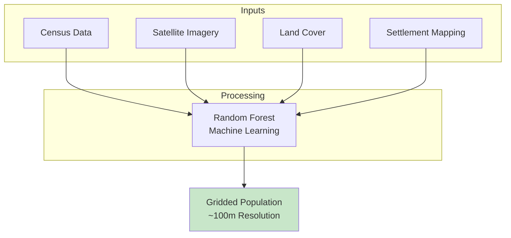
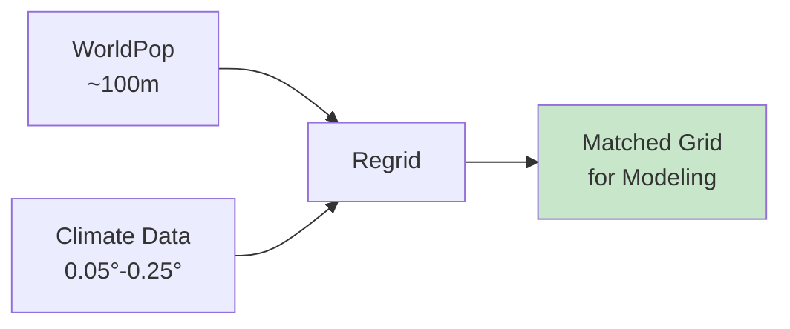

# 👥 Downloading WorldPop Population Data

## Overview

**WorldPop/AfriPop** provides high-resolution gridded population estimates essential for disease burden modeling, exposure assessment, and public health planning. This tutorial shows how to download population counts and convert them to density for use with VECTRI and other models.

<div class="grid cards" markdown>

-   :material-account-group: **Dataset**
    
    ---
    
    WorldPop/AfriPop Ethiopia
    
    **Variable:** Population counts  
    **Resolution:** ~100m  
    **Coverage:** Ethiopia  
    **Format:** GeoTIFF

-   :material-calendar: **Temporal**
    
    ---
    
    **Years:** 2010, 2015  
    **Versions:** UN-adjusted, Unadjusted  
    **Updates:** Periodic  
    **Projections:** Available

-   :material-map-marker: **Spatial**
    
    ---
    
    **CRS:** WGS84 (EPSG:4326)  
    **Grid:** ~100m × 100m  
    **Units:** Persons per cell  
    **Quality:** High accuracy

-   :material-download: **Access**
    
    ---
    
    **Source:** WorldPop Hub  
    **Method:** HTTP download  
    **Auth:** None required  
    **Size:** ~500 MB per file

</div>

---

## 🎯 What This Script Does


The script performs the following operations:

1. **Downloads** AfriPop GeoTIFF from WorldPop servers
2. **Reads** population counts per grid cell
3. **Computes** cell area accounting for latitude
4. **Calculates** population density (per km² or m²)
5. **Optionally regrids** to match a template (e.g., VECTRI grid)
6. **Saves** as NetCDF for model input

---

## 👥 Understanding WorldPop Data

### What is WorldPop/AfriPop?

WorldPop combines multiple data sources to estimate population distribution:



### Available Files for Ethiopia

| Filename | Year | Type | Description |
|----------|------|------|-------------|
| `ETH10adjv5.tif` | 2010 | UN-adjusted | Aligned to UN estimates |
| `ETH10v5.tif` | 2010 | Unadjusted | Raw model output |
| `ETH15adjv5.tif` | 2015 | UN-adjusted | Aligned to UN estimates |
| `ETH15v5.tif` | 2015 | Unadjusted | Raw model output |

!!! tip "Which Version to Use?"
    - **UN-adjusted (default):** Recommended for most applications
    - **Unadjusted:** Use for comparison or when UN estimates are questioned

---

## 🚀 Quick Start Guide

### Prerequisites

!!! info "Required Python Packages"
    ```bash
    pip install requests xarray rioxarray netCDF4 numpy
    ```

### Basic Usage

=== "Density per km²"
    ```bash
    python download_worldpop_population.py \
        --year 2010 \
        --out-nc data/pop_ethiopia_2010_km2.nc
    ```

=== "Density per m²"
    ```bash
    python download_worldpop_population.py \
        --year 2010 \
        --out-nc data/pop_ethiopia_2010_m2.nc \
        --per-m2
    ```

=== "Regrid to VECTRI"
    ```bash
    python download_worldpop_population.py \
        --year 2010 \
        --out-nc data/pop_ethiopia_vectri_2010.nc \
        --per-m2 \
        --template-nc climate_forcing.nc
    ```

---

## 📋 The Complete Script

### Python Download Script

Save this as `download_worldpop_population.py`:

```python
#!/usr/bin/env python
"""
Download AfriPop / WorldPop Ethiopia 100m population raster, then convert it
to population density (per km^2 or m^2), with optional regridding to a
template NetCDF grid (e.g. VECTRI climate driver).

Data source (AfriPop Ethiopia):
  Hub page: https://hub.worldpop.org/doi/10.5258/SOTON/WP00087
  Files (served from data.worldpop.org):
    ETH10adjv5.tif  (2010, UN-adjusted counts)
    ETH10v5.tif     (2010, unadjusted counts)
    ETH15adjv5.tif  (2015, UN-adjusted counts)
    ETH15v5.tif     (2015, unadjusted counts)
Units: estimated persons per grid square (~100 m), WGS84, GeoTIFF.

Example usage:

  # 1) Download 2010 UN-adjusted AfriPop and make persons per km^2 (AfriPop grid)
  python download_worldpop_population.py \
      --year 2010 \
      --out-nc data/pop_eth_afripop_2010_km2.nc

  # 2) Same but persons per m^2 on VECTRI climate grid
  python download_worldpop_population.py \
      --year 2010 \
      --out-nc data/pop_eth_vectri_grid_2010_m2.nc \
      --per-m2 \
      --template-nc example_sys5.nc

  # 3) Use unadjusted counts (not UN-adjusted)
  python download_worldpop_population.py \
      --year 2015 \
      --unadjusted \
      --out-nc data/pop_eth_afripop_2015_km2.nc
"""

import argparse
from pathlib import Path
from typing import Optional

import numpy as np
import requests
import xarray as xr
import rioxarray as rxr


# Base URL for AfriPop/WorldPop Ethiopia 100m population
BASE_URL = (
    "https://data.worldpop.org/"
    "GIS/Population/Individual_countries/ETH/"
    "Ethiopia_100m_Population/{filename}"
)


def build_filename(year: int, adjusted: bool) -> str:
    """
    Build AfriPop filename for Ethiopia given year and adjustment flag.

    Valid combinations (version 5):
      2010, adjusted   -> ETH10adjv5.tif
      2010, unadjusted -> ETH10v5.tif
      2015, adjusted   -> ETH15adjv5.tif
      2015, unadjusted -> ETH15v5.tif
    """
    if year not in (2010, 2015):
        raise ValueError("Only years 2010 and 2015 are available for this AfriPop set.")

    yy = str(year)[-2:]  # "10" or "15"
    if adjusted:
        return f"ETH{yy}adjv5.tif"
    else:
        return f"ETH{yy}v5.tif"


def download_afripop_file(year: int, adjusted: bool, data_dir: Path) -> Path:
    """
    Ensure the AfriPop GeoTIFF file exists locally; if not, download it.

    Returns
    -------
    tif_path : Path
        Local path to the downloaded (or already existing) GeoTIFF.
    """
    data_dir.mkdir(parents=True, exist_ok=True)
    filename = build_filename(year, adjusted)
    tif_path = data_dir / filename

    if tif_path.exists():
        print(f"[info] AfriPop file already present: {tif_path}")
        return tif_path

    url = BASE_URL.format(filename=filename)
    print(f"[info] Downloading AfriPop from:\n       {url}")
    print(f"[info] Saving to: {tif_path}")

    with requests.get(url, stream=True, timeout=300) as r:
        try:
            r.raise_for_status()
        except requests.HTTPError as exc:
            raise RuntimeError(
                f"Failed to download {url} (HTTP {r.status_code}). "
                f"Check internet connection or try in browser."
            ) from exc

        total = int(r.headers.get("Content-Length", 0) or 0)
        downloaded = 0
        with open(tif_path, "wb") as f:
            for chunk in r.iter_content(chunk_size=1024 * 1024):
                if not chunk:
                    continue
                f.write(chunk)
                downloaded += len(chunk)
                if total:
                    pct = 100 * downloaded / total
                    print(
                        f"\r[info] Downloaded "
                        f"{downloaded/1e6:.1f}/{total/1e6:.1f} MB ({pct:.1f}%)",
                        end="",
                    )

    print(f"\n[info] Download complete: {tif_path}")
    return tif_path


def compute_cell_area_km2(lat_vals: np.ndarray, lon_vals: np.ndarray) -> np.ndarray:
    """
    Approximate spherical-Earth pixel area for each (lat, lon) cell of a
    regular lat/lon grid.

    Parameters
    ----------
    lat_vals : np.ndarray
        1D array of latitude values
    lon_vals : np.ndarray
        1D array of longitude values

    Returns
    -------
    area_km2 : np.ndarray
        2D array with shape (nlat, nlon) giving area in km².
    """
    R = 6371.0  # Earth radius in km

    lat = np.asarray(lat_vals)
    lon = np.asarray(lon_vals)

    if lat.size < 2 or lon.size < 2:
        raise ValueError("Need at least 2 lat and lon points to compute grid spacing.")

    dlat_deg = float(np.abs(lat[1] - lat[0]))
    dlon_deg = float(np.abs(lon[1] - lon[0]))

    dlat = np.deg2rad(dlat_deg)
    dlon = np.deg2rad(dlon_deg)

    phi = np.deg2rad(lat)
    sin_term = np.sin(phi + dlat / 2.0) - np.sin(phi - dlat / 2.0)

    area_band_km2 = (R**2) * dlon * sin_term  # (nlat,)

    area_km2 = np.repeat(area_band_km2[:, np.newaxis], lon.size, axis=1)
    return area_km2


def afripop_to_density(
    afripop_tif: Path,
    out_nc: Path,
    per_m2: bool = False,
    template_nc: Optional[Path] = None,
    out_var_name: str = "population",
):
    """
    Convert AfriPop/WorldPop raster (counts per pixel) to population density.

    Parameters
    ----------
    afripop_tif : Path
        Path to AfriPop GeoTIFF (counts per grid cell).
    out_nc : Path
        Output NetCDF path.
    per_m2 : bool
        If True, output in persons m⁻², else persons km⁻².
    template_nc : Path or None
        If provided, interpolate density to its lat/lon grid.
    out_var_name : str
        Variable name in output NetCDF.
    """
    afripop_tif = afripop_tif.expanduser()
    if not afripop_tif.exists():
        raise FileNotFoundError(f"Input raster not found: {afripop_tif}")

    print(f"[info] Reading AfriPop raster: {afripop_tif}")

    # 1. Read AfriPop raster (counts per cell), masking nodata
    da = rxr.open_rasterio(afripop_tif, masked=True).squeeze(drop=True)

    # CRS
    if da.rio.crs is None:
        print("[warn] AfriPop file has no CRS; assuming EPSG:4326 (WGS84).")
        da = da.rio.write_crs("EPSG:4326", inplace=False)

    # Rename dimensions to lat/lon
    da = da.rename({"y": "lat", "x": "lon"})

    # Explicitly mask nodata and any negative values
    nodata = da.rio.nodata
    if nodata is not None:
        da = da.where(da != nodata)
    da = da.where(da >= 0)

    lat_vals = da["lat"].values
    lon_vals = da["lon"].values

    print(
        f"[info] AfriPop grid: nlat={lat_vals.size}, nlon={lon_vals.size}, "
        f"lat range=({float(lat_vals.min()):.3f}, {float(lat_vals.max()):.3f}), "
        f"lon range=({float(lon_vals.min()):.3f}, {float(lon_vals.max()):.3f})"
    )

    # 2. Compute cell area (km²)
    print("[info] Computing cell areas...")
    area_km2 = compute_cell_area_km2(lat_vals, lon_vals)
    area_da = xr.DataArray(
        area_km2,
        coords={"lat": lat_vals, "lon": lon_vals},
        dims=("lat", "lon"),
        name="cell_area",
        attrs={"units": "km2", "long_name": "grid_cell_area"},
    )

    # 3. Density = persons / km²
    print("[info] Computing population density...")
    density_km2 = da / area_da
    density_km2.name = out_var_name
    density_km2.attrs["long_name"] = "Population density from AfriPop/WorldPop"
    density_km2.attrs["source"] = "WorldPop/AfriPop Ethiopia"

    # Remove any non-finite values
    density_km2 = density_km2.where(np.isfinite(density_km2))

    if per_m2:
        density = density_km2 / 1e6  # 1 km² = 1e6 m²
        density.attrs["units"] = "persons m-2"
        print("[info] Output units: persons per m²")
    else:
        density = density_km2
        density.attrs["units"] = "persons km-2"
        print("[info] Output units: persons per km²")

    # 4. Optional regridding to template grid
    if template_nc is not None:
        print(f"[info] Loading template grid from: {template_nc}")
        ds_tmpl = xr.open_dataset(template_nc)

        # Detect lat/lon names
        lat_name = None
        lon_name = None
        for cand in ["lat", "latitude", "y"]:
            if cand in ds_tmpl.coords:
                lat_name = cand
                break
        for cand in ["lon", "longitude", "x"]:
            if cand in ds_tmpl.coords:
                lon_name = cand
                break

        if lat_name is None or lon_name is None:
            raise ValueError(
                "Could not find latitude/longitude coordinates in template NetCDF."
            )

        lat_target = ds_tmpl[lat_name]
        lon_target = ds_tmpl[lon_name]

        print(
            f"[info] Regridding density to template grid: "
            f"{lat_name}={lat_target.size}, {lon_name}={lon_target.size}"
        )

        density_interp = density.interp(lat=lat_target, lon=lon_target)

        # Rename coords back to template names if needed
        rename_dict = {}
        if lat_name != "lat":
            rename_dict["lat"] = lat_name
        if lon_name != "lon":
            rename_dict["lon"] = lon_name
        if rename_dict:
            density_interp = density_interp.rename(rename_dict)

        density = density_interp
        ds_tmpl.close()

    # Final clean-up
    density = density.where(np.isfinite(density) & (density >= 0))

    # 5. Save to NetCDF
    out_nc.parent.mkdir(parents=True, exist_ok=True)
    ds_out = density.to_dataset(name=out_var_name)
    
    # Add global attributes
    ds_out.attrs["title"] = "Population Density from WorldPop/AfriPop"
    ds_out.attrs["source"] = "WorldPop (https://www.worldpop.org/)"
    ds_out.attrs["institution"] = "WorldPop, University of Southampton"
    ds_out.attrs["references"] = "https://hub.worldpop.org/doi/10.5258/SOTON/WP00087"
    
    # Compression
    encoding = {out_var_name: {"zlib": True, "complevel": 4}}
    ds_out.to_netcdf(out_nc, encoding=encoding)
    
    print(f"[info] Wrote population density to {out_nc}")
    if template_nc is not None:
        print("[info] Grid matches template NetCDF.")
    else:
        print("[info] Grid matches original AfriPop raster.")


def main():
    parser = argparse.ArgumentParser(
        description=(
            "Download AfriPop/WorldPop Ethiopia 100m population (2010/2015) and "
            "convert to population density (per km² or m²), with optional "
            "regridding to a template NetCDF grid."
        ),
        formatter_class=argparse.RawDescriptionHelpFormatter,
        epilog="""
Examples:
  # Download 2010 UN-adjusted, density per km²
  python download_worldpop_population.py \\
      --year 2010 \\
      --out-nc data/pop_ethiopia_2010_km2.nc

  # Density per m² on VECTRI climate grid
  python download_worldpop_population.py \\
      --year 2010 \\
      --out-nc data/pop_ethiopia_vectri_2010_m2.nc \\
      --per-m2 \\
      --template-nc climate_forcing.nc

  # Use unadjusted counts
  python download_worldpop_population.py \\
      --year 2015 \\
      --unadjusted \\
      --out-nc data/pop_ethiopia_2015_km2.nc
        """
    )
    parser.add_argument(
        "--year",
        type=int,
        choices=[2010, 2015],
        default=2010,
        help="AfriPop year (2010 or 2015; default: 2010).",
    )
    parser.add_argument(
        "--unadjusted",
        action="store_true",
        help="Use UN-unadjusted counts (default: UN-adjusted).",
    )
    parser.add_argument(
        "--data-dir",
        default="data/worldpop",
        help="Directory to store/download AfriPop GeoTIFFs (default: data/worldpop).",
    )
    parser.add_argument(
        "--out-nc",
        required=True,
        help="Output NetCDF file for population density.",
    )
    parser.add_argument(
        "--per-m2",
        action="store_true",
        help="Output units in persons m⁻² (default: persons km⁻²).",
    )
    parser.add_argument(
        "--template-nc",
        default=None,
        help=(
            "Optional template NetCDF file; if provided, density will be "
            "interpolated to its lat/lon grid (e.g. climate_forcing.nc)."
        ),
    )
    parser.add_argument(
        "--var-name",
        default="population",
        help="Name of the output variable (default: population).",
    )

    args = parser.parse_args()

    print(f"\n{'#'*60}")
    print(f"# WorldPop/AfriPop Population Download")
    print(f"# Year: {args.year}")
    print(f"# Type: {'Unadjusted' if args.unadjusted else 'UN-adjusted'}")
    print(f"# Units: {'persons/m²' if args.per_m2 else 'persons/km²'}")
    print(f"{'#'*60}\n")

    data_dir = Path(args.data_dir)
    out_nc = Path(args.out_nc)
    template_nc = Path(args.template_nc) if args.template_nc else None

    # 1. Ensure AfriPop file is present (download if needed)
    tif_path = download_afripop_file(
        year=args.year,
        adjusted=not args.unadjusted,
        data_dir=data_dir,
    )

    # 2. Convert to density and write NetCDF
    afripop_to_density(
        afripop_tif=tif_path,
        out_nc=out_nc,
        per_m2=args.per_m2,
        template_nc=template_nc,
        out_var_name=args.var_name,
    )

    print(f"\n{'#'*60}")
    print(f"# Download and processing complete!")
    print(f"# Output: {out_nc}")
    print(f"{'#'*60}\n")


if __name__ == "__main__":
    main()
```

---

## 🔧 Command-Line Arguments

### Required Arguments

| Argument | Type | Description | Example |
|----------|------|-------------|---------|
| `--out-nc` | String | Output NetCDF file path | `data/pop_eth.nc` |

### Optional Arguments

| Argument | Type | Description | Default |
|----------|------|-------------|---------|
| `--year` | Integer | Population year (2010 or 2015) | `2010` |
| `--unadjusted` | Flag | Use unadjusted counts | False (UN-adjusted) |
| `--data-dir` | String | Directory for GeoTIFF downloads | `data/worldpop` |
| `--per-m2` | Flag | Output in persons/m² | False (persons/km²) |
| `--template-nc` | String | Template NetCDF for regridding | None |
| `--var-name` | String | Output variable name | `population` |

---

## 📊 Understanding Population Density

### Counts vs Density

| Format | Units | Use Case |
|--------|-------|----------|
| **Raw counts** | Persons per cell | Total population estimates |
| **Density (km⁻²)** | Persons per km² | Regional comparisons |
| **Density (m⁻²)** | Persons per m² | Model input (e.g., VECTRI) |

### Cell Area Calculation

The script computes cell area using spherical Earth geometry:

$$
A_{cell} = R^2 \cdot \Delta\lambda \cdot (\sin(\phi + \frac{\Delta\phi}{2}) - \sin(\phi - \frac{\Delta\phi}{2}))
$$

Where:
- $R$ = Earth radius (6371 km)
- $\Delta\lambda$ = longitude spacing (radians)
- $\phi$ = latitude (radians)
- $\Delta\phi$ = latitude spacing (radians)

!!! info "Why Cell Area Varies"
    Grid cells at different latitudes have different areas. A 100m cell at the equator is larger than one at 15°N. The script accounts for this.

---

## 💡 Usage Examples

### Example 1: Basic Download (Density per km²)

```bash
python download_worldpop_population.py \
    --year 2010 \
    --out-nc data/pop_ethiopia_2010_km2.nc
```

**What it does:**

- Downloads 2010 UN-adjusted population
- Converts to persons per km²
- Keeps original ~100m grid
- ~5-10 minutes download

---

### Example 2: VECTRI-Ready Format

```bash
python download_worldpop_population.py \
    --year 2010 \
    --out-nc data/pop_ethiopia_vectri_2010.nc \
    --per-m2 \
    --template-nc climate_forcing.nc
```

**What it does:**

- Downloads 2010 UN-adjusted population
- Converts to persons per m² (VECTRI units)
- Regrids to match climate forcing file
- Ready for VECTRI input

---

### Example 3: Compare Adjusted vs Unadjusted

```bash
# UN-adjusted (recommended)
python download_worldpop_population.py \
    --year 2015 \
    --out-nc data/pop_ethiopia_2015_adj.nc

# Unadjusted
python download_worldpop_population.py \
    --year 2015 \
    --unadjusted \
    --out-nc data/pop_ethiopia_2015_unadj.nc
```

---

### Example 4: Both Years

```bash
#!/bin/bash
# download_both_years.sh

for YEAR in 2010 2015; do
    python download_worldpop_population.py \
        --year $YEAR \
        --out-nc "data/pop_ethiopia_${YEAR}_km2.nc"
done

echo "Downloaded population for 2010 and 2015"
```

---

### Example 5: Custom Variable Name

```bash
python download_worldpop_population.py \
    --year 2010 \
    --out-nc data/pop_density.nc \
    --var-name pop_density \
    --per-m2
```

---

## 📂 Output Directory Structure

After running the script, your output directory will contain:

```
data/
├── worldpop/
│   ├── ETH10adjv5.tif              # Downloaded GeoTIFF (2010)
│   └── ETH15adjv5.tif              # Downloaded GeoTIFF (2015)
├── pop_ethiopia_2010_km2.nc        # Density per km²
├── pop_ethiopia_2010_m2.nc         # Density per m²
└── pop_ethiopia_vectri_2010.nc     # Regridded to VECTRI
```

---

## 🔍 Verifying Your Download

After downloading, verify your data using Python:

```python
import xarray as xr
import matplotlib.pyplot as plt
import numpy as np

# Open population density file
ds = xr.open_dataset('data/pop_ethiopia_2010_km2.nc')

# Display dataset information
print(ds)
print(f"\nDimensions: {dict(ds.dims)}")
print(f"Units: {ds.population.attrs.get('units', 'unknown')}")

# Statistics
pop = ds.population
print(f"\nPopulation density statistics:")
print(f"  Min: {float(pop.min()):.2f}")
print(f"  Max: {float(pop.max()):.2f}")
print(f"  Mean: {float(pop.mean()):.2f}")

# Plot population density
fig, ax = plt.subplots(figsize=(12, 10))
pop.plot(
    ax=ax, 
    cmap='YlOrRd',
    norm=plt.matplotlib.colors.LogNorm(vmin=0.1, vmax=10000),
    cbar_kwargs={'label': 'Population density (persons/km²)'}
)
ax.set_title('WorldPop Population Density - Ethiopia 2010')
ax.set_xlabel('Longitude')
ax.set_ylabel('Latitude')
plt.savefig('worldpop_density.png', dpi=150, bbox_inches='tight')
plt.show()

# Histogram
plt.figure(figsize=(10, 5))
pop_flat = pop.values.flatten()
pop_flat = pop_flat[np.isfinite(pop_flat) & (pop_flat > 0)]
plt.hist(np.log10(pop_flat), bins=50, color='steelblue', edgecolor='white')
plt.xlabel('Log10(Population Density)')
plt.ylabel('Frequency')
plt.title('Distribution of Population Density')
plt.savefig('worldpop_histogram.png', dpi=150, bbox_inches='tight')
plt.show()
```

---

## 📊 Computing Population Statistics

### Total Population Estimate

```python
import xarray as xr
import numpy as np

# Load density (per km²)
ds = xr.open_dataset('data/pop_ethiopia_2010_km2.nc')
density = ds.population

# Compute cell areas
lat = density.lat.values
lon = density.lon.values

R = 6371.0  # km
dlat = np.abs(lat[1] - lat[0])
dlon = np.abs(lon[1] - lon[0])

dlat_rad = np.deg2rad(dlat)
dlon_rad = np.deg2rad(dlon)

lat_rad = np.deg2rad(lat)
sin_term = np.sin(lat_rad + dlat_rad/2) - np.sin(lat_rad - dlat_rad/2)
area_km2 = R**2 * dlon_rad * sin_term

area_2d = np.repeat(area_km2[:, np.newaxis], len(lon), axis=1)

# Total population
total_pop = (density * area_2d).sum().values
print(f"Total population estimate: {total_pop/1e6:.2f} million")
```

### Urban vs Rural Distribution

```python
import xarray as xr
import numpy as np

ds = xr.open_dataset('data/pop_ethiopia_2010_km2.nc')
density = ds.population

# Define urban threshold (e.g., > 1000 persons/km²)
urban_threshold = 1000

urban_mask = density > urban_threshold
rural_mask = (density > 0) & (density <= urban_threshold)

# Count cells
n_urban = urban_mask.sum().values
n_rural = rural_mask.sum().values
n_total = (density > 0).sum().values

print(f"Urban cells (>{urban_threshold}/km²): {n_urban} ({100*n_urban/n_total:.1f}%)")
print(f"Rural cells: {n_rural} ({100*n_rural/n_total:.1f}%)")
```

---

## 🔄 Regridding to Climate Grid

### Why Regrid?

VECTRI and other models need population on the same grid as climate data:



### Regridding Example

```python
import xarray as xr

# Load high-resolution population
ds_pop = xr.open_dataset('data/pop_ethiopia_2010_km2.nc')
pop = ds_pop.population

# Load climate template
ds_climate = xr.open_dataset('climate_forcing.nc')
lat_target = ds_climate.lat
lon_target = ds_climate.lon

# Regrid using interpolation
pop_regrid = pop.interp(lat=lat_target, lon=lon_target)

# Save
pop_regrid.to_netcdf('pop_ethiopia_climate_grid.nc')
print(f"Regridded from {pop.shape} to {pop_regrid.shape}")
```

!!! warning "Regridding Considerations"
    - **Interpolation** spreads population across cells
    - **Total population** is approximately conserved
    - **Peak densities** may be smoothed
    - Use **conservative regridding** for exact conservation

---

## ⚠️ Troubleshooting

### Common Issues and Solutions

=== "Download Failed"

    **Problem:** HTTP error during download
    
    ```
    RuntimeError: Failed to download ... (HTTP 404)
    ```
    
    **Solutions:**
    
    1. **Check URL:** Verify file exists on WorldPop server
    2. **Check year:** Only 2010 and 2015 available
    3. **Try browser:** Download manually and place in data-dir

=== "Memory Error"

    **Problem:** Out of memory reading large GeoTIFF
    
    **Solutions:**
    
    1. **Use chunks:** Process in tiles
    2. **Reduce resolution:** Aggregate to coarser grid first
    3. **Increase RAM:** Close other applications

=== "CRS Warning"

    **Problem:** "AfriPop file has no CRS"
    
    **Solution:** This is normal for some files. Script assumes EPSG:4326 (WGS84), which is correct for WorldPop data.

=== "Template Grid Mismatch"

    **Problem:** Cannot find lat/lon in template
    
    **Solutions:**
    
    1. **Check coordinate names:** lat/latitude/y, lon/longitude/x
    2. **Inspect template:** `ncdump -h template.nc`
    3. **Rename coordinates** in template if needed

=== "Negative Values"

    **Problem:** Negative population values
    
    **Solution:** Script automatically masks negative values. This can occur from nodata handling.

---

## 🎓 Data Quality Notes

!!! success "Strengths"
    - **High resolution** - ~100m grid
    - **Machine learning** - Advanced modeling
    - **UN-adjusted** - Aligned to official estimates
    - **Well documented** - Peer-reviewed methodology
    - **Free access** - No registration required

!!! warning "Limitations"
    - **Modeled data** - Not census counts
    - **Static years** - Only 2010, 2015 for this set
    - **Uncertainty** - Higher in sparse data areas
    - **Large files** - ~500 MB per GeoTIFF

!!! tip "Best Practices"
    - **Use UN-adjusted** for most applications
    - **Validate locally** if possible
    - **Consider uncertainty** in low-density areas
    - **Document version** used in publications

---

## 📖 Additional Resources

### Official Documentation

- **WorldPop Hub:** [https://hub.worldpop.org/](https://hub.worldpop.org/)
- **AfriPop Ethiopia:** [https://hub.worldpop.org/doi/10.5258/SOTON/WP00087](https://hub.worldpop.org/doi/10.5258/SOTON/WP00087)
- **Methods Paper:** Linard et al. (2012) - Population Biology

### Related Datasets

- **WorldPop Projections:** Future population estimates
- **GPW v4:** NASA Gridded Population of the World
- **LandScan:** Oak Ridge National Laboratory

### Related Tutorials

- [Climate Data Access](09-climate_data_access_and_extraction.md) - Overview
- [VECTRI Model](../day1/06-vectri_model_components_larvae_to_hydrology.md) - Model input

---

## 🚀 Next Steps

<div class="grid cards" markdown>

-   :material-chart-bar: **Analyze Distribution**
    
    ---
    
    Population statistics  
    Urban/rural classification  
    
    → [Xarray Tutorial](06-Xarray_for_Climate_and_Meteorology_Workshop.md)

-   :material-map: **Visualize Data**
    
    ---
    
    Population density maps  
    Regional comparisons  
    
    → [Matplotlib Tutorial](05-Matplotlib_for_Climate_and_Meteorology_Workshop.md)

-   :material-grid: **Regrid Data**
    
    ---
    
    Match climate grids  
    Prepare for modeling  
    
    → [GeoPandas Tutorial](07-Geopandas_for_Climate_and_Meteorology_Workshop.md)

-   :material-bug: **VECTRI Modeling**
    
    ---
    
    Population at risk  
    Disease burden estimates  
    
    → [VECTRI Model](../day1/06-vectri_model_components_larvae_to_hydrology.md)

</div>

---

!!! example "Need Help?"
    If you encounter issues or have questions:
    
    - Check the [Troubleshooting](#troubleshooting) section
    - Review [WorldPop Documentation](https://hub.worldpop.org/)
    - Contact workshop instructors

---

<div style="background: linear-gradient(135deg, #2e7d32 0%, #4caf50 100%); color: white; padding: 2rem; border-radius: 8px; text-align: center; margin-top: 2rem;">
  <h3 style="margin: 0 0 1rem 0;">👥 Ready for Population Analysis!</h3>
  <p style="margin: 0; opacity: 0.95;">You now have everything you need to download WorldPop population data for disease modeling, exposure assessment, and public health applications.</p>
</div>

