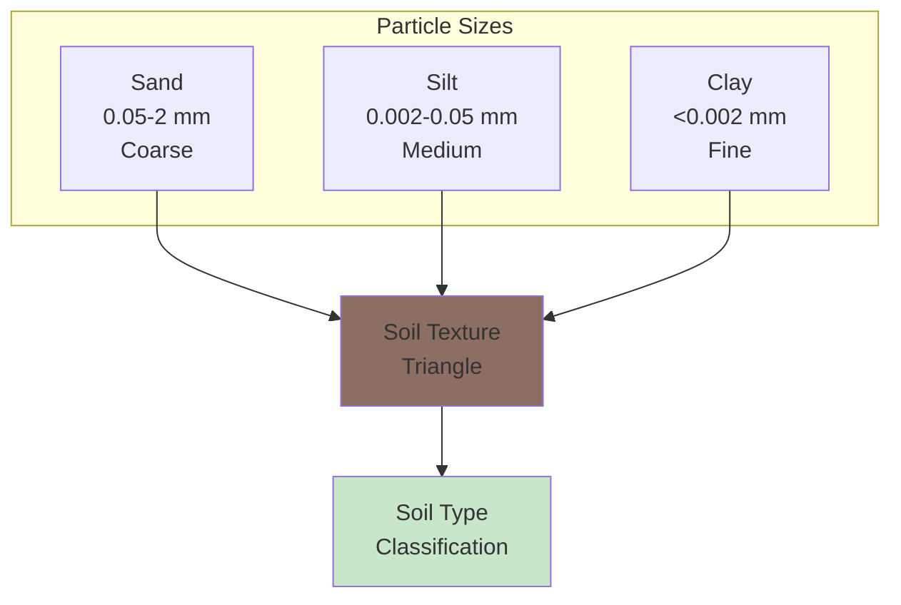

# 🌍 Downloading HWSD Soil Texture Data

## Overview

**Harmonized World Soil Database (HWSD)** provides global soil properties including sand, silt, and clay fractions essential for hydrological modeling, land surface models, and disease vector habitat characterization. This tutorial shows how to extract and process topsoil texture data for use with VECTRI and other models.

<div class="grid cards" markdown>

-   :material-terrain: **Dataset**
    
    ---
    
    HWSD Soil Texture
    
    **Variables:** Sand, Silt, Clay  
    **Layer:** Topsoil (0-30 cm)  
    **Coverage:** Global  
    **Format:** NetCDF

-   :material-grid: **Resolution**
    
    ---
    
    **Native:** ~1 km  
    **Source:** ISIMIP  
    **CRS:** WGS84  
    **Units:** % → fraction

-   :material-layers: **Soil Properties**
    
    ---
    
    **Sand:** Coarse particles  
    **Silt:** Medium particles  
    **Clay:** Fine particles  
    **Sum:** Should equal 1.0

-   :material-download: **Access**
    
    ---
    
    **Source:** ISIMIP  
    **Method:** HTTP download  
    **Auth:** None (public)  
    **Size:** ~500 MB

</div>

---

## 🎯 What This Script Does


The script performs the following operations:

1. **Downloads** HWSD NetCDF from ISIMIP (if not present)
2. **Crops** to your region of interest
3. **Extracts** sand, silt, clay percentages
4. **Converts** percentages to fractions (0-1)
5. **Optionally regrids** to match a template grid
6. **Saves** as NetCDF for model input

---

## 🌍 Understanding Soil Texture

### What is Soil Texture?

Soil texture describes the proportion of different particle sizes:



### Why Soil Texture Matters

| Property | Sand-dominated | Clay-dominated |
|----------|----------------|----------------|
| **Drainage** | Fast | Slow |
| **Water holding** | Low | High |
| **Infiltration** | High | Low |
| **Runoff** | Low | High |
| **Mosquito habitat** | Less suitable | More suitable |

!!! info "Soil and Malaria"
    Soil texture affects:
    
    - **Water pooling:** Clay soils retain water longer
    - **Breeding sites:** Persistent pools support mosquito larvae
    - **Hydrology:** Runoff patterns determine surface water
    - **VECTRI:** Uses soil fractions for water balance

---

## 🚀 Quick Start Guide

### Prerequisites

!!! info "Required Python Packages"
    ```bash
    pip install requests xarray netCDF4 numpy
    ```

### Basic Usage

=== "Ethiopia (Default)"
    ```bash
    python download_hwsd_soil_texture.py \
        --hwsd-nc data/hwsd/hwsd_soil_data_all_land.nc \
        --out-nc data/soil_ethiopia.nc
    ```

=== "Custom Region"
    ```bash
    python download_hwsd_soil_texture.py \
        --hwsd-nc data/hwsd/hwsd_soil_data_all_land.nc \
        --out-nc data/soil_east_africa.nc \
        --lat-min -5 --lat-max 12 \
        --lon-min 28 --lon-max 42
    ```

=== "Regrid to VECTRI"
    ```bash
    python download_hwsd_soil_texture.py \
        --hwsd-nc data/hwsd/hwsd_soil_data_all_land.nc \
        --out-nc data/soil_vectri_grid.nc \
        --template-nc climate_forcing.nc
    ```

---

## 📋 The Complete Script

### Python Download Script

Save this as `download_hwsd_soil_texture.py`:

```python
#!/usr/bin/env python
"""
Extract topsoil sand/silt/clay fractions from HWSD-based NetCDF
(e.g. hwsd_soil_data_all_land.nc), crop to a region (Ethiopia by
default), convert to fractions (0–1), and optionally regrid to a
template model grid (e.g. VECTRI forcing grid).

If the HWSD NetCDF does not exist locally, the script can
download it from ISIMIP using a direct URL.

Expected input:
  - HWSD-derived NetCDF with variables:
        sand  : topsoil sand fraction in %
        silt  : topsoil silt fraction in %
        clay  : topsoil clay fraction in %
    and coordinates lat/lon (or latitude/longitude).

Output:
  - NetCDF with variables:
        sandfrac(lat, lon)
        siltfrac(lat, lon)
        clayfrac(lat, lon)
    all as fractions (0–1) for the topsoil layer (0–30 cm).

Examples:
  # Ethiopia with auto-download
  python download_hwsd_soil_texture.py \
      --hwsd-nc data/hwsd/hwsd_soil_data_all_land.nc \
      --out-nc data/soil_ethiopia.nc

  # Custom region
  python download_hwsd_soil_texture.py \
      --hwsd-nc data/hwsd/hwsd_soil_data_all_land.nc \
      --out-nc data/soil_east_africa.nc \
      --lat-min -5 --lat-max 12 --lon-min 28 --lon-max 42

  # Regrid to model grid
  python download_hwsd_soil_texture.py \
      --hwsd-nc data/hwsd/hwsd_soil_data_all_land.nc \
      --out-nc data/soil_vectri.nc \
      --template-nc climate_forcing.nc
"""

import argparse
from pathlib import Path

import numpy as np
import xarray as xr
import requests


# ---------------------------------------------------------------------------
# Constants
# ---------------------------------------------------------------------------

# Default ISIMIP URL for hwsd_soil_data_all_land.nc
HWSD_DEFAULT_URL = (
    "https://files.isimip.org/ISIMIP3a/InputData/geo_conditions/soil/"
    "hwsd_soil_data_all_land.nc"
)


# ---------------------------------------------------------------------------
# Download helpers
# ---------------------------------------------------------------------------

def download_file(
    url: str, 
    out_path: Path, 
    chunk_size: int = 2**20,
    max_retries: int = 4, 
    timeout: int = 120
) -> Path:
    """
    Robust downloader with retries and progress indicator.
    
    Parameters
    ----------
    url : str
        URL to download
    out_path : Path
        Local file path
    chunk_size : int
        Download chunk size in bytes
    max_retries : int
        Number of retry attempts
    timeout : int
        Request timeout in seconds
    
    Returns
    -------
    Path
        Path to downloaded file
    """
    out_path = Path(out_path)
    out_path.parent.mkdir(parents=True, exist_ok=True)

    for attempt in range(1, max_retries + 1):
        if out_path.exists():
            out_path.unlink()  # remove any partial file

        print(f"[info] Downloading (attempt {attempt}/{max_retries}):")
        print(f"       {url}")

        try:
            with requests.get(url, stream=True, timeout=timeout) as r:
                r.raise_for_status()
                total = int(r.headers.get("Content-Length", 0) or 0)
                downloaded = 0

                with open(out_path, "wb") as f:
                    for chunk in r.iter_content(chunk_size=chunk_size):
                        if not chunk:
                            continue
                        f.write(chunk)
                        downloaded += len(chunk)
                        if total:
                            pct = 100 * downloaded / total
                            print(
                                f"\r[info] Downloaded "
                                f"{downloaded/1e6:.1f}/{total/1e6:.1f} MB ({pct:.1f}%)",
                                end="",
                            )
            print()

            # Verify complete download
            if total and out_path.stat().st_size != total:
                raise IOError(
                    f"Incomplete download: got {out_path.stat().st_size} bytes, "
                    f"expected {total}"
                )

            print(f"[info] Saved to {out_path}")
            return out_path

        except Exception as e:
            print(f"\n[warn] Download failed on attempt {attempt}: {e}")
            if out_path.exists():
                out_path.unlink()
            if attempt == max_retries:
                raise RuntimeError(
                    f"Failed to download {url} after {max_retries} attempts"
                ) from e


def ensure_hwsd_file(hwsd_nc: Path, download_url: str | None = None) -> Path:
    """
    Ensure the HWSD NetCDF exists locally, downloading if necessary.
    
    Parameters
    ----------
    hwsd_nc : Path
        Expected local path
    download_url : str, optional
        URL to download from if file missing
    
    Returns
    -------
    Path
        Path to HWSD file
    """
    hwsd_nc = Path(hwsd_nc)
    if hwsd_nc.exists():
        print(f"[info] HWSD file already present: {hwsd_nc}")
        return hwsd_nc

    if download_url is None:
        raise FileNotFoundError(
            f"HWSD file not found: {hwsd_nc}\n"
            "Please either:\n"
            "  1) Download hwsd_soil_data_all_land.nc manually from ISIMIP,\n"
            "     and point --hwsd-nc to its location, or\n"
            "  2) Re-run with --download-url pointing to the direct download link."
        )

    print(f"[info] HWSD file not found locally. Downloading from:")
    print(f"       {download_url}")
    download_file(download_url, hwsd_nc)
    return hwsd_nc


# ---------------------------------------------------------------------------
# Coordinate helpers
# ---------------------------------------------------------------------------

def find_lat_lon_names(
    ds: xr.Dataset,
    lat_guess: tuple = ("lat", "latitude", "y"),
    lon_guess: tuple = ("lon", "longitude", "x"),
) -> tuple:
    """Find lat/lon coordinate names in a dataset."""
    lat_name = next((n for n in lat_guess if n in ds.coords), None)
    lon_name = next((n for n in lon_guess if n in ds.coords), None)
    if lat_name is None or lon_name is None:
        raise ValueError(
            f"Could not find lat/lon coords in dataset. "
            f"Tried {lat_guess} for lat and {lon_guess} for lon. "
            f"Available coords: {list(ds.coords)}"
        )
    return lat_name, lon_name


def sort_lat_lon(ds: xr.Dataset, lat_name: str, lon_name: str) -> xr.Dataset:
    """Ensure lat & lon are ascending in the dataset."""
    if float(ds[lat_name][0]) > float(ds[lat_name][-1]):
        ds = ds.sortby(lat_name)
    if float(ds[lon_name][0]) > float(ds[lon_name][-1]):
        ds = ds.sortby(lon_name)
    return ds


# ---------------------------------------------------------------------------
# Core HWSD processing
# ---------------------------------------------------------------------------

def load_hwsd_topsoil_fractions(
    hwsd_nc: Path,
    lat_min: float,
    lat_max: float,
    lon_min: float,
    lon_max: float,
) -> xr.Dataset:
    """
    Load HWSD-derived soil texture data, crop to a bounding box,
    and convert sand/silt/clay to fractions (0–1).

    Parameters
    ----------
    hwsd_nc : Path
        Path to HWSD NetCDF file
    lat_min, lat_max : float
        Latitude bounds
    lon_min, lon_max : float
        Longitude bounds

    Returns
    -------
    xr.Dataset
        Dataset with sandfrac, siltfrac, clayfrac variables
    """
    hwsd_nc = Path(hwsd_nc)
    print(f"[info] Opening HWSD file: {hwsd_nc}")
    ds = xr.open_dataset(hwsd_nc)

    lat_name, lon_name = find_lat_lon_names(ds)
    ds = sort_lat_lon(ds, lat_name, lon_name)

    print(f"[info] Cropping to region:")
    print(f"       {lat_name}: [{lat_min}, {lat_max}]")
    print(f"       {lon_name}: [{lon_min}, {lon_max}]")
    
    ds_sub = ds.sel({
        lat_name: slice(lat_min, lat_max),
        lon_name: slice(lon_min, lon_max)
    })

    # Check variables exist
    for v in ("sand", "silt", "clay"):
        if v not in ds_sub.variables:
            raise KeyError(
                f"Variable '{v}' not found in HWSD dataset. "
                f"Available variables: {list(ds_sub.data_vars)}"
            )

    sand = ds_sub["sand"]
    silt = ds_sub["silt"]
    clay = ds_sub["clay"]

    # Handle extra dimensions (e.g., depth layer)
    for name, arr in [("sand", sand), ("silt", silt), ("clay", clay)]:
        extra_dims = [d for d in arr.dims if d not in (lat_name, lon_name)]
        if extra_dims:
            print(f"[warn] Variable '{name}' has extra dims {extra_dims}, taking first index")
            sel_dict = {d: 0 for d in extra_dims}
            ds_sub[name] = arr.isel(**sel_dict)

    sand = ds_sub["sand"]
    silt = ds_sub["silt"]
    clay = ds_sub["clay"]

    print(f"[info] Grid size: {ds_sub[lat_name].size} x {ds_sub[lon_name].size}")

    # Convert % -> fraction (0–1), clip to valid range
    print("[info] Converting percentages to fractions (0-1)...")
    sandfrac = (sand / 100.0).clip(0.0, 1.0).astype("float32")
    siltfrac = (silt / 100.0).clip(0.0, 1.0).astype("float32")
    clayfrac = (clay / 100.0).clip(0.0, 1.0).astype("float32")

    sandfrac.name = "sandfrac"
    siltfrac.name = "siltfrac"
    clayfrac.name = "clayfrac"

    # Add metadata
    sandfrac.attrs.update({
        "units": "1",
        "long_name": "Topsoil sand fraction (0-30 cm)",
        "standard_name": "volume_fraction_of_sand_in_soil",
        "source": "HWSD via ISIMIP",
    })
    siltfrac.attrs.update({
        "units": "1",
        "long_name": "Topsoil silt fraction (0-30 cm)",
        "standard_name": "volume_fraction_of_silt_in_soil",
        "source": "HWSD via ISIMIP",
    })
    clayfrac.attrs.update({
        "units": "1",
        "long_name": "Topsoil clay fraction (0-30 cm)",
        "standard_name": "volume_fraction_of_clay_in_soil",
        "source": "HWSD via ISIMIP",
    })

    ds_out = xr.Dataset({
        "sandfrac": sandfrac,
        "siltfrac": siltfrac,
        "clayfrac": clayfrac,
    })
    
    # Keep coordinate attributes
    ds_out[lat_name].attrs.update(ds_sub[lat_name].attrs)
    ds_out[lon_name].attrs.update(ds_sub[lon_name].attrs)

    # Summary statistics
    print(f"[info] Sand fraction: {float(sandfrac.min()):.3f} to {float(sandfrac.max()):.3f}")
    print(f"[info] Silt fraction: {float(siltfrac.min()):.3f} to {float(siltfrac.max()):.3f}")
    print(f"[info] Clay fraction: {float(clayfrac.min()):.3f} to {float(clayfrac.max()):.3f}")

    return ds_out


def regrid_to_template(
    ds: xr.Dataset,
    template_nc: Path,
) -> xr.Dataset:
    """
    Interpolate soil fractions to the lat/lon coordinates of template_nc.

    Parameters
    ----------
    ds : xr.Dataset
        Input dataset with soil fractions
    template_nc : Path
        Template NetCDF file with target grid

    Returns
    -------
    xr.Dataset
        Regridded dataset
    """
    template_nc = Path(template_nc)
    print(f"[info] Opening template grid: {template_nc}")
    ds_tmpl = xr.open_dataset(template_nc)

    # Find coordinates in source
    lat_name_ds, lon_name_ds = find_lat_lon_names(ds)
    ds = sort_lat_lon(ds, lat_name_ds, lon_name_ds)

    # Find coordinates in template
    lat_name_tmpl, lon_name_tmpl = find_lat_lon_names(ds_tmpl)
    lat_t = ds_tmpl[lat_name_tmpl]
    lon_t = ds_tmpl[lon_name_tmpl]

    print(f"[info] Regridding to template grid:")
    print(f"       {lat_name_tmpl}: {lat_t.size} points")
    print(f"       {lon_name_tmpl}: {lon_t.size} points")

    # Interpolate each variable
    ds_interp = xr.Dataset()
    for v in ("sandfrac", "siltfrac", "clayfrac"):
        if v not in ds:
            raise KeyError(f"Variable '{v}' not found in dataset")
        
        da = ds[v]
        da_i = da.interp(
            {lat_name_ds: lat_t, lon_name_ds: lon_t},
            method="linear",
        )
        
        # Rename coords if necessary
        rename_dict = {}
        if lat_name_ds != lat_name_tmpl:
            rename_dict[lat_name_ds] = lat_name_tmpl
        if lon_name_ds != lon_name_tmpl:
            rename_dict[lon_name_ds] = lon_name_tmpl
        if rename_dict:
            da_i = da_i.rename(rename_dict)
        
        ds_interp[v] = da_i.astype("float32")

    # Copy coordinate metadata
    ds_interp[lat_name_tmpl].attrs.update(ds_tmpl[lat_name_tmpl].attrs)
    ds_interp[lon_name_tmpl].attrs.update(ds_tmpl[lon_name_tmpl].attrs)

    ds_interp.attrs["regridded_to"] = str(template_nc)

    ds_tmpl.close()
    return ds_interp


# ---------------------------------------------------------------------------
# Main
# ---------------------------------------------------------------------------

def main():
    parser = argparse.ArgumentParser(
        description=(
            "Extract HWSD topsoil sand/silt/clay fractions, crop to region, "
            "convert to fractions (0-1), and optionally regrid to template grid."
        ),
        formatter_class=argparse.RawDescriptionHelpFormatter,
        epilog="""
Examples:
  # Ethiopia (default region)
  python download_hwsd_soil_texture.py \\
      --hwsd-nc data/hwsd/hwsd_soil_data_all_land.nc \\
      --out-nc data/soil_ethiopia.nc

  # East Africa
  python download_hwsd_soil_texture.py \\
      --hwsd-nc data/hwsd/hwsd_soil_data_all_land.nc \\
      --out-nc data/soil_east_africa.nc \\
      --lat-min -5 --lat-max 12 --lon-min 28 --lon-max 42

  # Regrid to VECTRI grid
  python download_hwsd_soil_texture.py \\
      --hwsd-nc data/hwsd/hwsd_soil_data_all_land.nc \\
      --out-nc data/soil_vectri.nc \\
      --template-nc climate_forcing.nc
        """
    )
    parser.add_argument(
        "--hwsd-nc", type=str, required=True,
        help="Path for HWSD NetCDF (will download if missing)",
    )
    parser.add_argument(
        "--download-url", type=str, default=None,
        help="Custom download URL for HWSD (default: ISIMIP URL)",
    )
    parser.add_argument(
        "--lat-min", type=float, default=3.0,
        help="Minimum latitude (default: 3.0 for Ethiopia)",
    )
    parser.add_argument(
        "--lat-max", type=float, default=15.0,
        help="Maximum latitude (default: 15.0 for Ethiopia)",
    )
    parser.add_argument(
        "--lon-min", type=float, default=33.0,
        help="Minimum longitude (default: 33.0 for Ethiopia)",
    )
    parser.add_argument(
        "--lon-max", type=float, default=48.0,
        help="Maximum longitude (default: 48.0 for Ethiopia)",
    )
    parser.add_argument(
        "--out-nc", type=str, required=True,
        help="Output NetCDF file path",
    )
    parser.add_argument(
        "--template-nc", type=str, default=None,
        help="Optional template NetCDF for regridding",
    )

    args = parser.parse_args()

    print(f"\n{'#'*60}")
    print(f"# HWSD Soil Texture Extraction")
    print(f"# Region: lat [{args.lat_min}, {args.lat_max}], lon [{args.lon_min}, {args.lon_max}]")
    print(f"{'#'*60}\n")

    hwsd_nc = Path(args.hwsd_nc)
    out_nc = Path(args.out_nc)
    template_nc = Path(args.template_nc) if args.template_nc else None

    # Determine download URL
    download_url = args.download_url if args.download_url else HWSD_DEFAULT_URL

    # Ensure HWSD file exists (download if missing)
    hwsd_nc = ensure_hwsd_file(hwsd_nc, download_url=download_url)

    # Load and process HWSD data
    ds_frac = load_hwsd_topsoil_fractions(
        hwsd_nc=hwsd_nc,
        lat_min=args.lat_min,
        lat_max=args.lat_max,
        lon_min=args.lon_min,
        lon_max=args.lon_max,
    )

    # Optional regridding
    if template_nc is not None:
        ds_frac = regrid_to_template(ds_frac, template_nc)

    # Add global attributes
    ds_frac.attrs.update({
        "title": "Topsoil (0-30 cm) sand/silt/clay fractions from HWSD",
        "source": "Harmonized World Soil Database via ISIMIP",
        "institution": "FAO/IIASA/ISRIC/ISS-CAS/JRC",
        "references": "https://www.fao.org/soils-portal/data-hub/soil-maps-and-databases/harmonized-world-soil-database-v12/",
        "history": "Created by download_hwsd_soil_texture.py",
    })

    # Save output
    out_nc.parent.mkdir(parents=True, exist_ok=True)
    
    # Compression encoding
    encoding = {
        "sandfrac": {"zlib": True, "complevel": 4},
        "siltfrac": {"zlib": True, "complevel": 4},
        "clayfrac": {"zlib": True, "complevel": 4},
    }
    
    print(f"[info] Writing NetCDF: {out_nc}")
    ds_frac.to_netcdf(out_nc, encoding=encoding)
    
    print(f"\n{'#'*60}")
    print(f"# Processing complete!")
    print(f"# Output: {out_nc}")
    print(f"{'#'*60}\n")


if __name__ == "__main__":
    main()
```

---

## 🔧 Command-Line Arguments

### Required Arguments

| Argument | Type | Description | Example |
|----------|------|-------------|---------|
| `--hwsd-nc` | String | Path to HWSD NetCDF (downloads if missing) | `data/hwsd/hwsd.nc` |
| `--out-nc` | String | Output NetCDF file path | `data/soil_eth.nc` |

### Optional Arguments

| Argument | Type | Description | Default |
|----------|------|-------------|---------|
| `--download-url` | String | Custom download URL | ISIMIP default |
| `--lat-min` | Float | Minimum latitude | `3.0` |
| `--lat-max` | Float | Maximum latitude | `15.0` |
| `--lon-min` | Float | Minimum longitude | `33.0` |
| `--lon-max` | Float | Maximum longitude | `48.0` |
| `--template-nc` | String | Template NetCDF for regridding | None |

---

## 📊 Understanding Output Variables

### Soil Texture Fractions

| Variable | Description | Range | Units |
|----------|-------------|-------|-------|
| `sandfrac` | Sand fraction (0.05-2 mm) | 0-1 | fraction |
| `siltfrac` | Silt fraction (0.002-0.05 mm) | 0-1 | fraction |
| `clayfrac` | Clay fraction (<0.002 mm) | 0-1 | fraction |

!!! info "Texture Triangle"
    The three fractions should sum to approximately 1.0:
    
    $$
    \text{sandfrac} + \text{siltfrac} + \text{clayfrac} \approx 1.0
    $$

### Soil Texture Classes

| Class | Sand % | Silt % | Clay % |
|-------|--------|--------|--------|
| Sand | 85-100 | 0-15 | 0-10 |
| Loamy Sand | 70-90 | 0-30 | 0-15 |
| Sandy Loam | 50-70 | 0-50 | 0-20 |
| Loam | 25-50 | 30-50 | 10-30 |
| Silt Loam | 0-50 | 50-90 | 0-30 |
| Clay Loam | 20-45 | 15-50 | 25-40 |
| Clay | 0-45 | 0-40 | 40-100 |

---

## 📍 Regional Bounding Boxes

Use these coordinates with the `--lat-min`, `--lat-max`, `--lon-min`, `--lon-max` arguments:

=== "Ethiopia"
    ```bash
    --lat-min 3 --lat-max 15 --lon-min 33 --lon-max 48
    ```
    **Coverage:** Entire Ethiopia

=== "East Africa"
    ```bash
    --lat-min -5 --lat-max 12 --lon-min 28 --lon-max 42
    ```
    **Coverage:** Kenya, Uganda, Tanzania, Rwanda, Burundi

=== "Horn of Africa"
    ```bash
    --lat-min -5 --lat-max 18 --lon-min 32 --lon-max 52
    ```
    **Coverage:** Ethiopia, Somalia, Eritrea, Djibouti, Kenya

=== "Africa"
    ```bash
    --lat-min -35 --lat-max 37 --lon-min -18 --lon-max 52
    ```
    **Coverage:** Entire African continent

---

## 💡 Usage Examples

### Example 1: Basic Download (Ethiopia)

```bash
python download_hwsd_soil_texture.py \
    --hwsd-nc data/hwsd/hwsd_soil_data_all_land.nc \
    --out-nc data/soil_ethiopia.nc
```

**What it does:**

- Downloads HWSD if not present (~500 MB)
- Crops to Ethiopia region
- Converts to fractions
- Saves compressed NetCDF

---

### Example 2: East Africa Region

```bash
python download_hwsd_soil_texture.py \
    --hwsd-nc data/hwsd/hwsd_soil_data_all_land.nc \
    --out-nc data/soil_east_africa.nc \
    --lat-min -5 --lat-max 12 \
    --lon-min 28 --lon-max 42
```

---

### Example 3: Regrid to VECTRI Grid

```bash
python download_hwsd_soil_texture.py \
    --hwsd-nc data/hwsd/hwsd_soil_data_all_land.nc \
    --out-nc data/soil_vectri_grid.nc \
    --template-nc climate_forcing.nc
```

**What it does:**

- Extracts soil fractions
- Interpolates to climate forcing grid
- Ready for direct VECTRI input

---

### Example 4: Custom Download URL

```bash
python download_hwsd_soil_texture.py \
    --hwsd-nc data/hwsd/hwsd_custom.nc \
    --download-url "https://example.com/hwsd.nc" \
    --out-nc data/soil_ethiopia.nc
```

---

## 📂 Output Directory Structure

After running the script, your output directory will contain:

```
data/
├── hwsd/
│   └── hwsd_soil_data_all_land.nc    # Downloaded HWSD (~500 MB)
├── soil_ethiopia.nc                   # Processed output
├── soil_east_africa.nc
└── soil_vectri_grid.nc               # Regridded to model grid
```

---

## 🔍 Verifying Your Download

After downloading, verify your data using Python:

```python
import xarray as xr
import matplotlib.pyplot as plt
import numpy as np

# Open soil texture file
ds = xr.open_dataset('data/soil_ethiopia.nc')

# Display dataset information
print(ds)
print(f"\nVariables: {list(ds.data_vars)}")

# Check that fractions sum to ~1
total = ds.sandfrac + ds.siltfrac + ds.clayfrac
print(f"\nSum of fractions: {float(total.mean()):.3f} (should be ~1.0)")

# Statistics
for var in ['sandfrac', 'siltfrac', 'clayfrac']:
    da = ds[var]
    valid = da.values[np.isfinite(da.values)]
    print(f"{var}: min={valid.min():.3f}, max={valid.max():.3f}, mean={valid.mean():.3f}")

# Plot soil texture
fig, axes = plt.subplots(1, 3, figsize=(15, 5))

ds.sandfrac.plot(ax=axes[0], cmap='YlOrBr', vmin=0, vmax=1)
axes[0].set_title('Sand Fraction')

ds.siltfrac.plot(ax=axes[1], cmap='YlOrBr', vmin=0, vmax=1)
axes[1].set_title('Silt Fraction')

ds.clayfrac.plot(ax=axes[2], cmap='YlOrBr', vmin=0, vmax=1)
axes[2].set_title('Clay Fraction')

plt.tight_layout()
plt.savefig('soil_texture_maps.png', dpi=150, bbox_inches='tight')
plt.show()
```

---

## 📊 Soil Texture Analysis

### Classify Soil Types

```python
import xarray as xr
import numpy as np

# Load data
ds = xr.open_dataset('data/soil_ethiopia.nc')

sand = ds.sandfrac.values * 100  # Convert to %
silt = ds.siltfrac.values * 100
clay = ds.clayfrac.values * 100

# Simple texture classification
def classify_texture(sand, silt, clay):
    """Simplified soil texture classification."""
    if clay >= 40:
        return "Clay"
    elif sand >= 85:
        return "Sand"
    elif silt >= 80:
        return "Silt"
    elif sand >= 70:
        return "Loamy Sand"
    elif clay >= 25:
        return "Clay Loam"
    else:
        return "Loam"

# Classify each cell (simplified)
texture_class = np.zeros_like(sand, dtype=int)
texture_class[(clay >= 40)] = 1  # Clay
texture_class[(sand >= 70) & (clay < 20)] = 2  # Sandy
texture_class[(silt >= 50) & (clay < 30)] = 3  # Silty
# etc.

print("Soil texture distribution:")
print(f"  High clay (>40%): {np.sum(clay >= 40)} cells")
print(f"  High sand (>70%): {np.sum(sand >= 70)} cells")
print(f"  High silt (>50%): {np.sum(silt >= 50)} cells")
```

### Hydrological Properties

```python
import xarray as xr
import numpy as np

# Load data
ds = xr.open_dataset('data/soil_ethiopia.nc')

# Estimate hydraulic conductivity (simplified Cosby et al. 1984)
sand = ds.sandfrac
clay = ds.clayfrac

# Saturated hydraulic conductivity (mm/hr) - simplified
Ksat = 10 ** (1.255 - 0.0087 * (sand * 100) - 0.0190 * (clay * 100))

# Porosity (simplified)
porosity = 0.489 - 0.00126 * (sand * 100)

# Field capacity (simplified)
field_capacity = 0.2391 + 0.0019 * (clay * 100)

# Add to dataset
ds['Ksat'] = Ksat
ds['Ksat'].attrs = {'units': 'mm/hr', 'long_name': 'Saturated hydraulic conductivity'}

ds['porosity'] = porosity
ds['porosity'].attrs = {'units': '1', 'long_name': 'Soil porosity'}

ds.to_netcdf('soil_ethiopia_hydro.nc')
print("Added hydraulic properties")
```

---

## ⚠️ Troubleshooting

### Common Issues and Solutions

=== "Download Failed"

    **Problem:** ISIMIP download fails
    
    ```
    RuntimeError: Failed to download after 4 attempts
    ```
    
    **Solutions:**
    
    1. **Check network:** Verify internet connection
    2. **Try browser:** Download manually from ISIMIP
    3. **Custom URL:** Use `--download-url` with working link

=== "File Not Found"

    **Problem:** HWSD file missing
    
    ```
    FileNotFoundError: HWSD file not found
    ```
    
    **Solutions:**
    
    1. **Auto-download:** Script downloads automatically
    2. **Manual download:** Get from ISIMIP and specify path
    3. **Check path:** Ensure correct `--hwsd-nc` path

=== "Variable Not Found"

    **Problem:** sand/silt/clay variables missing
    
    ```
    KeyError: Variable 'sand' not found
    ```
    
    **Solutions:**
    
    1. **Check file:** Inspect with `ncdump -h`
    2. **Different source:** Some HWSD versions have different names
    3. **Modify script:** Adjust variable names

=== "Fractions Don't Sum to 1"

    **Problem:** sandfrac + siltfrac + clayfrac ≠ 1.0
    
    **Causes:**
    
    - Missing data (NaN values)
    - Organic matter not included
    - Rounding in original data
    
    **Solution:** Small deviations are normal. Check for NaN:
    ```python
    total = ds.sandfrac + ds.siltfrac + ds.clayfrac
    print(f"Mean sum: {float(total.mean()):.3f}")
    ```

=== "Memory Error"

    **Problem:** Out of memory reading global file
    
    **Solutions:**
    
    1. **Use smaller region:** Reduce bounding box
    2. **Process in chunks:** Modify script for chunked reading
    3. **Increase RAM:** Close other applications

---

## 🎓 Data Quality Notes

!!! success "Strengths"
    - **Global coverage** - Consistent worldwide data
    - **High resolution** - ~1 km native resolution
    - **Well-documented** - FAO/IIASA standard
    - **Free access** - Available via ISIMIP
    - **Multiple properties** - Sand, silt, clay, and more

!!! warning "Limitations"
    - **Static** - Single time point (no temporal variation)
    - **Topsoil only** - 0-30 cm layer
    - **Generalized** - May miss local heterogeneity
    - **Large file** - ~500 MB download

!!! tip "Best Practices"
    - **Validate locally** if possible with field data
    - **Check sum** - Fractions should sum to ~1.0
    - **Consider uncertainty** in model applications
    - **Document version** in publications

---

## 📖 Additional Resources

### Official Documentation

- **HWSD:** [https://www.fao.org/soils-portal/data-hub/soil-maps-and-databases/harmonized-world-soil-database-v12/](https://www.fao.org/soils-portal/data-hub/soil-maps-and-databases/harmonized-world-soil-database-v12/)
- **ISIMIP:** [https://www.isimip.org/](https://www.isimip.org/)
- **ISIMIP Soil Data:** [https://files.isimip.org/ISIMIP3a/InputData/geo_conditions/soil/](https://files.isimip.org/ISIMIP3a/InputData/geo_conditions/soil/)

### Related Datasets

- **SoilGrids:** Machine learning-based global soil maps
- **WISE30sec:** Higher resolution soil database
- **AfSIS:** Africa-specific soil information

### Related Tutorials

- [WorldPop Population](25-download_worldpop_population.md) - Population data
- [Climate Data Access](09-climate_data_access_and_extraction.md) - Overview
- [VECTRI Model](../day1/06-vectri_model_components_larvae_to_hydrology.md) - Model input

---

## 🚀 Next Steps

<div class="grid cards" markdown>

-   :material-chart-bar: **Analyze Texture**
    
    ---
    
    Soil classification  
    Hydraulic properties  
    
    → [Xarray Tutorial](06-Xarray_for_Climate_and_Meteorology_Workshop.md)

-   :material-map: **Visualize Data**
    
    ---
    
    Soil texture maps  
    Regional patterns  
    
    → [Matplotlib Tutorial](05-Matplotlib_for_Climate_and_Meteorology_Workshop.md)

-   :material-grid: **Regrid Data**
    
    ---
    
    Match climate grids  
    Prepare for modeling  
    
    → [GeoPandas Tutorial](07-Geopandas_for_Climate_and_Meteorology_Workshop.md)

-   :material-bug: **VECTRI Modeling**
    
    ---
    
    Soil-hydrology coupling  
    Breeding site suitability  
    
    → [VECTRI Model](../day1/06-vectri_model_components_larvae_to_hydrology.md)

</div>

---

!!! example "Need Help?"
    If you encounter issues or have questions:
    
    - Check the [Troubleshooting](#troubleshooting) section
    - Review [HWSD Documentation](https://www.fao.org/soils-portal/data-hub/)
    - Contact workshop instructors

---

<div style="background: linear-gradient(135deg, #5d4037 0%, #8d6e63 100%); color: white; padding: 2rem; border-radius: 8px; text-align: center; margin-top: 2rem;">
  <h3 style="margin: 0 0 1rem 0;">🌍 Ready for Soil Texture Analysis!</h3>
  <p style="margin: 0; opacity: 0.95;">You now have everything you need to download HWSD soil texture data for hydrological modeling, land surface analysis, and disease vector habitat characterization.</p>
</div>

