# VECTRI Hands-On: Analyzing Outputs with Maps, Time Series & Key Visualizations

---

**What you'll learn:**

- Understand VECTRI output variable groups (Vector, Disease, Hydrology)
- Use auto-detection scripts to identify variables
- Create time-mean maps and area-mean time series
- Compare baseline vs experiment outputs
- Interpret coupling patterns between hydrology, vector, and disease

---

This guide helps you **understand and visualise VECTRI output variables** with a practical, repeatable workflow.

It is designed for training and can be used with tutorial outputs such as:

- `vectri.nc`
- `outputs/*.nc`

---

## Practical Notebook: VECTRI Output Analysis & Visualization

This section provides a comprehensive, hands-on analysis of VECTRI model outputs using Python. We'll inspect, visualize, and analyze variables across three key groups: Vector, Disease, and Hydrology.

### Setup & Data Loading

First, let's set up our environment and load the necessary libraries:

```python
import xarray as xr
import numpy as np
import matplotlib.pyplot as plt
import pandas as pd
import seaborn as sns
import geopandas as gpd
import cartopy.crs as ccrs
import cartopy.feature as cfeature
import rioxarray as rio
import os

# Set plot style
sns.set_theme(style="whitegrid")
plt.rcParams['figure.figsize'] = [12, 6]

# Define the output folder for figures
OUTPUT_FOLDER = 'output_figures'
if not os.path.exists(OUTPUT_FOLDER):
    os.makedirs(OUTPUT_FOLDER)
```

Load your VECTRI output file:

```python
# Load the dataset
FILE_PATH = 'experment1.nc'  # Update with your file path

try:
    ds_vector = xr.open_dataset(FILE_PATH, group="vector")
    print("Dataset loaded successfully.")
    print(ds_vector)
except Exception as e:
    print(f"Error loading dataset: {e}")
```

### General Inspection

Let's inspect the dataset structure:

```python
if 'ds_vector' in locals():
    print("Dimensions:", dict(ds_vector.dims))
    print("\nVariables:", list(ds_vector.data_vars))
    
    # Check time range
    if 'time' in ds_vector.coords:
        print(f"\nTime Range: {ds_vector.time.min().values} to {ds_vector.time.max().values}")
```

For proper coordinate assignment, load your precipitation data to extract coordinates:

```python
# Load precipitation data to get coordinates
ds_precip = xr.open_dataset('data/processed/precip_processed.nc')
latitudes = ds_precip.latitude.values
longitudes = ds_precip.longitude.values
time_values = ds_precip.time.values
```

Load your administrative boundaries shapefile:

```python
# Define the path to your shapefile
shapefile = 'ETH_Admins_2024/ETH_Regions.shp'  # Update with your path
```

---

## 1) Output Groups

VECTRI outputs are organized into three logical groups:

### 1.1 Vector Group

| Variable | Description |
|----------|-------------|
| **vector** | Adult vector density/abundance variables |
| **larvae** | Larval density |
| **emergence** | Emergence rate |
| **HBR** | Human biting rate |

### 1.2 Disease Group

| Variable | Description |
|----------|-------------|
| **PRd** | Parasite rate / detectable prevalence |
| **CSPR** | Circumsporozoite protein rate |
| **EIR** | Entomological inoculation rate |
| **cases** | Number of cases |
| **immunity** | Immune population fraction |

### 1.3 Hydrology Group

| Variable | Description |
|----------|-------------|
| **wperm** | Permanent breeding site fraction |
| **wurbn** | Urban breeding site fraction |
| **wpond** | Temporary pond fraction |

!!! note "Variable Names"
    Exact variable names may differ across versions/builds. This guide includes scripts that **auto-detect variables by keyword** so you can work robustly even if names vary.

---

## Visualization Functions

Before we dive into the analysis, let's define helper functions for creating spatial maps and time series:

### Spatial Map Function

```python
def plot_spatial_map(ds, var_name, title, lats=None, lons=None, shapefile_path=None):
    """Plots a smoothed spatial map of the time-averaged value of a variable, clipped to a shapefile."""
    if var_name in ds:
        ds_to_plot = ds.copy()
        if lats is not None:
            ds_to_plot.coords['latitude'] = lats
        if lons is not None:
            ds_to_plot.coords['longitude'] = lons

        # Spatial distribution (Time Average)
        avg_map = ds_to_plot[var_name].mean(dim='time')
        
        # Create a higher-resolution grid for interpolation
        new_lons = np.linspace(avg_map.longitude.min().item(), avg_map.longitude.max().item(), 300)
        new_lats = np.linspace(avg_map.latitude.min().item(), avg_map.latitude.max().item(), 300)

        # Interpolate to smooth the data
        smoothed_map = avg_map.interp(longitude=new_lons, latitude=new_lats, method='cubic')
        
        # Add CRS information to the smoothed DataArray
        smoothed_map.rio.write_crs("epsg:4326", inplace=True)

        if shapefile_path:
            # Load the shapefile
            gdf = gpd.read_file(shapefile_path)
            
            # Clip the smoothed data to the shapefile
            clipped_map = smoothed_map.rio.clip(gdf.geometry, gdf.crs, drop=False)
        else:
            clipped_map = smoothed_map

        # Create the plot with a specific map projection
        fig = plt.figure(figsize=(12, 10))
        ax = fig.add_subplot(1, 1, 1, projection=ccrs.PlateCarree())
        
        # Plot the smoothed and clipped data
        clipped_map.plot(ax=ax, x='longitude', y='latitude', cmap='viridis', 
                          transform=ccrs.PlateCarree(), add_colorbar=True,
                          cbar_kwargs={'shrink': 0.6})

        if shapefile_path:
            # Add the shapefile to the plot for boundary visualization
            ax.add_geometries(gdf['geometry'], crs=ccrs.PlateCarree(), facecolor='none', edgecolor='black')

        # Add map features
        ax.coastlines()
        ax.add_feature(cfeature.BORDERS, linestyle=':')
        
        # Set title and labels
        ax.set_title(f"{title} (Time-Averaged)")
        ax.set_xlabel("Longitude")
        ax.set_ylabel("Latitude")
        
        # Save the figure
        file_name = f"spatial_map_{var_name}.png"
        plt.savefig(os.path.join(OUTPUT_FOLDER, file_name), dpi=150, bbox_inches='tight')
        
        plt.show()
    else:
        print(f"Variable '{var_name}' not found.")
```

### Time Series Function

```python
def plot_temporal_series(ds, var_name, title, time_coords=None):
    """Plots a time series of the spatially-averaged value of a variable."""
    if var_name in ds:
        ds_to_plot = ds.copy()
        if time_coords is not None:
            # Ensure time coordinates are assigned correctly
            if len(time_coords) == len(ds_to_plot['time']):
                ds_to_plot = ds_to_plot.assign_coords(time=time_coords)
            else:
                print("Warning: Length of time_coords does not match length of time dimension.")
                return

        # Time Series (Spatial Average)
        spatial_mean = ds_to_plot[var_name].mean(dim=['latitude', 'longitude'], keep_attrs=True)
        
        plt.figure(figsize=(12, 5))
        spatial_mean.plot()
        plt.title(f"{title} (Spatially Averaged Time Series)")
        plt.ylabel(ds_to_plot[var_name].attrs.get('units', 'Value'))
        
        # Save the figure
        file_name = f"temporal_series_{var_name}.png"
        plt.savefig(os.path.join(OUTPUT_FOLDER, file_name), dpi=150, bbox_inches='tight')
        
        plt.show()
    else:
        print(f"Variable '{var_name}' not found.")
```

---

## Vector Analysis (Mosquito Population Dynamics)

The vector group contains variables related to mosquito population dynamics. Let's visualize each variable:

### Mosquito Density (Adult Vector)

```python
plot_spatial_map(ds_vector, var_name='vector', title='Mosquito Density', 
                 lats=latitudes, lons=longitudes, shapefile_path=shapefile)
```


### Larvae Density

```python
plot_spatial_map(ds_vector, var_name='larvae', title='Larvae Density', 
                 lats=latitudes, lons=longitudes, shapefile_path=shapefile)
```

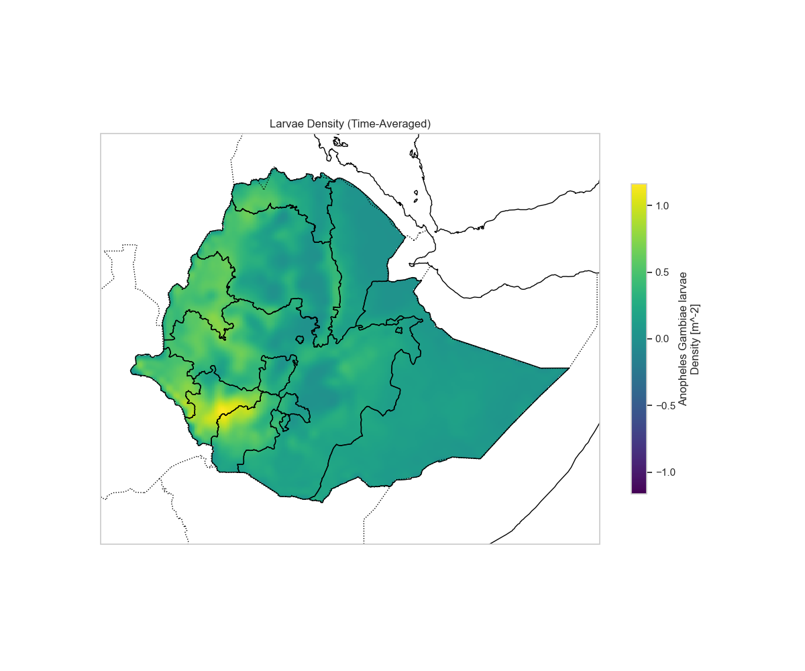

### Emergence Density

```python
plot_spatial_map(ds_vector, var_name='emergence', title='Emergence Density', 
                 lats=latitudes, lons=longitudes, shapefile_path=shapefile)
```

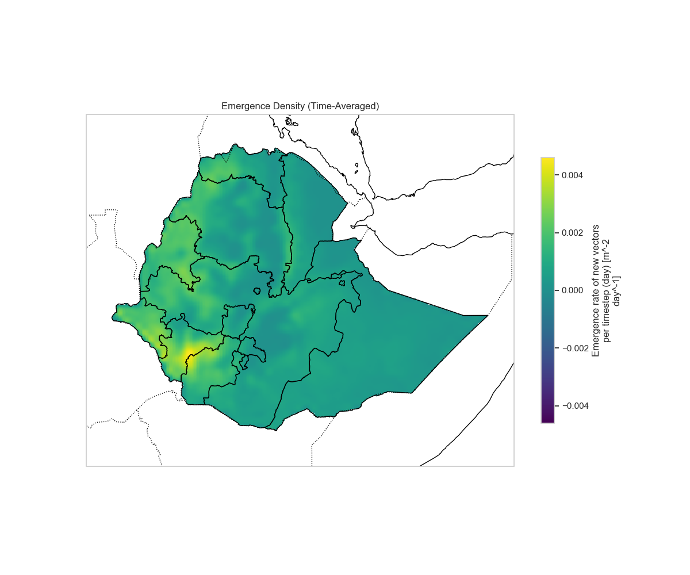

### Human Biting Rate (HBR)

```python
plot_spatial_map(ds_vector, var_name='hbr', title='Human Biting Rate (HBR)', 
                 lats=latitudes, lons=longitudes, shapefile_path=shapefile)
```

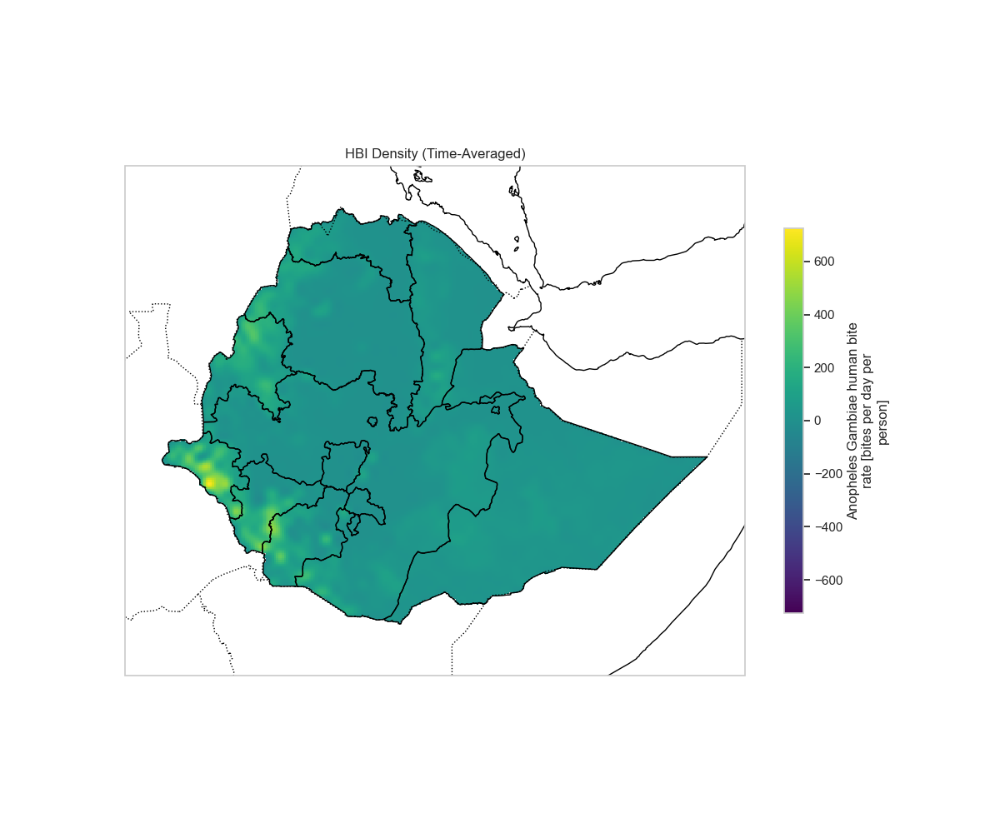

### Spatially Averaged Time Series

Let's also examine the temporal patterns for vector variables:

```python
plot_temporal_series(ds_vector, var_name='vector', title='Mosquito Density', time_coords=time_values)
```


```python
plot_temporal_series(ds_vector, var_name='larvae', title='Larvae Density', time_coords=time_values)
```

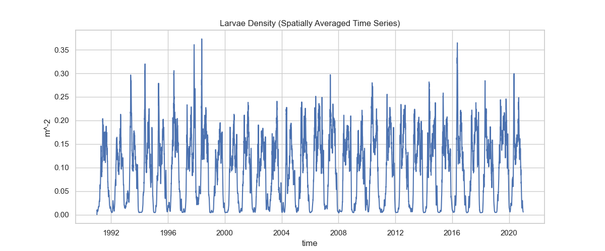

```python
plot_temporal_series(ds_vector, var_name='emergence', title='Emergence Density', time_coords=time_values)
```

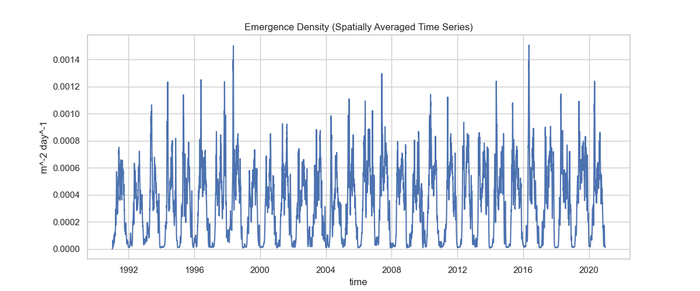

```python
plot_temporal_series(ds_vector, var_name='hbr', title='Human Biting Rate (HBR)', time_coords=time_values)
```

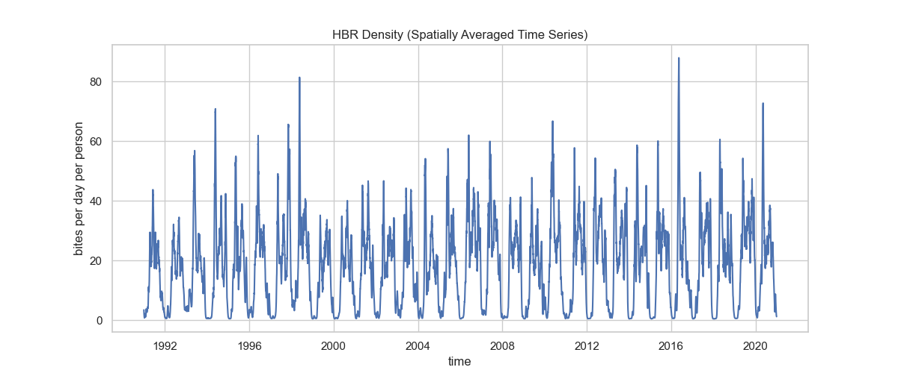

---

## Disease Analysis (Transmission Metrics)

Now let's load and analyze the disease group:

```python
try:
    ds_disease = xr.open_dataset(FILE_PATH, group="disease")
    print("Dataset loaded successfully.")
    print(ds_disease)
except Exception as e:
    print(f"Error loading dataset: {e}")
```

Inspect the disease variables:

```python
if 'ds_disease' in locals():
    print("Dimensions:", dict(ds_disease.dims))
    print("\nVariables:", list(ds_disease.data_vars))
```

### Entomological Inoculation Rate (EIR)

EIR is a key metric representing the number of infectious bites per person per unit time.

```python
plot_spatial_map(ds_disease, 'eir', 'Entomological Inoculation Rate (EIR)', 
                 lats=latitudes, lons=longitudes, shapefile_path=shapefile)
```


### Detectable Parasite Ratio (PRd)

PRd represents the proportion of the population with detectable parasites.

```python
plot_spatial_map(ds_disease, 'PRd', 'P. falciparum detectable parasite ratio', 
                 lats=latitudes, lons=longitudes, shapefile_path=shapefile)
```

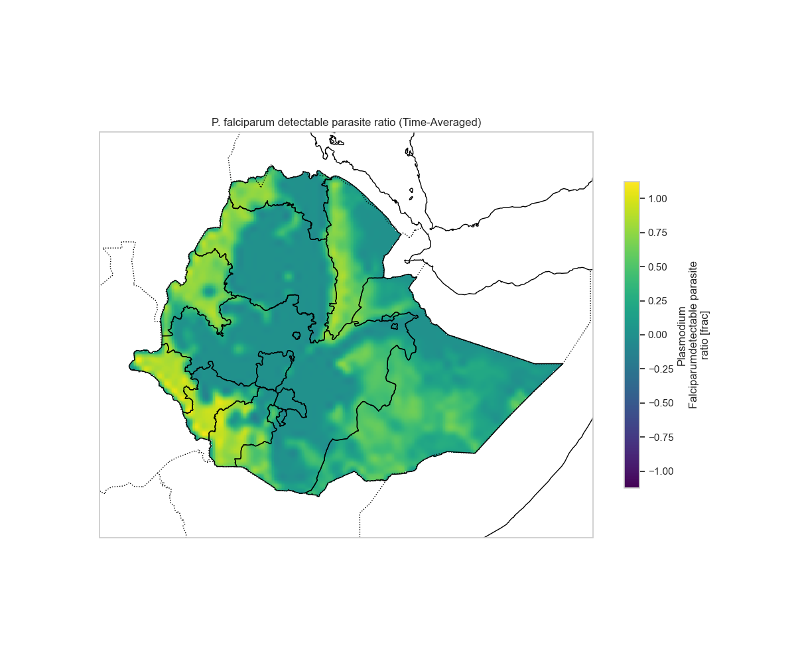

### Circumsporozoite Protein Rate (CSPR)

CSPR indicates the proportion of vectors that are infective (carrying sporozoites).

```python
plot_spatial_map(ds_disease, 'cspr', 'Circumsporozoite protein rate - proportion of infective vectors (malaria)', 
                 lats=latitudes, lons=longitudes, shapefile_path=shapefile)
```

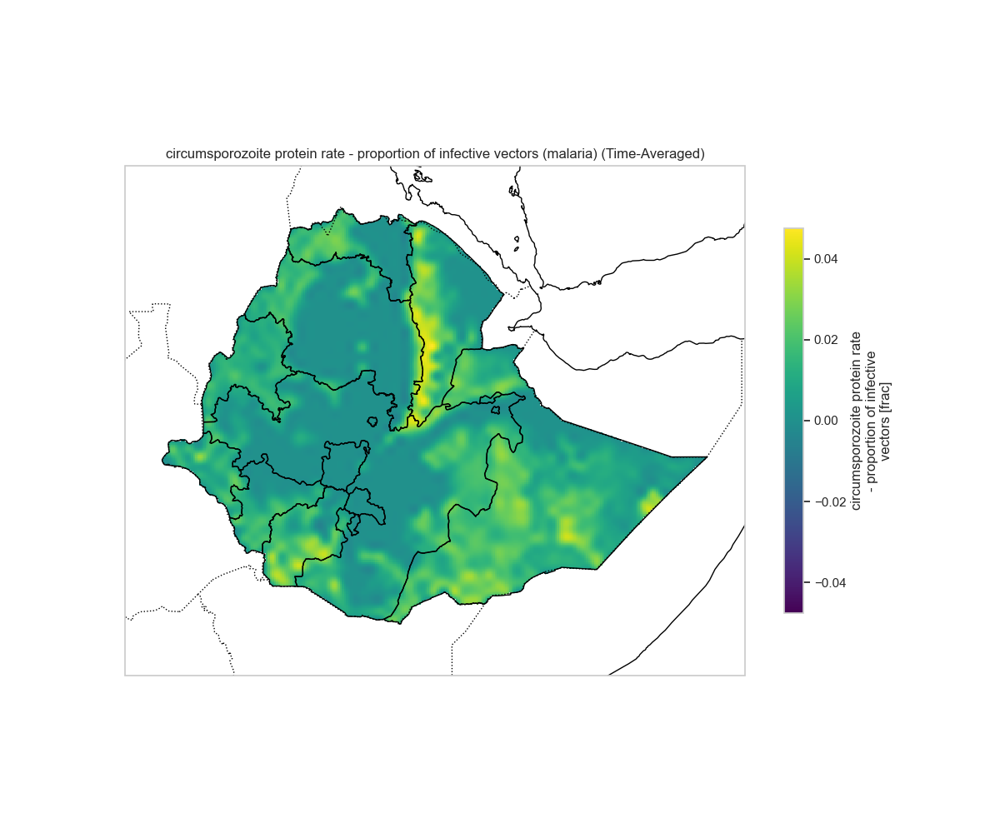

### Symptomatic Cases

The number of symptomatic malaria cases in the population.

```python
plot_spatial_map(ds_disease, 'cases', 'Symptomatic cases (malaria)', 
                 lats=latitudes, lons=longitudes, shapefile_path=shapefile)
```

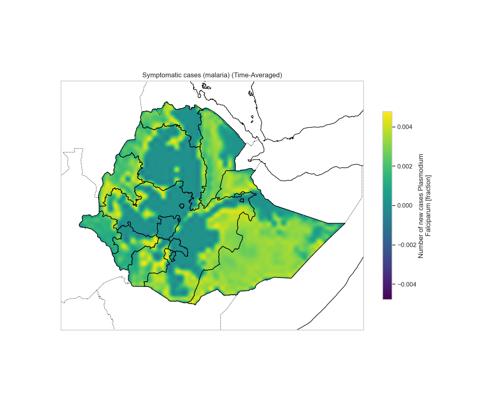

### Population Immunity

The proportion of the population with immunity to malaria.

```python
plot_spatial_map(ds_disease, 'immunity', 'Proportion of population with immunity (malaria)', 
                 lats=latitudes, lons=longitudes, shapefile_path=shapefile)
```

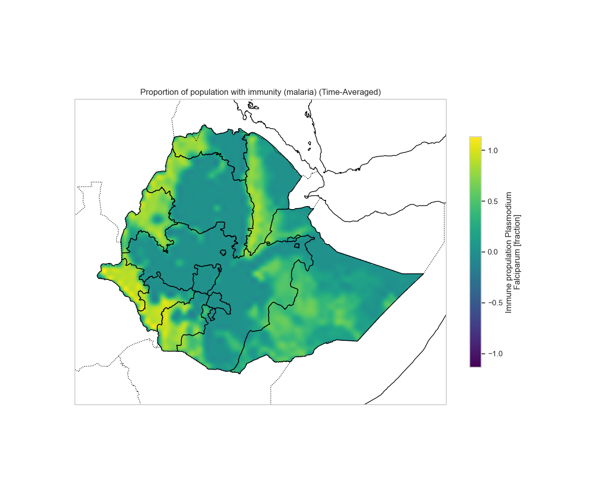

---

## Hydrology Analysis (Water Fraction/Pond Dynamics)

Finally, let's examine the hydrology group:

```python
try:
    ds_hydrology = xr.open_dataset(FILE_PATH, group="hydrology")
    print("Dataset loaded successfully.")
    print(ds_hydrology)
except Exception as e:
    print(f"Error loading dataset: {e}")
```

Inspect hydrology variables:

```python
if 'ds_hydrology' in locals():
    print("Dimensions:", dict(ds_hydrology.dims))
    print("\nVariables:", list(ds_hydrology.data_vars))
```

### Temporary Pond Fraction (wpond)

The fraction of area covered by temporary ponds, which serve as breeding sites for mosquitoes.

```python
plot_spatial_map(ds_hydrology, 'wpond', 'Fraction coverage temporary ponds', 
                 lats=latitudes, lons=longitudes, shapefile_path=shapefile)
```

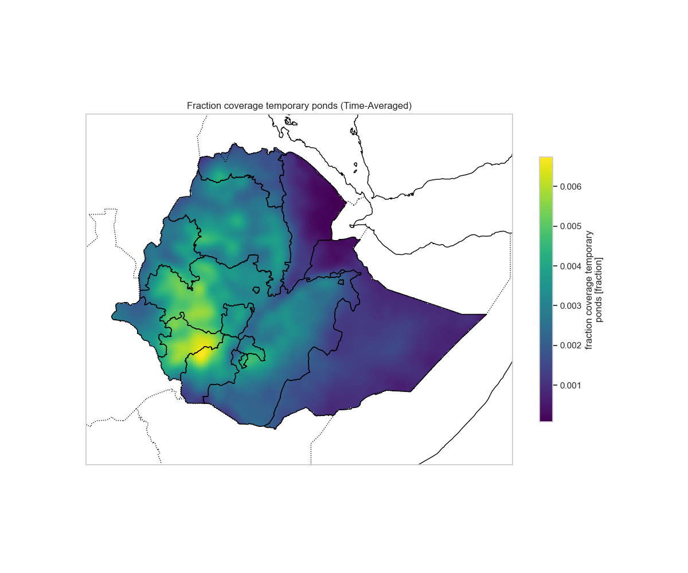

---

## Key Insights from the Analysis

### Spatial Patterns

- **Vector variables** (vector, larvae, emergence, HBR) show spatial heterogeneity, with higher densities in areas with suitable breeding conditions.
- **Disease variables** (EIR, PRd, cases) typically correlate with vector abundance, showing transmission hotspots.
- **Hydrology** (wpond) directly influences vector breeding habitat availability.

### Temporal Patterns

- **Seasonal cycles** are evident in the time series, reflecting the influence of climate drivers (rainfall, temperature).
- **Peak transmission** periods align with favorable conditions for both vector breeding and parasite development.
- **Immunity** builds up over time, affecting disease dynamics.

### Coupling Relationships

1. **Hydrology → Vector**: Increased ponding (`wpond`) provides breeding habitat, leading to higher larvae and emergence rates.
2. **Vector → Disease**: Higher vector density and HBR increase EIR and transmission, resulting in more cases.
3. **Disease → Immunity**: As cases increase, immunity builds up, which can dampen future transmission.

---

## Advanced Analysis: Seasonality, Anomalies, and Climate-Disease Lags

This section covers advanced analysis techniques for VECTRI outputs, including monthly/seasonal analysis, anomalies, and climate-disease lag relationships.

### Setup for Advanced Analysis

```python
import xarray as xr
import numpy as np
import matplotlib.pyplot as plt
import pandas as pd
import seaborn as sns
try:
    import cartopy.crs as ccrs
    import cartopy.feature as cfeature
    CARTOPY_AVAILABLE = True
except ImportError:
    CARTOPY_AVAILABLE = False
    print("Cartopy not found, specific map projections will be disabled.")

sns.set_theme(style="whitegrid")
plt.rcParams['figure.figsize'] = [12, 6]
```

### Data Loading with Coordinate Handling

```python
# Load Data
FILE_PATH = 'experment1.nc'  # Update with your file path
PRECIP_PATH = 'data/processed/precip_processed.nc'
TEMP_PATH = 'data/processed/temp_processed.nc'

try:
    # Load Precipitation First to get reference Time coordinates if needed
    ds_precip = xr.open_dataset(PRECIP_PATH)
    if 'latitude' in ds_precip.coords:
        ds_precip = ds_precip.rename({'latitude': 'lat', 'longitude': 'lon'}) 
        
    ds_temp = xr.open_dataset(TEMP_PATH)
    if 'latitude' in ds_temp.coords:
        ds_temp = ds_temp.rename({'latitude': 'lat', 'longitude': 'lon'}) 

    # Load Vector Data
    ds = xr.open_dataset(FILE_PATH, group="vector")
    print("Vector Data Loaded:", ds)
    
    # Assign Coordinates if missing
    if 'time' not in ds.coords:
        print("'time' coordinate missing in vector group. Attempting to assign from precipitation data...")
        if ds.sizes['time'] == ds_precip.sizes['time']:
            ds = ds.assign_coords(time=ds_precip.time)
            print("Assigned time coordinate from precip data.")
        else:
            print("Dimension mismatch, generating annual daily time index starting 1991-01-01.")
            # Assuming daily data for annual runs
            dates = pd.date_range(start='1991-01-01', periods=ds.sizes['time'], freq='D')
            ds = ds.assign_coords(time=dates)
            print("Created synthetic time index.")

    if 'latitude' in ds.coords:
        ds = ds.rename({'latitude': 'lat', 'longitude': 'lon'}) 
    elif 'lat' not in ds.coords and 'latitude' not in ds.coords:
         # If lat/lon dimensions exist but are not coords, try to copy from precip
         if ds.sizes['lat'] == ds_precip.sizes['lat'] and ds.sizes['lon'] == ds_precip.sizes['lon']:
             ds = ds.assign_coords(lat=ds_precip.lat, lon=ds_precip.lon)
             print("Assigned lat/lon coordinates from precip data.")

except Exception as e:
    print(f"Error loading data: {e}")
```

---

## 1. Monthly Basis Analysis

### Monthly Climatology (Seasonality Profile)

Understanding the seasonal cycle is crucial for malaria transmission patterns:

```python
# Monthly Climatology (Seasonality Profile)
vector_monthly_clim = ds['vector'].groupby('time.month').mean(dim='time')
vector_seasonality = vector_monthly_clim.mean(dim=['lat', 'lon'])

plt.figure(figsize=(10, 6))
vector_seasonality.plot(linewidth=2, marker='o', color='purple')
plt.title('Average Seasonal Cycle of Vector Density')
plt.ylabel('Vector Density (m^-2)')
plt.xlabel('Month')
plt.xticks(range(1, 13), ['Jan', 'Feb', 'Mar', 'Apr', 'May', 'Jun', 
                          'Jul', 'Aug', 'Sep', 'Oct', 'Nov', 'Dec'])
plt.grid(True)
plt.tight_layout()
plt.savefig('output_figures/monthly_seasonality.png', dpi=150, bbox_inches='tight')
plt.show()
```


This plot shows the typical seasonal pattern of vector density, helping identify peak transmission months.

### Monthly Climatology for PRd (Parasite Rate)

```python
# Load disease group for PRd analysis
ds_disease = xr.open_dataset(FILE_PATH, group="disease")
prd_monthly_clim = ds_disease['PRd'].groupby('time.month').mean(dim='time')
prd_seasonality = prd_monthly_clim.mean(dim=['lat', 'lon'])

plt.figure(figsize=(10, 6))
prd_seasonality.plot(linewidth=2, marker='o', color='red')
plt.title('Average Seasonal Cycle of Parasite Rate (PRd)')
plt.ylabel('Parasite Rate')
plt.xlabel('Month')
plt.xticks(range(1, 13), ['Jan', 'Feb', 'Mar', 'Apr', 'May', 'Jun', 
                          'Jul', 'Aug', 'Sep', 'Oct', 'Nov', 'Dec'])
plt.grid(True)
plt.tight_layout()
plt.savefig('output_figures/monthly_clim_prd.png', dpi=150, bbox_inches='tight')
plt.show()
```

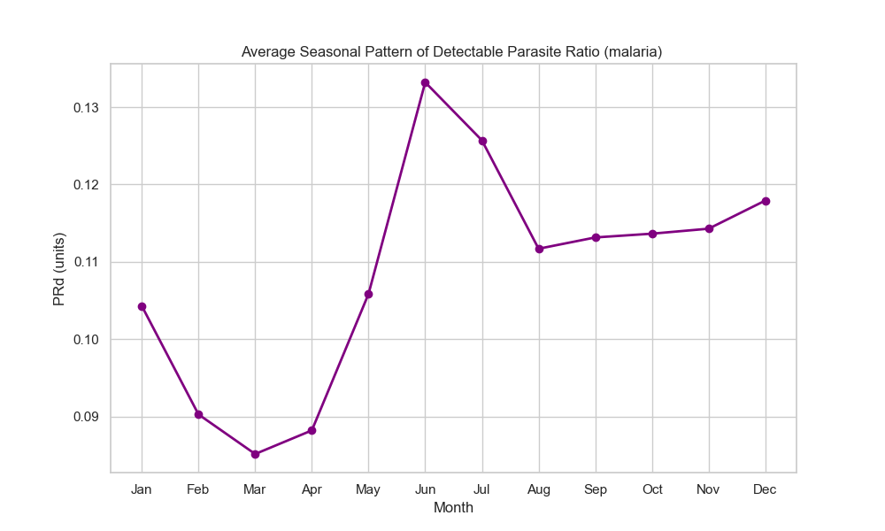

### Monthly Climatology for wpond (Pond Fraction)

```python
# Load hydrology group for wpond analysis
ds_hydrology = xr.open_dataset(FILE_PATH, group="hydrology")
wpond_monthly_clim = ds_hydrology['wpond'].groupby('time.month').mean(dim='time')
wpond_seasonality = wpond_monthly_clim.mean(dim=['lat', 'lon'])

plt.figure(figsize=(10, 6))
wpond_seasonality.plot(linewidth=2, marker='o', color='blue')
plt.title('Average Seasonal Cycle of Temporary Pond Fraction (wpond)')
plt.ylabel('Pond Fraction')
plt.xlabel('Month')
plt.xticks(range(1, 13), ['Jan', 'Feb', 'Mar', 'Apr', 'May', 'Jun', 
                          'Jul', 'Aug', 'Sep', 'Oct', 'Nov', 'Dec'])
plt.grid(True)
plt.tight_layout()
plt.savefig('output_figures/monthly_clim_wpond.png', dpi=150, bbox_inches='tight')
plt.show()
```

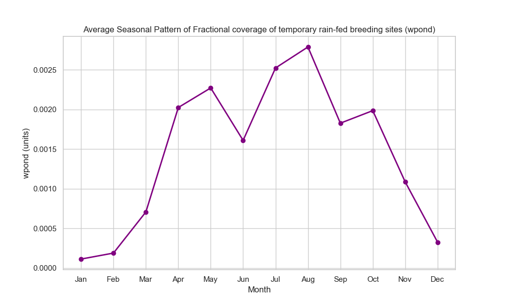

### Monthly Seasonality for Cases

```python
# Monthly climatology for cases
cases_monthly_clim = ds_disease['cases'].groupby('time.month').mean(dim='time')
cases_seasonality = cases_monthly_clim.mean(dim=['lat', 'lon'])

plt.figure(figsize=(10, 6))
cases_seasonality.plot(linewidth=2, marker='o', color='darkred')
plt.title('Average Seasonal Cycle of Malaria Cases')
plt.ylabel('Cases')
plt.xlabel('Month')
plt.xticks(range(1, 13), ['Jan', 'Feb', 'Mar', 'Apr', 'May', 'Jun', 
                          'Jul', 'Aug', 'Sep', 'Oct', 'Nov', 'Dec'])
plt.grid(True)
plt.tight_layout()
plt.savefig('output_figures/monthly_seasonality_cases.png', dpi=150, bbox_inches='tight')
plt.show()
```

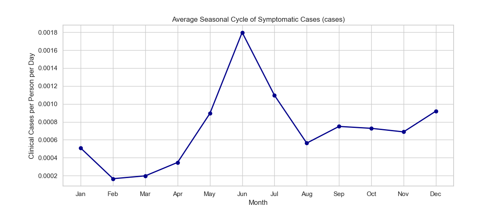

### Monthly Seasonality for HBR

```python
# Monthly climatology for HBR
hbr_monthly_clim = ds['hbr'].groupby('time.month').mean(dim='time')
hbr_seasonality = hbr_monthly_clim.mean(dim=['lat', 'lon'])

plt.figure(figsize=(10, 6))
hbr_seasonality.plot(linewidth=2, marker='o', color='orange')
plt.title('Average Seasonal Cycle of Human Biting Rate (HBR)')
plt.ylabel('HBR')
plt.xlabel('Month')
plt.xticks(range(1, 13), ['Jan', 'Feb', 'Mar', 'Apr', 'May', 'Jun', 
                          'Jul', 'Aug', 'Sep', 'Oct', 'Nov', 'Dec'])
plt.grid(True)
plt.tight_layout()
plt.savefig('output_figures/monthly_seasonality_hbr.png', dpi=150, bbox_inches='tight')
plt.show()
```

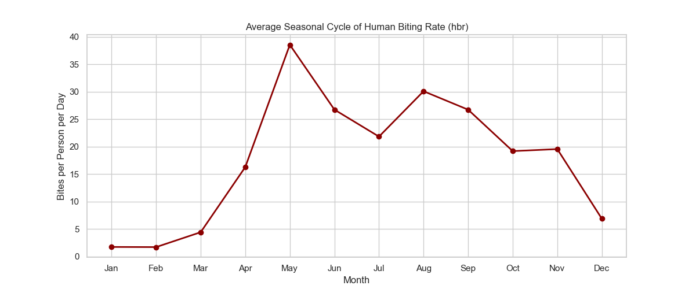

### Monthly Anomaly Analysis

Anomalies reveal deviations from the expected seasonal pattern:

```python
# Monthly Anomaly Analysis
vector_anomaly = ds['vector'].groupby('time.month') - vector_monthly_clim
vector_anomaly_ts = vector_anomaly.mean(dim=['lat', 'lon'])

plt.figure(figsize=(12, 6))
vector_anomaly_ts.plot(color='red', linewidth=1)
plt.title('Monthly Vector Density Anomaly (Deviation from Seasonal Mean)')
plt.axhline(0, color='k', linestyle='--', alpha=0.7)
plt.ylabel('Anomaly')
plt.tight_layout()
plt.savefig('output_figures/monthly_anomaly.png', dpi=150, bbox_inches='tight')
plt.show()
```

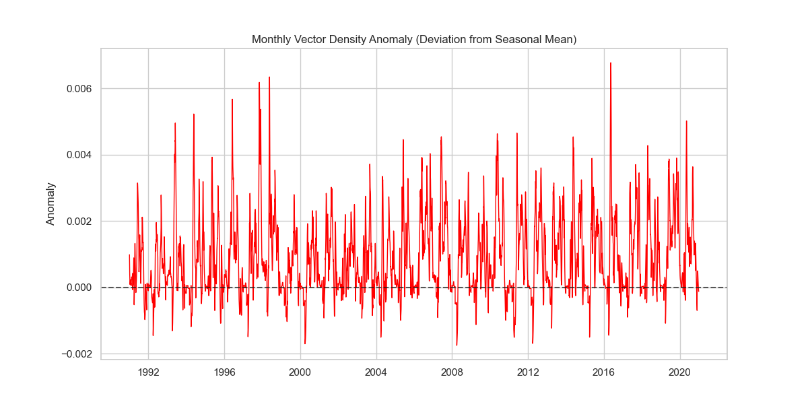

Positive anomalies indicate periods with higher than normal transmission, while negative anomalies indicate lower transmission.

### Hovmöller Diagram (Latitude vs Time)

A Hovmöller diagram shows how patterns propagate across latitudes over time:

```python
# Hovmöller Diagram (Latitude vs Time)
# Resample to monthly to reduce noise and file size influence
try:
    ds_monthly = ds['vector'].resample(time='1MS').mean()
    lat_time = ds_monthly.mean(dim='lon')

    plt.figure(figsize=(12, 8))
    lat_time.plot(x='time', y='lat', cmap='viridis')
    plt.title('Hovmöller Diagram: Vector Density (Latitude vs Time)')
    plt.ylabel('Latitude')
    plt.tight_layout()
    plt.savefig('output_figures/hovmoller_lat_time.png', dpi=150, bbox_inches='tight')
    plt.show()
except Exception as e:
    print(f"Could not plot Hovmoller: {e}")
```

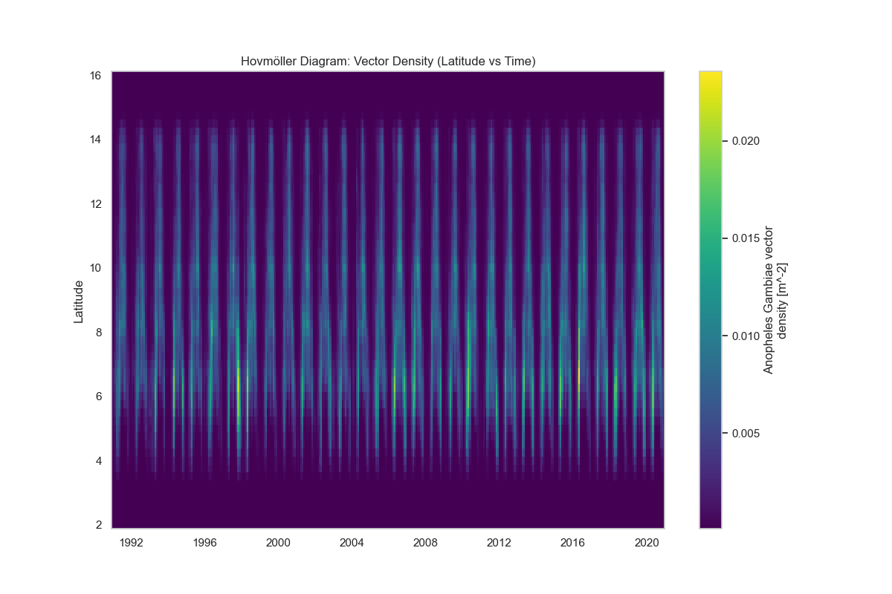

This visualization helps identify latitudinal shifts in transmission patterns and seasonal migration of transmission zones.

---

## 2. Seasonal Basis Analysis

### Seasonal Spatial Maps

Compare transmission patterns across different seasons:

```python
# Seasonal Spatial Maps
try:
    ds_seasonal = ds['vector'].groupby('time.season').mean(dim='time')

    fig, axes = plt.subplots(2, 2, figsize=(16, 12), 
                             subplot_kw={'projection': ccrs.PlateCarree()} if CARTOPY_AVAILABLE else {})
    seasons = ['DJF', 'MAM', 'JJA', 'SON']

    for i, season in enumerate(seasons):
        ax = axes.flat[i]
        if CARTOPY_AVAILABLE:
            ax.coastlines()
            ax.add_feature(cfeature.BORDERS, linestyle=':')
        
        if season in ds_seasonal.season:
            data = ds_seasonal.sel(season=season)
            if CARTOPY_AVAILABLE:
                data.plot(ax=ax, transform=ccrs.PlateCarree(), cmap='YlGnBu', 
                         cbar_kwargs={'label': 'Vector Density'})
            else:
                data.plot(ax=ax, cmap='YlGnBu')
            ax.set_title(f'Seasonal Mean: {season}')
        else:
            ax.text(0.5, 0.5, 'Season not present', ha='center')

    plt.tight_layout()
    plt.savefig('output_figures/seasonal_spatial_maps.png', dpi=150, bbox_inches='tight')
    plt.show()
except Exception as e:
    print(f"Error plotting seasonal maps: {e}")
```


**Season definitions:**
- **DJF**: December, January, February (dry season in many regions)
- **MAM**: March, April, May (transition period)
- **JJA**: June, July, August (main rainy season in many regions)
- **SON**: September, October, November (post-rainy season)

### Seasonal Maps for Other Variables

#### Seasonal Map for Emergence

```python
# Seasonal spatial maps for emergence
ds_emergence_seasonal = ds['emergence'].groupby('time.season').mean(dim='time')

fig, axes = plt.subplots(2, 2, figsize=(16, 12), 
                         subplot_kw={'projection': ccrs.PlateCarree()} if CARTOPY_AVAILABLE else {})
seasons = ['DJF', 'MAM', 'JJA', 'SON']

for i, season in enumerate(seasons):
    ax = axes.flat[i]
    if CARTOPY_AVAILABLE:
        ax.coastlines()
        ax.add_feature(cfeature.BORDERS, linestyle=':')
    
    if season in ds_emergence_seasonal.season:
        data = ds_emergence_seasonal.sel(season=season)
        if CARTOPY_AVAILABLE:
            data.plot(ax=ax, transform=ccrs.PlateCarree(), cmap='YlGnBu', 
                     cbar_kwargs={'label': 'Emergence Rate'})
        else:
            data.plot(ax=ax, cmap='YlGnBu')
        ax.set_title(f'Seasonal Mean: {season}')

plt.tight_layout()
plt.savefig('output_figures/seasonal_map_emergence.png', dpi=150, bbox_inches='tight')
plt.show()
```

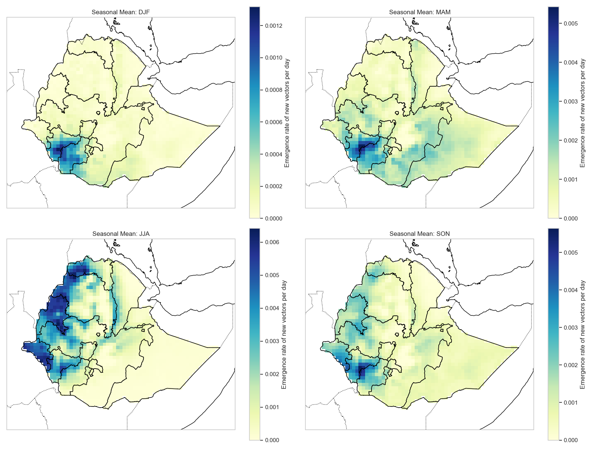

#### Seasonal Map for HBR

```python
# Seasonal spatial maps for HBR
ds_hbr_seasonal = ds['hbr'].groupby('time.season').mean(dim='time')

fig, axes = plt.subplots(2, 2, figsize=(16, 12), 
                         subplot_kw={'projection': ccrs.PlateCarree()} if CARTOPY_AVAILABLE else {})
seasons = ['DJF', 'MAM', 'JJA', 'SON']

for i, season in enumerate(seasons):
    ax = axes.flat[i]
    if CARTOPY_AVAILABLE:
        ax.coastlines()
        ax.add_feature(cfeature.BORDERS, linestyle=':')
    
    if season in ds_hbr_seasonal.season:
        data = ds_hbr_seasonal.sel(season=season)
        if CARTOPY_AVAILABLE:
            data.plot(ax=ax, transform=ccrs.PlateCarree(), cmap='YlOrRd', 
                     cbar_kwargs={'label': 'HBR'})
        else:
            data.plot(ax=ax, cmap='YlOrRd')
        ax.set_title(f'Seasonal Mean: {season}')

plt.tight_layout()
plt.savefig('output_figures/seasonal_map_hbr.png', dpi=150, bbox_inches='tight')
plt.show()
```

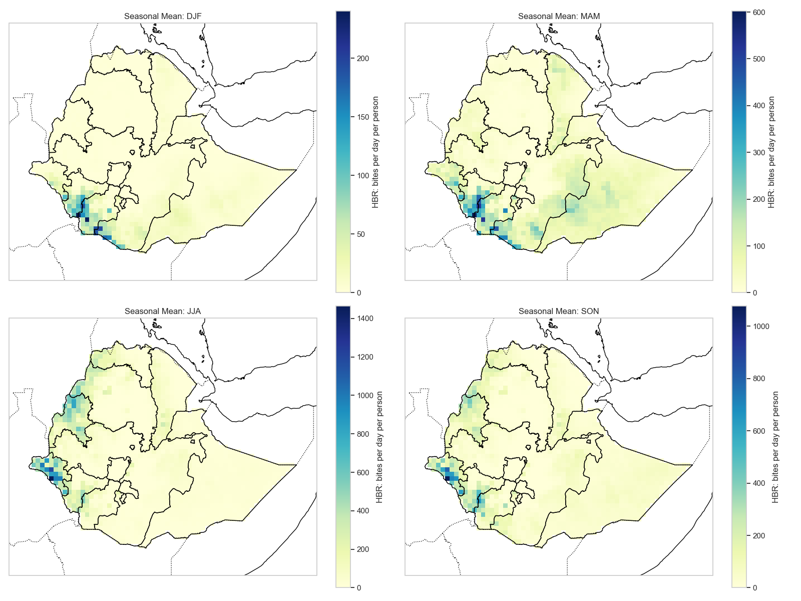

#### Seasonal Map for PRd

```python
# Seasonal spatial maps for PRd
ds_prd_seasonal = ds_disease['PRd'].groupby('time.season').mean(dim='time')

fig, axes = plt.subplots(2, 2, figsize=(16, 12), 
                         subplot_kw={'projection': ccrs.PlateCarree()} if CARTOPY_AVAILABLE else {})
seasons = ['DJF', 'MAM', 'JJA', 'SON']

for i, season in enumerate(seasons):
    ax = axes.flat[i]
    if CARTOPY_AVAILABLE:
        ax.coastlines()
        ax.add_feature(cfeature.BORDERS, linestyle=':')
    
    if season in ds_prd_seasonal.season:
        data = ds_prd_seasonal.sel(season=season)
        if CARTOPY_AVAILABLE:
            data.plot(ax=ax, transform=ccrs.PlateCarree(), cmap='Reds', 
                     cbar_kwargs={'label': 'PRd'})
        else:
            data.plot(ax=ax, cmap='Reds')
        ax.set_title(f'Seasonal Mean: {season}')

plt.tight_layout()
plt.savefig('output_figures/seasonal_map_prd.png', dpi=150, bbox_inches='tight')
plt.show()
```

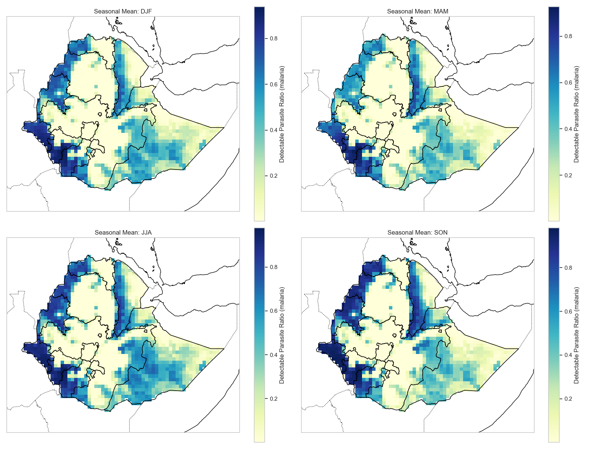

#### Seasonal Map for wpond

```python
# Seasonal spatial maps for wpond
ds_wpond_seasonal = ds_hydrology['wpond'].groupby('time.season').mean(dim='time')

fig, axes = plt.subplots(2, 2, figsize=(16, 12), 
                         subplot_kw={'projection': ccrs.PlateCarree()} if CARTOPY_AVAILABLE else {})
seasons = ['DJF', 'MAM', 'JJA', 'SON']

for i, season in enumerate(seasons):
    ax = axes.flat[i]
    if CARTOPY_AVAILABLE:
        ax.coastlines()
        ax.add_feature(cfeature.BORDERS, linestyle=':')
    
    if season in ds_wpond_seasonal.season:
        data = ds_wpond_seasonal.sel(season=season)
        if CARTOPY_AVAILABLE:
            data.plot(ax=ax, transform=ccrs.PlateCarree(), cmap='Blues', 
                     cbar_kwargs={'label': 'Pond Fraction'})
        else:
            data.plot(ax=ax, cmap='Blues')
        ax.set_title(f'Seasonal Mean: {season}')

plt.tight_layout()
plt.savefig('output_figures/seasonal_map_wpond.png', dpi=150, bbox_inches='tight')
plt.show()
```

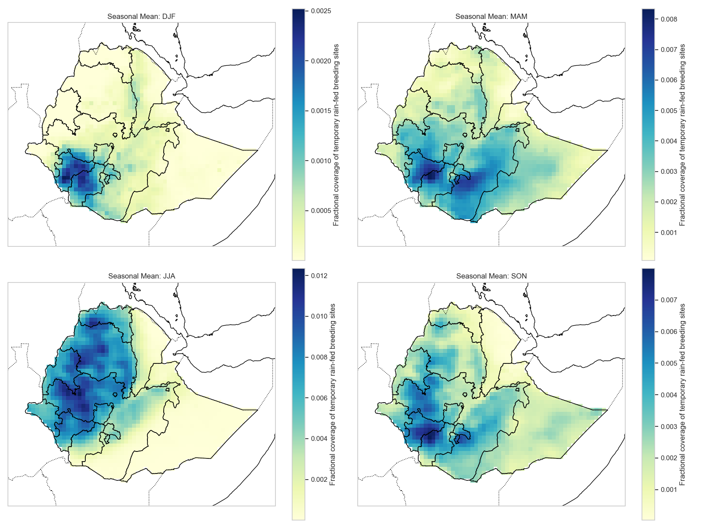

#### Seasonal Map for Cases

```python
# Seasonal spatial maps for cases
ds_cases_seasonal = ds_disease['cases'].groupby('time.season').mean(dim='time')

fig, axes = plt.subplots(2, 2, figsize=(16, 12), 
                         subplot_kw={'projection': ccrs.PlateCarree()} if CARTOPY_AVAILABLE else {})
seasons = ['DJF', 'MAM', 'JJA', 'SON']

for i, season in enumerate(seasons):
    ax = axes.flat[i]
    if CARTOPY_AVAILABLE:
        ax.coastlines()
        ax.add_feature(cfeature.BORDERS, linestyle=':')
    
    if season in ds_cases_seasonal.season:
        data = ds_cases_seasonal.sel(season=season)
        if CARTOPY_AVAILABLE:
            data.plot(ax=ax, transform=ccrs.PlateCarree(), cmap='Reds', 
                     cbar_kwargs={'label': 'Cases'})
        else:
            data.plot(ax=ax, cmap='Reds')
        ax.set_title(f'Seasonal Mean: {season}')

plt.tight_layout()
plt.savefig('output_figures/seasonal_map_cases.png', dpi=150, bbox_inches='tight')
plt.show()
```

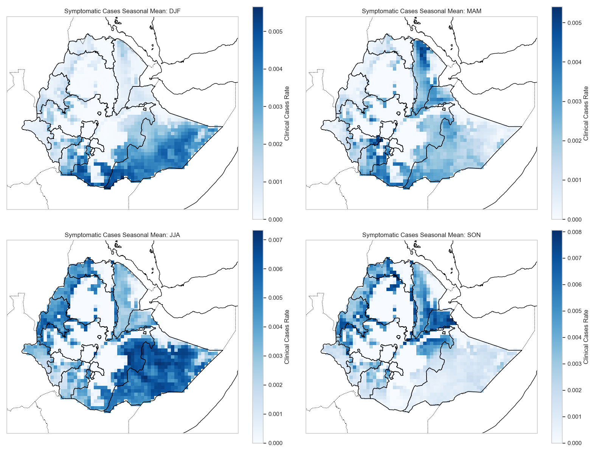

### Transmission Season Length

Identify areas with extended transmission periods:

```python
# Transmission Season Length
# Define threshold (e.g., mean value or specific density)
threshold = ds['vector'].mean().values
# Count months per year where density > threshold
monthly_counts = (ds['vector'].resample(time='1MS').mean() > threshold).groupby('time.year').sum(dim='time')
avg_season_length = monthly_counts.mean(dim='year')

plt.figure(figsize=(10, 8))
ax = plt.axes(projection=ccrs.PlateCarree()) if CARTOPY_AVAILABLE else plt.axes()
if CARTOPY_AVAILABLE: 
    ax.coastlines()
    ax.add_feature(cfeature.BORDERS, linestyle=':')
avg_season_length.plot(ax=ax, transform=ccrs.PlateCarree() if CARTOPY_AVAILABLE else None, 
                       cmap='RdYlBu_r', cbar_kwargs={'label': 'Months per Year'})
plt.title('Average Transmission Season Length (Months/Year)')
plt.tight_layout()
plt.savefig('output_figures/transmission_season_length.png', dpi=150, bbox_inches='tight')
plt.show()
```

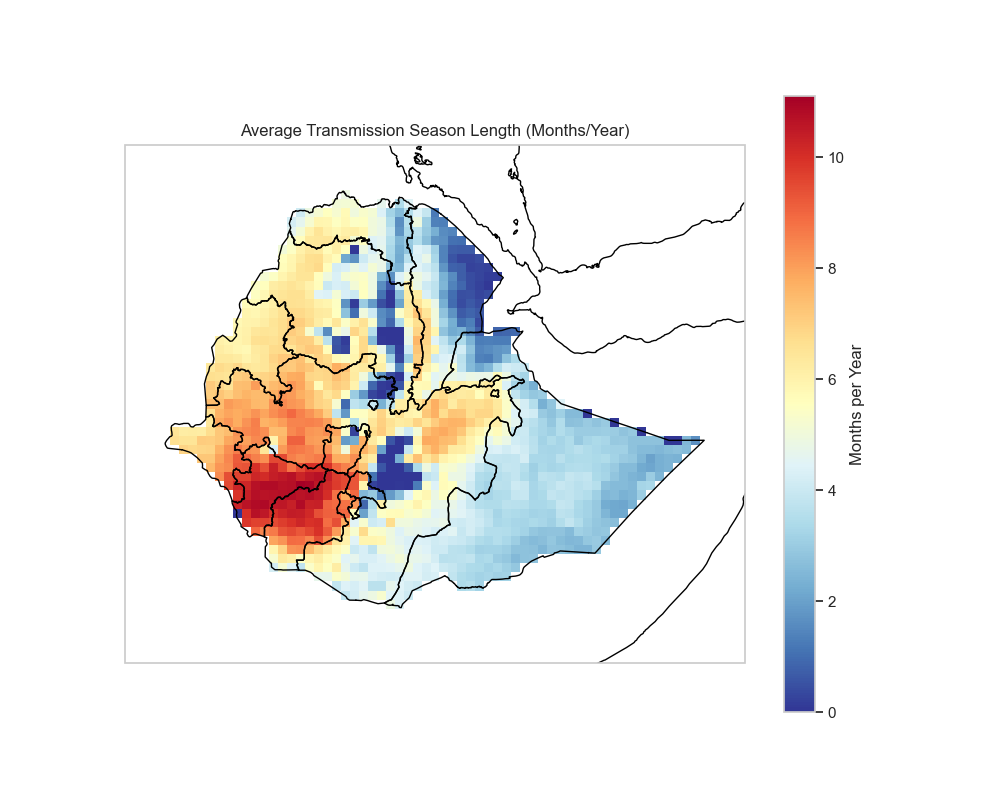

This map shows how many months per year each location experiences transmission above the threshold, helping identify perennial vs. seasonal transmission zones.

### Peak Timing Map

Identify when peak transmission occurs at each location:

```python
# Peak Timing Map
# Month index of peak transmission
peak_month = ds['vector'].groupby('time.month').mean(dim='time').idxmax(dim='month')

plt.figure(figsize=(10, 8))
ax = plt.axes(projection=ccrs.PlateCarree()) if CARTOPY_AVAILABLE else plt.axes()
if CARTOPY_AVAILABLE: 
    ax.coastlines()
    ax.add_feature(cfeature.BORDERS, linestyle=':')
peak_month.plot(ax=ax, transform=ccrs.PlateCarree() if CARTOPY_AVAILABLE else None, 
                cmap='twilight', levels=13, cbar_kwargs={'label': 'Month'})
plt.title('Month of Peak Transmission')
plt.tight_layout()
plt.savefig('output_figures/peak_timing_map.png', dpi=150, bbox_inches='tight')
plt.show()
```

!!! note "Figure Note"
    The peak timing map will be generated when you run the code above. The figure shows the month of peak transmission for each location.

This visualization helps understand spatial heterogeneity in peak transmission timing, which is important for timing interventions.

---

## 3. Annual Basis Analysis

### Inter-Annual Variability (Trend)

Examine long-term trends in vector density:

```python
# Inter-Annual Variability (Trend)
annual_mean = ds['vector'].resample(time='1YS').mean().mean(dim=['lat', 'lon'])

plt.figure(figsize=(12, 5))
annual_mean.plot(marker='o', linestyle='-', color='green')
plt.title('Inter-Annual Variability of Vector Density (Domain Average)')
plt.ylabel('Mean Vector Density')
plt.xlabel('Year')
plt.grid(True)
plt.tight_layout()
plt.savefig('output_figures/interannual_variability.png', dpi=150, bbox_inches='tight')
plt.show()
```

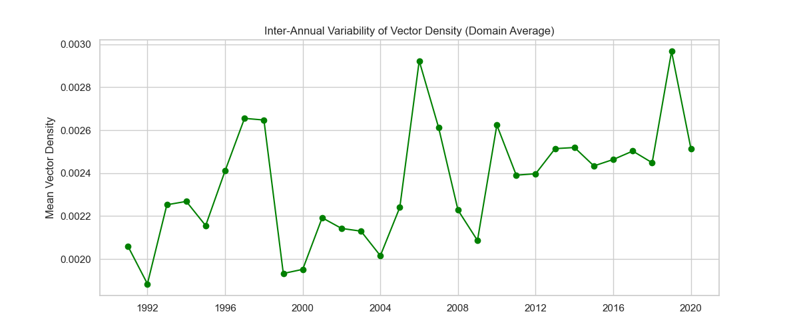

This time series reveals long-term trends and inter-annual variability, which may be related to climate variability or long-term climate change.

### Inter-Annual Variability for Cases

```python
# Inter-Annual Variability for Cases
cases_annual_mean = ds_disease['cases'].resample(time='1YS').mean().mean(dim=['lat', 'lon'])

plt.figure(figsize=(12, 5))
cases_annual_mean.plot(marker='o', linestyle='-', color='darkred')
plt.title('Inter-Annual Variability of Malaria Cases (Domain Average)')
plt.ylabel('Mean Cases')
plt.xlabel('Year')
plt.grid(True)
plt.tight_layout()
plt.savefig('output_figures/annual_variability_cases.png', dpi=150, bbox_inches='tight')
plt.show()
```

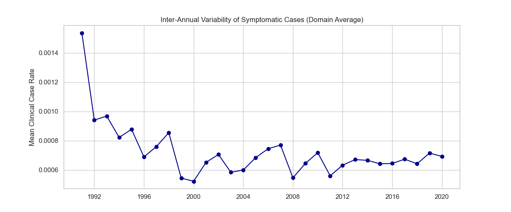

### Year-to-Year Spatial Comparison

Compare early vs. late periods to identify spatial changes:

```python
# Year-to-Year Spatial Comparison (Early vs Late)
start_year = int(ds.time.dt.year.min())
end_year = int(ds.time.dt.year.max())

# Mean of first 5 years vs last 5 years
early_period = ds['vector'].sel(time=slice(f'{start_year}-01-01', f'{start_year+4}-12-31')).mean(dim='time')
late_period = ds['vector'].sel(time=slice(f'{end_year-4}-01-01', f'{end_year}-12-31')).mean(dim='time')
diff = late_period - early_period

plt.figure(figsize=(10, 8))
ax = plt.axes(projection=ccrs.PlateCarree()) if CARTOPY_AVAILABLE else plt.axes()
if CARTOPY_AVAILABLE: 
    ax.coastlines()
    ax.add_feature(cfeature.BORDERS, linestyle=':')
diff.plot(ax=ax, transform=ccrs.PlateCarree() if CARTOPY_AVAILABLE else None, 
          cmap='RdBu_r', center=0, cbar_kwargs={'label': 'Difference (Late - Early)'})
plt.title(f'Change in Vector Density: {start_year}-{start_year+4} vs {end_year-4}-{end_year}')
plt.tight_layout()
plt.savefig('output_figures/early_late_comparison.png', dpi=150, bbox_inches='tight')
plt.show()
```

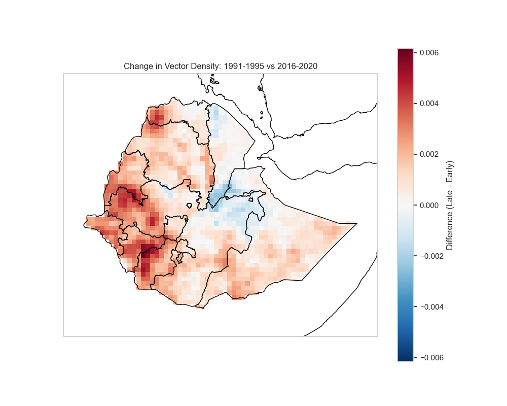

This difference map highlights areas where transmission has increased (positive values) or decreased (negative values) over time.

### Mean Spatial Maps

#### Mean Spatial Map for Cases

```python
# Mean spatial map for cases
cases_mean = ds_disease['cases'].mean(dim='time')

plt.figure(figsize=(10, 8))
ax = plt.axes(projection=ccrs.PlateCarree()) if CARTOPY_AVAILABLE else plt.axes()
if CARTOPY_AVAILABLE: 
    ax.coastlines()
    ax.add_feature(cfeature.BORDERS, linestyle=':')
cases_mean.plot(ax=ax, transform=ccrs.PlateCarree() if CARTOPY_AVAILABLE else None, 
                cmap='Reds', cbar_kwargs={'label': 'Mean Cases'})
plt.title('Mean Spatial Distribution of Malaria Cases')
plt.tight_layout()
plt.savefig('output_figures/mean_spatial_cases.png', dpi=150, bbox_inches='tight')
plt.show()
```

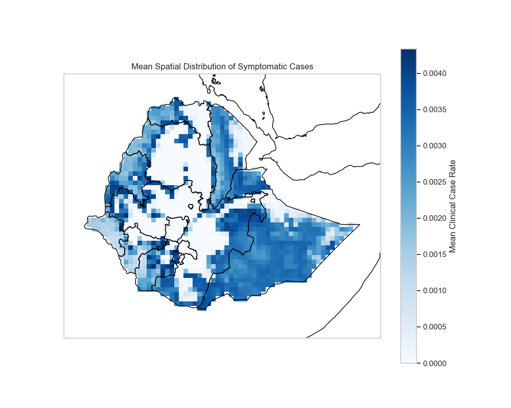

#### Mean Spatial Map for HBR

```python
# Mean spatial map for HBR
hbr_mean = ds['hbr'].mean(dim='time')

plt.figure(figsize=(10, 8))
ax = plt.axes(projection=ccrs.PlateCarree()) if CARTOPY_AVAILABLE else plt.axes()
if CARTOPY_AVAILABLE: 
    ax.coastlines()
    ax.add_feature(cfeature.BORDERS, linestyle=':')
hbr_mean.plot(ax=ax, transform=ccrs.PlateCarree() if CARTOPY_AVAILABLE else None, 
              cmap='YlOrRd', cbar_kwargs={'label': 'Mean HBR'})
plt.title('Mean Spatial Distribution of Human Biting Rate (HBR)')
plt.tight_layout()
plt.savefig('output_figures/mean_spatial_hbr.png', dpi=150, bbox_inches='tight')
plt.show()
```

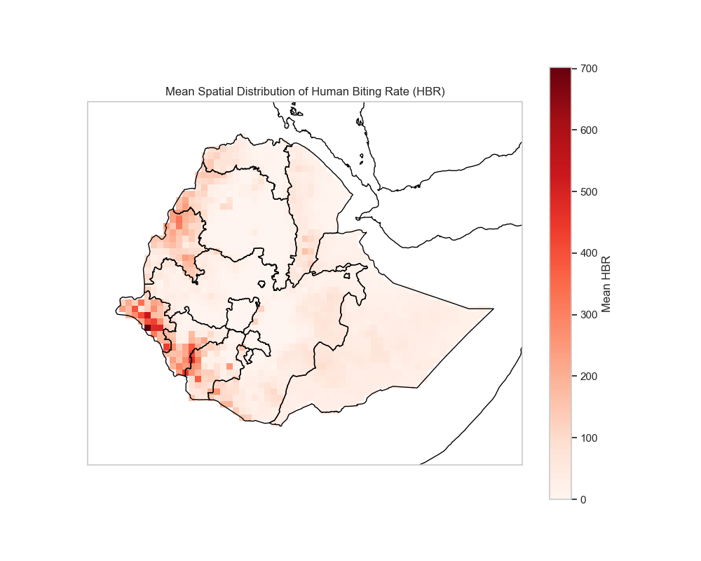

### Spatial Subplot: Vector, PRd, and wpond

```python
# Create a subplot showing vector, PRd, and wpond side by side
vector_mean = ds['vector'].mean(dim='time')
prd_mean = ds_disease['PRd'].mean(dim='time')
wpond_mean = ds_hydrology['wpond'].mean(dim='time')

fig, axes = plt.subplots(1, 3, figsize=(18, 6), 
                         subplot_kw={'projection': ccrs.PlateCarree()} if CARTOPY_AVAILABLE else {})

# Vector
ax = axes[0] if CARTOPY_AVAILABLE else axes[0]
if CARTOPY_AVAILABLE:
    ax.coastlines()
    ax.add_feature(cfeature.BORDERS, linestyle=':')
vector_mean.plot(ax=ax, transform=ccrs.PlateCarree() if CARTOPY_AVAILABLE else None, 
                 cmap='viridis', cbar_kwargs={'label': 'Vector Density'})
ax.set_title('Mean Vector Density')

# PRd
ax = axes[1] if CARTOPY_AVAILABLE else axes[1]
if CARTOPY_AVAILABLE:
    ax.coastlines()
    ax.add_feature(cfeature.BORDERS, linestyle=':')
prd_mean.plot(ax=ax, transform=ccrs.PlateCarree() if CARTOPY_AVAILABLE else None, 
              cmap='Reds', cbar_kwargs={'label': 'PRd'})
ax.set_title('Mean Parasite Rate (PRd)')

# wpond
ax = axes[2] if CARTOPY_AVAILABLE else axes[2]
if CARTOPY_AVAILABLE:
    ax.coastlines()
    ax.add_feature(cfeature.BORDERS, linestyle=':')
wpond_mean.plot(ax=ax, transform=ccrs.PlateCarree() if CARTOPY_AVAILABLE else None, 
                cmap='Blues', cbar_kwargs={'label': 'Pond Fraction'})
ax.set_title('Mean Pond Fraction (wpond)')

plt.tight_layout()
plt.savefig('output_figures/spatial_subplot_vector_prd_wpond.png', dpi=150, bbox_inches='tight')
plt.show()
```

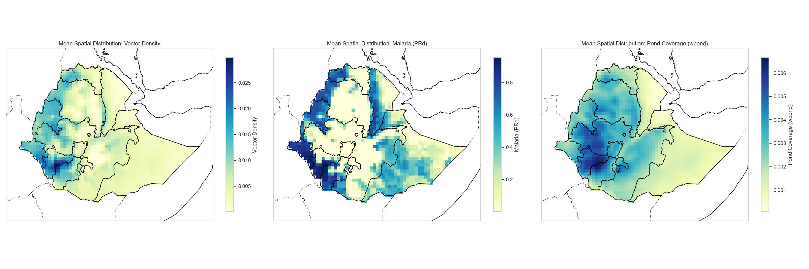

---

## 4. Statistical & Advanced Analysis

### Correlation Matrix

Analyze relationships between different variables:

```python
# Calculate correlation matrix between key variables
# Spatially and temporally average to get time series
vector_ts = ds['vector'].mean(dim=['lat', 'lon']).resample(time='1MS').mean()
hbr_ts = ds['hbr'].mean(dim=['lat', 'lon']).resample(time='1MS').mean()
prd_ts = ds_disease['PRd'].mean(dim=['lat', 'lon']).resample(time='1MS').mean()
cases_ts = ds_disease['cases'].mean(dim=['lat', 'lon']).resample(time='1MS').mean()
wpond_ts = ds_hydrology['wpond'].mean(dim=['lat', 'lon']).resample(time='1MS').mean()

# Align all time series
common_time = vector_ts.time
vector_aligned = vector_ts.sel(time=common_time)
hbr_aligned = hbr_ts.sel(time=common_time)
prd_aligned = prd_ts.sel(time=common_time)
cases_aligned = cases_ts.sel(time=common_time)
wpond_aligned = wpond_ts.sel(time=common_time)

# Create DataFrame for correlation
df = pd.DataFrame({
    'Vector': vector_aligned.values,
    'HBR': hbr_aligned.values,
    'PRd': prd_aligned.values,
    'Cases': cases_aligned.values,
    'wpond': wpond_aligned.values
})

# Calculate correlation matrix
corr_matrix = df.corr()

# Plot correlation matrix
plt.figure(figsize=(10, 8))
sns.heatmap(corr_matrix, annot=True, cmap='coolwarm', center=0, 
            square=True, linewidths=1, cbar_kws={"shrink": 0.8}, fmt='.2f')
plt.title('Correlation Matrix: Key VECTRI Variables')
plt.tight_layout()
plt.savefig('output_figures/correlation_matrix.png', dpi=150, bbox_inches='tight')
plt.show()
```


### Spatial Correlation Maps

Examine spatial correlations between variables:

#### Spatial Correlation: Vector Density vs PRd

```python
# Calculate spatial correlation between vector and PRd
# Resample to monthly for consistency
vector_monthly = ds['vector'].resample(time='1MS').mean()
prd_monthly = ds_disease['PRd'].resample(time='1MS').mean()

# Calculate correlation at each grid point
spatial_corr = xr.corr(vector_monthly, prd_monthly, dim='time')

plt.figure(figsize=(10, 8))
ax = plt.axes(projection=ccrs.PlateCarree()) if CARTOPY_AVAILABLE else plt.axes()
if CARTOPY_AVAILABLE: 
    ax.coastlines()
    ax.add_feature(cfeature.BORDERS, linestyle=':')
spatial_corr.plot(ax=ax, transform=ccrs.PlateCarree() if CARTOPY_AVAILABLE else None, 
                  cmap='RdBu_r', center=0, vmin=-1, vmax=1, 
                  cbar_kwargs={'label': 'Correlation Coefficient'})
plt.title('Spatial Correlation: Vector Density vs Malaria (PRd)')
plt.tight_layout()
plt.savefig('output_figures/spatial_corr_Vector_Density_vs_Malaria_(PRd).png', dpi=150, bbox_inches='tight')
plt.show()
```

.png)

#### Spatial Correlation: Vector Density vs Pond Coverage

```python
# Calculate spatial correlation between vector and wpond
wpond_monthly = ds_hydrology['wpond'].resample(time='1MS').mean()

# Align dimensions if needed
if vector_monthly.sizes['time'] == wpond_monthly.sizes['time']:
    spatial_corr_pond = xr.corr(vector_monthly, wpond_monthly, dim='time')
    
    plt.figure(figsize=(10, 8))
    ax = plt.axes(projection=ccrs.PlateCarree()) if CARTOPY_AVAILABLE else plt.axes()
    if CARTOPY_AVAILABLE: 
        ax.coastlines()
        ax.add_feature(cfeature.BORDERS, linestyle=':')
    spatial_corr_pond.plot(ax=ax, transform=ccrs.PlateCarree() if CARTOPY_AVAILABLE else None, 
                          cmap='RdBu_r', center=0, vmin=-1, vmax=1, 
                          cbar_kwargs={'label': 'Correlation Coefficient'})
    plt.title('Spatial Correlation: Vector Density vs Pond Coverage (wpond)')
    plt.tight_layout()
    plt.savefig('output_figures/spatial_corr_Vector_Density_vs_Pond_Coverage_(wpond).png', dpi=150, bbox_inches='tight')
    plt.show()
```

.png)

#### Spatial Correlation: PRd vs Pond Coverage

```python
# Calculate spatial correlation between PRd and wpond
if prd_monthly.sizes['time'] == wpond_monthly.sizes['time']:
    spatial_corr_prd_pond = xr.corr(prd_monthly, wpond_monthly, dim='time')
    
    plt.figure(figsize=(10, 8))
    ax = plt.axes(projection=ccrs.PlateCarree()) if CARTOPY_AVAILABLE else plt.axes()
    if CARTOPY_AVAILABLE: 
        ax.coastlines()
        ax.add_feature(cfeature.BORDERS, linestyle=':')
    spatial_corr_prd_pond.plot(ax=ax, transform=ccrs.PlateCarree() if CARTOPY_AVAILABLE else None, 
                               cmap='RdBu_r', center=0, vmin=-1, vmax=1, 
                               cbar_kwargs={'label': 'Correlation Coefficient'})
    plt.title('Spatial Correlation: Malaria (PRd) vs Pond Coverage (wpond)')
    plt.tight_layout()
    plt.savefig('output_figures/spatial_corr_Malaria_(PRd)_vs_Pond_Coverage_(wpond).png', dpi=150, bbox_inches='tight')
    plt.show()
```

_vs_Pond_Coverage_(wpond).png)

### Climate-Disease Lag Analysis

Understanding the lag between climate drivers and disease outcomes is crucial for early warning:

```python
# Climate-Disease Lag Analysis
# Determine precipitation variable name
precip_var = 'tp' if 'tp' in ds_precip else list(ds_precip.data_vars)[0]
print(f"Using precipitation variable: {precip_var}")

# Spatially aggregate
precip_ts = ds_precip[precip_var].mean(dim=['lat', 'lon']).resample(time='1MS').mean()
vector_ts = ds['vector'].mean(dim=['lat', 'lon']).resample(time='1MS').mean()

# Align time series
common_time = np.intersect1d(precip_ts.time, vector_ts.time)
p_aligned = precip_ts.sel(time=common_time)
v_aligned = vector_ts.sel(time=common_time)

# Calculate cross-correlation
lags = range(0, 7)  # 0 to 6 months
corrs = []
for lag in lags:
    # Shift precip forward by lag months (P affects V in future)
    # corr(P(t-lag), V(t))
    p_shifted = p_aligned.shift(time=lag).dropna(dim='time')
    v_aligned_trimmed = v_aligned.dropna(dim='time')
    # Align after shifting
    common_time_shifted = np.intersect1d(p_shifted.time, v_aligned_trimmed.time)
    if len(common_time_shifted) > 0:
        p_final = p_shifted.sel(time=common_time_shifted)
        v_final = v_aligned_trimmed.sel(time=common_time_shifted)
        corr = np.corrcoef(p_final.values, v_final.values)[0, 1]
        corrs.append(corr)
    else:
        corrs.append(np.nan)

plt.figure(figsize=(8, 5))
plt.bar(lags, corrs, color='skyblue')
plt.xlabel('Lag (Months)')
plt.ylabel('Correlation Coefficient')
plt.title('Lagged Correlation: Precipitation vs Vector Density')
plt.grid(axis='y', alpha=0.3)
plt.axhline(0, color='k', linestyle='--', alpha=0.5)
plt.tight_layout()
plt.savefig('output_figures/climate_disease_lag.png', dpi=150, bbox_inches='tight')
plt.show()

# Find optimal lag
optimal_lag = lags[np.nanargmax(corrs)]
print(f"Optimal lag: {optimal_lag} months (correlation = {max(corrs):.3f})")
```

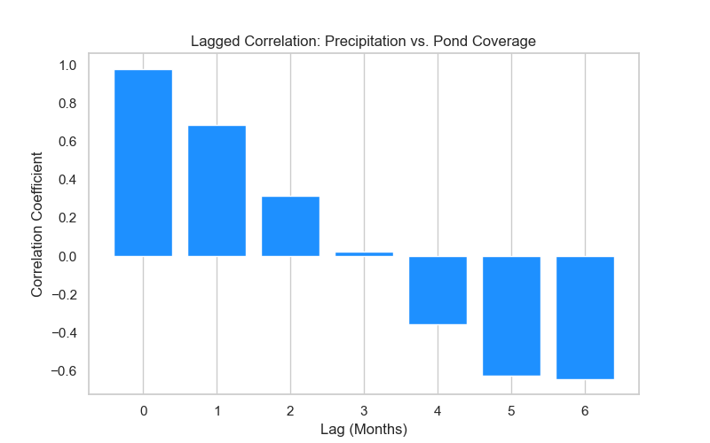

**Interpretation:**
- **Lag 0**: Immediate response (same month)
- **Lag 1-2**: Typical lag for mosquito breeding cycle
- **Lag 3-6**: Longer-term effects through multiple generations

The optimal lag indicates the lead time for early warning systems.

### Exceedance Probability

Identify high-risk areas based on probability of exceeding thresholds:

```python
# Exceedance Probability
# Probability of exceeding the 75th percentile of vector density
thresh_75 = ds['vector'].quantile(0.75).values
prob_exceed = (ds['vector'] > thresh_75).mean(dim='time')

plt.figure(figsize=(10, 8))
ax = plt.axes(projection=ccrs.PlateCarree()) if CARTOPY_AVAILABLE else plt.axes()
if CARTOPY_AVAILABLE: 
    ax.coastlines()
    ax.add_feature(cfeature.BORDERS, linestyle=':')
prob_exceed.plot(ax=ax, transform=ccrs.PlateCarree() if CARTOPY_AVAILABLE else None, 
                 cmap='Reds', cbar_kwargs={'label': 'Probability'})
plt.title(f'Probability of Exceeding High Transmission Threshold (> {thresh_75:.2f})')
plt.tight_layout()
plt.savefig('output_figures/exceedance_probability.png', dpi=150, bbox_inches='tight')
plt.show()
```

!!! note "Figure Note"
    The exceedance probability map will be generated when you run the code above. The figure shows the probability of exceeding high transmission thresholds.

This map shows areas with consistently high transmission risk, useful for prioritizing intervention resources.

---

## Advanced Analysis Summary

### Key Applications

1. **Seasonality Analysis**: Identify peak transmission months and seasonal patterns
2. **Anomaly Detection**: Detect unusual transmission events
3. **Spatial Patterns**: Understand geographic heterogeneity in transmission
4. **Temporal Trends**: Monitor long-term changes in transmission
5. **Lag Analysis**: Determine optimal lead times for early warning
6. **Risk Mapping**: Identify high-risk areas for targeted interventions

### Best Practices

- **Coordinate Handling**: Always check and properly assign time and spatial coordinates
- **Resampling**: Use monthly resampling for seasonal analysis to reduce noise
- **Threshold Selection**: Choose meaningful thresholds based on epidemiological context
- **Lag Ranges**: Consider biological constraints when selecting lag ranges (mosquito life cycle ~2-4 weeks)
- **Spatial Aggregation**: Domain averages are useful for time series, but spatial patterns require full spatial analysis

---

## 2) Recommended Folder Layout

Recommended structure:

```
vectri_analysis/
  outputs/
    base.nc
    out_cold_start.nc
    ...
  figures/
    global/
    ethiopia/
  scripts/
```

Create folders:

```bash
mkdir -p outputs
```

```bash
mkdir -p figures/global
```

```bash
mkdir -p figures/ethiopia
```

```bash
mkdir -p scripts
```

Or create all at once:

```bash
mkdir -p outputs figures/global figures/ethiopia scripts
```

---

## 3) Quick Manual Inspection

Start with metadata:

```bash
ncdump -h outputs/base.nc | head -n 160
```

List variable names quickly:

```python
import xarray as xr

ds = xr.open_dataset("outputs/base.nc")
print("Variables:")
for v in ds.data_vars:
    print(" -", v)
```

Save as `list_variables.py`:

```bash
python list_variables.py
```

---

## 4) The Core Idea of This Workflow

For each variable of interest:

1. **Map** — time-mean map, or a chosen time slice
2. **Time series** — area-mean for your domain (Global or Ethiopia)
3. *(optional)* Monthly or seasonal aggregation

This gives you an immediate, interpretable picture of:

- Spatial hotspots
- Temporal seasonality
- Differences between experiments
- Hydrology–vector–disease coupling patterns

---

## 5) Ethiopia Bounds (Default)

This guide uses common Ethiopia bounds:

| Coordinate | Range |
|------------|-------|
| **lat** | 3 to 15 |
| **lon** | 33 to 48 |

Adjust as needed for your study.

---

## 6) Use the Auto-Plot Script (Recommended)

This guide comes with a companion Python script:

- `vectri_plot_outputs.py`

It can:

- Auto-detect variables by keyword
- Group into vector/disease/hydrology
- Create:
  - Time-mean maps
  - Area-mean time series
  - Monthly means (optional)
- Save figures to:
  - `figures/global/`
  - `figures/ethiopia/`

### 6.1 Basic Run (Global)

```bash
python scripts/vectri_plot_outputs.py --nc outputs/base.nc --outdir figures/global
```

### 6.2 Ethiopia-Only Run

```bash
python scripts/vectri_plot_outputs.py --nc outputs/base.nc --outdir figures/ethiopia --ethiopia
```

### 6.3 Two-File Comparison (Baseline vs Experiment)

```bash
python scripts/vectri_plot_outputs.py --nc outputs/base.nc --compare outputs/exp_temp_plus1K.nc --outdir figures/ethiopia --ethiopia
```

This produces:

- Maps + time series for each detected variable
- Simple difference summaries (where safe)

### 6.4 Custom Ethiopia Bounds

```bash
python scripts/vectri_plot_outputs.py --nc outputs/base.nc --outdir figures/ethiopia --ethiopia --lat-min 3 --lat-max 15 --lon-min 33 --lon-max 48
```

---

## 7) What the Script Looks For

The script uses keyword detection for your groups:

### 7.1 Vector Keywords

- `vector`, `adult`, `mosquito`, `hbr`, `bite`, `biting`, `larv`, `larvae`, `emerge`, `emergence`

### 7.2 Disease Keywords

- `prd`, `pr`, `cspr`, `eir`, `case`, `cases`, `immune`, `immunity`, `infection`, `infect`, `parasite`

### 7.3 Hydrology Keywords

- `wperm`, `wurbn`, `wpond`, `pond`, `water`

!!! tip "Fallback Behavior"
    If no matches are found, it will fall back to plotting the first few variables.

---

## 8) Suggested Teaching Sequence (60–90 min)

| Step | Activity | Time |
|------|----------|------|
| 1 | **Baseline output anatomy** | 10 min |
|    | - `ncdump -h` | |
|    | - List variables | |
| 2 | **Run auto-plot global** | 10 min |
| 3 | **Run Ethiopia-only** | 10 min |
| 4 | **Pick one variable per group** | 15 min |
|    | - Discuss physical/epidemiological meaning | |
| 5 | **Compare two experiments** | 15 min |
|    | - e.g., rainfall factor vs hydrology outputs | |
| 6 | **Explain coupling ideas** | 10 min |
|    | - rainfall → `wpond/wperm` → larvae → HBR/EIR/PRd | |

---

## 9) Interpretation Tips (High-Level)

### 9.1 Hydrology → Vector

- Increased ponding/permanent water often provides more breeding habitat
- Watch whether:
  - `wpond` increases align with
  - larvae/emergence increases

### 9.2 Vector → Disease

- Higher HBR or vector density can increase:
  - `EIR`
  - `PRd`
  - cases (depending on model config)

### 9.3 Immunity Feedbacks

- Changes in incidence/transmission can shift immunity metrics
- This can dampen or amplify later-season risk depending on settings

!!! note "Training vs Research"
    These are **qualitative training heuristics**. For research-grade inference, you'll validate with local epidemiology and longer evaluation windows.

---

## 10) Minimal Manual Plotting Template

If you want to teach the basics without the auto-script:

### 10.1 One Variable Map (Time Mean)

Create `plot_map.py`:

```python
import xarray as xr
import matplotlib.pyplot as plt

ds = xr.open_dataset("outputs/base.nc")
var = list(ds.data_vars)[0]
da = ds[var]

# Find a time dimension if present
time_dim = next((d for d in da.dims if "time" in d.lower()), None)
field = da.mean(time_dim) if time_dim else da

plt.figure()
field.plot()
plt.title(f"{var} time-mean")
plt.tight_layout()
plt.savefig("figures/manual_map.png", dpi=150)
plt.close()
```

Run:

```bash
python plot_map.py
```

### 10.2 One Variable Ethiopia Area-Mean Time Series

Create `plot_timeseries.py`:

```python
import xarray as xr
import matplotlib.pyplot as plt

ds = xr.open_dataset("outputs/base.nc")

# Crude coord detection
lat = next((c for c in ds.coords if "lat" in c.lower()), None)
lon = next((c for c in ds.coords if "lon" in c.lower()), None)

var = list(ds.data_vars)[0]
da = ds[var]

if lat and lon:
    ds = ds.sel({lat: slice(3, 15), lon: slice(33, 48)})

da = ds[var]

lat_dim = next((d for d in da.dims if "lat" in d.lower()), None)
lon_dim = next((d for d in da.dims if "lon" in d.lower()), None)

spatial = [d for d in [lat_dim, lon_dim] if d in da.dims]
ts = da.mean(spatial) if spatial else da

plt.figure()
ts.plot()
plt.title(f"{var} Ethiopia area-mean time series")
plt.tight_layout()
plt.savefig("figures/manual_timeseries.png", dpi=150)
plt.close()
```

Run:

```bash
python plot_timeseries.py
```

---

## 11) Outputs You'll Get

With the auto script, expect filenames like:

```
figures/ethiopia/
  vector__<varname>__map.png
  vector__<varname>__ts.png
  disease__<varname>__map.png
  disease__<varname>__ts.png
  hydro__<varname>__map.png
  hydro__<varname>__ts.png
```

If using comparison mode:

```
figures/ethiopia/
  vector__<varname>__delta_map.png
  vector__<varname>__delta_ts.png
  ...
```

This structure makes it easy to assemble slides quickly.

---

## 12) Complete Workflow Example

### Step 1: Set Up Directories

```bash
mkdir -p outputs figures/global figures/ethiopia scripts
```

### Step 2: Inspect Output Structure

```bash
ncdump -h outputs/base.nc | head -n 100
```

### Step 3: List Variables

```python
import xarray as xr

ds = xr.open_dataset("outputs/base.nc")
print("Variables:")
for v in ds.data_vars:
    print(" -", v)
```

### Step 4: Generate Global Figures

```bash
python scripts/vectri_plot_outputs.py --nc outputs/base.nc --outdir figures/global
```

### Step 5: Generate Ethiopia Figures

```bash
python scripts/vectri_plot_outputs.py --nc outputs/base.nc --outdir figures/ethiopia --ethiopia
```

### Step 6: Compare Experiments

```bash
python scripts/vectri_plot_outputs.py --nc outputs/base.nc --compare outputs/exp_temp_plus1K.nc --outdir figures/ethiopia --ethiopia
```

### Step 7: View Results

```bash
ls figures/ethiopia/
```

---

## 13) Understanding the Variable Inventory

The script creates a `variable_inventory.txt` file in the output directory:

```bash
cat figures/ethiopia/variable_inventory.txt
```

This file lists:

- Source file used
- Comparison file (if any)
- Geographic subset (if any)
- Detected variable groupings

---

## 14) Troubleshooting

!!! warning "Common Issues"

    **Script can't find variables:**
    
    - Check that your output file contains expected variable names
    - Verify the file path is correct
    - Try running with manual variable specification
    
    **Plots are empty or show errors:**
    
    - Ensure the data has spatial dimensions (lat/lon)
    - Check that time dimension exists for time series
    - Verify coordinate names match expected patterns
    
    **Comparison fails:**
    
    - Ensure both files have the same variable names
    - Check that coordinates align between files
    - Verify both files cover the same time period

---

## 15) Advanced: Custom Variable Selection

If you want to plot specific variables, you can modify the script or create a custom version that:

1. Takes a list of variable names as input
2. Plots only those variables
3. Applies custom grouping logic

Example custom script structure:

```python
import xarray as xr
import matplotlib.pyplot as plt

# Load dataset
ds = xr.open_dataset("outputs/base.nc")

# Specify variables of interest
variables = ["disease/eir", "vector/vector", "hydrology/wpond"]

# Plot each
for var in variables:
    if var in ds.data_vars:
        da = ds[var]
        # ... plotting code ...
```

---

## 📝 Exercises

### Exercise 1: Basic Visualization

1. Run the auto-plot script on your baseline output
2. Identify one variable from each group (vector, disease, hydrology)
3. Compare the spatial patterns in the maps

### Exercise 2: Regional Comparison

1. Generate global figures
2. Generate Ethiopia-specific figures
3. Compare the differences in patterns

### Exercise 3: Experiment Comparison

1. Run baseline and one experiment
2. Generate comparison figures
3. Identify which variables show the largest changes

### Exercise 4: Coupling Analysis

1. Plot `wpond` (hydrology)
2. Plot `larvae` (vector)
3. Plot `eir` (disease)
4. Discuss the temporal relationships between them

---

## 🔗 Additional Resources

- [VECTRI Output Analysis](./01-vectri-output-analysis.md)
- [VECTRI Parameter Sensitivity](./05-vectri-parameter-sensitivity.md)
- [VECTRI Hands-On Simulations](./03-vectri-hands-on-simulations.md)
- [VECTRI Documentation](https://users.ictp.it/~tompkins/vectri/documentation/)
- [Xarray Documentation](https://docs.xarray.dev/)
- [Matplotlib Documentation](https://matplotlib.org/)

