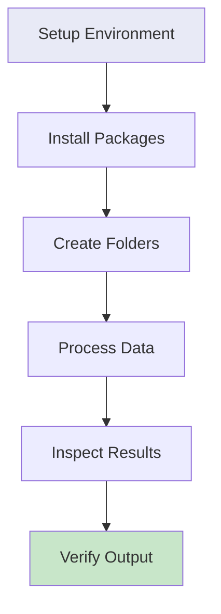

# 📊 Data Processing and Inspecting

---

## Overview

This tutorial guides you through setting up a Python environment for climate data processing, harmonizing disparate climate datasets into a unified format, and verifying the processed data. You'll learn to:

- Set up a Python virtual environment in VS Code
- Install required packages for climate data processing
- Process and harmonize climate, population, and soil datasets
- Inspect and verify processed data using Jupyter notebooks

<div class="grid cards" markdown>

-   :material-folder-cog: **Setup**
    
    ---
    
    **Environment:** Python virtual environment  
    **IDE:** VS Code  
    **Packages:** xarray, numpy, pandas, scipy, etc.  
    **Folders:** Organized data structure

-   :material-database-sync: **Processing**
    
    ---
    
    **Tasks:** Inspect, standardize, regrid  
    **Output:** Harmonized NetCDF files  
    **Format:** Unified grid and units  
    **Target:** VECTRI-ready data

-   :material-file-check: **Verification**
    
    ---
    
    **Method:** Jupyter notebook  
    **Checks:** Metadata, resolution, units  
    **Visualization:** Plot verification  
    **Output:** Processed data ready for use

</div>

---

## 🎯 What You'll Learn



By the end of this tutorial, you will:

1. **Set up** a Python virtual environment in VS Code
2. **Install** all required packages for climate data processing
3. **Organize** data into structured folders
4. **Process** raw climate datasets into a unified format
5. **Inspect** and verify processed data quality

---

## 🚀 Part 1: Setting Up Your Environment

### Step 1: Open Your Project Folder

1. **Open VS Code**
2. **Go to File > Open Folder...**
3. **Navigate** to your project folder (e.g., `VECTRI-PYTHON`)
4. **Select** the folder and click "Select Folder"

### Step 2: Open a Command Prompt Terminal

1. **Open the terminal** in VS Code (View > Terminal or `` Ctrl+` ``)
2. **If the default is PowerShell**, click the dropdown arrow next to the `+` sign in the terminal panel
3. **Select Command Prompt** from the dropdown

### Step 3: Create the Virtual Environment

In the Command Prompt terminal, run:

```bash
python -m venv .venv
```

This creates a virtual environment in a folder named `.venv`. A new folder named `.venv` will appear in your project's file explorer.

### Step 4: Activate the Virtual Environment

To activate the environment in your Command Prompt session, run:

```bash
.venv\Scripts\activate
```

You will know it's active because the name of the environment will appear in parentheses at the start of your command prompt, like this: `(.venv)`.

### Step 5: Select the Python Interpreter

VS Code should automatically detect the new environment and ask if you want to use it for the workspace. If you see a notification, click **"Yes"**.

If not, you can set it manually:

1. **Press** `Ctrl+Shift+P` to open the Command Palette
2. **Type** and select `Python: Select Interpreter`
3. **Choose** the Python interpreter from the list that includes `.venv` in its path. It should be marked as "Recommended"

Your Command Prompt is now configured with the project's isolated Python environment. Any packages you install will be specific to this project.

---

## 📦 Part 2: Installing Required Packages

### Install Core Packages

Install the required packages one by one:

```bash
pip install numpy
```

```bash
pip install pandas
```

```bash
pip install matplotlib
```

```bash
pip install cftime
```

```bash
pip install cf_xarray
```

```bash
pip install openpyxl
```

```bash
pip install shapely
```

```bash
pip install scipy
```

```bash
pip install requests
```

```bash
pip install cartopy
```

```bash
pip install geopandas
```

```bash
pip install rioxarray
```

```bash
pip install rasterio
```

```bash
pip install regionmask
```

```bash
pip install salem
```

```bash
pip install netCDF4
```

### Install Xarray with Complete Dependencies

Install xarray with all optional dependencies:

```bash
python -m pip install "xarray[complete]"
```

### Verify Installation

Verify that the packages are installed correctly:

```bash
python -c "import xarray; print('xarray:', xarray.__version__)"
```

```bash
python -c "import numpy; print('numpy:', numpy.__version__)"
```

```bash
python -c "import pandas; print('pandas:', pandas.__version__)"
```

```bash
python -c "import scipy; print('scipy:', scipy.__version__)"
```

---

## 📁 Part 3: Creating Data Folders and download data 

Create the following folders to organize your data:

```bash
mkdir arc2
```

```bash
mkdir chc_cmip6
```

```bash
mkdir chirps
```

```bash
mkdir chirts
```

```bash
mkdir population
```

```bash
mkdir soil
```

```bash
mkdir temp
```

```bash
mkdir precip
```

```bash
mkdir hwsd
```

### Create Processed Data Folder

Create a folder for processed data:

```bash
mkdir data
```

```bash
mkdir data\processed
```

Download the data using the following link and place it in the correct folders:

[Data Download Link](https://drive.google.com/drive/folders/1_sps-53feC8t_azqHffBkGlW9Wg6Oo4Q?usp=sharing)


---

## 🔄 Part 4: Data Processing

### Overview of Data Processing

The data processing script (`process_climate_data.py`) performs the following core tasks:

1. **Inspects** raw NetCDF files for metadata (resolution, bounding box, units)
2. **Standardizes** spatial dimensions (renames `lat`/`lon` to `latitude`/`longitude`)
3. **Regrids** all data to match the resolution and domain of the **Precipitation** dataset
4. **Converts Units** (e.g., Kelvin to Celsius, kg/m²/s to mm/day)
5. **Formats** attributes and dimensions (e.g., handles specific time dimension requirements)

### Step-by-Step Processing Logic

#### Step 1: Configuration & Loading

**What it does:**
- Defines file paths for Input (Precip, Temp, Soil, Pop) and Output (`data/processed`)
- Loads all datasets using `xarray`

#### Step 2: Data Inspection (`inspect_dataset`)

**What it does:**
Before processing, the script prints key metadata for every input file:

- **Variables:** Lists available data variables
- **Resolution:** Calculates the grid step size (e.g., `0.25` degrees)
- **Bounding Box:** Shows the min/max Latitude and Longitude to verify coverage
- **Time:** Shows the start/end dates and calculates the time step (e.g., `1.0 days`)
- **Units:** Checks the units attribute (e.g., `mm/day`, `Kelvin`)

#### Step 3: Dimension Standardization (`standardize_dims`)

**Why this is needed:**
Different datasets often name dimensions differently (e.g., `lat` vs `latitude`, `lon` vs `longitude`). `xarray` requires matching names to regrid correctly.

**What it does:**
- Checks if a dataset uses `lon`/`lat`
- Renames them to `longitude`/`latitude` to match the target Precipitation dataset

#### Step 4: Defining the Target Grid

**Strategy:**
The **Precipitation** dataset is treated as the "Master Grid".

- All other datasets (Temperature, Population, Soil) will be interpolated (regridded) to match this dataset's grid points and resolution exactly

#### Step 5: Processing Individual Datasets

##### A. Precipitation

- **Action:** The data remains on its original grid
- **Unit Conversion:** Checks if units are `kg m-2 s-1`. If so, multiplies by `86400` to convert to `mm/day`
- **Formatting:** Saves variable as `tp` with standard attributes (`_FillValue`, `missing_value`)

##### B. Temperature

- **Action:** Regrids to the Precipitation grid using **Linear Interpolation**
- **Unit Conversion:** Checks if units are `Kelvin` (`K`). If so, subtracts `273.15` to convert to `deg C`
- **Formatting:** Saves variable as `t2m`

##### C. Population

- **Action:** Regrids to the Precipitation grid
- **Method:** Uses `nearest` neighbor by default (or user selection) to preserve discrete population counts better than linear interpolation
- **Dimension Handling:** **Removes the time dimension**. The output is a static map `(latitude, longitude)`
- **Attributes:** Sets units to `per km2`

##### D. Soil Texture

- **Action:** Regrids to the Precipitation grid
- **Variables:** Extracts `sand`, `silt`, and `clay` fractions
- **Dimension Handling:**
  - The script creates a **single time step** (size 1) anchored to the first date of the precipitation data
  - It saves this time dimension as **UNLIMITED**, allowing future tools (like CDO) to append data if needed
- **Attributes:** Sets specific physical ranges (`vmin`, `vmax`) for each soil type

#### Step 6: Saving Output

All processed files are saved to `data/processed/` as NetCDF files:

- `precip_processed.nc`
- `temp_processed.nc`
- `pop_processed.nc`
- `soil_processed.nc`

### Running the Processing Script

#### Default (Linear Interpolation)

```bash
python scripts/process_climate_data.py
```

#### Use Nearest Neighbor (Better for Population/Categorical Data)

```bash
python scripts/process_climate_data.py --method nearest
```

---

## 🔍 Part 5: Data Inspection and Verification

### Overview

After processing your data, you need to verify that:

1. All datasets have been processed correctly
2. Metadata (resolution, bounding box, units) is correct
3. Data values are reasonable
4. Visual inspection confirms proper processing

### Using the Verification Notebook

The verification notebook (`notebooks/verify_processed_data.ipynb`) is designed to:

- Load all the processed files from `data/processed/`
- Print the same metadata (Resolution, BBox, Time, Units) as the script
- Plot the first time step of each dataset for visual verification

### Opening the Notebook

1. **Open VS Code**
2. **Navigate** to the `notebooks` folder
3. **Open** `verify_processed_data.ipynb`
4. **Select** the Python interpreter (`.venv` environment)
5. **Run** cells one by one or all at once

### Notebook Contents

#### 1. Import Libraries

```python
import xarray as xr
import numpy as np
import matplotlib.pyplot as plt
import os
```

#### 2. Define Paths

```python
DATA_DIR = r'../data/processed'
FILE_PRECIP = os.path.join(DATA_DIR, 'precip_processed.nc')
FILE_TEMP = os.path.join(DATA_DIR, 'temp_processed.nc')
FILE_POP = os.path.join(DATA_DIR, 'pop_processed.nc')
FILE_SOIL = os.path.join(DATA_DIR, 'soil_processed.nc')
```

#### 3. Inspection Function

The notebook includes an `inspect_dataset` function that:

- Lists available variables
- Calculates grid resolution
- Shows bounding box (lat/lon ranges)
- Displays time duration and time step
- Reports units for each variable

#### 4. Verify Each Dataset

##### Precipitation Data

```python
ds_pr = xr.open_dataset(FILE_PRECIP)
inspect_dataset("Precipitation", ds_pr)

# Plot first time step
plt.figure(figsize=(10, 6))
ds_pr['tp'].isel(time=0).plot()
plt.title("Precipitation (First Time Step)")
plt.show()
```

##### Temperature Data

```python
ds_t2 = xr.open_dataset(FILE_TEMP)
inspect_dataset("Temperature", ds_t2)

plt.figure(figsize=(10, 6))
ds_t2['t2m'].isel(time=0).plot(cmap='coolwarm')
plt.title("Temperature (First Time Step)")
plt.show()
```

##### Population Data

```python
ds_pop = xr.open_dataset(FILE_POP)
inspect_dataset("Population", ds_pop)

plt.figure(figsize=(10, 6))
ds_pop['population'].plot(cmap='viridis')
plt.title("Population Density")
plt.show()
```

##### Soil Data

```python
ds_soil = xr.open_dataset(FILE_SOIL)
inspect_dataset("Soil", ds_soil)

# Plot Clay
if 'soilfraction_clay' in ds_soil:
    plt.figure(figsize=(10, 6))
    ds_soil['soilfraction_clay'].isel(time=0).plot(cmap='copper_r')
    plt.title("Soil Fraction: Clay (First Time Step)")
    plt.show()
```

### What to Check

When verifying your processed data, ensure:

1. **Resolution:** All datasets should have the same resolution (matching the precipitation dataset)
2. **Bounding Box:** All datasets should cover the same geographic area
3. **Time Coverage:** Temperature and precipitation should have matching time dimensions
4. **Units:** 
   - Precipitation: `mm/day`
   - Temperature: `degC` or `K`
   - Population: `per km2`
5. **Values:** Check that data values are within reasonable ranges
6. **Visual Inspection:** Maps should look correct and show expected patterns

---

## ⚠️ Troubleshooting

### Common Issues and Solutions

=== "NetCDF: Unknown file format"

    **Problem:** NetCDF library not properly installed
    
    **Solution:**
    ```bash
    pip install netCDF4
    ```
    
    If the issue persists, try:
    ```bash
    pip uninstall netCDF4
    ```
    
    ```bash
    pip install netCDF4
    ```

=== "Regridding seems wrong"

    **Problem:** Dimension names not standardized correctly
    
    **Solution:**
    1. Check the Inspection output to ensure dimension names were standardized correctly
    2. Verify that `lat`/`lon` were renamed to `latitude`/`longitude`
    3. Check that the target grid (precipitation) has the correct dimensions

=== "ModuleNotFoundError"

    **Problem:** Required package not installed
    
    **Solution:**
    ```bash
    pip install <package_name>
    ```
    
    For example:
    ```bash
    pip install xarray
    ```

=== "Virtual environment not activating"

    **Problem:** Activation script not found
    
    **Solution:**
    1. Ensure you're in the correct directory
    2. Check that `.venv` folder exists
    3. Try using the full path:
       ```bash
       .\.venv\Scripts\activate
       ```

=== "Jupyter notebook not opening"

    **Problem:** Jupyter not installed or not in environment
    
    **Solution:**
    ```bash
    pip install jupyter
    ```
    
    Or use VS Code's built-in notebook support (recommended)

=== "Data values seem incorrect"

    **Problem:** Unit conversion may have failed
    
    **Solution:**
    1. Check the original data units
    2. Verify unit conversion logic in the processing script
    3. Inspect the processed data attributes to confirm units

---

## 📋 Quick Reference Checklist

Use this checklist to ensure you've completed all steps:

- [ ] Opened project folder in VS Code
- [ ] Created virtual environment (`.venv`)
- [ ] Activated virtual environment
- [ ] Selected Python interpreter in VS Code
- [ ] Installed all required packages
- [ ] Created all data folders (arc2, chc_cmip6, chirps, etc.)
- [ ] Created `data/processed` folder
- [ ] Placed raw data files in appropriate folders
- [ ] Ran data processing script
- [ ] Verified processed files exist in `data/processed/`
- [ ] Opened verification notebook
- [ ] Ran all notebook cells
- [ ] Verified metadata (resolution, bounding box, units)
- [ ] Checked visual plots for each dataset
- [ ] Confirmed all datasets are ready for VECTRI

---

## 🎓 Best Practices

### Data Organization

- **Keep raw data separate** from processed data
- **Use descriptive folder names** for different data sources
- **Maintain a consistent naming convention** for processed files
- **Document data sources** and processing steps

### Processing

- **Always inspect raw data** before processing
- **Verify units** before and after processing
- **Check for missing values** and handle them appropriately
- **Use appropriate interpolation methods** (linear for continuous, nearest for categorical)

### Verification

- **Always verify processed data** before using in models
- **Compare processed data** with original data visually
- **Check metadata** matches expectations
- **Document any issues** or anomalies found

---

## 📖 Additional Resources

### Documentation

- **Xarray Documentation:** [https://xarray.pydata.org/](https://xarray.pydata.org/)
- **NetCDF Documentation:** [https://www.unidata.ucar.edu/software/netcdf/](https://www.unidata.ucar.edu/software/netcdf/)
- **SciPy Interpolation:** [https://docs.scipy.org/doc/scipy/reference/interpolate.html](https://docs.scipy.org/doc/scipy/reference/interpolate.html)

### Related Tutorials

- [Xarray for Climate Data](../day3/06-Xarray_for_Climate_and_Meteorology_Workshop.md)
- [Python Setup](../day2/05-Python_Setup_for_Climate_and_Meteorology_Workshop.md)
- [VECTRI Model Theory](../day1/06-vectri-model-theory-and-code.md)

---

## 🚀 Next Steps

<div class="grid cards" markdown>

-   :material-bug: **Run VECTRI Simulations**
    
    ---
    
    Use processed data for VECTRI  
    Configure model parameters  
    
    → [VECTRI Hands-On](../day4/04-vectri-hands-on-simulations.md)

-   :material-chart-line: **Analyze Results**
    
    ---
    
    Visualize VECTRI outputs  
    Compare with observations  
    
    → [VECTRI Output Analysis](../day4/02-vectri-output-analysis.md)

-   :material-cog: **Parameter Sensitivity**
    
    ---
    
    Test different parameters  
    Understand model behavior  
    
    → [Parameter Sensitivity](../day5/06-vectri-parameter-sensitivity.md)

</div>

---

!!! example "Need Help?"
    If you encounter issues or have questions:
    
    - Check the [Troubleshooting](#troubleshooting) section
    - Review the processing script documentation
    - Verify all packages are installed correctly
    - Check that data files are in the correct locations
    - Contact workshop instructors

---

<div style="background: linear-gradient(135deg, #5c6bc0 0%, #3949ab 100%); color: white; padding: 2rem; border-radius: 8px; text-align: center; margin-top: 2rem;">
  <h3 style="margin: 0 0 1rem 0;">📊 Ready for Data Processing!</h3>
  <p style="margin: 0; opacity: 0.95;">You now have everything you need to process, harmonize, and verify climate datasets for use with VECTRI and other modeling applications.</p>
</div>

