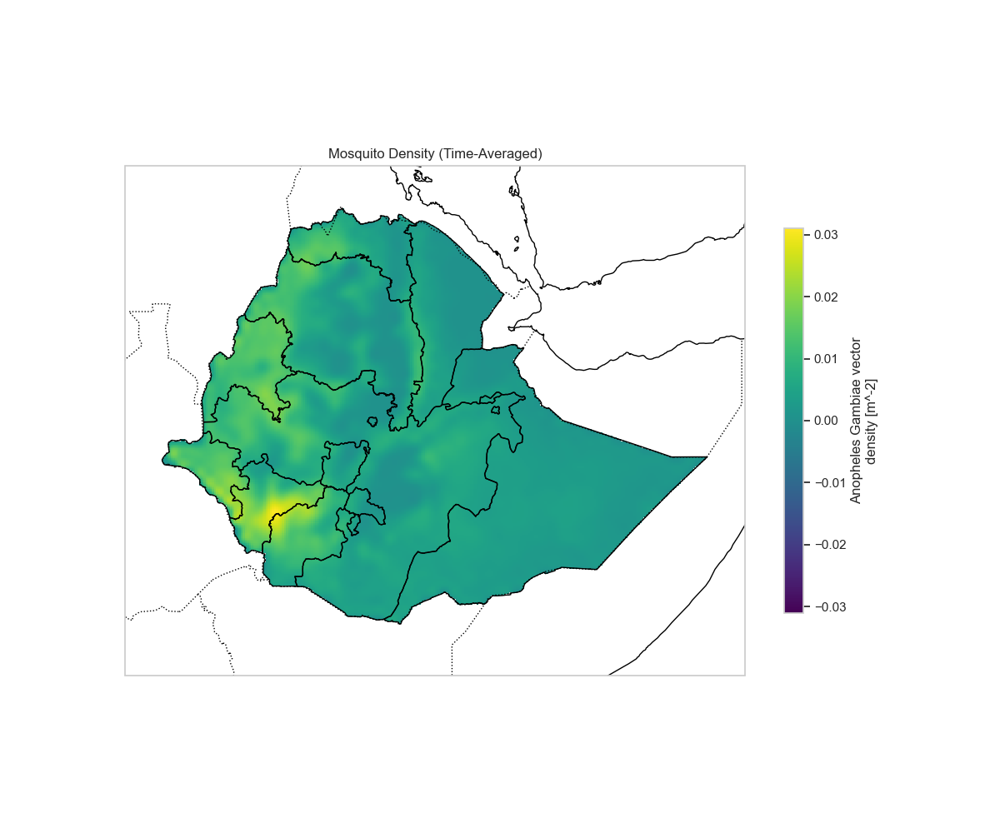
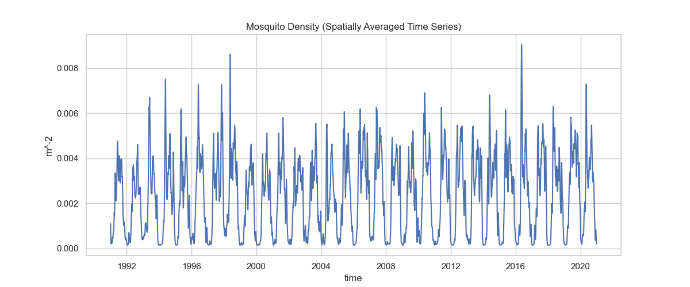
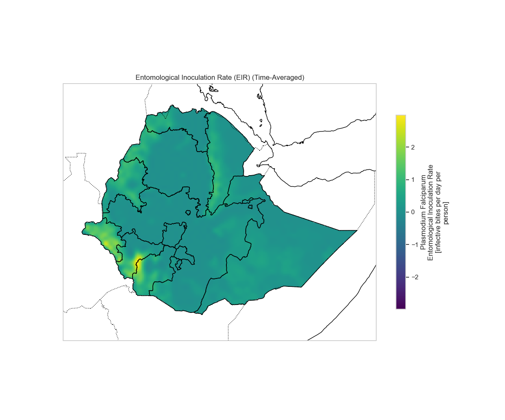
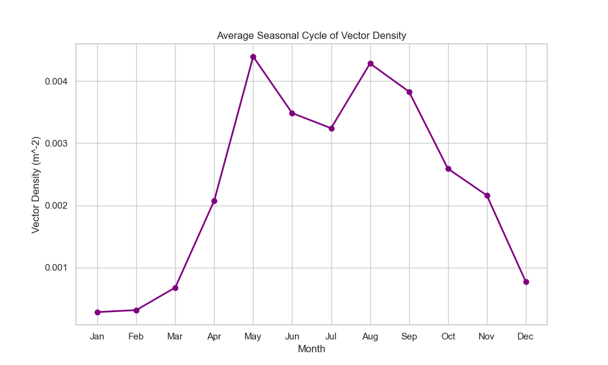
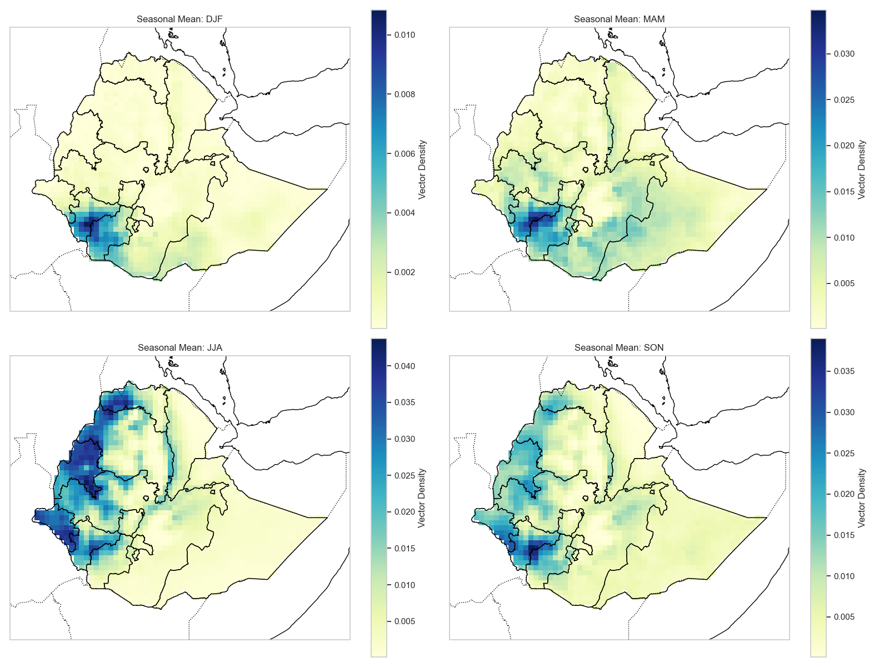
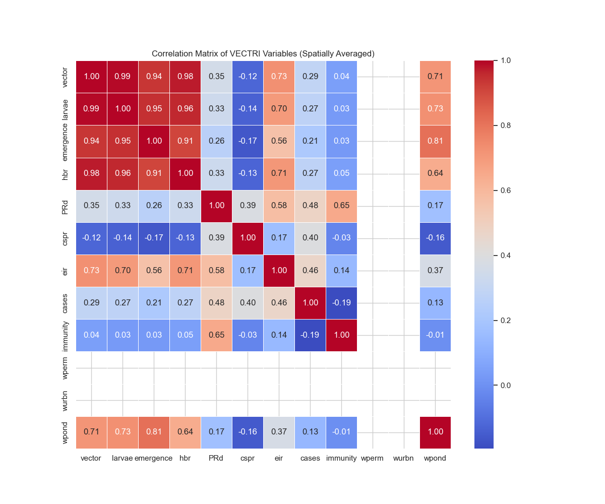

# Climate-Driven Malaria Modeling with VECTRI

**One-Week Training Workshop**

📅 December 8–12, 2025

  

    

      
      

        <h4>Spatial Patterns</h4>
        
Time-averaged mosquito density showing transmission hotspots

      

    

    

      
      

        <h4>Temporal Dynamics</h4>
        
Seasonal cycles in vector populations over time

      

    

    

      
      

        <h4>Disease Metrics</h4>
        
Entomological Inoculation Rate (EIR) distribution

      

    

    

      
      

        <h4>Seasonal Analysis</h4>
        
Average seasonal cycle of vector density

      

    

    

      
      

        <h4>Seasonal Maps</h4>
        
Transmission patterns across different seasons

      

    

    

      
      

        <h4>Variable Relationships</h4>
        
Correlations between key VECTRI variables

      

    

    
    <button class="carousel-nav prev" onclick="changeSlide(-1)">‹</button>
    <button class="carousel-nav next" onclick="changeSlide(1)">›</button>
    
    

  

  

## Overview

This training is designed to help participants understand how climate-driven malaria modeling using VECTRI can be used to enhance malaria early warning systems and support evidence-based public health interventions in Ethiopia. In particular, this training is prepared in collaboration between the **Swedish Meteorological and Hydrological Institute (SMHI)** and **Addis Ababa University (AAU)** to support participants from the **Ethiopian Meteorological Institute (EMI)**. 

It will cover both foundational concepts and hands-on practical applications using real-world data from the Amhara region. This training is financed by the **Swedish International Development Cooperation Agency (Sida)** as part of the **Water and Climate Change Services for Africa, Ethiopia (WACCA-E), phase 2** project.

---

## Workshop Details

| | |
|---|---|
| **Dates** | Monday–Friday, December 8–12, 2025 |
| **Time** | 09:00–17:00 daily (UTC+03:00, Addis Ababa) |
| **Duration** | 5 Days |
| **Format** | In-person (mix of lectures, practical exercises, and discussions) |
| **Participants** | Up to 15 participants |
| **Venue** | Elilly Hotel, Addis Ababa, Ethiopia |

---

## Target Audience

- **EMI health, hydrology and meteorology team**
- **Masters and PhD students from AAU**
- **Experts from Ethiopian Public Health Institute (EPHI)**

---

## Learning Outcomes

By the end of this training, participants will be able to:

1. Source, quality check, and preprocess ERA5/CHIRPS climate data into daily, VECTRI-ready NetCDF format (rainfall, 2-m temperature)
2. Compile and run VECTRI; interpret outputs (EIR - Entomological Inoculation Rate, HBR - Human Biting Rate, cases) and evaluate lags (EIR→cases)
3. Understand the biological basis of malaria transmission and how climate variables drive vector and parasite dynamics
4. Create environmental input files (population, soil type) for VECTRI modeling
5. Conduct spatial and temporal analysis of model outputs to identify malaria transmission hotspots and seasonal patterns

---

## Daily Structure (Quick Glance)

| Day | Theme | Lessons | Focus |
|-----|-------|---------|-------|
| **Day 1** | Foundations | 6 lessons | Theory, VECTRI introduction, model components |
| **Day 2** | Setup and Python Basics | 5 lessons | Environment setup, Linux, Python fundamentals, NumPy |
| **Day 3** | Advanced Python and Climate Data | 6 lessons | Data processing libraries, climate data access |
| **Day 4** | VECTRI Setup and Running | 5 lessons | VECTRI configuration, execution, output analysis |
| **Day 5** | Advanced Analysis | 2 lessons | Advanced visualizations, parameter sensitivity |

---

## Requirements

!!! warning "Prerequisites"
    - **Basic Python programming** skills (Pandas, NumPy, Matplotlib)
    - **Basic Linux command-line** skills
    - **Personal laptop** (Linux preferred; Windows users must have WSL2 installed)

### Software & Tools
- Python 3.8+ (Jupyter Notebooks)
- VECTRI model (compiled from source)
- Linux/Unix environment (native or WSL2)
- NetCDF utilities 

### Key Datasets

- **Climate:** 
    - Rainfall 
        - Historical: **[CHIRPS](scripts/download_chirps.py)**, **[ARC2](scripts/download_arc2.py)**, **[TAMSAT](scripts/download_tamsat.py)**
        - Near-real-time: **[NCEP-GFS](scripts/download_gfs_precip_forecast.py)**, **[ECMWF HRES](scripts/download_ecmwf-hres_precip.py)**
        - Sub-seasonal: **[ECMWF S2S](scripts/download_ecmwf-s2s-precip.py)**, **[ECMWF S2S Ensemble](scripts/download_ecmwf_s2s_precip_daily_ensemble.py)**
        - Seasonal: **[ECMWF Seasonal (C3S)](scripts/download_c3s_seasonal_precip_ensmean_daily.py)** 
        - Long-term projections: **[CHC-CMIP6](scripts/download_chc_cmip6_precip_daily.py)**, CMIP6, ISIMIP3b, Regional products (e.g. CORDEX)

    - Temperature:
        - Historical: **[CHIRTS](scripts/download_chirts.py)**, **[ERA5-Land](scripts/download_era5-land-temp.py)**, **[ERA5](scripts/download_era5-temp.py)**  
        - Near-real-time: **[NCEP-GFS](scripts/download_gfs_temp_forecast.py)**, **[ECMWF HRES](scripts/download_ecmwf-hres_temp.py)**
        - Sub-seasonal: **[ECMWF S2S](scripts/download_ecmwf-s2s-temp.py)**, **[ECMWF S2S Ensemble](scripts/download_ecmwf_s2s_temp_daily_ensemble.py)**
        - Seasonal: **[ECMWF Seasonal (C3S)](scripts/download_c3s_seasonal_temp_ensmean_daily.py)**, NCEP CFSv2, NMME
        - Long-term projections: **[CHC-CMIP6](scripts/download_chc_cmip6_temp_daily.py)**, CMIP6, ISIMIP3b, Regional products (e.g. CORDEX)

- **Population data:** 
    - **[AfriPop (WorldPop)](scripts/download_afripop_worldpop.py)** 
    - **[WorldPop Projections](scripts/download_harmonized_world_soil_database.py)**

- **Soil Type/Soil Fraction:**
    - **[Harmonized World Soil Database (HWSD)](scripts/download_harmonized_world_soil_database.py)**
  
- **Geographic:** 
    - Administrative boundaries (shapefiles) GADM/FAO GAUL

- **Malaria:** EPHI confirmed case data

--- 

## Facilitators

  

    <h3><a href="https://youtu.be/yCuJHWiX3jo?si=K3ds-ZhjMYkHkZpm&t=2" target="_blank" rel="noopener" style="color: inherit; text-decoration: none;">Dr. Addisu Gezahegn</a></h3>
    
NSF Science and Technology Center, Columbia University

  

  

    <h3>Dr. Bode Gbobaniyi</h3>
    
Swedish Meteorological and Hydrological Institute (SMHI)

  

  

    <h3>Yonas Mersha</h3>
    
International Livestock Research Institute (ILRI)

  

  
  

    <h3>Dr. Alemayehu Mengesha</h3>
    
Addis Ababa University (AAU)

  

  
  

    <h3>Dr. Natei Ermias</h3>
    
Addis Ababa University (AAU)

  

  

    <h3>Hailu Fentaw</h3>
    
Addis Ababa University (AAU)

  

  

    <h3>Fitsum Bekele</h3>
    
Addis Ababa University (AAU)

  

  
  

    <h3>Samson Warkaye</h3>
    
Addis Ababa University (AAU)

  

  

---

## Interactive Learning with Binder

Experience hands-on learning with our interactive Jupyter notebooks! No installation required - just click and start coding.

  

    <a href="https://mybinder.org/v2/gh/YonSci/vectri-mkdocs/main" target="_blank" rel="noopener" class="binder-button">
      
      Launch Interactive Environment
    </a>
    

      Includes all lessons, sample climate data, and pre-configured Python environment.
    

  

  
  

    <h4>💡 What is Binder?</h4>
    

      A free service that turns our GitHub repository into a live, interactive Jupyter environment. 
      Perfect for following along with lessons or experimenting with code!
    

  

---

## 💬 Real-Time Collaboration

Join our dedicated real-time collaborative space for Q&A, notes, and discussions during training sessions:

    <!-- https://mensuel.framapad.org/p/sd4kzsefdk-ahvu
    https://etherpad.wikimedia.org/p/zUfnxQWMHmdzQZYnDI8I -->
   <!-- https://rustpad.io/#UsvH7I -->
  <a href="https://etherpad.wikimedia.org/p/zUfnxQWMHmdzQZYnDI8I" target="_blank" rel="noopener" class="collab-button">
    🚀
    Join Training Pad
  </a>

For more collaboration options, visit our [full collaboration guide](collaboration.md).

---

## Participants List 

| No. | Name              | Department/Desk | Email                       |
|-----|-------------------|-----------------|-----------------------------|
| 1   | Tarekgn Abera     | ISOMS           | tatarish59@gmail.com        |
| 2   | Desalegn Tarekgn  | Health Met      | desalegntarekegn@gmail.com  |
| 3   | Ayalew Tassew     | HealthMet       | ayalewtasew8@gmail.com      |
| 4   | Tamirat Yohannes  | Hydromet        | yohannestamirat81@gmail.com |
| 5   | Alemu Gamini      | Hydro met       | alemugamini@gmail.com       |
| 6   | Kidus Belay       | Agromet         | kibe_302001@yahoo.com       |
| 7   | Yimer Assefa      | Agromet         | yimera649@gmail.com         |
| 8   | Gebremariam Adane | Healthmet       | gebremariamadane@gmail.com  |
| 9   | Sintayhu Tewabe   | Agomet          | santazewdu18@gmail.com      |
| 10  | Chaka Natai       | Halthmet        | chakanatae832@gmail.com     |
| 11  | Rahele Yirdaw     | MFEW            | rahelyirdaw21@gmail.com     |

---

  <h4 style="margin-bottom: 0.75rem; color: #1a237e; font-size: 1rem;">📱 Scan to Access Workshop Materials</h4>
  
  

    <a href="https://vectri-emi-smhi.netlify.app/" target="_blank" style="color: #1565c0; text-decoration: none; font-weight: 500;">
      vectri-emi-smhi.netlify.app
    </a>
  

  

    Access on mobile device
  

---

## Contact

  

    For inquiries about this workshop, please contact:
  

  

    

      
    

    

      <h3 style="margin: 0 0 0.5rem 0; color: #1a237e; font-size: 1.25rem; font-weight: 600;">
        Yonas Mersha
      </h3>
      

        <strong>Hydro-Climate Modelling and ML/AI Expert</strong> 
        International Livestock Research Institute (ILRI)
      

      

        

          <a href="mailto:yonas.mersha14@gmail.com" style="color: #1565c0; text-decoration: none; font-weight: 500; display: inline-flex; align-items: center; gap: 0.5rem;">
            📧
            yonas.mersha14@gmail.com
          </a>
        

        

          <a href="https://www.linkedin.com/in/yonas-mersha-baab561b5/" target="_blank" rel="noopener" style="color: #0077b5; text-decoration: none; font-weight: 500; display: inline-flex; align-items: center; gap: 0.4rem; font-size: 0.9rem;">
            💼
            LinkedIn
          </a>
          <a href="https://github.com/YonSci" target="_blank" rel="noopener" style="color: #333; text-decoration: none; font-weight: 500; display: inline-flex; align-items: center; gap: 0.4rem; font-size: 0.9rem;">
            💻
            GitHub
          </a>
          <a href="https://medium.com/@yonas.mersha14" target="_blank" rel="noopener" style="color: #00ab6c; text-decoration: none; font-weight: 500; display: inline-flex; align-items: center; gap: 0.4rem; font-size: 0.9rem;">
            ✍️
            Medium
          </a>
        

      

    

  

---