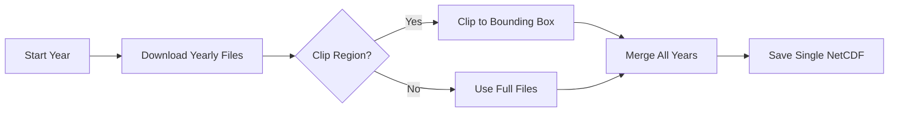

# 🌧️ CHIRPS Rainfall Data Download Tutorial

Learn how to download CHIRPS (Climate Hazards Group InfraRed Precipitation with Station data) rainfall datasets for climate and malaria modeling.

---

## 📋 Overview

This tutorial provides a complete Python script to download, clip, and merge CHIRPS daily rainfall data for any region and time period.

!!! info "CHIRPS Dataset"
    **CHIRPS v2.0** is a quasi-global (50°S–50°N) rainfall dataset combining satellite imagery with in-situ station data.
    
    - **Temporal Coverage**: 1981–present (updated every 2 weeks)
    - **Temporal Resolution**: Daily
    - **Spatial Resolution**: 0.05° (~5 km) or 0.25° (~25 km)
    - **Format**: NetCDF
    - **Best For**: High-resolution rainfall analysis in Africa

---

## 🎯 What This Script Does

The download script performs four main operations:

1. **📥 Downloads** CHIRPS yearly NetCDF files from the official repository
2. **✂️ Clips** data to your region of interest (optional)
3. **🔗 Merges** multiple years into a single NetCDF file
4. **💾 Saves** compressed output for efficient storage



---

## 🚀 Quick Start

### 1. Installation

First, install the required Python packages:

```bash
pip install requests xarray netCDF4 numpy
```

### 2. Save the Script

Create a new file called `download_chirps.py` and copy the script below into it.

### 3. Run Examples

**Download 3 years without clipping:**

```bash
python download_chirps.py --start 2018 --end 2020 --outdir data/chirps_p25
```

**Download and clip to East Africa (Ethiopia region):**

```bash
python download_chirps.py --start 2013 --end 2019 \
  --clip 15 3 33 48 \
  --outdir data/chirps_ethiopia \
  --res p05
```

**Download with custom merged filename:**

```bash
python download_chirps.py --start 2015 --end 2017 \
  --clip 15 -5 30 50 \
  --outdir data/chirps_ea \
  --merge-name chirps_east_africa.nc
```

---

## 📜 The Complete Python Script

Click the tabs below to view different sections of the script, or scroll down for the complete code.

=== "Main Script"

    This is the complete, production-ready script you can use immediately.

    ```python title="download_chirps.py" linenums="1"
    #!/usr/bin/env python3 
    # Shebang line: when this file is executed as a script (e.g., ./download_merge_chirps.py),
    # the operating system uses the `python3` interpreter found in the user's environment.

    """
    Download CHIRPS daily NetCDF (v2.0) by year range, optionally clip to a region,
    and merge all (clipped or raw) files into a single NetCDF saved in --outdir.

    This docstring explains the overall purpose of the script and gives usage examples.

    Examples
    --------
    # 1) Download 2018–2020, no clip, merge to one file (auto name in outdir)
    python download_merge_chirps.py --start 2018 --end 2020 \
    --outdir data/chirps_p25 --merge-name merged.nc

    # 2) Clip to EA box and auto-name the merged file in outdir
    python download_merge_chirps.py --start 2015 --end 2017 \
    --clip 15 -10 30 50 \
    --outdir data/chirps_p25_ea
    """
    import argparse          # Standard library module for parsing command-line arguments.
    from pathlib import Path # Path object for OS-independent file and directory paths.
    import sys, os           # sys for exiting with status codes; os is imported (not heavily used here).
    import requests          # Third-party HTTP library for making web requests to download files.

    def download_file(url: str, dest: Path, chunk=2**20):
        """
        Download a file from a given URL and save it to `dest` in chunks.

        Parameters
        ----------
        url : str
            The HTTP(S) URL to download from.
        dest : Path
            Local filesystem target path where the file should be saved.
        chunk : int
            Chunk size in bytes (default = 2**20 ≈ 1 MB) for streaming download.
        """
        dest.parent.mkdir(parents=True, exist_ok=True)
        # Ensure the directory of `dest` exists. `parents=True` creates any missing parents,
        # and `exist_ok=True` avoids errors if the directory already exists.

        tmp = dest.with_suffix(dest.suffix + ".part")
        # Create a temporary filepath with suffix ".part" so incomplete downloads
        # don't overwrite existing complete files.

        with requests.get(url, stream=True, timeout=180) as r:
            # Send a GET request to the URL.
            # `stream=True` means we will read the response in chunks (useful for large files).
            # `timeout=180` sets a 180-second timeout for the connection.

            r.raise_for_status()
            # If the server returned an HTTP error (4xx or 5xx), this raises an exception.

            with open(tmp, "wb") as f:
                # Open the temporary file in binary write mode.

                for blk in r.iter_content(chunk_size=chunk):
                    # Iterate over the response data in chunks of size `chunk`.
                    if blk:
                        # `blk` may be empty (keep-alive chunks). Only write if it has data.
                        f.write(blk)

        tmp.replace(dest)
        # Atomically rename the temporary file to the final destination.
        # This ensures we only see a complete file at `dest`.

    def build_url(year: int, res: str) -> str:
        """
        Build the CHIRPS daily NetCDF URL for a given year and spatial resolution.

        Parameters
        ----------
        year : int
            The year to download (e.g., 2018).
        res : str
            Resolution string: 'p25' for 0.25°, 'p05' for 0.05°.

        Returns
        -------
        str
            The full URL to the CHIRPS NetCDF file.
        """
        base = f"https://data.chc.ucsb.edu/products/CHIRPS-2.0/global_daily/netcdf/{res}"
        # Base URL points to the CHIRPS v2.0 global daily NetCDF folder for the chosen resolution.

        return f"{base}/chirps-v2.0.{year}.days_{res}.nc"
        # CHIRPS files follow a consistent naming pattern: chirps-v2.0.<year>.days_<res>.nc

    def standardize_for_merge(ds):
        """
        Standardize dimension names and latitude orientation for merging.

        This helper function:
        1. Renames 'latitude' → 'lat' and 'longitude' → 'lon' if needed.
        2. Flips latitude so that it runs from south to north (if necessary).

        Parameters
        ----------
        ds : xarray.Dataset
            Dataset to standardize.

        Returns
        -------
        xarray.Dataset
            Dataset with standardized coordinate names and increasing latitudes.
        """
        ren = {}
        if "latitude" in ds.dims: ren["latitude"] = "lat"
        # If the dataset has 'latitude' dimension, plan to rename it to 'lat'.

        if "longitude" in ds.dims: ren["longitude"] = "lon"
        # Similarly, if it has 'longitude', rename it to 'lon'.

        if ren:
            ds = ds.rename(ren)
            # Apply any renaming that we collected.

        try:
            lat = ds["lat"]
            # Access the latitude coordinate (after renaming).

            if lat[0] > lat[-1]:
                # If the first latitude is greater than the last, the array is descending.
                # Many tools prefer lat to go from south (minimum) to north (maximum),
                # so flip the order.
                ds = ds.reindex(lat=list(reversed(lat.values)))
        except Exception:
            # If 'lat' is missing or something goes wrong, just skip this step.
            pass

        return ds
        # Return the standardized dataset.

    def clip_box(ds, N, S, W, E):
        """
        Clip the dataset to a latitude/longitude bounding box.

        Parameters
        ----------
        ds : xarray.Dataset
            Input dataset with latitude/longitude coordinates.
        N, S, W, E : float
            North, South, West, East boundaries in degrees.

        Returns
        -------
        xarray.Dataset
            Subset of the dataset clipped to the requested box, with standardized coords.
        """
        import numpy as np
        # Local import of numpy (used for numeric operations).

        # Validate latitude bounds
        if S >= N:
            # Ensure that the southern bound is less than the northern bound.
            raise ValueError(f"Invalid latitude bounds: South ({S}) must be less than North ({N})")
        
        # Work with original coordinate names first
        lat_name = "latitude" if "latitude" in ds.dims else "lat"
        lon_name = "longitude" if "longitude" in ds.dims else "lon"
        # Detect whether the dataset uses 'latitude'/'longitude' or 'lat'/'lon'.

        lat = ds[lat_name].values
        lon = ds[lon_name].values
        # Extract the latitude and longitude coordinate arrays as NumPy arrays.

        # For xarray.sel(), we need to provide bounds in the correct order
        # CHIRPS latitude goes from south to north (-49.875 to 49.875)
        # So we select from S (southern bound) to N (northern bound)
        lat_slice = slice(S, N)
        # slice(S, N) means "from S up to N" in increasing latitude.

        lon_min, lon_max = float(lon.min()), float(lon.max())
        W2, E2 = W, E
        # Store the global min/max longitude values and initially copy W, E to W2, E2.

        # Handle longitude wrapping if needed (CHIRPS uses -180 to 180)
        if lon_min >= 0 and W < 0:
            # If the dataset longitudes are non-negative (0..360) but the requested
            # West/East are in -180..180, we convert W, E into 0..360 range.
            W2 = (W + 360) % 360
            E2 = (E + 360) % 360
        
        # Create selection dictionary
        sel_dict = {lat_name: lat_slice}
        # Prepare selection for latitude only; we'll add longitude later.

        if W2 <= E2:
            # Simple case: no wrapping across the 180°/0° boundary.
            sel_dict[lon_name] = slice(W2, E2)
            # Add a straightforward longitude slice: W2 → E2.

            ds_sub = ds.sel(sel_dict)
            # Clip the dataset using .sel() with the selection dictionary.
        else:
            # Handle longitude wrapping case
            # This occurs when W2 > E2, e.g. selecting a region that crosses the dateline.

            left_dict = {lat_name: lat_slice, lon_name: slice(W2, lon_max)}
            right_dict = {lat_name: lat_slice, lon_name: slice(lon_min, E2)}
            # Create two bounding boxes:
            # left: from W2 to maximum longitude,
            # right: from minimum longitude to E2.

            left = ds.sel(left_dict)
            right = ds.sel(right_dict)
            # Select each region separately.

            ds_sub = type(ds).concat([left, right], dim=lon_name)
            # Concatenate the two pieces along the longitude dimension.

        # Now standardize for merge
        ds_sub = standardize_for_merge(ds_sub)
        # Apply coordinate standardization (lat/lon names & orientation).

        return ds_sub
        # Return the clipped and standardized dataset.

    def merge_to_netcdf(nc_paths, out_path: Path):
        """
        Merge multiple NetCDF files (by coordinates) into one output file.

        Parameters
        ----------
        nc_paths : list of Path
            List of paths to input NetCDF files.
        out_path : Path
            Output path for merged NetCDF file.
        """
        import xarray as xr
        # Local import of xarray (used for NetCDF manipulation).

        if not nc_paths:
            # If the list of input files is empty, this is an error.
            raise ValueError("No input files found to merge.")

        print(f"[merge] {len(nc_paths)} files -> {out_path.name}")
        # Informative message: how many files are being merged into which output file.

        ds = xr.open_mfdataset(
            [str(p) for p in nc_paths],  # Convert Path objects to strings.
            combine="by_coords",        # Merge along matching dimension coordinates.
            preprocess=standardize_for_merge,  # Apply standardization to each dataset.
            parallel=False,             # Parallel=False for simple, deterministic behavior.
        )

        data_vars = list(ds.data_vars)
        # Collect data variables present in the merged Dataset.

        if not data_vars:
            # If there are no data variables, merging produced an empty dataset.
            raise ValueError("No data variables in opened datasets.")

        enc = {v: {"zlib": True, "complevel": 3} for v in data_vars}
        # Build an encoding dictionary: enable zlib compression with compression level 3
        # for each data variable when writing to NetCDF.

        out_path.parent.mkdir(parents=True, exist_ok=True)
        # Ensure that the directory for the output file exists.

        ds.to_netcdf(out_path, encoding=enc)
        # Write the merged dataset to disk with the chosen compression.

        print("[ok] merged saved:", out_path)
        # Informative message that merge was successful.

    def main():
        """
        Main function that parses arguments, downloads yearly files,
        optionally clips them, and merges them into one NetCDF.
        """
        ap = argparse.ArgumentParser(
            description="Download CHIRPS daily v2.0 by year range; optional clip & merge (merged saved in --outdir)."
        )
        # Create an ArgumentParser with a short description of what the script does.

        ap.add_argument("--start", type=int, required=True, help="Start year (e.g., 2018)")
        # Required argument: starting year for the download.

        ap.add_argument("--end", type=int, required=True, help="End year (inclusive, e.g., 2020)")
        # Required argument: ending year (inclusive).

        ap.add_argument("--outdir", default="chirps_downloads",
                        help="Directory to save yearly and merged files")
        # Optional: output directory for individual and merged NetCDF files.

        ap.add_argument("--res", choices=["p25","p05"], default="p25",
                        help="Spatial resolution: p25=0.25°, p05=0.05°")
        # Optional: CHIRPS spatial resolution. Defaults to 0.25° (p25).

        ap.add_argument("--clip", nargs=4, type=float, metavar=("N","S","W","E"),
                        help="Optional clip box (degrees): North South West East")
        # Optional: bounding box for clipping (N, S, W, E). If provided, files are clipped.

        ap.add_argument("--merge-name", type=str, default=None,
                        help="Merged filename (no path). If omitted, an automatic name is used.")
        # Optional: explicit name for the merged file. If not given, a name is auto-generated.

        ap.add_argument("--overwrite", action="store_true",
                        help="Overwrite existing yearly files")
        # Optional flag: if set, existing files will be overwritten.

        args = ap.parse_args()
        # Parse arguments from the command line into the `args` namespace.

        years = list(range(args.start, args.end + 1))
        # Create a list of all years from start to end, inclusive.

        outdir = Path(args.outdir)
        # Convert outdir string to a Path object for easier path manipulation.

        outdir.mkdir(parents=True, exist_ok=True)
        # Make sure output directory exists.

        downloaded = []
        # List to store paths to downloaded yearly NetCDF files.

        clipped = []
        # List to store paths to clipped NetCDF files (if clipping is requested).

        for y in years:
            # Loop over each year that needs to be downloaded and processed.

            url = build_url(y, args.res)
            # Build the CHIRPS URL for this year and resolution.

            raw_nc = outdir / f"chirps-v2.0.{y}.days_{args.res}.nc"
            # Define the local file path where this year's NetCDF will be saved.

            if not raw_nc.exists() or args.overwrite:
                # If the file doesn't exist, or if overwrite is requested, download it.

                print(f"[GET]  {url}")
                # Log that we are performing a GET request.

                try:
                    download_file(url, raw_nc)
                    # Download the file and save it to raw_nc.

                    print(f"[ok ]  saved {raw_nc}")
                    # Log success.
                except Exception as e:
                    # If anything goes wrong in download_file, catch the exception.

                    print(f"[ERR]  download failed for {y}: {e}")
                    # Log the error and continue to the next year.

                    continue
            else:
                # If the file already exists and overwrite is not set, skip downloading.

                print(f"[skip] {raw_nc} exists")

            downloaded.append(raw_nc)
            # Record this year's NetCDF file path (whether newly downloaded or existing).

            if args.clip:
                # If the user has requested clipping, process this file.

                N, S, W, E = args.clip
                # Unpack the clip bounds: North, South, West, East.

                out_clip = raw_nc.with_name(raw_nc.stem + "_clip.nc")
                # Build the path for the clipped file by appending "_clip" before the .nc suffix.

                if not out_clip.exists() or args.overwrite:
                    # If the clipped file does not exist, or overwrite is requested, clip it.

                    try:
                        import xarray as xr
                        # Import xarray locally to read/write the NetCDF file.

                        ds = xr.open_dataset(raw_nc)
                        # Open the yearly NetCDF as an xarray Dataset.

                        ds_sub = clip_box(ds, N, S, W, E)
                        # Clip the dataset to the bounding box and standardize coordinates.

                        enc = {v: {"zlib": True, "complevel": 3} for v in ds_sub.data_vars}
                        # Prepare encoding with compression for all data variables.

                        ds_sub.to_netcdf(out_clip, encoding=enc)
                        # Save the clipped dataset to out_clip.

                        print(f"[ok ]  clipped → {out_clip}")
                        # Log that clipping succeeded.

                    except Exception as e:
                        # Catch any exceptions while clipping this file.

                        print(f"[warn] clip failed for {y} ({e}); skipping clip")
                        # Warn and move on without adding a clipped file for this year.
                else:
                    # If a clipped file already exists and overwrite is not set, skip clipping.

                    print(f"[skip] {out_clip} exists")

                if out_clip.exists():
                    # If the clipped file exists (either newly created or existing), record it.

                    clipped.append(out_clip)

        # Make merged filename inside outdir
        if args.merge_name:
            merge_name = Path(args.merge_name).name  # drop any directory parts
            # If the user specified a custom merged filename, use its last path component only.
        else:
            suffix = "_clip" if args.clip else ""
            # If clipping was used, append "_clip" to the merged filename.

            merge_name = f"chirps_{args.res}_{years[0]}-{years[-1]}{suffix}.nc"
            # Auto-generate a name like "chirps_p25_2015-2017_clip.nc"
            # that encodes resolution, year range, and whether it was clipped.

        target = outdir / merge_name
        # Full path to the merged NetCDF file.

        # Merge if we have files
        to_merge = clipped if args.clip else downloaded
        # Decide which list to merge:
        # - clipped files if clipping was requested,
        # - raw downloaded files otherwise.

        to_merge = [p for p in to_merge if p.exists()]
        # Filter out any paths that do not exist (safety check).

        if to_merge:
            # If we have at least one file to merge:

            try:
                merge_to_netcdf(to_merge, target)
                # Merge all files into the target NetCDF.

            except Exception as e:
                # If merging fails, log an error and exit with non-zero status.

                print(f"[ERR] merge failed: {e}")
                sys.exit(2)
        else:
            # If there were no files to merge, warn the user.

            print("[warn] nothing to merge (no downloaded or clipped files).")

    if __name__ == "__main__":
        # Standard Python idiom to only run main() when the script is executed
        # directly (not when it is imported as a module).

        main()
        # Call the main() function to start the script.
    ```

=== "Key Functions Explained"

    ### 📥 Download Function
    
    ```python
    def download_file(url: str, dest: Path, chunk=2**20):
        """Downloads file in chunks with atomic write."""
        dest.parent.mkdir(parents=True, exist_ok=True)
        tmp = dest.with_suffix(dest.suffix + ".part")
        
        with requests.get(url, stream=True, timeout=180) as r:
            r.raise_for_status()
            with open(tmp, "wb") as f:
                for blk in r.iter_content(chunk_size=chunk):
                    if blk:
                        f.write(blk)
        
        tmp.replace(dest)  # Atomic rename
    ```
    
    **Features:**
    
    - Streams large files (doesn't load all into memory)
    - Uses temporary `.part` file during download
    - Atomic rename ensures complete files only
    - 180-second timeout for slow connections
    
    ---
    
    ### 🔗 URL Builder
    
    ```python
    def build_url(year: int, res: str) -> str:
        """Constructs CHIRPS URL for year and resolution."""
        base = f"https://data.chc.ucsb.edu/products/CHIRPS-2.0/global_daily/netcdf/{res}"
        return f"{base}/chirps-v2.0.{year}.days_{res}.nc"
    ```
    
    **Example URLs:**
    
    - 0.25°: `...netcdf/p25/chirps-v2.0.2018.days_p25.nc`
    - 0.05°: `...netcdf/p05/chirps-v2.0.2018.days_p05.nc`
    
    ---
    
    ### ✂️ Clipping Function
    
    ```python
    def clip_box(ds, N, S, W, E):
        """Clips dataset to bounding box [N, S, W, E]."""
        # Handles:
        # - Coordinate name variations (lat/latitude)
        # - Longitude wrapping (dateline crossing)
        # - Standardization for merging
    ```
    
    **Bounding Box Format:**
    
    - **N** = Northern latitude (e.g., 15°N)
    - **S** = Southern latitude (e.g., 3°N)
    - **W** = Western longitude (e.g., 33°E)
    - **E** = Eastern longitude (e.g., 48°E)
    
    ---
    
    ### 🔗 Merge Function
    
    ```python
    def merge_to_netcdf(nc_paths, out_path: Path):
        """Merges multiple years into single NetCDF."""
        ds = xr.open_mfdataset(
            nc_paths,
            combine="by_coords",      # Merge along time
            preprocess=standardize_for_merge,
            parallel=False,
        )
        
        # Compress output (zlib level 3)
        enc = {v: {"zlib": True, "complevel": 3} for v in ds.data_vars}
        ds.to_netcdf(out_path, encoding=enc)
    ```
    
    **Benefits:**
    
    - Concatenates along time dimension automatically
    - Compresses output (smaller file size)
    - Standardizes coordinates across years

=== "Command-Line Arguments"

    The script accepts several command-line arguments:
    
    | Argument | Required | Description | Example |
    |----------|----------|-------------|---------|
    | `--start` | ✅ | Starting year | `--start 2018` |
    | `--end` | ✅ | Ending year (inclusive) | `--end 2020` |
    | `--outdir` | ❌ | Output directory | `--outdir data/chirps` |
    | `--res` | ❌ | Resolution (p25 or p05) | `--res p05` |
    | `--clip` | ❌ | Bounding box [N S W E] | `--clip 15 3 33 48` |
    | `--merge-name` | ❌ | Custom merged filename | `--merge-name ethiopia.nc` |
    | `--overwrite` | ❌ | Overwrite existing files | `--overwrite` |
    
    **Default Values:**
    
    - `outdir`: `"chirps_downloads"`
    - `res`: `"p25"` (0.25° resolution)
    - `merge-name`: Auto-generated (e.g., `chirps_p25_2018-2020.nc`)

---

## 📍 Regional Bounding Boxes

Use these bounding boxes for common regions:

=== "Ethiopia"

    ```bash
    --clip 15 3 33 48
    ```
    
    - North: 15°N
    - South: 3°N
    - West: 33°E
    - East: 48°E

=== "Amhara Region"

    ```bash
    --clip 13.5 9.0 36.0 40.5
    ```
    
    - North: 13.5°N
    - South: 9.0°N
    - West: 36.0°E
    - East: 40.5°E

=== "East Africa"

    ```bash
    --clip 15 -12 28 52
    ```
    
    - North: 15°N
    - South: 12°S
    - West: 28°E
    - East: 52°E

=== "Greater Horn of Africa"

    ```bash
    --clip 20 -15 20 55
    ```
    
    - North: 20°N
    - South: 15°S
    - West: 20°E
    - East: 55°E

---

## 💡 Usage Examples

### Example 1: Amhara Region (2013-2019) - High Resolution

Download high-resolution (0.05°) CHIRPS data for the Amhara case study:

```bash
python download_chirps.py \
  --start 2013 \
  --end 2019 \
  --res p05 \
  --clip 13.5 9.0 36.0 40.5 \
  --outdir data/chirps_amhara \
  --merge-name chirps_amhara_2013-2019.nc
```

**Output:**

- Individual years: `data/chirps_amhara/chirps-v2.0.2013.days_p05_clip.nc`, etc.
- Merged file: `data/chirps_amhara/chirps_amhara_2013-2019.nc`

---

### Example 2: Ethiopia - Multiple Resolutions

Download both resolutions for comparison:

```bash
# 0.25° resolution (faster download)
python download_chirps.py \
  --start 2015 \
  --end 2020 \
  --res p25 \
  --clip 15 3 33 48 \
  --outdir data/chirps_ethiopia_p25

# 0.05° resolution (higher detail)
python download_chirps.py \
  --start 2015 \
  --end 2020 \
  --res p05 \
  --clip 15 3 33 48 \
  --outdir data/chirps_ethiopia_p05
```

---

### Example 3: Global Data (No Clipping)

Download global CHIRPS without clipping:

```bash
python download_chirps.py \
  --start 2018 \
  --end 2020 \
  --res p25 \
  --outdir data/chirps_global
```

**Note:** Global files are large (~1.5 GB per year at 0.25°, ~8 GB at 0.05°)

---

## 🔍 Understanding the Output

### File Structure

After running the script, you'll have:

```
data/chirps_amhara/
├── chirps-v2.0.2013.days_p05.nc           # Raw yearly file
├── chirps-v2.0.2013.days_p05_clip.nc      # Clipped yearly file
├── chirps-v2.0.2014.days_p05.nc
├── chirps-v2.0.2014.days_p05_clip.nc
├── ...
└── chirps_amhara_2013-2019.nc             # Merged file (use this!)
```

### NetCDF Structure

Open the merged file to inspect:

```python
import xarray as xr

ds = xr.open_dataset("data/chirps_amhara/chirps_amhara_2013-2019.nc")
print(ds)
```

**Expected Structure:**

```
<xarray.Dataset>
Dimensions:  (time: 2557, lat: 47, lon: 46)
Coordinates:
  * time     (time) datetime64[ns] 2013-01-01 ... 2019-12-31
  * lat      (lat) float32 9.025 9.075 9.125 ... 13.375 13.425 13.475
  * lon      (lon) float32 36.025 36.075 ... 40.425 40.475
Data variables:
    precip   (time, lat, lon) float32 ...
Attributes:
    ...
```

---

## 🎓 Advanced Usage

### Processing After Download

Once you have the merged NetCDF, you can:

**1. Calculate Monthly Totals:**

```python
import xarray as xr

ds = xr.open_dataset("chirps_amhara_2013-2019.nc")
monthly = ds.resample(time="MS").sum()
monthly.to_netcdf("chirps_amhara_monthly.nc")
```

**2. Extract Specific Location:**

```python
# Extract time series for Addis Ababa (9.03°N, 38.74°E)
point = ds.sel(lat=9.03, lon=38.74, method="nearest")
precip_ts = point["precip"].values
```

**3. Calculate Seasonal Means:**

```python
# Kiremt season (June-September)
kiremt = ds.sel(time=ds.time.dt.month.isin([6, 7, 8, 9]))
kiremt_mean = kiremt.groupby("time.year").sum("time")
```

---

## ⚠️ Troubleshooting

### Common Issues and Solutions

!!! warning "Download Timeout"
    **Problem:** `requests.exceptions.Timeout`
    
    **Solution:**
    
    - Check your internet connection
    - Try again later (server may be busy)
    - Increase timeout: modify `timeout=180` to `timeout=300`

!!! warning "Out of Memory"
    **Problem:** Script crashes with memory error
    
    **Solution:**
    
    - Use lower resolution (`--res p25` instead of `p05`)
    - Clip to smaller region
    - Download fewer years at once
    - Close other applications

!!! warning "File Already Exists"
    **Problem:** Script skips downloading existing files
    
    **Solution:**
    
    - Use `--overwrite` flag to force re-download
    - Or manually delete old files

!!! warning "Invalid Bounding Box"
    **Problem:** `ValueError: Invalid latitude bounds`
    
    **Solution:**
    
    - Ensure South < North
    - Check coordinates are in valid range:
        - Latitude: -50 to 50 (CHIRPS coverage)
        - Longitude: -180 to 180

---

## 📊 Data Quality Notes

!!! info "CHIRPS Data Quality"
    
    **Strengths:**
    
    - High spatial resolution (0.05°)
    - Long temporal record (1981–present)
    - Blends satellite and station data
    - Regular updates (every 2 weeks)
    - Quasi-global coverage
    
    **Limitations:**
    
    - 2-week lag for final product
    - Station density varies by region
    - Better over land than ocean
    - May underestimate extreme events
    
    **Recommended For:**
    
    - Climate analysis and trends
    - Model forcing (e.g., VECTRI)
    - Drought monitoring
    - Agricultural applications

---

## 🔗 Additional Resources

- **CHIRPS Homepage**: [https://www.chc.ucsb.edu/data/chirps](https://www.chc.ucsb.edu/data/chirps)
- **CHIRPS Documentation**: [Technical Documentation](https://data.chc.ucsb.edu/products/CHIRPS-2.0/README-CHIRPS.txt)
- **Data Portal**: [https://data.chc.ucsb.edu/products/CHIRPS-2.0/](https://data.chc.ucsb.edu/products/CHIRPS-2.0/)
- **Publication**: Funk et al. (2015), Scientific Data
- **Xarray Documentation**: [https://docs.xarray.dev/](https://docs.xarray.dev/)

---

## 📞 Support

Need help with the download script?

- **Workshop Support**: [yonas.mersha14@gmail.com](mailto:yonas.mersha14@gmail.com)
- **CHIRPS Support**: [chc@ucsb.edu](mailto:chc@ucsb.edu)
- **Technical Issues**: Check the [GitHub Issues](https://github.com/YonSci/vectri-mkdocs/issues)

---

## 🎯 Next Steps

After downloading CHIRPS data:

1. **Quality Check**: Inspect the NetCDF file with `xarray`
2. **Visualization**: Plot spatial and temporal patterns
3. **Integration**: Combine with temperature data (ERA5)
4. **VECTRI Setup**: Prepare climate forcing files

[← Back to Data Access](../../day3/09-climate_data_access_and_extraction.md){ .md-button }
[Continue to ERA5 Download →](#){ .md-button .md-button--primary }
