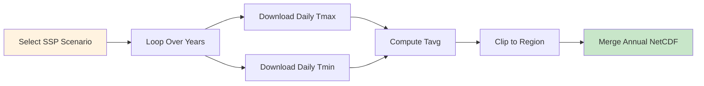
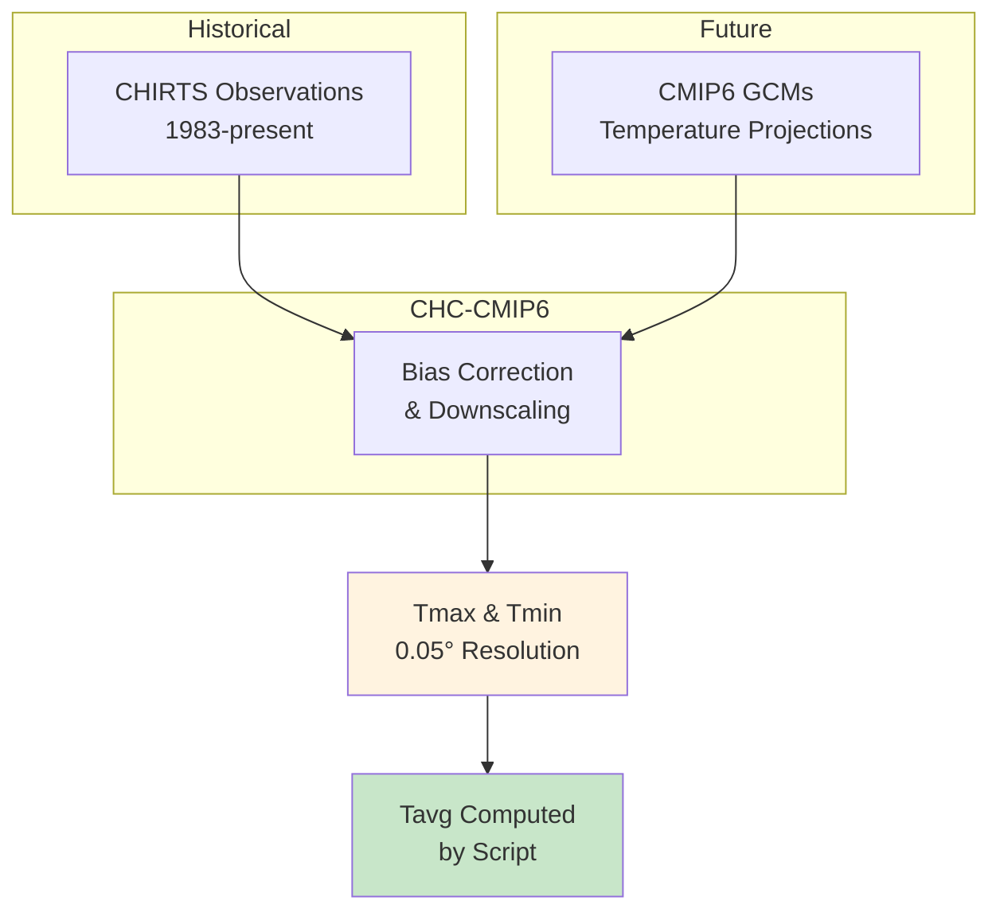

# 🌡️ Downloading CHC-CMIP6 Daily Temperature

## Overview

**CHC-CMIP6** provides climate change-adjusted daily temperature data (Tmax & Tmin) based on CHIRTS observations and CMIP6 model projections. This dataset is ideal for studying future temperature scenarios and their impacts on health, agriculture, and ecosystems.

<div class="grid cards" markdown>

-   :material-thermometer: **Dataset**
    
    ---
    
    CHC-CMIP6 Daily Temperature
    
    **Variables:** Tmax, Tmin, Tavg  
    **Resolution:** 0.05° (~5 km)  
    **Coverage:** Africa & global tropics  
    **Format:** GeoTIFF → NetCDF

-   :material-chart-timeline-variant: **Scenarios**
    
    ---
    
    **SSP245:** Middle of the road  
    **SSP585:** High emissions  
    **Periods:** 2030, 2050, 2070  
    **Baseline:** Historical CHIRTS

-   :material-calendar-range: **Temporal**
    
    ---
    
    **Range:** 1983–present  
    **Frequency:** Daily  
    **Units:** °C  
    **Structure:** Separate Tmax/Tmin files

-   :material-download: **Access**
    
    ---
    
    **Source:** CHC Data Portal  
    **Method:** HTTP download  
    **Auth:** None required  
    **Size:** ~100 MB/year (Ethiopia)

</div>

---

## 🎯 What This Script Does



The script performs the following operations:

1. **Downloads** daily Tmax and Tmin GeoTIFF files
2. **Computes** daily average temperature: `Tavg = (Tmax + Tmin) / 2`
3. **Clips** each file to your region of interest
4. **Standardizes** variable names and units (°C)
5. **Merges** daily files into annual NetCDF
6. **Cleans up** temporary files automatically

---

## 🌡️ Understanding CHC-CMIP6 Temperature

### What Variables Are Available?

| Variable | Description | Calculation |
|----------|-------------|-------------|
| **Tmax** | Daily maximum 2m temperature | Direct from data |
| **Tmin** | Daily minimum 2m temperature | Direct from data |
| **Tavg** | Daily average 2m temperature | `(Tmax + Tmin) / 2` |

### Temperature Data Flow



### Why Temperature Matters for Malaria

!!! info "Temperature and Malaria Transmission"
    Temperature is critical for malaria modeling:
    
    - **Mosquito development:** Faster at warmer temperatures
    - **Parasite development:** Temperature-dependent sporogonic cycle
    - **Survival:** Extreme heat/cold affects mosquito survival
    - **Biting rate:** Temperature-dependent behavior
    
    VECTRI uses daily temperature to drive these processes.

---

## 🚀 Quick Start Guide

### Prerequisites

!!! info "Required Python Packages"
    ```bash
    pip install requests xarray rioxarray netCDF4 numpy
    ```

### Basic Usage

=== "All Variables (Tmax, Tmin, Tavg)"
    ```bash
    python download_chc_cmip6_temp_daily.py \
        --period-tags 2030_SSP245 \
        --start-year 1983 --end-year 1984 \
        --outdir data/CHC_CMIP6 \
        --lat-min 3 --lat-max 15 \
        --lon-min 33 --lon-max 48
    ```

=== "Only Tavg (Smaller Files)"
    ```bash
    python download_chc_cmip6_temp_daily.py \
        --period-tags 2030_SSP245 \
        --start-year 1983 --end-year 1984 \
        --outdir data/CHC_CMIP6 \
        --lat-min 3 --lat-max 15 \
        --lon-min 33 --lon-max 48 \
        --tavg-only
    ```

=== "Multiple Scenarios"
    ```bash
    python download_chc_cmip6_temp_daily.py \
        --period-tags 2030_SSP245 2030_SSP585 2050_SSP245 2050_SSP585 \
        --start-year 1983 --end-year 2020 \
        --outdir data/CHC_CMIP6 \
        --lat-min 3 --lat-max 15 \
        --lon-min 33 --lon-max 48
    ```

---

## 📋 The Complete Script

### Python Download Script

Save this as `download_chc_cmip6_temp_daily.py`:

```python
#!/usr/bin/env python
"""
Download CHC-CMIP6 daily temperature GeoTIFFs (Tmax & Tmin),
clip to a bounding box, convert to NetCDF, and compute
daily average temperature:

    tavg = (tmax + tmin) / 2

Expected CHC-CMIP6 structure:
  https://data.chc.ucsb.edu/products/CHC_CMIP6/<period_tag>/<Tmax|Tmin>/<year>/
Files:
  <period_tag>.Tmax.YYYY.MM.DD.tif
  <period_tag>.Tmin.YYYY.MM.DD.tif

Outputs:
  One NetCDF per year per period tag with dims (time, lat, lon)
  Variables:
    - tmax (degC)
    - tmin (degC)
    - tavg (degC)  [computed]

Examples
--------
# Save tmax, tmin, and tavg
python download_chc_cmip6_temp_daily.py \
  --period-tags 2030_SSP245 2030_SSP585 \
  --start-year 1983 --end-year 1984 \
  --outdir data/CHC_CMIP6 \
  --lat-min 3 --lat-max 15 --lon-min 33 --lon-max 48

# Save ONLY tavg
python download_chc_cmip6_temp_daily.py \
  --period-tags 2030_SSP245 \
  --start-year 1983 --end-year 1983 \
  --outdir data/CHC_CMIP6 \
  --lat-min 3 --lat-max 15 --lon-min 33 --lon-max 48 \
  --tavg-only

Notes
-----
- CHC/CHIRTS temperature is typically in degC.
  A small heuristic is included: if values look like Kelvin (>100),
  they are converted to degC.
- The script skips a day if either Tmax or Tmin is missing.
"""

import argparse
import calendar
import os
import time
from pathlib import Path
from typing import Iterable, Tuple, List, Optional

import numpy as np
import requests
import rioxarray
import xarray as xr

BASE_URL = "https://data.chc.ucsb.edu/products/CHC_CMIP6"


# -----------------------------------------------------------------------------#
# Utilities
# -----------------------------------------------------------------------------#

def iter_dates(year: int) -> Iterable[Tuple[int, int, int]]:
    """Yield (year, month, day) for every day in a given year."""
    for month in range(1, 13):
        ndays = calendar.monthrange(year, month)[1]
        for day in range(1, ndays + 1):
            yield year, month, day


def log(msg: str) -> None:
    """Print info message."""
    print(f"[info] {msg}")


def warn(msg: str) -> None:
    """Print warning message."""
    print(f"[warn] {msg}")


def download_file(url: str, dest_path: str, max_retries: int = 5, verbose: bool = False) -> bool:
    """
    Download file from URL to dest_path with retry logic.
    
    Returns True on success, False otherwise.
    """
    for attempt in range(1, max_retries + 1):
        try:
            r = requests.get(url, stream=True, timeout=60)
            if r.status_code == 200:
                with open(dest_path, "wb") as f:
                    for chunk in r.iter_content(1024 * 1024):
                        if chunk:
                            f.write(chunk)
                if verbose:
                    print(f"[ok] Downloaded {os.path.basename(dest_path)}")
                return True
            else:
                if verbose:
                    warn(f"HTTP {r.status_code} for {url}")
        except Exception as exc:
            if verbose:
                warn(f"Failed to download {url}: {exc}")

        if attempt < max_retries:
            sleep_s = min(10 * attempt, 60)
            time.sleep(sleep_s)

    return False


def subset_bbox(
    da: xr.DataArray,
    lat_min: float,
    lat_max: float,
    lon_min: float,
    lon_max: float,
) -> xr.DataArray:
    """
    Subset DataArray to bounding box.
    
    Handles both ascending and descending latitude.
    """
    da = da.rio.write_crs("EPSG:4326", inplace=True)

    # Handle y ascending/descending
    y0 = float(da.y.values[0])
    y1 = float(da.y.values[-1])
    if y0 > y1:
        lat_slice = slice(lat_max, lat_min)
    else:
        lat_slice = slice(lat_min, lat_max)

    return da.sel(y=lat_slice, x=slice(lon_min, lon_max))


def rename_xy_to_latlon(da: xr.DataArray) -> xr.DataArray:
    """Rename raster dims/coords from x/y to lon/lat."""
    rename_dims = {}
    if "x" in da.dims:
        rename_dims["x"] = "lon"
    if "y" in da.dims:
        rename_dims["y"] = "lat"
    if rename_dims:
        da = da.rename(rename_dims)

    rename_coords = {}
    if "x" in da.coords:
        rename_coords["x"] = "lon"
    if "y" in da.coords:
        rename_coords["y"] = "lat"
    if rename_coords:
        da = da.rename(rename_coords)

    return da


def maybe_kelvin_to_celsius(da: xr.DataArray) -> xr.DataArray:
    """
    Heuristic unit fix: if values look like Kelvin (>100), convert to °C.
    """
    try:
        vmax = float(da.max().values)
        # Daily air temperature in degC should never exceed ~70 realistically.
        if vmax > 100:
            da = da - 273.15
            log("Converted temperature from Kelvin to Celsius")
    except Exception:
        pass
    return da


def standardize_temp_da(da: xr.DataArray, name: str) -> xr.DataArray:
    """
    Standardize temperature variable name and metadata.
    
    Parameters
    ----------
    da : xr.DataArray
        Temperature data
    name : str
        Variable name: "tmax", "tmin", or "tavg"
    """
    da = maybe_kelvin_to_celsius(da)
    da.name = name
    da.attrs["units"] = "degC"
    da.attrs["standard_name"] = "air_temperature"
    
    if name == "tmax":
        da.attrs["long_name"] = "Daily maximum 2m air temperature"
    elif name == "tmin":
        da.attrs["long_name"] = "Daily minimum 2m air temperature"
    elif name == "tavg":
        da.attrs["long_name"] = "Daily average 2m air temperature"
        da.attrs["description"] = "Computed as (tmax + tmin) / 2"
    else:
        da.attrs["long_name"] = "Daily temperature"
    
    return da


def combine_and_save_year(
    tmax_list: List[xr.DataArray],
    tmin_list: List[xr.DataArray],
    tavg_list: List[xr.DataArray],
    out_path: Path,
    tavg_only: bool = False,
    period_tag: str = "",
):
    """
    Combine daily DataArrays into a single NetCDF for the year.
    
    Parameters
    ----------
    tmax_list : list
        List of daily Tmax DataArrays
    tmin_list : list
        List of daily Tmin DataArrays
    tavg_list : list
        List of daily Tavg DataArrays
    out_path : Path
        Output NetCDF path
    tavg_only : bool
        If True, only save Tavg (smaller file)
    period_tag : str
        Scenario name for metadata
    """
    if not tavg_list:
        warn(f"No daily data to save for {out_path.name}")
        return

    tavg = xr.concat(tavg_list, dim="time").sortby("time")

    if tavg_only:
        ds = tavg.to_dataset(name="tavg")
        varnames = ["tavg"]
    else:
        tmax = xr.concat(tmax_list, dim="time").sortby("time")
        tmin = xr.concat(tmin_list, dim="time").sortby("time")

        # Align defensively
        tmax, tmin, tavg = xr.align(tmax, tmin, tavg, join="exact")

        ds = xr.Dataset({"tmax": tmax, "tmin": tmin, "tavg": tavg})
        varnames = ["tmax", "tmin", "tavg"]

    # Add global attributes
    ds.attrs["title"] = "CHC-CMIP6 Daily Temperature"
    ds.attrs["source"] = "Climate Hazards Center, UC Santa Barbara"
    ds.attrs["institution"] = "CHC-UCSB"
    ds.attrs["scenario"] = period_tag
    ds.attrs["references"] = "https://data.chc.ucsb.edu/products/CHC_CMIP6"
    ds.attrs["history"] = "Downloaded and processed with download_chc_cmip6_temp_daily.py"

    # Compression encoding
    encoding = {
        v: {"zlib": True, "complevel": 4, "dtype": "float32"}
        for v in varnames
    }

    out_path.parent.mkdir(parents=True, exist_ok=True)
    ds.to_netcdf(out_path, encoding=encoding)
    print(f"[ok] Saved NetCDF → {out_path}")


# -----------------------------------------------------------------------------#
# Core processing
# -----------------------------------------------------------------------------#

def process_period(
    period_tag: str,
    start_year: int,
    end_year: int,
    outdir: Path,
    lat_min: float,
    lat_max: float,
    lon_min: float,
    lon_max: float,
    tavg_only: bool = False,
    verbose: bool = False,
):
    """
    Download + process CHC-CMIP6 daily Tmax/Tmin for one period tag
    and write one NetCDF per year including tavg.
    """
    tmp_root = outdir / "_tmp_chc_cmip6_temp"
    tmp_root.mkdir(parents=True, exist_ok=True)

    for year in range(start_year, end_year + 1):
        print(f"\n{'='*60}")
        log(f"Processing {period_tag} temperature {year}")
        print(f"{'='*60}")

        tmax_list: List[xr.DataArray] = []
        tmin_list: List[xr.DataArray] = []
        tavg_list: List[xr.DataArray] = []

        success_count = 0
        fail_count = 0

        tmax_year_url = f"{BASE_URL}/{period_tag}/Tmax/{year}"
        tmin_year_url = f"{BASE_URL}/{period_tag}/Tmin/{year}"

        for y, m, d in iter_dates(year):
            fname_max = f"{period_tag}.Tmax.{y}.{m:02d}.{d:02d}.tif"
            fname_min = f"{period_tag}.Tmin.{y}.{m:02d}.{d:02d}.tif"

            url_max = f"{tmax_year_url}/{fname_max}"
            url_min = f"{tmin_year_url}/{fname_min}"

            tmp_max = tmp_root / fname_max
            tmp_min = tmp_root / fname_min

            # Download both files
            ok_max = download_file(url_max, str(tmp_max), verbose=verbose)
            ok_min = download_file(url_min, str(tmp_min), verbose=verbose)

            if not (ok_max and ok_min):
                # Clean any partial download
                for p in (tmp_max, tmp_min):
                    if p.exists():
                        try:
                            p.unlink()
                        except Exception:
                            pass
                fail_count += 1
                continue

            try:
                # Open GeoTIFFs
                da_max = rioxarray.open_rasterio(tmp_max).squeeze(drop=True)
                da_min = rioxarray.open_rasterio(tmp_min).squeeze(drop=True)

                # Subset to bounding box
                da_max = subset_bbox(da_max, lat_min, lat_max, lon_min, lon_max)
                da_min = subset_bbox(da_min, lat_min, lat_max, lon_min, lon_max)

                # Rename coordinates
                da_max = rename_xy_to_latlon(da_max)
                da_min = rename_xy_to_latlon(da_min)

                # Standardize and load into memory
                da_max = standardize_temp_da(da_max, "tmax").load()
                da_min = standardize_temp_da(da_min, "tmin").load()

                # Align grids & coords
                da_max, da_min = xr.align(da_max, da_min, join="exact")

                # Compute average temperature
                da_avg = (da_max + da_min) / 2.0
                da_avg = standardize_temp_da(da_avg, "tavg")

                # Add time dimension
                time_val = np.datetime64(f"{y:04d}-{m:02d}-{d:02d}")
                da_max = da_max.expand_dims(time=[time_val])
                da_min = da_min.expand_dims(time=[time_val])
                da_avg = da_avg.expand_dims(time=[time_val])

                tmax_list.append(da_max)
                tmin_list.append(da_min)
                tavg_list.append(da_avg)

                success_count += 1

                # Close handles if supported
                try:
                    da_max.rio.close()
                    da_min.rio.close()
                except Exception:
                    pass

            except Exception as exc:
                warn(f"Failed to process {fname_max} / {fname_min}: {exc}")
                fail_count += 1

            finally:
                # Remove temp files
                for p in (tmp_max, tmp_min):
                    try:
                        if p.exists():
                            p.unlink()
                    except Exception:
                        pass

        # Summary
        total_days = 366 if calendar.isleap(year) else 365
        print(f"\n[summary] {period_tag} {year}: {success_count}/{total_days} days processed")

        if not tavg_list:
            warn(f"No valid data for {period_tag} {year}")
            continue

        # Output path
        if tavg_only:
            out_path = outdir / period_tag / "temperature" / f"{period_tag}_Tavg_{year}_daily.nc"
        else:
            out_path = outdir / period_tag / "temperature" / f"{period_tag}_Tmax_Tmin_Tavg_{year}_daily.nc"

        combine_and_save_year(
            tmax_list=tmax_list,
            tmin_list=tmin_list,
            tavg_list=tavg_list,
            out_path=out_path,
            tavg_only=tavg_only,
            period_tag=period_tag,
        )


def process_all_periods(
    period_tags: list,
    start_year: int,
    end_year: int,
    outdir: Path,
    lat_min: float,
    lat_max: float,
    lon_min: float,
    lon_max: float,
    tavg_only: bool = False,
    verbose: bool = False,
):
    """Process multiple CHC-CMIP6 periods/scenarios."""
    print(f"\n{'#'*60}")
    print(f"# CHC-CMIP6 Daily Temperature Download")
    print(f"# Scenarios: {', '.join(period_tags)}")
    print(f"# Years: {start_year} to {end_year}")
    print(f"# Region: lat [{lat_min}, {lat_max}], lon [{lon_min}, {lon_max}]")
    print(f"# Output: {'Tavg only' if tavg_only else 'Tmax, Tmin, Tavg'}")
    print(f"{'#'*60}\n")

    for tag in period_tags:
        process_period(
            period_tag=tag,
            start_year=start_year,
            end_year=end_year,
            outdir=outdir,
            lat_min=lat_min,
            lat_max=lat_max,
            lon_min=lon_min,
            lon_max=lon_max,
            tavg_only=tavg_only,
            verbose=verbose,
        )

    print(f"\n{'#'*60}")
    print(f"# Download complete!")
    print(f"# Output directory: {outdir}")
    print(f"{'#'*60}\n")


# -----------------------------------------------------------------------------#
# CLI
# -----------------------------------------------------------------------------#

def parse_args():
    p = argparse.ArgumentParser(
        description=(
            "Download CHC-CMIP6 daily temperature (Tmax & Tmin), "
            "subset to a bounding box, convert to NetCDF, "
            "and compute daily average temperature."
        ),
        formatter_class=argparse.RawDescriptionHelpFormatter,
        epilog="""
Examples:
  # All temperature variables
  python download_chc_cmip6_temp_daily.py \\
      --period-tags 2030_SSP245 \\
      --start-year 1983 --end-year 1983 \\
      --outdir data/CHC_CMIP6 \\
      --lat-min 3 --lat-max 15 --lon-min 33 --lon-max 48

  # Only average temperature (smaller files)
  python download_chc_cmip6_temp_daily.py \\
      --period-tags 2030_SSP245 \\
      --start-year 1983 --end-year 1983 \\
      --outdir data/CHC_CMIP6 \\
      --lat-min 3 --lat-max 15 --lon-min 33 --lon-max 48 \\
      --tavg-only
        """
    )

    p.add_argument(
        "--period-tags",
        nargs="+",
        required=True,
        help="Period tags: 2030_SSP245 2030_SSP585 2050_SSP245 2050_SSP585 etc.",
    )
    p.add_argument(
        "--start-year", 
        type=int, 
        default=1983,
        help="Start year (default: 1983)"
    )
    p.add_argument(
        "--end-year", 
        type=int, 
        default=1983,
        help="End year (default: 1983)"
    )
    p.add_argument(
        "--outdir", 
        required=True,
        help="Output directory for NetCDF files"
    )
    p.add_argument("--lat-min", type=float, default=3.0, help="Min latitude")
    p.add_argument("--lat-max", type=float, default=15.0, help="Max latitude")
    p.add_argument("--lon-min", type=float, default=33.0, help="Min longitude")
    p.add_argument("--lon-max", type=float, default=48.0, help="Max longitude")
    p.add_argument(
        "--tavg-only",
        action="store_true",
        help="Output only Tavg (drop Tmax/Tmin from NetCDF for smaller files)",
    )
    p.add_argument(
        "--verbose", "-v",
        action="store_true",
        help="Print verbose download messages"
    )

    return p.parse_args()


def main():
    args = parse_args()
    outdir = Path(args.outdir)
    outdir.mkdir(parents=True, exist_ok=True)

    process_all_periods(
        period_tags=args.period_tags,
        start_year=args.start_year,
        end_year=args.end_year,
        outdir=outdir,
        lat_min=args.lat_min,
        lat_max=args.lat_max,
        lon_min=args.lon_min,
        lon_max=args.lon_max,
        tavg_only=args.tavg_only,
        verbose=args.verbose,
    )


if __name__ == "__main__":
    main()
```

---

## 🔧 Command-Line Arguments

### Required Arguments

| Argument | Type | Description | Example |
|----------|------|-------------|---------|
| `--period-tags` | String(s) | SSP scenario period(s) | `2030_SSP245 2030_SSP585` |
| `--outdir` | String | Output directory path | `data/CHC_CMIP6` |

### Optional Arguments

| Argument | Type | Description | Default |
|----------|------|-------------|---------|
| `--start-year` | Integer | First year to download | `1983` |
| `--end-year` | Integer | Last year to download | `1983` |
| `--lat-min` | Float | Minimum latitude | `3.0` |
| `--lat-max` | Float | Maximum latitude | `15.0` |
| `--lon-min` | Float | Minimum longitude | `33.0` |
| `--lon-max` | Float | Maximum longitude | `48.0` |
| `--tavg-only` | Flag | Only output Tavg (smaller files) | False |
| `--verbose`, `-v` | Flag | Print download details | False |

---

## 📊 Available Period Tags

### SSP245 Scenarios (Moderate Emissions)

| Period Tag | Time Period | Warming | Description |
|------------|-------------|---------|-------------|
| `2030_SSP245` | 2020–2039 | ~1.5°C | Near-term moderate |
| `2050_SSP245` | 2040–2059 | ~2.0°C | Mid-century moderate |
| `2070_SSP245` | 2060–2079 | ~2.5°C | Late-century moderate |

### SSP585 Scenarios (High Emissions)

| Period Tag | Time Period | Warming | Description |
|------------|-------------|---------|-------------|
| `2030_SSP585` | 2020–2039 | ~1.7°C | Near-term high |
| `2050_SSP585` | 2040–2059 | ~2.5°C | Mid-century high |
| `2070_SSP585` | 2060–2079 | ~3.5°C | Late-century high |

!!! warning "Temperature Increase Implications"
    Each degree of warming can significantly affect:
    
    - **Mosquito development:** 2-3 days faster per °C
    - **Parasite development:** Sporogonic cycle shortens
    - **Transmission season:** Extended duration
    - **Geographic range:** Higher elevations become suitable

---

## 📍 Regional Bounding Boxes

Use these coordinates with the `--lat-min`, `--lat-max`, `--lon-min`, `--lon-max` arguments:

=== "Ethiopia"
    ```bash
    --lat-min 3 --lat-max 15 --lon-min 33 --lon-max 48
    ```
    **Coverage:** Entire Ethiopia

=== "East Africa"
    ```bash
    --lat-min -5 --lat-max 12 --lon-min 28 --lon-max 42
    ```
    **Coverage:** Kenya, Uganda, Tanzania, Rwanda, Burundi

=== "Horn of Africa"
    ```bash
    --lat-min -5 --lat-max 18 --lon-min 32 --lon-max 52
    ```
    **Coverage:** Ethiopia, Somalia, Eritrea, Djibouti, Kenya

=== "West Africa"
    ```bash
    --lat-min 4 --lat-max 18 --lon-min -18 --lon-max 16
    ```
    **Coverage:** Sahel and coastal West Africa

=== "Southern Africa"
    ```bash
    --lat-min -35 --lat-max -10 --lon-min 10 --lon-max 45
    ```
    **Coverage:** South Africa, Zimbabwe, Mozambique, etc.

---

## 💡 Usage Examples

### Example 1: Quick Test (Single Year, Tavg Only)

```bash
python download_chc_cmip6_temp_daily.py \
    --period-tags 2030_SSP245 \
    --start-year 1983 --end-year 1983 \
    --outdir data/CHC_CMIP6 \
    --lat-min 3 --lat-max 15 \
    --lon-min 33 --lon-max 48 \
    --tavg-only \
    --verbose
```

**What it does:**

- Downloads 365 daily Tmax + Tmin GeoTIFFs
- Computes Tavg and saves only that variable
- ~10-15 minutes download time
- Smaller output file

---

### Example 2: Full Temperature Suite

```bash
python download_chc_cmip6_temp_daily.py \
    --period-tags 2030_SSP245 \
    --start-year 1983 --end-year 2000 \
    --outdir data/CHC_CMIP6 \
    --lat-min 3 --lat-max 15 \
    --lon-min 33 --lon-max 48
```

**What it does:**

- Downloads 18 years of daily data
- Saves Tmax, Tmin, and Tavg
- Useful for climatology and extremes analysis
- ~1-2 days download time

---

### Example 3: Compare Warming Scenarios

```bash
#!/bin/bash
# compare_warming_scenarios.sh

OUTDIR="data/CHC_CMIP6"

# Download both SSP245 and SSP585 for 2050
python download_chc_cmip6_temp_daily.py \
    --period-tags 2050_SSP245 2050_SSP585 \
    --start-year 2000 --end-year 2010 \
    --outdir "$OUTDIR" \
    --lat-min 3 --lat-max 15 \
    --lon-min 33 --lon-max 48 \
    --tavg-only

echo "Downloaded both scenarios for comparison"
```

---

### Example 4: Complete Climate Analysis

```bash
#!/bin/bash
# download_all_temp_scenarios.sh

OUTDIR="data/CHC_CMIP6"
LAT_MIN=3
LAT_MAX=15
LON_MIN=33
LON_MAX=48

# All scenarios
SCENARIOS=(
    "2030_SSP245"
    "2030_SSP585"
    "2050_SSP245"
    "2050_SSP585"
    "2070_SSP245"
    "2070_SSP585"
)

for scenario in "${SCENARIOS[@]}"; do
    echo "Processing $scenario..."
    python download_chc_cmip6_temp_daily.py \
        --period-tags "$scenario" \
        --start-year 1983 --end-year 2020 \
        --outdir "$OUTDIR" \
        --lat-min $LAT_MIN --lat-max $LAT_MAX \
        --lon-min $LON_MIN --lon-max $LON_MAX \
        --tavg-only
done

echo "All temperature scenarios downloaded!"
```

---

### Example 5: Combined Temperature and Precipitation

Download both for complete climate forcing:

```bash
#!/bin/bash
# download_climate_forcing.sh

SCENARIO="2050_SSP245"
OUTDIR="data/CHC_CMIP6"
YEARS_START=1983
YEARS_END=2020

# Download precipitation
echo "Downloading precipitation..."
python download_chc_cmip6_precip_daily.py \
    --period-tags "$SCENARIO" \
    --start-year $YEARS_START --end-year $YEARS_END \
    --outdir "$OUTDIR" \
    --lat-min 3 --lat-max 15 \
    --lon-min 33 --lon-max 48

# Download temperature
echo "Downloading temperature..."
python download_chc_cmip6_temp_daily.py \
    --period-tags "$SCENARIO" \
    --start-year $YEARS_START --end-year $YEARS_END \
    --outdir "$OUTDIR" \
    --lat-min 3 --lat-max 15 \
    --lon-min 33 --lon-max 48 \
    --tavg-only

echo "Climate forcing data ready for $SCENARIO"
```

---

## 📂 Output Directory Structure

After running the script, your output directory will contain:

```
data/CHC_CMIP6/
├── 2030_SSP245/
│   └── temperature/
│       ├── 2030_SSP245_Tmax_Tmin_Tavg_1983_daily.nc    # Full output
│       ├── 2030_SSP245_Tmax_Tmin_Tavg_1984_daily.nc
│       └── ...
├── 2030_SSP585/
│   └── temperature/
│       └── ...
├── 2050_SSP245/
│   └── temperature/
│       ├── 2050_SSP245_Tavg_1983_daily.nc              # Tavg-only output
│       └── ...
└── _tmp_chc_cmip6_temp/    # Temporary (cleaned automatically)
```

!!! tip "File Naming Convention"
    - **Full output:** `{scenario}_Tmax_Tmin_Tavg_{year}_daily.nc`
    - **Tavg only:** `{scenario}_Tavg_{year}_daily.nc`

---

## 🔍 Verifying Your Download

After downloading, verify your data using Python:

```python
import xarray as xr
import matplotlib.pyplot as plt

# Open a downloaded file
ds = xr.open_dataset('data/CHC_CMIP6/2030_SSP245/temperature/2030_SSP245_Tmax_Tmin_Tavg_1983_daily.nc')

# Display dataset information
print(ds)
print(f"\nDimensions: {dict(ds.dims)}")
print(f"Variables: {list(ds.data_vars)}")
print(f"Time range: {ds.time.values[0]} to {ds.time.values[-1]}")

# Temperature statistics
for var in ['tmax', 'tmin', 'tavg']:
    if var in ds:
        print(f"{var}: {float(ds[var].min()):.1f}°C to {float(ds[var].max()):.1f}°C")

# Plot annual mean temperature
annual_mean = ds.tavg.mean(dim='time')

fig, ax = plt.subplots(figsize=(10, 8))
annual_mean.plot(ax=ax, cmap='RdYlBu_r', cbar_kwargs={'label': '°C'})
ax.set_title('CHC-CMIP6 (2030_SSP245) Annual Mean Temperature 1983')
plt.savefig('chc_cmip6_temp_annual_mean.png', dpi=150, bbox_inches='tight')
plt.show()

# Plot diurnal temperature range
if 'tmax' in ds and 'tmin' in ds:
    dtr = (ds.tmax - ds.tmin).mean(dim='time')
    
    fig, ax = plt.subplots(figsize=(10, 8))
    dtr.plot(ax=ax, cmap='YlOrRd', cbar_kwargs={'label': '°C'})
    ax.set_title('Mean Diurnal Temperature Range')
    plt.savefig('chc_cmip6_dtr.png', dpi=150, bbox_inches='tight')
    plt.show()
```

---

## 📊 Comparing Temperature Scenarios

### Scenario Comparison Script

```python
import xarray as xr
import matplotlib.pyplot as plt
import numpy as np

# Load two scenarios
ds_ssp245 = xr.open_dataset('data/CHC_CMIP6/2050_SSP245/temperature/2050_SSP245_Tavg_2000_daily.nc')
ds_ssp585 = xr.open_dataset('data/CHC_CMIP6/2050_SSP585/temperature/2050_SSP585_Tavg_2000_daily.nc')

# Compute annual means
mean_ssp245 = ds_ssp245.tavg.mean(dim='time')
mean_ssp585 = ds_ssp585.tavg.mean(dim='time')

# Compute difference (warming signal)
warming = mean_ssp585 - mean_ssp245

# Plot comparison
fig, axes = plt.subplots(1, 3, figsize=(18, 5))

# SSP245
mean_ssp245.plot(ax=axes[0], cmap='RdYlBu_r', vmin=15, vmax=35, 
                  cbar_kwargs={'label': '°C'})
axes[0].set_title('2050_SSP245 Annual Mean Temperature')

# SSP585
mean_ssp585.plot(ax=axes[1], cmap='RdYlBu_r', vmin=15, vmax=35,
                  cbar_kwargs={'label': '°C'})
axes[1].set_title('2050_SSP585 Annual Mean Temperature')

# Difference
warming.plot(ax=axes[2], cmap='Reds', vmin=0, vmax=2,
             cbar_kwargs={'label': '°C warming'})
axes[2].set_title('Additional Warming (SSP585 - SSP245)')

plt.tight_layout()
plt.savefig('temperature_scenario_comparison.png', dpi=150, bbox_inches='tight')
plt.show()

# Print statistics
print(f"SSP245 mean: {float(mean_ssp245.mean()):.2f}°C")
print(f"SSP585 mean: {float(mean_ssp585.mean()):.2f}°C")
print(f"Additional warming: {float(warming.mean()):.2f}°C")
```

---

## 📈 Temperature Trend Analysis

### Multi-Year Trend Script

```python
import xarray as xr
import matplotlib.pyplot as plt
import numpy as np
import glob

# Load all years for a scenario
scenario = "2050_SSP245"
files = sorted(glob.glob(f'data/CHC_CMIP6/{scenario}/temperature/*.nc'))

# Open as multi-file dataset
ds = xr.open_mfdataset(files, combine='by_coords')
print(ds)

# Compute annual means
annual_mean = ds.tavg.resample(time='YE').mean()

# Spatial mean time series
spatial_mean = annual_mean.mean(dim=['lat', 'lon'])

# Plot time series
plt.figure(figsize=(12, 5))
spatial_mean.plot(marker='o', linewidth=2, color='orangered')
plt.axhline(y=float(spatial_mean.mean()), color='gray', linestyle='--', 
            label=f'Mean: {float(spatial_mean.mean()):.1f}°C')
plt.xlabel('Year')
plt.ylabel('Annual Mean Temperature (°C)')
plt.title(f'{scenario} Temperature Trend - Ethiopia')
plt.legend()
plt.grid(True, alpha=0.3)
plt.savefig('temperature_trend.png', dpi=150, bbox_inches='tight')
plt.show()

# Compute linear trend
years = np.arange(len(spatial_mean))
coeffs = np.polyfit(years, spatial_mean.values, 1)
trend_per_decade = coeffs[0] * 10

print(f"Linear trend: {trend_per_decade:.2f}°C/decade")
```

---

## 🌡️ Computing Thermal Indices

### Heat Stress and Growing Degree Days

```python
import xarray as xr
import numpy as np

# Load temperature data
ds = xr.open_dataset('data/CHC_CMIP6/2050_SSP245/temperature/2050_SSP245_Tmax_Tmin_Tavg_2000_daily.nc')

# 1. Count hot days (Tmax > 35°C)
hot_days = (ds.tmax > 35).sum(dim='time')
print(f"Hot days (Tmax > 35°C): {float(hot_days.mean()):.1f} days/year")

# 2. Count frost days (Tmin < 0°C)
frost_days = (ds.tmin < 0).sum(dim='time')
print(f"Frost days (Tmin < 0°C): {float(frost_days.mean()):.1f} days/year")

# 3. Growing Degree Days (base 10°C)
gdd_base = 10
gdd = np.maximum(ds.tavg - gdd_base, 0).sum(dim='time')
print(f"Growing Degree Days (base 10°C): {float(gdd.mean()):.0f}")

# 4. Malaria transmission suitability (18-32°C range)
suitable = ((ds.tavg >= 18) & (ds.tavg <= 32)).sum(dim='time')
print(f"Malaria-suitable days (18-32°C): {float(suitable.mean()):.0f} days/year")

# Save thermal indices
ds_indices = xr.Dataset({
    'hot_days': hot_days,
    'frost_days': frost_days,
    'gdd': gdd,
    'malaria_suitable_days': suitable,
})
ds_indices.to_netcdf('thermal_indices_2050_SSP245.nc')
print("Saved thermal indices")
```

---

## ⚠️ Troubleshooting

### Common Issues and Solutions

=== "HTTP 404 Error"

    **Problem:** File not found on server
    
    ```
    [warn] HTTP 404 for https://data.chc.ucsb.edu/...
    ```
    
    **Causes:**
    
    - Data not yet available for requested date
    - Incorrect period tag
    - Missing Tmax or Tmin for that day
    
    **Solutions:**
    
    1. **Check period tag:** Ensure valid format (e.g., `2030_SSP245`)
    2. **Script handles this:** Skips days with missing data
    3. **Check year range:** Data starts from 1983

=== "Kelvin/Celsius Confusion"

    **Problem:** Temperature values around 280-300
    
    **Cause:** Data is in Kelvin
    
    **Solution:** Script auto-detects and converts:
    
    ```python
    # Automatic conversion if values > 100
    if vmax > 100:
        da = da - 273.15
    ```

=== "Memory Error"

    **Problem:** Out of memory when processing
    
    **Solutions:**
    
    1. **Use `--tavg-only`:** Smaller output files
    2. **Process fewer years:** Smaller year ranges
    3. **Reduce region:** Smaller bounding box

=== "rioxarray Import Error"

    **Problem:** `ModuleNotFoundError: No module named 'rioxarray'`
    
    **Solution:**
    
    ```bash
    pip install rioxarray
    ```
    
    Note: rioxarray requires GDAL, which may need system-level installation.

=== "Slow Download"

    **Problem:** Downloads are very slow
    
    **Solutions:**
    
    1. **Script has retry logic:** Automatic retries with backoff
    2. **Use off-peak hours:** CHC servers may be busy
    3. **Download in batches:** Year by year

---

## 🎓 Data Quality Notes

!!! success "Strengths"
    - **High resolution** - 0.05° (~5 km)
    - **Long record** - 1983 to present
    - **Consistent methodology** - CHIRTS-based
    - **Multiple scenarios** - SSP245 and SSP585
    - **Computed Tavg** - Automatic calculation
    - **Free access** - No registration required

!!! warning "Limitations"
    - **Bias-corrected** - Not raw GCM output
    - **Statistical downscaling** - May miss extremes
    - **Two downloads per day** - Tmax and Tmin separately
    - **Single ensemble** - No uncertainty quantification

!!! tip "Best Practices"
    - **Use `--tavg-only`** for VECTRI (only needs mean temperature)
    - **Keep Tmax/Tmin** for heat stress analysis
    - **Compare scenarios** - Use both SSP245 and SSP585
    - **Validate locally** - Compare with observations
    - **Combine with precipitation** - For complete forcing

---

## 📖 Additional Resources

### Official Documentation

- **CHC Data Portal:** [https://data.chc.ucsb.edu/products/CHC_CMIP6](https://data.chc.ucsb.edu/products/CHC_CMIP6)
- **CHIRTS:** [https://www.chc.ucsb.edu/data/chirts](https://www.chc.ucsb.edu/data/chirts)
- **CMIP6 Overview:** [https://www.wcrp-climate.org/wgcm-cmip/wgcm-cmip6](https://www.wcrp-climate.org/wgcm-cmip/wgcm-cmip6)

### SSP Scenarios

- **SSP Database:** [https://tntcat.iiasa.ac.at/SspDb](https://tntcat.iiasa.ac.at/SspDb)
- **IPCC AR6:** [https://www.ipcc.ch/report/ar6/wg1/](https://www.ipcc.ch/report/ar6/wg1/)

### Related Tutorials

- [CHC-CMIP6 Precipitation](20-download_chc_cmip6_precip_daily.md) - Precipitation projections
- [Climate Data Access](../../day3/09-climate_data_access_and_extraction.md) - Overview of sources

---

## 🚀 Next Steps

<div class="grid cards" markdown>

-   :material-chart-line: **Trend Analysis**
    
    ---
    
    Compute temperature trends  
    Compare warming scenarios  
    
    → [Xarray Tutorial](../../day3/06-Xarray_for_Climate_and_Meteorology_Workshop.md)

-   :material-map: **Visualize Changes**
    
    ---
    
    Map future projections  
    Warming difference plots  
    
    → [Matplotlib Tutorial](../../day3/05-Matplotlib_for_Climate_and_Meteorology_Workshop.md)

-   :material-weather-rainy: **Precipitation Projections**
    
    ---
    
    Download CHC-CMIP6 precipitation  
    Combined climate analysis  
    
    → [CHC-CMIP6 Precipitation](20-download_chc_cmip6_precip_daily.md)

-   :material-bug: **VECTRI Projections**
    
    ---
    
    Future malaria scenarios  
    Temperature-driven transmission  
    
    → [VECTRI Model](../../day1/vectri_model_components_larvae_to_hydrology.md)

</div>

---

!!! example "Need Help?"
    If you encounter issues or have questions:
    
    - Check the [Troubleshooting](#troubleshooting) section
    - Review [CHC Data Portal](https://data.chc.ucsb.edu/products/CHC_CMIP6)
    - Contact workshop instructors

---

<div style="background: linear-gradient(135deg, #ff6b35 0%, #f7931e 100%); color: white; padding: 2rem; border-radius: 8px; text-align: center; margin-top: 2rem;">
  <h3 style="margin: 0 0 1rem 0;">🌡️ Ready for Future Temperature Analysis!</h3>
  <p style="margin: 0; opacity: 0.95;">You now have everything you need to download CHC-CMIP6 daily temperature for climate change impact studies and future scenario modeling.</p>
</div>

