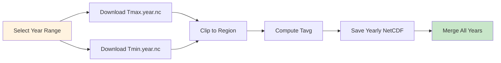
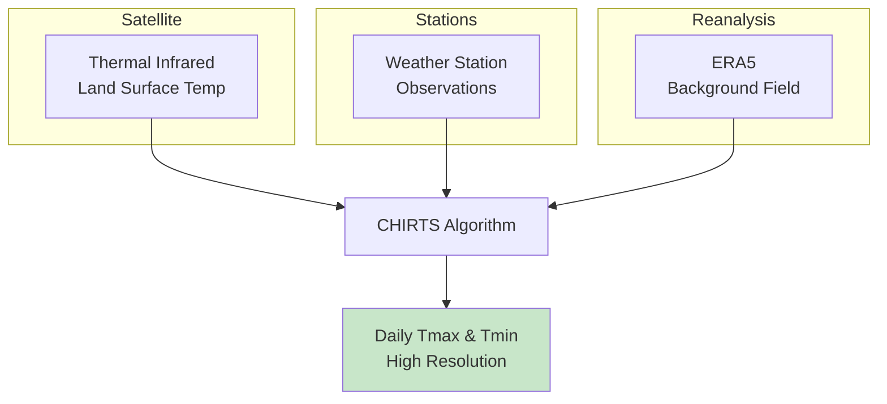

# 🌡️ Downloading CHIRTS-Daily Temperature

## Overview

**CHIRTS-daily** (Climate Hazards InfraRed Temperature with Stations) provides high-resolution daily temperature observations for Africa. This dataset combines satellite thermal infrared data with station observations to produce reliable Tmax and Tmin estimates, essential for climate analysis and disease modeling.

<div class="grid cards" markdown>

-   :material-thermometer: **Dataset**
    
    ---
    
    CHIRTS-daily v1.0
    
    **Variables:** Tmax, Tmin, Tavg  
    **Coverage:** Africa  
    **Format:** NetCDF (yearly files)  
    **Source:** CHC, UC Santa Barbara

-   :material-grid: **Resolution**
    
    ---
    
    **0.05°** (~5 km) - High resolution  
    **0.25°** (~25 km) - Faster downloads  
    
    Choose based on your needs

-   :material-calendar-range: **Temporal**
    
    ---
    
    **Range:** 1983–2016  
    **Frequency:** Daily  
    **Units:** °C  
    **Structure:** One file per year

-   :material-download: **Access**
    
    ---
    
    **Source:** CHC Data Portal  
    **Method:** HTTP download  
    **Auth:** None required  
    **Size:** ~200 MB/year (0.25°)

</div>

---

## 🎯 What This Script Does



The script performs the following operations:

1. **Downloads** yearly Tmax and Tmin NetCDF files
2. **Clips** to your region of interest (optional)
3. **Computes** daily average: `Tavg = (Tmax + Tmin) / 2`
4. **Saves** processed yearly files
5. **Merges** all years into a single NetCDF

---

## 🌡️ Understanding CHIRTS

### What is CHIRTS?

CHIRTS combines multiple data sources to produce reliable temperature estimates:



### CHIRTS vs Other Temperature Products

| Feature | CHIRTS | ERA5 | CRU |
|---------|--------|------|-----|
| **Resolution** | 0.05° | 0.25° | 0.5° |
| **Coverage** | Africa | Global | Global |
| **Period** | 1983–2016 | 1940–present | 1901–present |
| **Variables** | Tmax, Tmin | Many | Monthly only |
| **Best for** | Africa studies | Global, recent | Long-term trends |

!!! tip "When to Use CHIRTS"
    - High-resolution temperature analysis for Africa
    - Health/disease modeling (malaria, dengue)
    - Agricultural applications
    - Validation of climate models

---

## 🚀 Quick Start Guide

### Prerequisites

!!! info "Required Python Packages"
    ```bash
    pip install requests xarray netCDF4 numpy
    ```

### Basic Usage

=== "Quick Test (1 Year)"
    ```bash
    python download_chirts_daily.py \
        --start 2000 --end 2000 \
        --res p25 \
        --clip 15 3 33 48 \
        --outdir data/chirts_daily
    ```

=== "Multi-Year Download"
    ```bash
    python download_chirts_daily.py \
        --start 2000 --end 2010 \
        --res p25 \
        --clip 15 3 33 48 \
        --outdir data/chirts_daily
    ```

=== "High Resolution (0.05°)"
    ```bash
    python download_chirts_daily.py \
        --start 2000 --end 2005 \
        --res p05 \
        --clip 15 3 33 48 \
        --outdir data/chirts_daily
    ```

---

## 📋 The Complete Script

### Python Download Script

Save this as `download_chirts_daily.py`:

```python
#!/usr/bin/env python3
"""
Download CHIRTS-daily yearly NetCDFs (Tmax, Tmin) for a year range,
optionally clip to a region, compute daily mean temperature (Tavg),
and merge all processed yearly files into a single NetCDF.

CHIRTS-daily (v1.0) Africa NetCDF collections:
- 0.25°: https://data.chc.ucsb.edu/products/CHIRTSdaily/v1.0/africa_netcdf_p25/
- 0.05°: https://data.chc.ucsb.edu/products/CHIRTSdaily/v1.0/africa_netcdf_p05/

File naming:
- Tmax.<year>.nc
- Tmin.<year>.nc

Outputs
-------
Yearly processed files (in outdir):
  chirts_daily_<res>_<year>[_clip].nc with variables:
    - tmax (degC)
    - tmin (degC)
    - tavg (degC) = (tmax + tmin)/2

Merged file (in outdir):
  chirts_<res>_<start>-<end>[_clip].nc
  (unless --merge-name provided)

Examples
--------
# 1) Download 2000–2002 at 0.25°, clip to Ethiopia box, merge
python download_chirts_daily.py --start 2000 --end 2002 \
  --res p25 --clip 15 3 33 48 --outdir data/chirts_daily_eth

# 2) Same but explicit merged name
python download_chirts_daily.py --start 2000 --end 2002 \
  --res p25 --clip 15 3 33 48 --outdir data/chirts_daily_eth \
  --merge-name chirts_p25_2000-2002_clip.nc

Notes
-----
- CHIRTS-daily v1.0 coverage is 1983–2016.
- p05 files are large; test with p25 first if you're unsure.
"""

import argparse
from pathlib import Path
import sys
import requests


# -----------------------------------------------------------------------------#
# Logging
# -----------------------------------------------------------------------------#

def log(msg: str) -> None:
    """Print info message."""
    print(f"[info] {msg}")


def warn(msg: str) -> None:
    """Print warning message."""
    print(f"[warn] {msg}")


# -----------------------------------------------------------------------------#
# Download helpers
# -----------------------------------------------------------------------------#

def download_file(url: str, dest: Path, chunk: int = 2**20) -> None:
    """
    Download a file from URL to dest (atomic write).
    
    Uses a temporary .part file to ensure atomic writes.
    """
    dest.parent.mkdir(parents=True, exist_ok=True)
    tmp = dest.with_suffix(dest.suffix + ".part")

    with requests.get(url, stream=True, timeout=180) as r:
        r.raise_for_status()
        with open(tmp, "wb") as f:
            for blk in r.iter_content(chunk_size=chunk):
                if blk:
                    f.write(blk)

    tmp.replace(dest)


def build_urls(year: int, res: str) -> dict:
    """
    Build Africa CHIRTS-daily URLs for Tmax and Tmin.
    
    Parameters
    ----------
    year : int
        Year to download (1983-2016)
    res : str
        Resolution: 'p25' (0.25°) or 'p05' (0.05°)
    
    Returns
    -------
    dict
        URLs for tmax and tmin files
    """
    base = f"https://data.chc.ucsb.edu/products/CHIRTSdaily/v1.0/africa_netcdf_{res}"
    return {
        "tmax": f"{base}/Tmax.{year}.nc",
        "tmin": f"{base}/Tmin.{year}.nc",
    }


# -----------------------------------------------------------------------------#
# Xarray utilities
# -----------------------------------------------------------------------------#

def standardize_for_merge(ds):
    """
    Standardize dimension names and latitude orientation for merging:
    - rename latitude/longitude -> lat/lon if needed
    - ensure lat ascending
    """
    ren = {}
    if "latitude" in ds.dims:
        ren["latitude"] = "lat"
    if "longitude" in ds.dims:
        ren["longitude"] = "lon"
    if ren:
        ds = ds.rename(ren)

    try:
        lat = ds["lat"]
        if lat.size > 1 and lat[0] > lat[-1]:
            ds = ds.reindex(lat=list(reversed(lat.values)))
    except Exception:
        pass

    return ds


def clip_box(ds, N: float, S: float, W: float, E: float):
    """
    Clip dataset to bounding box (N, S, W, E).
    
    Works with either latitude/longitude or lat/lon.
    Handles simple longitude wrapping if needed.
    
    Parameters
    ----------
    ds : xr.Dataset
        Input dataset
    N, S, W, E : float
        Bounding box coordinates (North, South, West, East)
    
    Returns
    -------
    xr.Dataset
        Clipped and standardized dataset
    """
    import numpy as np
    import xarray as xr

    if S >= N:
        raise ValueError(f"Invalid latitude bounds: South ({S}) must be less than North ({N})")

    lat_name = "latitude" if "latitude" in ds.dims else "lat"
    lon_name = "longitude" if "longitude" in ds.dims else "lon"

    lat = ds[lat_name].values
    lon = ds[lon_name].values

    # Select latitude range (assume increasing selection)
    lat_slice = slice(S, N)

    lon_min, lon_max = float(np.nanmin(lon)), float(np.nanmax(lon))
    W2, E2 = W, E

    # If dataset uses 0..360 and user requests -180..180
    if lon_min >= 0 and W < 0:
        W2 = (W + 360) % 360
        E2 = (E + 360) % 360

    sel_dict = {lat_name: lat_slice}

    if W2 <= E2:
        sel_dict[lon_name] = slice(W2, E2)
        ds_sub = ds.sel(sel_dict)
    else:
        # Dateline wrap case
        left = ds.sel({lat_name: lat_slice, lon_name: slice(W2, lon_max)})
        right = ds.sel({lat_name: lat_slice, lon_name: slice(lon_min, E2)})
        ds_sub = xr.concat([left, right], dim=lon_name)

    return standardize_for_merge(ds_sub)


def pick_temp_var(ds, kind: str):
    """
    Robustly select a temperature variable from a CHIRTS dataset.
    
    Parameters
    ----------
    ds : xr.Dataset
        Input dataset
    kind : str
        Variable type: 'tmax' or 'tmin'
    
    Returns
    -------
    xr.DataArray
        Selected temperature variable
    """
    if not ds.data_vars:
        raise ValueError("No data variables found.")

    kind = kind.lower()

    # Common patterns to try
    preferred_names = []
    if kind == "tmax":
        preferred_names = ["tmax", "Tmax", "temperature_max", "temp_max"]
    else:
        preferred_names = ["tmin", "Tmin", "temperature_min", "temp_min"]

    for n in preferred_names:
        if n in ds.data_vars:
            return ds[n]

    # Fuzzy search by name/attrs
    for name in ds.data_vars:
        lname = name.lower()
        long_name = str(ds[name].attrs.get("long_name", "")).lower()
        units = str(ds[name].attrs.get("units", "")).lower()

        if kind in lname:
            return ds[name]

        if kind == "tmax" and ("max" in lname or "maximum" in long_name):
            return ds[name]

        if kind == "tmin" and ("min" in lname or "minimum" in long_name):
            return ds[name]

        # Sometimes variable is just "temperature"
        if "temperature" in lname and ("c" in units or "degc" in units):
            return ds[name]

    # Fallback to first variable
    return ds[list(ds.data_vars)[0]]


def ensure_celsius(da):
    """
    Convert to degC if units indicate Kelvin OR values look like Kelvin.
    
    Uses both unit metadata and heuristic value checking.
    """
    import numpy as np

    units = str(da.attrs.get("units", "")).strip().lower()

    # Unit-based conversion
    if units in ("k", "kelvin"):
        da = da - 273.15
        da.attrs["units"] = "degC"
        return da

    # Heuristic conversion if units missing/unclear
    try:
        vmax = float(np.nanmax(da.values))
        if vmax > 100:
            da = da - 273.15
            da.attrs["units"] = "degC"
    except Exception:
        pass

    # Standardize label if still missing
    if not units:
        da.attrs["units"] = "degC"

    return da


def build_year_dataset(ds_tmax, ds_tmin):
    """
    Create a standardized Dataset with tmax, tmin, tavg.
    
    Parameters
    ----------
    ds_tmax : xr.Dataset
        Dataset containing Tmax
    ds_tmin : xr.Dataset
        Dataset containing Tmin
    
    Returns
    -------
    xr.Dataset
        Combined dataset with tmax, tmin, tavg variables
    """
    import xarray as xr

    ds_tmax = standardize_for_merge(ds_tmax)
    ds_tmin = standardize_for_merge(ds_tmin)

    tmax = pick_temp_var(ds_tmax, "tmax")
    tmin = pick_temp_var(ds_tmin, "tmin")

    tmax = ensure_celsius(tmax).rename("tmax")
    tmin = ensure_celsius(tmin).rename("tmin")

    # Align grids/time exactly
    tmax, tmin = xr.align(tmax, tmin, join="exact", copy=False)

    # Compute average temperature
    tavg = ((tmax + tmin) / 2.0).rename("tavg")

    # Add metadata attributes
    tmax.attrs.update({
        "long_name": "Daily maximum 2m air temperature",
        "standard_name": "air_temperature",
    })
    tmin.attrs.update({
        "long_name": "Daily minimum 2m air temperature",
        "standard_name": "air_temperature",
    })
    tavg.attrs.update({
        "long_name": "Daily mean 2m air temperature",
        "standard_name": "air_temperature",
        "units": tmax.attrs.get("units", "degC"),
        "description": "Computed as (tmax + tmin)/2.",
    })

    return xr.Dataset({"tmax": tmax, "tmin": tmin, "tavg": tavg})


def merge_to_netcdf(nc_paths: list, out_path: Path) -> None:
    """
    Merge multiple NetCDF files into one output file.
    
    Parameters
    ----------
    nc_paths : list
        List of Path objects to merge
    out_path : Path
        Output file path
    """
    import xarray as xr

    if not nc_paths:
        raise ValueError("No input files found to merge.")

    log(f"[merge] {len(nc_paths)} files -> {out_path.name}")

    ds = xr.open_mfdataset(
        [str(p) for p in nc_paths],
        combine="by_coords",
        preprocess=standardize_for_merge,
        parallel=False,
    )

    data_vars = list(ds.data_vars)
    if not data_vars:
        raise ValueError("No data variables in opened datasets.")

    # Add global attributes
    ds.attrs["title"] = "CHIRTS-daily Temperature"
    ds.attrs["source"] = "Climate Hazards Center, UC Santa Barbara"
    ds.attrs["institution"] = "CHC-UCSB"
    ds.attrs["references"] = "https://data.chc.ucsb.edu/products/CHIRTSdaily/"

    enc = {v: {"zlib": True, "complevel": 3, "dtype": "float32"} for v in data_vars}

    out_path.parent.mkdir(parents=True, exist_ok=True)
    ds.to_netcdf(out_path, encoding=enc)
    log(f"[ok] merged saved: {out_path}")


# -----------------------------------------------------------------------------#
# Main
# -----------------------------------------------------------------------------#

def build_parser():
    """Build argument parser."""
    ap = argparse.ArgumentParser(
        description=(
            "Download CHIRTS-daily Tmax/Tmin by year range; optional clip; "
            "compute Tavg; merge outputs (saved in --outdir)."
        ),
        formatter_class=argparse.RawDescriptionHelpFormatter,
        epilog="""
Examples:
  # Download 2000–2002 at 0.25°, clip to Ethiopia, merge
  python download_chirts_daily.py --start 2000 --end 2002 \\
      --res p25 --clip 15 3 33 48 --outdir data/chirts_daily_eth

  # Same but with explicit merged filename
  python download_chirts_daily.py --start 2000 --end 2002 \\
      --res p25 --clip 15 3 33 48 --outdir data/chirts_daily_eth \\
      --merge-name chirts_p25_2000-2002_ethiopia.nc
        """
    )

    ap.add_argument("--start", type=int, required=True, help="Start year (>=1983)")
    ap.add_argument("--end", type=int, required=True, help="End year (<=2016)")

    ap.add_argument(
        "--outdir",
        default="chirts_daily_downloads",
        help="Directory to save yearly and merged files (default: chirts_daily_downloads)",
    )

    ap.add_argument(
        "--res",
        choices=["p25", "p05"],
        default="p25",
        help="Africa CHIRTS resolution: p25=0.25°, p05=0.05° (default: p25)",
    )

    ap.add_argument(
        "--clip",
        nargs=4,
        type=float,
        metavar=("N", "S", "W", "E"),
        help="Optional clip box (degrees): North South West East",
    )

    ap.add_argument(
        "--merge-name",
        type=str,
        default=None,
        help="Merged filename (no path). If omitted, an automatic name is used.",
    )

    ap.add_argument(
        "--overwrite",
        action="store_true",
        help="Overwrite existing yearly files",
    )

    return ap


def main():
    """Main entry point."""
    # Windows-friendly hint when run with no arguments
    if sys.platform.startswith("win") and len(sys.argv) == 1:
        print(
            "\n[hint] This script is best run from CMD/PowerShell like:\n"
            "  python download_chirts_daily.py --start 2000 --end 2002 "
            "--res p25 --clip 15 3 33 48 --outdir data/chirts_daily_eth\n"
        )
        build_parser().print_help()
        return

    ap = build_parser()
    args = ap.parse_args()

    # CHIRTS-daily v1 coverage guard
    if args.start < 1983 or args.end > 2016 or args.start > args.end:
        raise ValueError("CHIRTS-daily v1.0 valid year range is 1983–2016.")

    if args.res == "p05":
        warn("You selected p05 (0.05°). Files can be very large. "
             "Consider testing with p25 first.")

    print(f"\n{'#'*60}")
    print(f"# CHIRTS-daily Temperature Download")
    print(f"# Years: {args.start} to {args.end}")
    print(f"# Resolution: {args.res} ({'0.25°' if args.res == 'p25' else '0.05°'})")
    if args.clip:
        print(f"# Clip: N={args.clip[0]}, S={args.clip[1]}, W={args.clip[2]}, E={args.clip[3]}")
    print(f"{'#'*60}\n")

    years = list(range(args.start, args.end + 1))
    outdir = Path(args.outdir)
    outdir.mkdir(parents=True, exist_ok=True)

    processed_year_files = []

    for y in years:
        print(f"\n{'='*50}")
        print(f"Processing year {y}")
        print(f"{'='*50}")

        urls = build_urls(y, args.res)

        raw_tmax = outdir / f"Tmax.{y}.{args.res}.nc"
        raw_tmin = outdir / f"Tmin.{y}.{args.res}.nc"

        # Download Tmax
        if not raw_tmax.exists() or args.overwrite:
            log(f"[GET] {urls['tmax']}")
            try:
                download_file(urls["tmax"], raw_tmax)
                log(f"[ok ] saved {raw_tmax.name}")
            except Exception as e:
                print(f"[ERR] download failed for Tmax {y}: {e}")
                continue
        else:
            log(f"[skip] {raw_tmax.name} exists")

        # Download Tmin
        if not raw_tmin.exists() or args.overwrite:
            log(f"[GET] {urls['tmin']}")
            try:
                download_file(urls["tmin"], raw_tmin)
                log(f"[ok ] saved {raw_tmin.name}")
            except Exception as e:
                print(f"[ERR] download failed for Tmin {y}: {e}")
                continue
        else:
            log(f"[skip] {raw_tmin.name} exists")

        # Process yearly pair -> combined dataset
        try:
            import xarray as xr

            ds_max = xr.open_dataset(raw_tmax)
            ds_min = xr.open_dataset(raw_tmin)

            # Optional clip
            if args.clip:
                N, S, W, E = args.clip
                ds_max = clip_box(ds_max, N, S, W, E)
                ds_min = clip_box(ds_min, N, S, W, E)
            else:
                ds_max = standardize_for_merge(ds_max)
                ds_min = standardize_for_merge(ds_min)

            ds_year = build_year_dataset(ds_max, ds_min)

            clip_tag = "_clip" if args.clip else ""
            out_year = outdir / f"chirts_daily_{args.res}_{y}{clip_tag}.nc"

            if not out_year.exists() or args.overwrite:
                enc = {
                    "tmax": {"zlib": True, "complevel": 3, "dtype": "float32"},
                    "tmin": {"zlib": True, "complevel": 3, "dtype": "float32"},
                    "tavg": {"zlib": True, "complevel": 3, "dtype": "float32"},
                }
                ds_year.to_netcdf(out_year, encoding=enc)
                log(f"[ok ] yearly processed → {out_year.name}")
            else:
                log(f"[skip] {out_year.name} exists")

            if out_year.exists():
                processed_year_files.append(out_year)

        except Exception as e:
            print(f"[warn] processing failed for {y}: {e}")
            continue

    # Merge all yearly files
    if args.merge_name:
        merge_name = Path(args.merge_name).name
    else:
        clip_tag = "_clip" if args.clip else ""
        merge_name = f"chirts_{args.res}_{args.start}-{args.end}{clip_tag}.nc"

    target = outdir / merge_name

    to_merge = [p for p in processed_year_files if p.exists()]

    if to_merge:
        try:
            merge_to_netcdf(to_merge, target)
        except Exception as e:
            print(f"[ERR] merge failed: {e}")
            sys.exit(2)
    else:
        print("[warn] nothing to merge (no processed yearly files).")

    print(f"\n{'#'*60}")
    print(f"# Download complete!")
    print(f"# Output directory: {outdir}")
    print(f"{'#'*60}\n")


if __name__ == "__main__":
    main()
```

---

## 🔧 Command-Line Arguments

### Required Arguments

| Argument | Type | Description | Example |
|----------|------|-------------|---------|
| `--start` | Integer | Start year (1983–2016) | `2000` |
| `--end` | Integer | End year (1983–2016) | `2010` |

### Optional Arguments

| Argument | Type | Description | Default |
|----------|------|-------------|---------|
| `--outdir` | String | Output directory | `chirts_daily_downloads` |
| `--res` | Choice | Resolution: `p25` or `p05` | `p25` |
| `--clip` | 4 Floats | Bounding box: N S W E | None (full Africa) |
| `--merge-name` | String | Custom merged filename | Auto-generated |
| `--overwrite` | Flag | Overwrite existing files | False |

---

## 📊 Resolution Options

### Choosing the Right Resolution

| Resolution | Grid Size | File Size/Year | Best For |
|------------|-----------|----------------|----------|
| **p25** (0.25°) | ~27 km | ~200 MB | Quick analysis, regional studies |
| **p05** (0.05°) | ~5.5 km | ~2 GB | High-resolution studies, local analysis |

!!! tip "Recommendation"
    - Start with **p25** for testing and development
    - Use **p05** only when high resolution is essential
    - p05 downloads take significantly longer

---

## 📍 Regional Bounding Boxes

The `--clip` argument uses the format: `N S W E` (North, South, West, East)

=== "Ethiopia"
    ```bash
    --clip 15 3 33 48
    ```
    **Coverage:** Entire Ethiopia

=== "East Africa"
    ```bash
    --clip 12 -5 28 42
    ```
    **Coverage:** Kenya, Uganda, Tanzania, Rwanda, Burundi

=== "Horn of Africa"
    ```bash
    --clip 18 -5 32 52
    ```
    **Coverage:** Ethiopia, Somalia, Eritrea, Djibouti, Kenya

=== "West Africa"
    ```bash
    --clip 18 4 -18 16
    ```
    **Coverage:** Sahel and coastal West Africa

=== "Southern Africa"
    ```bash
    --clip -10 -35 10 45
    ```
    **Coverage:** South Africa, Zimbabwe, Mozambique, etc.

!!! warning "Clip Format"
    The clip box uses **N S W E** order (not the usual lat-min/lat-max/lon-min/lon-max).
    
    - **N** = Northern boundary (higher latitude)
    - **S** = Southern boundary (lower latitude)
    - **W** = Western boundary (lower longitude)
    - **E** = Eastern boundary (higher longitude)

---

## 💡 Usage Examples

### Example 1: Quick Test (Single Year)

```bash
python download_chirts_daily.py \
    --start 2000 --end 2000 \
    --res p25 \
    --clip 15 3 33 48 \
    --outdir data/chirts_test
```

**What it does:**

- Downloads Tmax and Tmin for year 2000
- Clips to Ethiopia bounding box
- Computes Tavg and saves processed file
- ~5-10 minutes download time

---

### Example 2: Full Historical Record

```bash
python download_chirts_daily.py \
    --start 1983 --end 2016 \
    --res p25 \
    --clip 15 3 33 48 \
    --outdir data/chirts_ethiopia \
    --merge-name chirts_ethiopia_1983-2016.nc
```

**What it does:**

- Downloads 34 years of daily temperature
- Creates yearly processed files
- Merges into single NetCDF
- ~2-3 hours download time

---

### Example 3: High Resolution Download

```bash
python download_chirts_daily.py \
    --start 2010 --end 2015 \
    --res p05 \
    --clip 15 3 33 48 \
    --outdir data/chirts_hires
```

**What it does:**

- Downloads at 0.05° (~5 km) resolution
- Much larger file sizes
- Better for local-scale analysis
- ~1 day download time

---

### Example 4: Batch Download Script

```bash
#!/bin/bash
# download_chirts_decades.sh

OUTDIR="data/chirts_ethiopia"
CLIP="15 3 33 48"

# Download by decade
for START in 1983 1990 2000 2010; do
    END=$((START + 9))
    if [ $END -gt 2016 ]; then END=2016; fi
    
    echo "Downloading $START-$END..."
    python download_chirts_daily.py \
        --start $START --end $END \
        --res p25 \
        --clip $CLIP \
        --outdir "$OUTDIR" \
        --merge-name "chirts_eth_${START}-${END}.nc"
done

echo "All decades downloaded!"
```

---

### Example 5: Resume Interrupted Download

```bash
# If download was interrupted, just run again
# Existing files will be skipped
python download_chirts_daily.py \
    --start 1983 --end 2016 \
    --res p25 \
    --clip 15 3 33 48 \
    --outdir data/chirts_ethiopia

# To force re-download, add --overwrite
python download_chirts_daily.py \
    --start 1983 --end 2016 \
    --res p25 \
    --clip 15 3 33 48 \
    --outdir data/chirts_ethiopia \
    --overwrite
```

---

## 📂 Output Directory Structure

After running the script, your output directory will contain:

```
data/chirts_ethiopia/
├── Tmax.2000.p25.nc                    # Raw Tmax download
├── Tmin.2000.p25.nc                    # Raw Tmin download
├── Tmax.2001.p25.nc
├── Tmin.2001.p25.nc
├── ...
├── chirts_daily_p25_2000_clip.nc       # Processed yearly file
├── chirts_daily_p25_2001_clip.nc
├── ...
└── chirts_p25_2000-2010_clip.nc        # Merged multi-year file
```

!!! tip "File Naming Convention"
    - **Raw files:** `Tmax.{year}.{res}.nc`, `Tmin.{year}.{res}.nc`
    - **Processed yearly:** `chirts_daily_{res}_{year}[_clip].nc`
    - **Merged:** `chirts_{res}_{start}-{end}[_clip].nc`

---

## 🔍 Verifying Your Download

After downloading, verify your data using Python:

```python
import xarray as xr
import matplotlib.pyplot as plt

# Open merged file
ds = xr.open_dataset('data/chirts_ethiopia/chirts_p25_2000-2010_clip.nc')

# Display dataset information
print(ds)
print(f"\nDimensions: {dict(ds.dims)}")
print(f"Variables: {list(ds.data_vars)}")
print(f"Time range: {ds.time.values[0]} to {ds.time.values[-1]}")

# Temperature statistics
for var in ['tmax', 'tmin', 'tavg']:
    if var in ds:
        print(f"{var}: {float(ds[var].min()):.1f}°C to {float(ds[var].max()):.1f}°C")

# Plot annual mean temperature
annual_mean = ds.tavg.groupby('time.year').mean(dim='time')

fig, ax = plt.subplots(figsize=(10, 8))
annual_mean.isel(year=0).plot(ax=ax, cmap='RdYlBu_r', cbar_kwargs={'label': '°C'})
ax.set_title('CHIRTS Annual Mean Temperature 2000')
plt.savefig('chirts_annual_mean.png', dpi=150, bbox_inches='tight')
plt.show()

# Time series for a point
lat_point, lon_point = 9.0, 38.7  # Addis Ababa
point_data = ds.tavg.sel(lat=lat_point, lon=lon_point, method='nearest')

# Monthly climatology
monthly = point_data.groupby('time.month').mean()

plt.figure(figsize=(10, 5))
monthly.plot(marker='o', linewidth=2, color='orangered')
plt.xlabel('Month')
plt.ylabel('Temperature (°C)')
plt.title('CHIRTS Monthly Temperature Climatology - Addis Ababa')
plt.grid(True, alpha=0.3)
plt.xticks(range(1, 13), ['J', 'F', 'M', 'A', 'M', 'J', 'J', 'A', 'S', 'O', 'N', 'D'])
plt.savefig('chirts_monthly_climatology.png', dpi=150, bbox_inches='tight')
plt.show()
```

---

## 📊 Computing Derived Products

### Diurnal Temperature Range

```python
import xarray as xr
import matplotlib.pyplot as plt

# Load data
ds = xr.open_dataset('data/chirts_ethiopia/chirts_p25_2000-2010_clip.nc')

# Compute Diurnal Temperature Range (DTR)
dtr = ds.tmax - ds.tmin

# Annual mean DTR
annual_dtr = dtr.groupby('time.year').mean(dim='time')

# Plot
fig, ax = plt.subplots(figsize=(10, 8))
annual_dtr.isel(year=0).plot(ax=ax, cmap='YlOrRd', cbar_kwargs={'label': '°C'})
ax.set_title('Mean Diurnal Temperature Range (Tmax - Tmin)')
plt.savefig('chirts_dtr.png', dpi=150, bbox_inches='tight')
plt.show()

print(f"Mean DTR: {float(dtr.mean()):.1f}°C")
```

### Temperature Extremes

```python
import xarray as xr
import numpy as np

# Load data
ds = xr.open_dataset('data/chirts_ethiopia/chirts_p25_2000-2010_clip.nc')

# Hot days (Tmax > 35°C)
hot_days = (ds.tmax > 35).groupby('time.year').sum(dim='time')
print(f"Mean hot days per year: {float(hot_days.mean()):.1f}")

# Cold nights (Tmin < 10°C)
cold_nights = (ds.tmin < 10).groupby('time.year').sum(dim='time')
print(f"Mean cold nights per year: {float(cold_nights.mean()):.1f}")

# Frost days (Tmin < 0°C)
frost_days = (ds.tmin < 0).groupby('time.year').sum(dim='time')
print(f"Mean frost days per year: {float(frost_days.mean()):.1f}")

# Growing Degree Days (base 10°C)
gdd = np.maximum(ds.tavg - 10, 0).groupby('time.year').sum(dim='time')
print(f"Mean GDD per year: {float(gdd.mean()):.0f}")
```

---

## 📈 Trend Analysis

### Temperature Trend Script

```python
import xarray as xr
import numpy as np
import matplotlib.pyplot as plt

# Load data
ds = xr.open_dataset('data/chirts_ethiopia/chirts_p25_1983-2016_clip.nc')

# Compute annual means
annual_mean = ds.tavg.groupby('time.year').mean(dim='time')

# Spatial average
spatial_mean = annual_mean.mean(dim=['lat', 'lon'])

# Plot trend
years = spatial_mean.year.values
temps = spatial_mean.values

# Linear regression
coeffs = np.polyfit(years, temps, 1)
trend_line = np.poly1d(coeffs)
trend_per_decade = coeffs[0] * 10

plt.figure(figsize=(12, 5))
plt.plot(years, temps, 'o-', color='orangered', label='Annual Mean')
plt.plot(years, trend_line(years), '--', color='gray', 
         label=f'Trend: {trend_per_decade:.2f}°C/decade')
plt.xlabel('Year')
plt.ylabel('Temperature (°C)')
plt.title('CHIRTS Temperature Trend - Ethiopia (1983-2016)')
plt.legend()
plt.grid(True, alpha=0.3)
plt.savefig('chirts_trend.png', dpi=150, bbox_inches='tight')
plt.show()

print(f"Temperature trend: {trend_per_decade:.2f}°C per decade")
```

---

## ⚠️ Troubleshooting

### Common Issues and Solutions

=== "Download Timeout"

    **Problem:** Download times out
    
    ```
    requests.exceptions.ReadTimeout
    ```
    
    **Solutions:**
    
    1. **Retry:** Script will skip existing files on re-run
    2. **Off-peak hours:** Try downloading at night
    3. **Smaller chunks:** Download fewer years at once

=== "File Not Found (404)"

    **Problem:** HTTP 404 error
    
    **Causes:**
    
    - Year outside 1983–2016 range
    - Server maintenance
    
    **Solutions:**
    
    1. **Check year range:** Must be 1983–2016
    2. **Try later:** Server may be temporarily unavailable

=== "Memory Error"

    **Problem:** Out of memory during merge
    
    **Solutions:**
    
    1. **Merge fewer years:** Process in smaller batches
    2. **Use smaller region:** Reduce clip area
    3. **Use p25:** Avoid p05 if memory is limited

=== "Clip Box Error"

    **Problem:** "South must be less than North"
    
    **Cause:** Wrong order of clip arguments
    
    **Solution:** Use `--clip N S W E` format:
    ```bash
    # Correct: North first, then South
    --clip 15 3 33 48
    
    # Wrong: South first
    --clip 3 15 33 48  # ERROR!
    ```

=== "Merge Failed"

    **Problem:** Merge step fails
    
    **Solutions:**
    
    1. **Check yearly files:** Ensure all processed files exist
    2. **Consistent clipping:** All years must have same clip region
    3. **Re-process:** Delete yearly files and re-run with `--overwrite`

---

## 🎓 Data Quality Notes

!!! success "Strengths"
    - **High resolution** - 0.05° or 0.25°
    - **Long record** - 34 years (1983–2016)
    - **Station-calibrated** - Improved accuracy
    - **Consistent methodology** - Comparable across time
    - **Free access** - No registration required

!!! warning "Limitations"
    - **Africa only** - No global coverage
    - **Ends in 2016** - No recent years
    - **Two variables** - Only Tmax and Tmin (Tavg computed)
    - **Large files** - p05 requires significant storage

!!! tip "Best Practices"
    - **Start with p25** for testing
    - **Use clipping** to reduce file sizes
    - **Validate locally** - Compare with station data
    - **Combine with CHIRPS** for complete climate forcing

---

## 📖 Additional Resources

### Official Documentation

- **CHC Data Portal:** [https://data.chc.ucsb.edu/products/CHIRTSdaily/](https://data.chc.ucsb.edu/products/CHIRTSdaily/)
- **CHIRTS Paper:** Funk et al. (2019) - Scientific Data
- **CHC Homepage:** [https://www.chc.ucsb.edu/](https://www.chc.ucsb.edu/)

### Related Datasets

- **CHIRPS:** Precipitation counterpart to CHIRTS
- **CHC-CMIP6:** Future projections based on CHIRTS
- **ERA5-Land:** Global reanalysis alternative

### Related Tutorials

- [CHIRPS Precipitation](10-download_chirps.md) - Companion precipitation data
- [CHC-CMIP6 Temperature](21-download_chc_cmip6_temp_daily.md) - Future projections
- [Climate Data Access](../../day3/09-climate_data_access_and_extraction.md) - Overview of sources

---

## 🚀 Next Steps

<div class="grid cards" markdown>

-   :material-chart-line: **Trend Analysis**
    
    ---
    
    Compute temperature trends  
    Analyze extremes  
    
    → [Xarray Tutorial](../../day3/06-Xarray_for_Climate_and_Meteorology_Workshop.md)

-   :material-map: **Visualize Data**
    
    ---
    
    Map temperature patterns  
    Seasonal climatologies  
    
    → [Matplotlib Tutorial](../../day3/05-Matplotlib_for_Climate_and_Meteorology_Workshop.md)

-   :material-weather-rainy: **Add Precipitation**
    
    ---
    
    Download CHIRPS rainfall  
    Combined climate forcing  
    
    → [CHIRPS Tutorial](10-download_chirps.md)

-   :material-bug: **VECTRI Modeling**
    
    ---
    
    Temperature-driven transmission  
    Historical malaria analysis  
    
    → [VECTRI Model](../../day1/vectri_model_components_larvae_to_hydrology.md)

</div>

---

!!! example "Need Help?"
    If you encounter issues or have questions:
    
    - Check the [Troubleshooting](#troubleshooting) section
    - Review [CHC Data Portal](https://data.chc.ucsb.edu/products/CHIRTSdaily/)
    - Contact workshop instructors

---

<div style="background: linear-gradient(135deg, #ff6b35 0%, #f7931e 100%); color: white; padding: 2rem; border-radius: 8px; text-align: center; margin-top: 2rem;">
  <h3 style="margin: 0 0 1rem 0;">🌡️ Ready for Historical Temperature Analysis!</h3>
  <p style="margin: 0; opacity: 0.95;">You now have everything you need to download CHIRTS-daily temperature for high-resolution historical climate analysis in Africa.</p>
</div>

