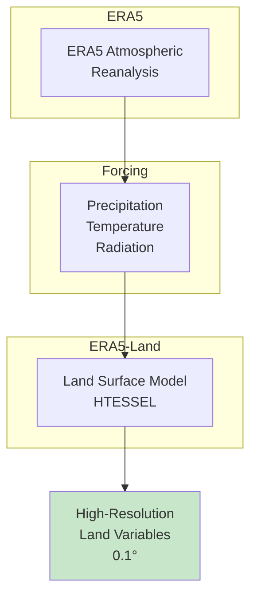

# 🌡️ Downloading ERA5-Land Daily Temperature

## Overview

**ERA5-Land** is ECMWF's high-resolution land surface reanalysis, providing hourly temperature data at 0.1° (~9 km) resolution. This tutorial shows how to download hourly data and convert it to daily means for climate analysis and disease modeling.

<div class="grid cards" markdown>

-   :material-thermometer: **Dataset**
    
    ---
    
    ERA5-Land Reanalysis
    
    **Variable:** 2m Temperature (t2m)  
    **Resolution:** 0.1° (~9 km)  
    **Coverage:** Global land areas  
    **Format:** NetCDF

-   :material-clock-outline: **Temporal**
    
    ---
    
    **Range:** 1950–present  
    **Native:** Hourly  
    **Output:** Daily means  
    **Latency:** ~5 days

-   :material-earth: **Coverage**
    
    ---
    
    **Domain:** Global land  
    **Quality:** High (reanalysis)  
    **Consistency:** Homogeneous  
    **Updates:** Near real-time

-   :material-download: **Access**
    
    ---
    
    **Source:** Copernicus CDS  
    **Method:** cdsapi Python  
    **Auth:** Required (free)  
    **Size:** ~50 MB/month

</div>

---

## 🎯 What This Script Does


The script performs the following operations:

1. **Downloads** hourly 2m temperature from CDS (month-by-month)
2. **Converts** hourly data to daily means
3. **Optionally converts** Kelvin to Celsius
4. **Merges** monthly files into yearly/multi-year NetCDF
5. **Cleans up** intermediate files

---

## 🌍 Understanding ERA5-Land

### What is ERA5-Land?

ERA5-Land is a replay of the land component of ERA5, providing:



### ERA5-Land vs Other Products

| Feature | ERA5-Land | ERA5 | CHIRTS |
|---------|-----------|------|--------|
| **Resolution** | 0.1° | 0.25° | 0.05° |
| **Coverage** | Global land | Global | Africa only |
| **Period** | 1950–present | 1940–present | 1983–2016 |
| **Type** | Reanalysis | Reanalysis | Obs-based |
| **Updates** | Near real-time | Near real-time | Static |

!!! tip "When to Use ERA5-Land"
    - Global land surface analysis
    - Near real-time applications
    - Long historical records (1950+)
    - Consistent, gap-free data

---

## 🚀 Quick Start Guide

### Prerequisites

!!! warning "CDS Account Required"
    You need a free Copernicus Climate Data Store account:
    
    1. **Register:** [https://cds.climate.copernicus.eu/](https://cds.climate.copernicus.eu/)
    2. **Get API key:** Profile → API Key
    3. **Configure:** Create `~/.cdsapirc` with your credentials

!!! info "Required Python Packages"
    ```bash
    pip install cdsapi xarray netCDF4
    ```

### API Configuration

Create a file `~/.cdsapirc` (Linux/Mac) or `%USERPROFILE%\.cdsapirc` (Windows):

```
url: https://cds.climate.copernicus.eu/api
key: YOUR-UID:YOUR-API-KEY
```

### Basic Usage

=== "Single Year"
    ```bash
    python download_era5_land_temp_daily.py \
        --start-year 2020 --end-year 2020 \
        --lat-min 3 --lat-max 15 \
        --lon-min 33 --lon-max 48 \
        --outdir data/era5_land \
        --merge-outfile era5_land_t2m_2020.nc \
        --to-celsius
    ```

=== "Multi-Year"
    ```bash
    python download_era5_land_temp_daily.py \
        --start-year 2015 --end-year 2023 \
        --lat-min 3 --lat-max 15 \
        --lon-min 33 --lon-max 48 \
        --outdir data/era5_land \
        --merge-outfile era5_land_t2m_2015-2023.nc \
        --to-celsius --delete-hourly
    ```

=== "Keep All Files"
    ```bash
    python download_era5_land_temp_daily.py \
        --start-year 2020 --end-year 2020 \
        --lat-min 3 --lat-max 15 \
        --lon-min 33 --lon-max 48 \
        --outdir data/era5_land \
        --keep-hourly --keep-monthly-daily
    ```

---

## 📋 The Complete Script

### Python Download Script

Save this as `download_era5_land_temp_daily.py`:

```python
#!/usr/bin/env python3
"""
Download ERA5-Land 2m temperature (hourly) from CDS, convert to daily means,
optionally convert Kelvin -> Celsius, and merge outputs.

Default strategy retrieves data month-by-month to reduce request size and
avoid "cost limits exceeded / request too large" errors.

Examples
--------
# 1) One year, small box, daily means, keep Kelvin
python download_era5_land_temp_daily.py \
  --start-year 2020 --end-year 2020 \
  --lat-min 3 --lat-max 6 --lon-min 33 --lon-max 35 \
  --outdir data/era5_land_t2m \
  --merge-outfile era5_land_t2m_daily_2020.nc

# 2) Two years, Ethiopia box, convert to Celsius, delete hourly
python download_era5_land_temp_daily.py \
  --start-year 2020 --end-year 2021 \
  --lat-min 3 --lat-max 15 --lon-min 33 --lon-max 48 \
  --outdir data/era5_land_t2m \
  --merge-outfile era5_land_t2m_daily_2020_2021.nc \
  --to-celsius --delete-hourly

# 3) Keep hourly + keep monthly daily intermediates
python download_era5_land_temp_daily.py \
  --start-year 2020 --end-year 2020 \
  --lat-min 3 --lat-max 15 --lon-min 33 --lon-max 48 \
  --outdir data/era5_land_t2m \
  --keep-hourly --keep-monthly-daily
"""

import argparse
import calendar
import os
from datetime import datetime
from pathlib import Path
from typing import List, Optional

import xarray as xr

try:
    import cdsapi
except ImportError as e:
    raise SystemExit(
        "Missing dependency 'cdsapi'. Install with:\n"
        "  pip install cdsapi\n"
    ) from e


# --------------------------------------------------------------------------- #
# Helpers
# --------------------------------------------------------------------------- #

def build_area(lat_min: float, lat_max: float, lon_min: float, lon_max: float):
    """
    CDS area format: [N, W, S, E]
    """
    if lat_min >= lat_max:
        raise ValueError("lat-min must be < lat-max")
    if lon_min >= lon_max:
        raise ValueError("lon-min must be < lon-max")
    return [float(lat_max), float(lon_min), float(lat_min), float(lon_max)]


def days_in_month(year: int, month: int) -> List[str]:
    """Return list of day strings for a given month."""
    n_days = calendar.monthrange(year, month)[1]
    return [f"{d:02d}" for d in range(1, n_days + 1)]


def hours_list() -> List[str]:
    """Return list of hour strings for all 24 hours."""
    return [f"{h:02d}:00" for h in range(24)]


def safe_remove(path: Path):
    """Safely remove a file, handling Windows permission issues."""
    try:
        if path.exists():
            path.unlink()
    except PermissionError:
        print(f"[warn] Could not delete file (in use): {path}")


def detect_t2m_var(ds: xr.Dataset) -> str:
    """
    ERA5-Land usually uses 't2m'. Fall back to the first data variable.
    """
    if "t2m" in ds.data_vars:
        return "t2m"
    vars_list = list(ds.data_vars)
    if not vars_list:
        raise ValueError("No data variables found in dataset.")
    return vars_list[0]


def retrieve_hourly_t2m_month(
    client: "cdsapi.Client",
    year: int,
    month: int,
    out_path: Path,
    area: list,
):
    """
    Retrieve one month of hourly ERA5-Land 2m temperature.
    
    Parameters
    ----------
    client : cdsapi.Client
        CDS API client
    year : int
        Year to download
    month : int
        Month to download (1-12)
    out_path : Path
        Output file path
    area : list
        Bounding box [N, W, S, E]
    """
    request = {
        "variable": "2m_temperature",
        "year": f"{year}",
        "month": f"{month:02d}",
        "day": days_in_month(year, month),
        "time": hours_list(),
        "area": area,
        "format": "netcdf",
    }

    print(f"[info] Requesting ERA5-Land hourly T2M for {year}-{month:02d}...")
    print(f"[info] Target: {out_path}")

    client.retrieve("reanalysis-era5-land", request).download(str(out_path))


def hourly_to_daily_mean(
    hourly_nc: Path,
    daily_nc: Path,
    to_celsius: bool = False,
):
    """
    Convert hourly T2M to daily mean T2M.
    
    Parameters
    ----------
    hourly_nc : Path
        Input hourly NetCDF file
    daily_nc : Path
        Output daily NetCDF file
    to_celsius : bool
        Convert from Kelvin to Celsius
    """
    print(f"[info] Converting hourly → daily mean: {hourly_nc.name}")

    ds = xr.open_dataset(hourly_nc)
    var = detect_t2m_var(ds)
    da = ds[var]

    if "time" not in da.dims:
        ds.close()
        raise ValueError("Expected 'time' dimension not found in hourly file.")

    # Daily mean
    da_daily = da.resample(time="1D").mean(keep_attrs=True)
    da_daily = da_daily.rename("t2m")

    # Optional unit conversion K -> C
    if to_celsius:
        da_daily = da_daily - 273.15
        da_daily.attrs["units"] = "degC"
        da_daily.attrs["long_name"] = "2 metre temperature (daily mean)"
    else:
        da_daily.attrs.setdefault("units", "K")
        da_daily.attrs.setdefault("long_name", "2 metre temperature (daily mean)")

    ds_out = da_daily.to_dataset()

    # Preserve coordinates
    for coord in ["latitude", "longitude", "lat", "lon"]:
        if coord in ds.coords and coord not in ds_out.coords:
            ds_out = ds_out.assign_coords({coord: ds[coord]})

    # Add metadata
    ds_out.attrs["title"] = "ERA5-Land Daily Mean 2m Temperature"
    ds_out.attrs["source"] = "ECMWF ERA5-Land Reanalysis"
    ds_out.attrs["institution"] = "ECMWF"

    ds_out.to_netcdf(daily_nc)
    ds.close()
    ds_out.close()

    print(f"[info] Daily file saved → {daily_nc.name}")


def retrieve_hourly_t2m_year(
    client: "cdsapi.Client",
    year: int,
    out_path: Path,
    area: list,
):
    """
    Attempt a single yearly retrieval (may fail for size/limits).
    """
    request = {
        "variable": "2m_temperature",
        "year": f"{year}",
        "month": [f"{m:02d}" for m in range(1, 13)],
        "day": [f"{d:02d}" for d in range(1, 32)],
        "time": hours_list(),
        "area": area,
        "format": "netcdf",
    }

    print(f"[info] Requesting ERA5-Land hourly T2M for {year} (yearly request)...")
    print(f"[info] Target: {out_path}")

    client.retrieve("reanalysis-era5-land", request).download(str(out_path))


def merge_netcdfs(nc_files: List[Path], out_path: Path):
    """
    Merge multiple NetCDF files by coordinates.
    
    Parameters
    ----------
    nc_files : list
        List of NetCDF file paths
    out_path : Path
        Output merged file path
    """
    if not nc_files:
        raise ValueError("No NetCDF files provided for merging.")

    print(f"[info] Merging {len(nc_files)} files → {out_path.name}")

    ds = xr.open_mfdataset(
        [str(p) for p in nc_files],
        combine="by_coords",
        parallel=False,
    )

    # Add compression
    encoding = {var: {"zlib": True, "complevel": 4} for var in ds.data_vars}

    ds.to_netcdf(out_path, encoding=encoding)
    ds.close()

    print(f"[info] Merged file saved → {out_path}")


# --------------------------------------------------------------------------- #
# CLI
# --------------------------------------------------------------------------- #

def parse_args() -> argparse.Namespace:
    p = argparse.ArgumentParser(
        description="Download ERA5-Land hourly T2M, convert to daily means.",
        formatter_class=argparse.RawDescriptionHelpFormatter,
        epilog="""
Examples:
  # Single year, convert to Celsius
  python download_era5_land_temp_daily.py \\
      --start-year 2020 --end-year 2020 \\
      --lat-min 3 --lat-max 15 --lon-min 33 --lon-max 48 \\
      --outdir data/era5_land --to-celsius \\
      --merge-outfile era5_land_t2m_2020.nc

  # Multi-year, delete hourly files
  python download_era5_land_temp_daily.py \\
      --start-year 2015 --end-year 2023 \\
      --lat-min 3 --lat-max 15 --lon-min 33 --lon-max 48 \\
      --outdir data/era5_land --to-celsius --delete-hourly \\
      --merge-outfile era5_land_t2m_2015-2023.nc
        """
    )

    p.add_argument("--start-year", type=int, required=True, help="Start year")
    p.add_argument("--end-year", type=int, required=True, help="End year")

    p.add_argument("--lat-min", type=float, required=True, help="Min latitude")
    p.add_argument("--lat-max", type=float, required=True, help="Max latitude")
    p.add_argument("--lon-min", type=float, required=True, help="Min longitude")
    p.add_argument("--lon-max", type=float, required=True, help="Max longitude")

    p.add_argument("--outdir", required=True, help="Output directory")

    p.add_argument(
        "--merge-outfile",
        default=None,
        help="Merged daily NetCDF filename (stored in outdir)"
    )

    p.add_argument(
        "--keep-hourly",
        action="store_true",
        help="Keep monthly hourly NetCDF files"
    )

    p.add_argument(
        "--keep-monthly-daily",
        action="store_true",
        help="Keep monthly daily NetCDF intermediates"
    )

    p.add_argument(
        "--to-celsius", "--to-Celsius",
        dest="to_celsius",
        action="store_true",
        help="Convert daily t2m from Kelvin to Celsius"
    )

    p.add_argument(
        "--delete-hourly",
        action="store_true",
        help="Delete hourly files after processing (default unless --keep-hourly)"
    )

    p.add_argument(
        "--request-mode",
        choices=["monthly", "yearly"],
        default="monthly",
        help="Retrieve data month-by-month (default) or attempt full-year request"
    )

    return p.parse_args()


def main() -> None:
    args = parse_args()

    if args.end_year < args.start_year:
        raise SystemExit("--end-year must be >= --start-year")

    if getattr(args, "delete_hourly", False):
        args.keep_hourly = False

    if args.start_year < 1950 or args.end_year > 2100:
        print("[warn] Year range looks unusual for ERA5-Land.")

    print(f"\n{'#'*60}")
    print(f"# ERA5-Land Daily Temperature Download")
    print(f"# Years: {args.start_year} to {args.end_year}")
    print(f"# Region: lat [{args.lat_min}, {args.lat_max}], lon [{args.lon_min}, {args.lon_max}]")
    print(f"# Output: {'Celsius' if args.to_celsius else 'Kelvin'}")
    print(f"{'#'*60}\n")

    outdir = Path(args.outdir)
    outdir.mkdir(parents=True, exist_ok=True)

    area = build_area(args.lat_min, args.lat_max, args.lon_min, args.lon_max)

    client = cdsapi.Client()

    yearly_daily_files: List[Path] = []

    for year in range(args.start_year, args.end_year + 1):
        print(f"\n{'='*50}")
        print(f"Processing year {year}")
        print(f"{'='*50}")

        hourly_dir = outdir / "hourly"
        daily_dir = outdir / "daily"
        hourly_dir.mkdir(exist_ok=True)
        daily_dir.mkdir(exist_ok=True)

        monthly_hourly_files: List[Path] = []
        monthly_daily_files: List[Path] = []

        if args.request_mode == "yearly":
            hourly_year_path = hourly_dir / f"era5_land_t2m_hourly_{year}.nc"
            try:
                retrieve_hourly_t2m_year(client, year, hourly_year_path, area)
            except Exception as e:
                print("[warn] Yearly request failed; switching to monthly mode.")
                print(f"[warn] Reason: {e}")
                args.request_mode = "monthly"
            else:
                daily_year_path = daily_dir / f"era5_land_t2m_daily_{year}.nc"
                hourly_to_daily_mean(
                    hourly_year_path,
                    daily_year_path,
                    to_celsius=args.to_celsius,
                )
                yearly_daily_files.append(daily_year_path)

                if not args.keep_hourly:
                    safe_remove(hourly_year_path)

                continue

        # Monthly mode
        for month in range(1, 13):
            hourly_m_path = hourly_dir / f"era5_land_t2m_hourly_{year}{month:02d}.nc"
            daily_m_path = daily_dir / f"era5_land_t2m_daily_{year}{month:02d}.nc"

            if daily_m_path.exists():
                print(f"[info] Found existing daily file, skipping: {daily_m_path.name}")
                monthly_daily_files.append(daily_m_path)
                continue

            try:
                retrieve_hourly_t2m_month(client, year, month, hourly_m_path, area)
                monthly_hourly_files.append(hourly_m_path)

                hourly_to_daily_mean(
                    hourly_m_path,
                    daily_m_path,
                    to_celsius=args.to_celsius,
                )
                monthly_daily_files.append(daily_m_path)

            except Exception as e:
                print(f"[error] Failed for {year}-{month:02d}: {e}")
                continue

            if not args.keep_hourly and hourly_m_path.exists():
                safe_remove(hourly_m_path)

        # Merge monthly to yearly
        daily_year_path = daily_dir / f"era5_land_t2m_daily_{year}.nc"
        if monthly_daily_files:
            try:
                merge_netcdfs(monthly_daily_files, daily_year_path)
                yearly_daily_files.append(daily_year_path)
            except Exception as e:
                print(f"[error] Could not merge monthly daily for {year}: {e}")

        # Cleanup monthly intermediates
        if not args.keep_monthly_daily:
            for p in monthly_daily_files:
                if p.resolve() != daily_year_path.resolve():
                    safe_remove(p)

    # Final merge across years
    if args.merge_outfile:
        merged_path = outdir / args.merge_outfile

        if yearly_daily_files:
            merge_inputs = yearly_daily_files
        else:
            merge_inputs = sorted((outdir / "daily").glob("era5_land_t2m_daily_*.nc"))

        if merge_inputs:
            try:
                merge_netcdfs(merge_inputs, merged_path)
                print(f"[info] Final merged file saved → {merged_path}")
            except Exception as e:
                print(f"[error] Final merge failed: {e}")
        else:
            print("[warn] No daily files found to merge.")

    print(f"\n{'#'*60}")
    print(f"# Download complete!")
    print(f"# Output directory: {outdir}")
    print(f"{'#'*60}\n")


if __name__ == "__main__":
    main()
```

---

## 🔧 Command-Line Arguments

### Required Arguments

| Argument | Type | Description | Example |
|----------|------|-------------|---------|
| `--start-year` | Integer | Start year (1950+) | `2020` |
| `--end-year` | Integer | End year | `2023` |
| `--lat-min` | Float | Minimum latitude | `3` |
| `--lat-max` | Float | Maximum latitude | `15` |
| `--lon-min` | Float | Minimum longitude | `33` |
| `--lon-max` | Float | Maximum longitude | `48` |
| `--outdir` | String | Output directory | `data/era5_land` |

### Optional Arguments

| Argument | Type | Description | Default |
|----------|------|-------------|---------|
| `--merge-outfile` | String | Merged output filename | None |
| `--to-celsius` | Flag | Convert K to °C | False (Kelvin) |
| `--keep-hourly` | Flag | Keep hourly files | False |
| `--keep-monthly-daily` | Flag | Keep monthly daily files | False |
| `--delete-hourly` | Flag | Delete hourly after processing | True |
| `--request-mode` | Choice | `monthly` or `yearly` | `monthly` |

---

## 📊 Understanding the Data

### Temperature Units

| Unit | Description | Conversion |
|------|-------------|------------|
| **Kelvin (K)** | Default ERA5 output | Native |
| **Celsius (°C)** | With `--to-celsius` | K - 273.15 |

!!! tip "Unit Recommendation"
    - Use `--to-celsius` for most applications
    - Keep Kelvin for direct model input (some models expect K)
    - VECTRI typically expects Celsius

### Hourly to Daily Conversion

The script computes daily means from 24 hourly values:

$$
T_{daily} = \frac{1}{24} \sum_{h=0}^{23} T_h
$$

This is different from `(Tmax + Tmin) / 2` used by CHIRTS.

---

## 📍 Regional Bounding Boxes

Use these coordinates with the `--lat-min`, `--lat-max`, `--lon-min`, `--lon-max` arguments:

=== "Ethiopia"
    ```bash
    --lat-min 3 --lat-max 15 --lon-min 33 --lon-max 48
    ```
    **Coverage:** Entire Ethiopia

=== "East Africa"
    ```bash
    --lat-min -5 --lat-max 12 --lon-min 28 --lon-max 42
    ```
    **Coverage:** Kenya, Uganda, Tanzania, Rwanda, Burundi

=== "Horn of Africa"
    ```bash
    --lat-min -5 --lat-max 18 --lon-min 32 --lon-max 52
    ```
    **Coverage:** Ethiopia, Somalia, Eritrea, Djibouti, Kenya

=== "West Africa"
    ```bash
    --lat-min 4 --lat-max 18 --lon-min -18 --lon-max 16
    ```
    **Coverage:** Sahel and coastal West Africa

=== "Global Small Test"
    ```bash
    --lat-min 8 --lat-max 10 --lon-min 38 --lon-max 40
    ```
    **Coverage:** Small test region (fast download)

---

## 💡 Usage Examples

### Example 1: Quick Test (Single Month Equivalent)

```bash
python download_era5_land_temp_daily.py \
    --start-year 2023 --end-year 2023 \
    --lat-min 8 --lat-max 10 \
    --lon-min 38 --lon-max 40 \
    --outdir data/era5_land_test \
    --merge-outfile test_2023.nc \
    --to-celsius
```

**What it does:**

- Downloads small region for testing
- Converts to Celsius
- ~10-15 minutes per month

---

### Example 2: Full Year for Ethiopia

```bash
python download_era5_land_temp_daily.py \
    --start-year 2023 --end-year 2023 \
    --lat-min 3 --lat-max 15 \
    --lon-min 33 --lon-max 48 \
    --outdir data/era5_land_ethiopia \
    --merge-outfile era5_land_t2m_ethiopia_2023.nc \
    --to-celsius --delete-hourly
```

**What it does:**

- Downloads all 12 months of 2023
- Converts to Celsius
- Deletes hourly files to save space
- ~2-3 hours total

---

### Example 3: Multi-Year Historical Record

```bash
python download_era5_land_temp_daily.py \
    --start-year 2010 --end-year 2023 \
    --lat-min 3 --lat-max 15 \
    --lon-min 33 --lon-max 48 \
    --outdir data/era5_land_ethiopia \
    --merge-outfile era5_land_t2m_ethiopia_2010-2023.nc \
    --to-celsius --delete-hourly
```

**What it does:**

- Downloads 14 years of data
- Merges into single file
- ~1-2 days total (CDS queue dependent)

---

### Example 4: Batch Download Script

```bash
#!/bin/bash
# download_era5_land_decades.sh

OUTDIR="data/era5_land_ethiopia"
LAT_MIN=3
LAT_MAX=15
LON_MIN=33
LON_MAX=48

# Download by decade
for DECADE_START in 1990 2000 2010 2020; do
    DECADE_END=$((DECADE_START + 9))
    if [ $DECADE_END -gt 2023 ]; then DECADE_END=2023; fi
    
    echo "Downloading $DECADE_START-$DECADE_END..."
    python download_era5_land_temp_daily.py \
        --start-year $DECADE_START --end-year $DECADE_END \
        --lat-min $LAT_MIN --lat-max $LAT_MAX \
        --lon-min $LON_MIN --lon-max $LON_MAX \
        --outdir "$OUTDIR" \
        --merge-outfile "era5_land_t2m_eth_${DECADE_START}-${DECADE_END}.nc" \
        --to-celsius --delete-hourly
done

echo "All decades downloaded!"
```

---

### Example 5: Keep All Intermediate Files

```bash
python download_era5_land_temp_daily.py \
    --start-year 2020 --end-year 2020 \
    --lat-min 3 --lat-max 15 \
    --lon-min 33 --lon-max 48 \
    --outdir data/era5_land_debug \
    --keep-hourly --keep-monthly-daily \
    --to-celsius
```

**What it does:**

- Keeps hourly files (for debugging/analysis)
- Keeps monthly daily files
- Useful for inspecting intermediate steps

---

## 📂 Output Directory Structure

After running the script, your output directory will contain:

```
data/era5_land_ethiopia/
├── hourly/                                    # (if --keep-hourly)
│   ├── era5_land_t2m_hourly_202001.nc
│   ├── era5_land_t2m_hourly_202002.nc
│   └── ...
├── daily/
│   ├── era5_land_t2m_daily_202001.nc         # (if --keep-monthly-daily)
│   ├── era5_land_t2m_daily_202002.nc
│   ├── ...
│   └── era5_land_t2m_daily_2020.nc           # Yearly merged
└── era5_land_t2m_ethiopia_2020.nc            # Final merged output
```

---

## 🔍 Verifying Your Download

After downloading, verify your data using Python:

```python
import xarray as xr
import matplotlib.pyplot as plt

# Open merged file
ds = xr.open_dataset('data/era5_land_ethiopia/era5_land_t2m_ethiopia_2020.nc')

# Display dataset information
print(ds)
print(f"\nDimensions: {dict(ds.dims)}")
print(f"Time range: {ds.time.values[0]} to {ds.time.values[-1]}")
print(f"Temperature range: {float(ds.t2m.min()):.1f} to {float(ds.t2m.max()):.1f}")
print(f"Units: {ds.t2m.attrs.get('units', 'unknown')}")

# Plot annual mean
annual_mean = ds.t2m.mean(dim='time')

fig, ax = plt.subplots(figsize=(10, 8))
annual_mean.plot(ax=ax, cmap='RdYlBu_r', cbar_kwargs={'label': '°C'})
ax.set_title('ERA5-Land Annual Mean Temperature 2020')
plt.savefig('era5_land_annual_mean.png', dpi=150, bbox_inches='tight')
plt.show()

# Monthly climatology for a point
lat_point, lon_point = 9.0, 38.7  # Addis Ababa
point_data = ds.t2m.sel(latitude=lat_point, longitude=lon_point, method='nearest')
monthly = point_data.groupby('time.month').mean()

plt.figure(figsize=(10, 5))
monthly.plot(marker='o', linewidth=2, color='orangered')
plt.xlabel('Month')
plt.ylabel('Temperature (°C)')
plt.title('ERA5-Land Monthly Temperature - Addis Ababa')
plt.xticks(range(1, 13), ['J', 'F', 'M', 'A', 'M', 'J', 'J', 'A', 'S', 'O', 'N', 'D'])
plt.grid(True, alpha=0.3)
plt.savefig('era5_land_monthly.png', dpi=150, bbox_inches='tight')
plt.show()
```

---

## 📈 Comparing with Other Datasets

### ERA5-Land vs CHIRTS Comparison

```python
import xarray as xr
import matplotlib.pyplot as plt

# Load both datasets
era5 = xr.open_dataset('data/era5_land/era5_land_t2m_2010.nc')
chirts = xr.open_dataset('data/chirts/chirts_p25_2010_clip.nc')

# Compute annual means
era5_mean = era5.t2m.mean(dim='time')
chirts_mean = chirts.tavg.mean(dim='time')

# Regrid CHIRTS to ERA5 grid for comparison
chirts_regrid = chirts_mean.interp(
    lat=era5_mean.latitude, 
    lon=era5_mean.longitude
)

# Compute difference
diff = era5_mean - chirts_regrid

# Plot
fig, axes = plt.subplots(1, 3, figsize=(18, 5))

era5_mean.plot(ax=axes[0], cmap='RdYlBu_r', vmin=15, vmax=30)
axes[0].set_title('ERA5-Land')

chirts_mean.plot(ax=axes[1], cmap='RdYlBu_r', vmin=15, vmax=30)
axes[1].set_title('CHIRTS')

diff.plot(ax=axes[2], cmap='RdBu_r', center=0, vmin=-3, vmax=3)
axes[2].set_title('Difference (ERA5 - CHIRTS)')

plt.tight_layout()
plt.savefig('era5_vs_chirts.png', dpi=150, bbox_inches='tight')
plt.show()
```

---

## ⚠️ Troubleshooting

### Common Issues and Solutions

=== "CDS API Error"

    **Problem:** API key not configured
    
    ```
    Exception: Missing/incomplete CDS API credentials
    ```
    
    **Solutions:**
    
    1. **Create config file:**
        ```bash
        # Linux/Mac
        nano ~/.cdsapirc
        
        # Windows
        notepad %USERPROFILE%\.cdsapirc
        ```
    
    2. **Add credentials:**
        ```
        url: https://cds.climate.copernicus.eu/api
        key: YOUR-UID:YOUR-API-KEY
        ```
    
    3. **Get key from:** [CDS Profile](https://cds.climate.copernicus.eu/user)

=== "Request Too Large"

    **Problem:** CDS rejects request as too large
    
    ```
    Exception: Request too large
    ```
    
    **Solutions:**
    
    1. **Use monthly mode:** `--request-mode monthly` (default)
    2. **Smaller region:** Reduce bounding box
    3. **Fewer years:** Download one year at a time

=== "Queue Timeout"

    **Problem:** Request times out in CDS queue
    
    **Solutions:**
    
    1. **Be patient:** CDS queues can be long
    2. **Off-peak hours:** Try nights/weekends
    3. **Smaller requests:** Reduce region or time range

=== "Disk Space"

    **Problem:** Running out of disk space
    
    **Solutions:**
    
    1. **Use `--delete-hourly`:** Remove hourly files
    2. **Don't use `--keep-monthly-daily`**
    3. **Process year by year**

=== "Memory Error"

    **Problem:** Out of memory during merge
    
    **Solutions:**
    
    1. **Merge fewer files:** Process in batches
    2. **Smaller region:** Reduce bounding box
    3. **Close other applications**

---

## 🎓 Data Quality Notes

!!! success "Strengths"
    - **Global coverage** - All land areas
    - **Long record** - 1950 to present
    - **High resolution** - 0.1° (~9 km)
    - **Consistent** - No gaps, homogeneous
    - **Near real-time** - ~5 days latency
    - **Hourly native** - True daily means

!!! warning "Limitations"
    - **Reanalysis** - Not direct observations
    - **Land only** - No ocean data
    - **Large files** - Hourly data is big
    - **CDS queues** - Can be slow
    - **API limits** - Request size constraints

!!! tip "Best Practices"
    - **Use monthly mode** to avoid request limits
    - **Delete hourly files** to save space
    - **Convert to Celsius** for most applications
    - **Validate locally** against station data
    - **Compare with CHIRTS** for Africa

---

## 📖 Additional Resources

### Official Documentation

- **ERA5-Land:** [https://cds.climate.copernicus.eu/datasets/reanalysis-era5-land](https://cds.climate.copernicus.eu/datasets/reanalysis-era5-land)
- **CDS API:** [https://cds.climate.copernicus.eu/how-to-api](https://cds.climate.copernicus.eu/how-to-api)
- **ERA5-Land Documentation:** [ECMWF ERA5-Land](https://www.ecmwf.int/en/era5-land)

### Related Datasets

- **ERA5:** Full atmospheric reanalysis (0.25°)
- **CHIRTS:** Africa temperature observations
- **CHC-CMIP6:** Future projections

### Related Tutorials

- [CHIRTS Daily Temperature](22-download_chirts_daily.md) - Africa observations
- [CHC-CMIP6 Temperature](21-download_chc_cmip6_temp_daily.md) - Future projections
- [Climate Data Access](../../day3/09-climate_data_access_and_extraction.md) - Overview

---

## 🚀 Next Steps

<div class="grid cards" markdown>

-   :material-chart-line: **Trend Analysis**
    
    ---
    
    Compute temperature trends  
    Long-term climate analysis  
    
    → [Xarray Tutorial](../../day3/06-Xarray_for_Climate_and_Meteorology_Workshop.md)

-   :material-map: **Visualize Data**
    
    ---
    
    Map temperature patterns  
    Seasonal climatologies  
    
    → [Matplotlib Tutorial](../../day3/05-Matplotlib_for_Climate_and_Meteorology_Workshop.md)

-   :material-compare: **Compare Datasets**
    
    ---
    
    ERA5-Land vs CHIRTS  
    Validation analysis  
    
    → [CHIRTS Tutorial](22-download_chirts_daily.md)

-   :material-bug: **VECTRI Modeling**
    
    ---
    
    Temperature-driven transmission  
    Historical malaria analysis  
    
    → [VECTRI Model](../../day1/vectri_model_components_larvae_to_hydrology.md)

</div>

---

!!! example "Need Help?"
    If you encounter issues or have questions:
    
    - Check the [Troubleshooting](#troubleshooting) section
    - Review [CDS API Documentation](https://cds.climate.copernicus.eu/how-to-api)
    - Contact workshop instructors

---

<div style="background: linear-gradient(135deg, #1976d2 0%, #42a5f5 100%); color: white; padding: 2rem; border-radius: 8px; text-align: center; margin-top: 2rem;">
  <h3 style="margin: 0 0 1rem 0;">🌡️ Ready for ERA5-Land Temperature Analysis!</h3>
  <p style="margin: 0; opacity: 0.95;">You now have everything you need to download ERA5-Land daily temperature for global land surface analysis with near real-time updates.</p>
</div>

