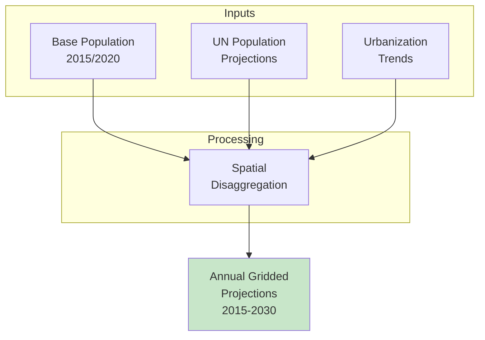

# 📈 Downloading WorldPop Population Projections

## Overview

**WorldPop Global Projections (R2025A)** provides gridded population estimates for 2015-2030, enabling future scenario planning for disease burden, climate adaptation, and development. This tutorial shows how to download projected population and convert to density for modeling applications.

<div class="grid cards" markdown>

-   :material-account-group: **Dataset**
    
    ---
    
    WorldPop Global 2015-2030
    
    **Version:** R2025A  
    **Resolution:** 1 km  
    **Coverage:** Ethiopia (ETH)  
    **Format:** GeoTIFF

-   :material-chart-timeline: **Temporal**
    
    ---
    
    **Range:** 2015–2030  
    **Frequency:** Annual  
    **Type:** Projections  
    **Method:** Constrained

-   :material-map-marker: **Spatial**
    
    ---
    
    **CRS:** WGS84 (EPSG:4326)  
    **Grid:** ~1 km × 1 km  
    **Units:** Persons per cell  
    **Constrained:** Yes

-   :material-download: **Access**
    
    ---
    
    **Source:** WorldPop  
    **Method:** HTTP download  
    **Auth:** None required  
    **Size:** ~50 MB per file

</div>

---

## 🎯 What This Script Does


The script performs the following operations:

1. **Downloads** projected population GeoTIFF from WorldPop
2. **Reads** population counts per grid cell
3. **Computes** cell area using spherical geometry
4. **Calculates** population density (persons/km²)
5. **Saves** as NetCDF for model input

---

## 📊 Understanding Population Projections

### What is WorldPop R2025A?

WorldPop R2025A provides constrained population projections:



### Constrained vs Unconstrained

| Type | Description | Use Case |
|------|-------------|----------|
| **Constrained** | Population within settlement areas only | More realistic spatial distribution |
| **Unconstrained** | Population spread across all land | Broader coverage, less realistic |

!!! tip "Recommendation"
    Use **constrained** projections (default) for most applications as they better represent actual population distribution.

### Available Years

| Year Range | Description |
|------------|-------------|
| **2015** | Base year (observed) |
| **2016-2019** | Near-term projections |
| **2020** | Reference year |
| **2021-2025** | Medium-term projections |
| **2026-2030** | Long-term projections |

---

## 🚀 Quick Start Guide

### Prerequisites

!!! info "Required Python Packages"
    ```bash
    pip install requests xarray rioxarray netCDF4 numpy
    ```

### Basic Usage

=== "Year 2030"
    ```bash
    python download_worldpop_projections.py \
        --year 2030 \
        --out-nc data/pop_ethiopia_2030_km2.nc
    ```

=== "Year 2025"
    ```bash
    python download_worldpop_projections.py \
        --year 2025 \
        --out-nc data/pop_ethiopia_2025_km2.nc
    ```

=== "Current Year 2020"
    ```bash
    python download_worldpop_projections.py \
        --year 2020 \
        --out-nc data/pop_ethiopia_2020_km2.nc
    ```

---

## 📋 The Complete Script

### Python Download Script

Save this as `download_worldpop_projections.py`:

```python
#!/usr/bin/env python
"""
Download WorldPop Global_2015_2030 / R2025A (ETH, 1km constrained)
and convert to population density (persons/km²) in NetCDF format.

Example:
    python download_worldpop_projections.py \
        --year 2030 \
        --out-nc data/pop_eth_worldpop_R2025A_2030_km2.nc
"""

import argparse
from pathlib import Path

import numpy as np
import xarray as xr
import rioxarray as rxr
import requests

EARTH_RADIUS_KM = 6371.0088


def download_file(url: str, out_path: Path, chunk_size: int = 2**20) -> Path:
    """
    Download file from URL if not already present.
    
    Parameters
    ----------
    url : str
        URL to download
    out_path : Path
        Local file path
    chunk_size : int
        Download chunk size in bytes
    
    Returns
    -------
    Path
        Path to downloaded file
    """
    out_path = Path(out_path)
    out_path.parent.mkdir(parents=True, exist_ok=True)

    if out_path.exists():
        print(f"[info] File already exists, skipping download: {out_path}")
        return out_path

    print(f"[info] Downloading from:\n       {url}")
    
    with requests.get(url, stream=True, timeout=300) as r:
        r.raise_for_status()
        total = int(r.headers.get("Content-Length", 0) or 0)
        downloaded = 0
        
        with open(out_path, "wb") as f:
            for chunk in r.iter_content(chunk_size=chunk_size):
                if chunk:
                    f.write(chunk)
                    downloaded += len(chunk)
                    if total:
                        pct = 100 * downloaded / total
                        print(
                            f"\r[info] Downloaded {downloaded/1e6:.1f}/{total/1e6:.1f} MB ({pct:.1f}%)",
                            end=""
                        )

    print(f"\n[info] Saved to {out_path}")
    return out_path


def build_worldpop_R2025A_url(year: int, country: str = "ETH") -> str:
    """
    Build download URL for WorldPop R2025A 1km constrained GeoTIFF.

    Parameters
    ----------
    year : int
        Projection year (2015-2030)
    country : str
        ISO3 country code (default: ETH for Ethiopia)

    Returns
    -------
    str
        Download URL

    Example URL (2030):
    https://data.worldpop.org/GIS/Population/Global_2015_2030/R2025A/2030/ETH/v1/1km_ua/constrained/eth_pop_2030_CN_1km_R2025A_UA_v1.tif
    """
    if year < 2015 or year > 2030:
        raise ValueError(f"Year must be between 2015 and 2030, got {year}")
    
    base = "https://data.worldpop.org/GIS/Population/Global_2015_2030/R2025A"
    iso3 = country.upper()
    iso3_lower = country.lower()
    fname = f"{iso3_lower}_pop_{year}_CN_1km_R2025A_UA_v1.tif"
    return f"{base}/{year}/{iso3}/v1/1km_ua/constrained/{fname}"


def compute_cell_area_km2(lat: np.ndarray, lon: np.ndarray) -> xr.DataArray:
    """
    Compute cell area in km² for each grid cell using spherical geometry.
    
    Parameters
    ----------
    lat : np.ndarray
        1D array of latitude values
    lon : np.ndarray
        1D array of longitude values
    
    Returns
    -------
    xr.DataArray
        2D array of cell areas in km²
    """
    if lat.size < 2 or lon.size < 2:
        raise ValueError("Need at least 2 lat and 2 lon points to compute cell area.")

    lat_rad = np.deg2rad(lat)
    dlat = np.abs(lat_rad[1] - lat_rad[0])
    dlon = np.abs(np.deg2rad(lon[1] - lon[0]))

    phi1 = lat_rad - 0.5 * dlat
    phi2 = lat_rad + 0.5 * dlat

    row_areas = (EARTH_RADIUS_KM ** 2) * dlon * (np.sin(phi2) - np.sin(phi1))
    area2d = np.repeat(row_areas[:, np.newaxis], lon.size, axis=1)

    return xr.DataArray(
        area2d,
        coords={"lat": lat, "lon": lon},
        dims=("lat", "lon"),
        name="cell_area",
        attrs={"units": "km2", "long_name": "grid-cell area"},
    )


def tif_to_density_nc(
    tif_path: Path, 
    out_nc: Path, 
    var_name: str = "pop_density",
    year: int = None,
) -> None:
    """
    Convert GeoTIFF population counts to density NetCDF.
    
    Parameters
    ----------
    tif_path : Path
        Input GeoTIFF path
    out_nc : Path
        Output NetCDF path
    var_name : str
        Output variable name
    year : int
        Projection year (for metadata)
    """
    tif_path = Path(tif_path)
    out_nc = Path(out_nc)
    out_nc.parent.mkdir(parents=True, exist_ok=True)

    print(f"[info] Reading GeoTIFF: {tif_path}")
    da = rxr.open_rasterio(tif_path, masked=True).squeeze(drop=True)
    da = da.rename({"x": "lon", "y": "lat"})

    # Ensure latitude is ascending
    if float(da.lat[0]) > float(da.lat[-1]):
        da = da.sortby("lat")

    # Set CRS if missing
    if not da.rio.crs:
        da = da.rio.write_crs("EPSG:4326", inplace=True)

    print(f"[info] Grid size: {da.lat.size} x {da.lon.size}")
    print(f"[info] Lat range: {float(da.lat.min()):.3f} to {float(da.lat.max()):.3f}")
    print(f"[info] Lon range: {float(da.lon.min()):.3f} to {float(da.lon.max()):.3f}")

    # Compute cell areas
    print("[info] Computing cell areas...")
    area = compute_cell_area_km2(da["lat"].values, da["lon"].values)
    
    # Calculate density
    print("[info] Computing population density...")
    density = (da / area).astype("float32")
    density.name = var_name
    density.attrs.update({
        "units": "persons km-2",
        "long_name": "Projected population density",
        "source": "WorldPop Global_2015_2030 R2025A (country=ETH, 1km_ua/constrained)",
        "projection_year": year if year else "unknown",
    })

    # Create dataset
    ds_out = density.to_dataset()
    ds_out["lat"].attrs.update({
        "units": "degrees_north", 
        "standard_name": "latitude"
    })
    ds_out["lon"].attrs.update({
        "units": "degrees_east", 
        "standard_name": "longitude"
    })
    
    # Global attributes
    ds_out.attrs["title"] = f"WorldPop Population Projection {year}"
    ds_out.attrs["source"] = "WorldPop Global_2015_2030 R2025A"
    ds_out.attrs["institution"] = "WorldPop, University of Southampton"
    ds_out.attrs["references"] = "https://www.worldpop.org/"

    # Encoding
    encoding = {
        var_name: {
            "_FillValue": np.float32(np.nan),
            "zlib": True,
            "complevel": 4,
        }
    }

    print(f"[info] Writing NetCDF: {out_nc}")
    ds_out.to_netcdf(out_nc, encoding=encoding)
    
    # Summary statistics
    valid_density = density.values[np.isfinite(density.values)]
    if valid_density.size > 0:
        print(f"[info] Density statistics:")
        print(f"       Min: {valid_density.min():.2f} persons/km²")
        print(f"       Max: {valid_density.max():.2f} persons/km²")
        print(f"       Mean: {valid_density.mean():.2f} persons/km²")
    
    print("[info] Done.")


def main():
    parser = argparse.ArgumentParser(
        description="Download WorldPop Global_2015_2030 / R2025A and convert to persons/km² NetCDF",
        formatter_class=argparse.RawDescriptionHelpFormatter,
        epilog="""
Examples:
  # Download 2030 projection
  python download_worldpop_projections.py \\
      --year 2030 \\
      --out-nc data/pop_ethiopia_2030_km2.nc

  # Download 2025 projection
  python download_worldpop_projections.py \\
      --year 2025 \\
      --out-nc data/pop_ethiopia_2025_km2.nc

  # Download with custom variable name
  python download_worldpop_projections.py \\
      --year 2030 \\
      --out-nc data/pop_projection.nc \\
      --var-name population
        """
    )
    parser.add_argument(
        "--year",
        type=int,
        default=2030,
        help="Projection year between 2015 and 2030 (default: 2030)",
    )
    parser.add_argument(
        "--cache-dir",
        type=str,
        default="data/worldpop_projections",
        help="Directory to cache downloaded GeoTIFF (default: data/worldpop_projections)",
    )
    parser.add_argument(
        "--out-nc",
        type=str,
        required=True,
        help="Output NetCDF path (e.g. data/pop_ethiopia_2030_km2.nc)",
    )
    parser.add_argument(
        "--var-name",
        type=str,
        default="pop_density",
        help="Name of output variable (default: pop_density)",
    )
    args = parser.parse_args()

    # Validate year
    if args.year < 2015 or args.year > 2030:
        raise SystemExit(f"Error: Year must be between 2015 and 2030, got {args.year}")

    print(f"\n{'#'*60}")
    print(f"# WorldPop Population Projection Download")
    print(f"# Year: {args.year}")
    print(f"# Version: R2025A (1km constrained)")
    print(f"{'#'*60}\n")

    url = build_worldpop_R2025A_url(args.year)
    cache_dir = Path(args.cache_dir)
    tif_path = cache_dir / Path(url).name

    download_file(url, tif_path)
    tif_to_density_nc(tif_path, Path(args.out_nc), var_name=args.var_name, year=args.year)

    print(f"\n{'#'*60}")
    print(f"# Download and processing complete!")
    print(f"# Output: {args.out_nc}")
    print(f"{'#'*60}\n")


if __name__ == "__main__":
    main()
```

---

## 🔧 Command-Line Arguments

### Required Arguments

| Argument | Type | Description | Example |
|----------|------|-------------|---------|
| `--out-nc` | String | Output NetCDF file path | `data/pop_2030.nc` |

### Optional Arguments

| Argument | Type | Description | Default |
|----------|------|-------------|---------|
| `--year` | Integer | Projection year (2015-2030) | `2030` |
| `--cache-dir` | String | Directory for GeoTIFF cache | `data/worldpop_projections` |
| `--var-name` | String | Output variable name | `pop_density` |

---

## 📊 Available Projection Years

### Download Multiple Years

```bash
#!/bin/bash
# download_all_projections.sh

OUTDIR="data/worldpop_projections"

for YEAR in 2015 2020 2025 2030; do
    echo "Downloading $YEAR projection..."
    python download_worldpop_projections.py \
        --year $YEAR \
        --out-nc "$OUTDIR/pop_ethiopia_${YEAR}_km2.nc"
done

echo "All projections downloaded!"
```

### Year-by-Year Download

```bash
#!/bin/bash
# download_annual_projections.sh

OUTDIR="data/worldpop_projections"

for YEAR in $(seq 2015 2030); do
    echo "Downloading $YEAR..."
    python download_worldpop_projections.py \
        --year $YEAR \
        --out-nc "$OUTDIR/pop_ethiopia_${YEAR}_km2.nc"
done

echo "All annual projections downloaded!"
```

---

## 💡 Usage Examples

### Example 1: Single Year (2030)

```bash
python download_worldpop_projections.py \
    --year 2030 \
    --out-nc data/pop_ethiopia_2030_km2.nc
```

**What it does:**

- Downloads 2030 projection GeoTIFF
- Converts to population density
- Saves as compressed NetCDF
- ~2-5 minutes

---

### Example 2: Compare 2020 vs 2030

```bash
# Download both years
python download_worldpop_projections.py \
    --year 2020 \
    --out-nc data/pop_ethiopia_2020_km2.nc

python download_worldpop_projections.py \
    --year 2030 \
    --out-nc data/pop_ethiopia_2030_km2.nc
```

---

### Example 3: Custom Variable Name

```bash
python download_worldpop_projections.py \
    --year 2030 \
    --out-nc data/population_projection.nc \
    --var-name population
```

---

### Example 4: Different Cache Directory

```bash
python download_worldpop_projections.py \
    --year 2030 \
    --cache-dir /data/worldpop_cache \
    --out-nc data/pop_ethiopia_2030_km2.nc
```

---

## 📂 Output Directory Structure

After running the script, your output directory will contain:

```
data/
├── worldpop_projections/
│   ├── eth_pop_2020_CN_1km_R2025A_UA_v1.tif    # Cached GeoTIFF
│   ├── eth_pop_2025_CN_1km_R2025A_UA_v1.tif
│   └── eth_pop_2030_CN_1km_R2025A_UA_v1.tif
├── pop_ethiopia_2020_km2.nc                     # Output NetCDF
├── pop_ethiopia_2025_km2.nc
└── pop_ethiopia_2030_km2.nc
```

---

## 🔍 Verifying Your Download

After downloading, verify your data using Python:

```python
import xarray as xr
import matplotlib.pyplot as plt
import numpy as np

# Open projection file
ds = xr.open_dataset('data/pop_ethiopia_2030_km2.nc')

# Display dataset information
print(ds)
print(f"\nDimensions: {dict(ds.dims)}")
print(f"Units: {ds.pop_density.attrs.get('units', 'unknown')}")
print(f"Year: {ds.pop_density.attrs.get('projection_year', 'unknown')}")

# Statistics
pop = ds.pop_density
valid = pop.values[np.isfinite(pop.values)]
print(f"\nPopulation density statistics:")
print(f"  Min: {valid.min():.2f} persons/km²")
print(f"  Max: {valid.max():.2f} persons/km²")
print(f"  Mean: {valid.mean():.2f} persons/km²")

# Plot population density
fig, ax = plt.subplots(figsize=(12, 10))
pop.plot(
    ax=ax, 
    cmap='YlOrRd',
    norm=plt.matplotlib.colors.LogNorm(vmin=1, vmax=10000),
    cbar_kwargs={'label': 'Population density (persons/km²)'}
)
ax.set_title('WorldPop Population Projection - Ethiopia 2030')
ax.set_xlabel('Longitude')
ax.set_ylabel('Latitude')
plt.savefig('worldpop_projection_2030.png', dpi=150, bbox_inches='tight')
plt.show()
```

---

## 📈 Analyzing Population Growth

### Compare Years

```python
import xarray as xr
import matplotlib.pyplot as plt
import numpy as np

# Load multiple years
ds_2020 = xr.open_dataset('data/pop_ethiopia_2020_km2.nc')
ds_2030 = xr.open_dataset('data/pop_ethiopia_2030_km2.nc')

# Compute change
pop_2020 = ds_2020.pop_density
pop_2030 = ds_2030.pop_density

# Absolute change
change = pop_2030 - pop_2020

# Percent change (where 2020 > 0)
pct_change = ((pop_2030 - pop_2020) / pop_2020) * 100
pct_change = pct_change.where(pop_2020 > 0)

# Plot comparison
fig, axes = plt.subplots(1, 3, figsize=(18, 6))

# 2020
pop_2020.plot(ax=axes[0], cmap='YlOrRd', 
              norm=plt.matplotlib.colors.LogNorm(vmin=1, vmax=10000))
axes[0].set_title('2020 Population Density')

# 2030
pop_2030.plot(ax=axes[1], cmap='YlOrRd',
              norm=plt.matplotlib.colors.LogNorm(vmin=1, vmax=10000))
axes[1].set_title('2030 Population Density')

# Change
change.plot(ax=axes[2], cmap='RdYlGn_r', center=0, vmin=-100, vmax=500,
            cbar_kwargs={'label': 'Change (persons/km²)'})
axes[2].set_title('Population Change (2030 - 2020)')

plt.tight_layout()
plt.savefig('population_change_2020_2030.png', dpi=150, bbox_inches='tight')
plt.show()

# Statistics
print(f"2020 total (approx): {float(pop_2020.sum()):.0f}")
print(f"2030 total (approx): {float(pop_2030.sum()):.0f}")
print(f"Mean change: {float(change.mean()):.2f} persons/km²")
```

### Population Growth Rate

```python
import xarray as xr
import numpy as np

# Load years
years = [2015, 2020, 2025, 2030]
totals = []

for year in years:
    ds = xr.open_dataset(f'data/pop_ethiopia_{year}_km2.nc')
    total = float(ds.pop_density.sum())
    totals.append(total)
    print(f"{year}: {total/1e6:.2f} million (density sum)")

# Plot trend
import matplotlib.pyplot as plt

plt.figure(figsize=(10, 6))
plt.plot(years, [t/1e6 for t in totals], 'o-', linewidth=2, markersize=10)
plt.xlabel('Year')
plt.ylabel('Population (millions, density sum)')
plt.title('Ethiopia Population Growth Projection')
plt.grid(True, alpha=0.3)
plt.savefig('population_trend.png', dpi=150, bbox_inches='tight')
plt.show()
```

---

## 🔄 Combining with Climate Projections

### Future Exposure Analysis

```python
import xarray as xr

# Load population projection
ds_pop = xr.open_dataset('data/pop_ethiopia_2030_km2.nc')
pop = ds_pop.pop_density

# Load future temperature (e.g., CHC-CMIP6)
ds_temp = xr.open_dataset('data/CHC_CMIP6/2030_SSP245/temperature/2030_SSP245_Tavg_2030_daily.nc')
temp_mean = ds_temp.tavg.mean(dim='time')

# Regrid population to temperature grid
pop_regrid = pop.interp(lat=temp_mean.lat, lon=temp_mean.lon)

# Compute population-weighted temperature
weighted_temp = (temp_mean * pop_regrid).sum() / pop_regrid.sum()
print(f"Population-weighted mean temperature: {float(weighted_temp):.1f}°C")

# Population exposed to high temperatures
hot_threshold = 30  # °C
pop_exposed = pop_regrid.where(temp_mean > hot_threshold).sum()
total_pop = pop_regrid.sum()
pct_exposed = 100 * pop_exposed / total_pop
print(f"Population exposed to >{hot_threshold}°C: {float(pct_exposed):.1f}%")
```

---

## ⚠️ Troubleshooting

### Common Issues and Solutions

=== "Download Failed"

    **Problem:** HTTP error during download
    
    ```
    requests.exceptions.HTTPError: 404 Client Error
    ```
    
    **Solutions:**
    
    1. **Check year:** Must be 2015-2030
    2. **Check URL:** Verify file exists on WorldPop
    3. **Try browser:** Download manually and place in cache-dir

=== "Year Out of Range"

    **Problem:** Invalid year specified
    
    ```
    ValueError: Year must be between 2015 and 2030
    ```
    
    **Solution:** Use a year between 2015 and 2030 inclusive.

=== "Memory Error"

    **Problem:** Out of memory reading GeoTIFF
    
    **Solutions:**
    
    1. **Close other applications**
    2. **Process smaller regions**
    3. **Use chunked processing**

=== "CRS Missing"

    **Problem:** GeoTIFF has no CRS
    
    **Solution:** Script automatically sets EPSG:4326 (WGS84).

=== "File Already Exists"

    **Problem:** Want to re-download
    
    **Solution:** Delete the cached GeoTIFF file:
    ```bash
    rm data/worldpop_projections/eth_pop_2030_CN_1km_R2025A_UA_v1.tif
    ```

---

## 🎓 Data Quality Notes

!!! success "Strengths"
    - **Annual projections** - 2015 to 2030
    - **1 km resolution** - Good for regional analysis
    - **Constrained** - Realistic spatial distribution
    - **UN-aligned** - Consistent with official projections
    - **Free access** - No registration required

!!! warning "Limitations"
    - **Projections** - Not observations
    - **Uncertainty** - Increases with projection horizon
    - **Single scenario** - No alternative pathways
    - **Country-specific** - Need separate downloads per country

!!! tip "Best Practices"
    - **Compare with historical** - Validate against 2015/2020
    - **Consider uncertainty** - Use for scenarios, not predictions
    - **Document version** - R2025A in publications
    - **Combine with climate** - For future impact studies

---

## 📖 Additional Resources

### Official Documentation

- **WorldPop:** [https://www.worldpop.org/](https://www.worldpop.org/)
- **Global 2015-2030:** [https://hub.worldpop.org/geodata/listing?id=77](https://hub.worldpop.org/geodata/listing?id=77)
- **Methods:** Tatem (2017) - Scientific Data

### Related Datasets

- **WorldPop Historical:** 2000-2020 estimates
- **AfriPop:** Higher resolution for Africa
- **GPW v4:** NASA alternative

### Related Tutorials

- [WorldPop Population](25-download_worldpop_population.md) - Historical data
- [CHC-CMIP6 Temperature](21-download_chc_cmip6_temp_daily.md) - Future climate
- [Climate Data Access](../../day3/09-climate_data_access_and_extraction.md) - Overview

---

## 🚀 Next Steps

<div class="grid cards" markdown>

-   :material-chart-line: **Trend Analysis**
    
    ---
    
    Population growth rates  
    Urban expansion  
    
    → [Xarray Tutorial](../../day3/06-Xarray_for_Climate_and_Meteorology_Workshop.md)

-   :material-map: **Visualize Projections**
    
    ---
    
    Future population maps  
    Change detection  
    
    → [Matplotlib Tutorial](../../day3/05-Matplotlib_for_Climate_and_Meteorology_Workshop.md)

-   :material-thermometer: **Climate Exposure**
    
    ---
    
    Future temperature exposure  
    Population at risk  
    
    → [CHC-CMIP6 Tutorial](21-download_chc_cmip6_temp_daily.md)

-   :material-bug: **VECTRI Scenarios**
    
    ---
    
    Future disease burden  
    Climate-population interactions  
    
    → [VECTRI Model](../../day1/vectri_model_components_larvae_to_hydrology.md)

</div>

---

!!! example "Need Help?"
    If you encounter issues or have questions:
    
    - Check the [Troubleshooting](#troubleshooting) section
    - Review [WorldPop Documentation](https://www.worldpop.org/)
    - Contact workshop instructors

---

<div style="background: linear-gradient(135deg, #1565c0 0%, #42a5f5 100%); color: white; padding: 2rem; border-radius: 8px; text-align: center; margin-top: 2rem;">
  <h3 style="margin: 0 0 1rem 0;">📈 Ready for Future Population Analysis!</h3>
  <p style="margin: 0; opacity: 0.95;">You now have everything you need to download WorldPop population projections for future scenario planning and climate-population impact studies.</p>
</div>

