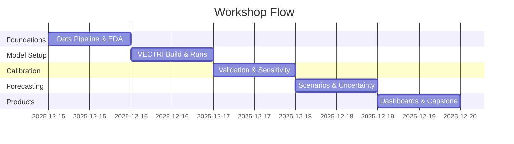

# Schedule

!!! info "Workshop Hours"
    **Time:** 09:00–17:00 daily (UTC+03:00, Africa/Addis_Ababa)  
    **Coffee Breaks:** 10:30–10:45 & 15:30–15:45  
    **Lunch:** 12:30–14:00

---

## Day 1 — Foundations & Data Pipeline
**Monday, 15 December 2025**

| Time | Session | Type |
|------|---------|------|
| 09:00–09:30 | Opening, goals, expectations & ice-breaker | Plenary |
| 09:30–10:30 | Climate–malaria pathways; VECTRI overview | Lecture |
| 10:30–10:45 | ☕ Coffee Break | |
| 10:45–12:30 | **Lab 1:** Setup (conda, Lmod) & repo structure | Hands-on |
| 12:30–14:00 | 🍽️ Lunch | |
| 14:00–15:30 | **Lab 2:** Download CHIRPS/ERA5-Land data | Hands-on |
| 15:30–15:45 | ☕ Coffee Break | |
| 15:45–17:00 | **Lab 3:** Preprocess to VECTRI grid; quick EDA | Hands-on |

!!! success "Day 1 Deliverables"
    - Conda environment configured
    - Raw & processed NetCDF files
    - Region mask created
    - EDA notebook with climate diagnostics

---

## Day 2 — VECTRI Configuration & Baseline Runs
**Tuesday, 16 December 2025**

| Time | Session | Type |
|------|---------|------|
| 09:00–09:15 | Day 1 recap & Q&A | Discussion |
| 09:15–10:30 | VECTRI architecture & parameters; config files | Lecture |
| 10:30–10:45 | ☕ Coffee Break | |
| 10:45–12:30 | **Lab 4:** Build/compile VECTRI; inputs & layout | Hands-on |
| 12:30–14:00 | 🍽️ Lunch | |
| 14:00–15:30 | **Lab 5:** Single-location run & output interpretation | Hands-on |
| 15:30–15:45 | ☕ Coffee Break | |
| 15:45–17:00 | **Lab 6:** Gridded runs; logging & quality control | Hands-on |

!!! success "Day 2 Deliverables"
    - Compiled VECTRI executable
    - Configuration files for study region
    - Baseline simulation outputs (EIR, vector density)
    - Diagnostic plots & validation notebook

---

## Day 3 — Calibration, Validation & Sensitivity
**Wednesday, 17 December 2025**

| Time | Session | Type |
|------|---------|------|
| 09:00–09:15 | Day 2 recap & troubleshooting | Discussion |
| 09:15–10:30 | Calibration methods; HMIS/DHIS2 data integration | Lecture |
| 10:30–10:45 | ☕ Coffee Break | |
| 10:45–12:30 | **Lab 7:** Prepare health surveillance data | Hands-on |
| 12:30–14:00 | 🍽️ Lunch | |
| 14:00–15:30 | **Lab 8:** Calibration & parameter tuning | Hands-on |
| 15:30–15:45 | ☕ Coffee Break | |
| 15:45–17:00 | **Lab 9:** Validation metrics; sensitivity analysis | Hands-on |

!!! success "Day 3 Deliverables"
    - Calibrated VECTRI parameters
    - Validation report (correlation, RMSE, bias)
    - Sensitivity analysis results
    - Regional skill assessment

---

## Day 4 — Forecasting, Scenarios & Uncertainty
**Thursday, 18 December 2025**

| Time | Session | Type |
|------|---------|------|
| 09:00–09:15 | Day 3 recap & discussion | Discussion |
| 09:15–10:30 | Seasonal forecasting; climate scenarios (SSPs) | Lecture |
| 10:30–10:45 | ☕ Coffee Break | |
| 10:45–12:30 | **Lab 10:** Seasonal outlook with forecast climate data | Hands-on |
| 12:30–14:00 | 🍽️ Lunch | |
| 14:00–15:30 | **Lab 11:** Climate change scenarios (RCP/SSP) | Hands-on |
| 15:30–15:45 | ☕ Coffee Break | |
| 15:45–17:00 | **Lab 12:** Ensemble runs & uncertainty quantification | Hands-on |

!!! success "Day 4 Deliverables"
    - Seasonal malaria outlook (3-month ahead)
    - Climate change scenario runs (2030, 2050)
    - Ensemble forecast with uncertainty bounds
    - IBF-style risk maps

---

## Day 5 — Decision Products, Communication & Capstone
**Friday, 19 December 2025**

| Time | Session | Type |
|------|---------|------|
| 09:00–09:30 | Decision support & stakeholder communication | Lecture |
| 09:30–10:30 | Dashboard design principles; Streamlit demo | Demo |
| 10:30–10:45 | ☕ Coffee Break | |
| 10:45–12:30 | **Lab 13:** Build mini-dashboard (Streamlit/Folium) | Hands-on |
| 12:30–14:00 | 🍽️ Lunch | |
| 14:00–15:30 | **Capstone Project:** Team presentations (15 min each) | Presentations |
| 15:30–15:45 | ☕ Coffee Break | |
| 15:45–16:30 | Panel discussion: Operational implementation challenges | Discussion |
| 16:30–17:00 | Closing remarks, certificates, next steps | Plenary |

!!! success "Day 5 Deliverables (Capstone)"
    - **Interactive dashboard** with seasonal outlook
    - **2-page policy brief** with key findings
    - **Presentation slide deck** (10-15 slides)
    - **Code repository** (GitHub/GitLab)

---

## Weekly Overview

---

## Important Notes

!!! warning "Lab Dependencies"
    Each lab builds on previous ones. If you fall behind, notify instructors immediately for catch-up support.

!!! tip "Time Management"
    - Labs include buffer time for troubleshooting
    - Bonus challenges provided for fast learners
    - Evening hours available for optional office hours (17:30-18:30)

!!! info "Daily Rhythm"
    - Morning: Theory + guided labs
    - Afternoon: Independent/team work with instructor support
    - End-of-day: Quick demos & peer learning

---

## Office Hours & Support

**Daily Office Hours:** 17:30–18:30 (optional)  
**Slack/Teams:** Active support throughout the day  
**Instructor Availability:** Circulating during all lab sessions
