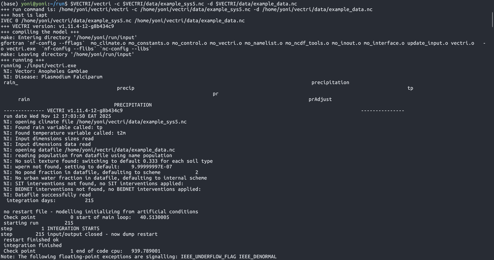

# Setup

This guide covers the complete setup process for running VECTRI, including WSL installation for Windows users and the VECTRI model installation on Ubuntu.

---

## 🖥️ VECTRI and WSL installation

=== ":fontawesome-brands-windows: Windows Users"

    Follow the **WSL Installation** tab first to set up Windows Subsystem for Linux, then proceed to the **VECTRI Installation** tab.

=== ":fontawesome-brands-linux: Linux Users"

    Skip directly to the **VECTRI Installation** tab if you're already running Ubuntu 22.04 LTS.

---

=== "WSL Installation"

    # 🪟 Windows Subsystem for Linux (WSL)

    ## What is WSL?

    **Windows Subsystem for Linux (WSL)** is a feature of Windows that allows you to run a Linux environment directly on Windows, without the need for a separate virtual machine or dual booting.

    ### Why Use WSL for VECTRI?

    <div class="grid cards" markdown>

    -   :material-linux: **Native Linux Environment**
        
        ---
        
        Run Linux commands, tools, and applications directly on Windows without modification.

    -   :material-speedometer: **High Performance**
        
        ---
        
        WSL 2 uses a real Linux kernel, providing near-native performance for scientific computing.

    -   :material-folder-sync: **Seamless Integration**
        
        ---
        
        Access Windows files from Linux and vice versa. Use VS Code with WSL backend.

    -   :material-package-variant: **Full Compatibility**
        
        ---
        
        Install and run VECTRI, NetCDF libraries, and all Linux-based scientific tools.

    </div>

    !!! tip "WSL 2 Recommended"
        WSL 2 is the recommended version for VECTRI as it provides:
        
        - Full Linux kernel compatibility
        - Better file system performance
        - Full system call compatibility
        - Support for Docker and other Linux tools

    ---

    ## Prerequisites

    Before you start, ensure you have:

    - ✅ **Administrator access** on your PC
    - ✅ **Hardware virtualization enabled** in BIOS/UEFI (Intel VT-x / AMD-V)
    - ✅ A reasonably up-to-date Windows build (Windows 10 version 2004+ or Windows 11)

    ---

    ## Step 0: Enable Windows Features (GUI Method)

    Before installing WSL, you can manually enable the required Windows features:

    !!! info "Enable WSL via Control Panel"

        1. **Navigate to Control Panel**
           - Press `Win + R`, type `control`, press Enter
           - Or search "Control Panel" in the Start menu

        2. **Open Programs and Features**
           - Click on **Programs**
           - Click on **Programs and Features**

        3. **Turn Windows Features On or Off**
           - In the left sidebar, click **Turn Windows features on or off**
           - A dialog box will appear

        4. **Enable Required Features**
           - ✅ Tick **Virtual Machine Platform**
           - ✅ Tick **Windows Subsystem for Linux**
           - Click **OK**

        5. **Restart Your Computer**
           - Windows will apply the changes
           - Restart when prompted


    ---

    ## How to Open CMD as Administrator

    1. Press **Start** (Windows key)
    2. Type **cmd**
    3. Right-click **Command Prompt**
    4. Select **Run as administrator**

    ---

    ## Installation Instructions

    === "Windows 11"

        ### Quick Install (Recommended)

        Windows 11 typically supports the simplest installation path.

        #### Step 1: Install WSL

        Open **CMD as Administrator** and run:

        ```bat
        wsl --install
        ```

        This command:
        
        - ✅ Enables required Windows features
        - ✅ Installs the WSL kernel
        - ✅ Installs Ubuntu (default distribution)

        #### Step 2: Restart Your Computer

        **Restart** Windows to complete the installation.

        #### Step 3: First Launch

        1. Open **Ubuntu** from the Start menu
        2. Create your Linux **username**
        3. Create your Linux **password**

        #### Step 4: Verify Installation

        ```bat
        wsl --status
        wsl -l -v
        ```

        ✅ Confirm your distro shows **VERSION 2**.

        #### Step 5: Update WSL (Optional but Recommended)

        ```bat
        wsl --update
        ```

        #### Install Ubuntu 22.04 (Recommended for VECTRI)

        ```bat
        wsl --list --online
        wsl --install -d Ubuntu-22.04
        ```

    === "Windows 10"

        ### Quick Install (Recommended)

        #### Step 1: Install WSL

        Open **CMD as Administrator** and run:

        ```bat
        wsl --install
        ```

        This command:
        
        - ✅ Enables required Windows features
        - ✅ Installs the WSL kernel
        - ✅ Installs Ubuntu (default distribution)

        #### Step 2: Restart Your Computer

        **Restart** Windows to complete the installation.

        #### Step 3: First Launch

        1. Open **Ubuntu** from the Start menu
        2. Create your Linux **username**
        3. Create your Linux **password**

        #### Step 4: Verify WSL Version

        ```bat
        wsl --status
        wsl -l -v
        ```

        ✅ Confirm your distro shows **VERSION 2**.

        ---

        ### Manual Install (If Quick Install Fails)

        Use this method if:
        
        - Your Windows 10 build is older
        - The one-command install is blocked by policy

        #### Step 1: Enable WSL Feature

        Open **CMD as Administrator**:

        ```bat
        dism.exe /online /enable-feature /featurename:Microsoft-Windows-Subsystem-Linux /all /norestart
        ```

        #### Step 2: Enable Virtual Machine Platform

        ```bat
        dism.exe /online /enable-feature /featurename:VirtualMachinePlatform /all /norestart
        ```

        #### Step 3: Restart Your Computer

        **Restart** Windows.

        #### Step 4: Set WSL 2 as Default

        ```bat
        wsl --set-default-version 2
        ```

        #### Step 5: Install Ubuntu

        1. Open **Microsoft Store**
        2. Search for **Ubuntu**
        3. Install **Ubuntu 22.04 LTS** (recommended)

        #### Step 6: Launch and Configure

        1. Open **Ubuntu** from Start menu
        2. Create your Linux **username** and **password**

    ---

    ## 🔧 Troubleshooting

    ??? warning "Virtualization is Disabled"
        
        **Symptoms:**
        
        - WSL 2 won't start
        - Errors referencing Hyper-V or virtualization
        
        **Fix:**
        
        1. Restart your computer and enter BIOS/UEFI settings
        2. Enable **Intel VT-x** or **AMD-V** (virtualization)
        3. Save and exit BIOS
        4. Run these commands again:
        
        ```bat
        dism.exe /online /enable-feature /featurename:Microsoft-Windows-Subsystem-Linux /all /norestart
        dism.exe /online /enable-feature /featurename:VirtualMachinePlatform /all /norestart
        ```
        
        5. Restart Windows

    ??? warning "Distro Installed as WSL 1"
        
        Check your distro version:
        
        ```bat
        wsl -l -v
        ```
        
        Convert to WSL 2:
        
        ```bat
        wsl --set-version Ubuntu-22.04 2
        ```
        
        Set WSL 2 as default for future installs:
        
        ```bat
        wsl --set-default-version 2
        ```

    ??? info "Common WSL Commands"
        
        ```bat
        :: List all installed distros
        wsl -l -v
        
        :: Shut down all WSL instances
        wsl --shutdown
        
        :: Update WSL
        wsl --update
        
        :: Uninstall a distro (deletes its data)
        wsl --unregister Ubuntu-22.04
        ```

    ---

    ## 📦 Post-Install: Prepare Ubuntu for VECTRI

    Once inside your Ubuntu terminal, update packages and install essential tools:

    ```bash
    sudo apt update && sudo apt upgrade -y
    sudo apt install -y build-essential git curl wget unzip gfortran
    ```

    ---

    ## 📚 Quick Reference: WSL Commands

    | Command | Description |
    |---------|-------------|
    | `wsl --install` | Install WSL + default distro |
    | `wsl --list --online` | List available distros |
    | `wsl --install -d Ubuntu-22.04` | Install specific distro |
    | `wsl -l -v` | Check installed distros and versions |
    | `wsl --set-default-version 2` | Set WSL 2 as default |
    | `wsl --set-version <Distro> 2` | Convert distro to WSL 2 |
    | `wsl --update` | Update WSL |
    | `wsl --shutdown` | Shutdown all WSL instances |
    | `wsl --unregister <Distro>` | Remove a distro |

    ---

    ## 📖 Additional Resources

    For more detailed WSL tutorials and guides, visit:

    - :material-book-open-variant: [WSL Installation Tutorial](https://yonsci.github.io/yon_academic//portfolio/portfolio-1/) - Comprehensive guide with screenshots
    - :material-microsoft: [Microsoft WSL Documentation](https://learn.microsoft.com/en-us/windows/wsl/)
    - :material-github: [WSL GitHub Repository](https://github.com/microsoft/WSL)

    ---

    !!! success "WSL Installation Complete!"
        You now have Ubuntu running on Windows. Proceed to the **WSL Post-Install** tab for Python/Data Science setup, or go directly to the **VECTRI Installation** tab.

=== "WSL Post-Install"

    # 🐍 WSL Post-Install Data Science Setup

    *Focused on Python, Conda/Mamba, Jupyter, VS Code Remote WSL, and NetCDF/xarray*

    !!! info "Prerequisites"
        This guide assumes you already installed Ubuntu 22.04 LTS via WSL 2 (see the **WSL Installation** tab).

    ---

    ## 1️⃣ Update Ubuntu Packages

    Open your Ubuntu terminal:

    ```bash
    sudo apt update
    sudo apt upgrade -y
    ```

    Install core build and utility tools:

    ```bash
    sudo apt install -y build-essential git curl wget unzip ca-certificates
    ```

    ---

    ## 2️⃣ Install Miniconda (Recommended)

    Download Miniconda:

    ```bash
    cd ~
    wget https://repo.anaconda.com/miniconda/Miniconda3-latest-Linux-x86_64.sh
    ```

    Install:

    ```bash
    bash Miniconda3-latest-Linux-x86_64.sh
    ```

    Follow prompts, then restart the terminal or run:

    ```bash
    source ~/.bashrc
    ```

    ---

    ## 3️⃣ Install Mamba (Optional but Recommended)

    Mamba is a faster drop-in replacement for conda:

    ```bash
    conda install -n base -c conda-forge mamba -y
    ```

    ---

    ## 4️⃣ Create a Data Science Environment

    ```bash
    mamba create -n ds python=3.11 -y
    conda activate ds
    ```

    Install the core scientific stack:

    ```bash
    mamba install -c conda-forge -y \
      numpy pandas scipy scikit-learn \
      matplotlib seaborn \
      jupyterlab ipykernel \
      xarray netcdf4 h5netcdf dask \
      cftime bottleneck \
      cartopy geopandas rasterio rioxarray \
      cfgrib eccodes
    ```

    !!! note "Package Notes"
        - `cartopy`, `rasterio`, and geospatial libs can be heavy; remove them for a lighter environment
        - `cfgrib` + `eccodes` helps with GRIB workflows

    Register the Jupyter kernel:

    ```bash
    python -m ipykernel install --user --name ds --display-name "Python (WSL ds)"
    ```

    ---

    ## 5️⃣ Install Node.js (Optional)

    Required for some Jupyter extensions:

    ```bash
    sudo apt install -y nodejs npm
    ```

    ---

    ## 6️⃣ JupyterLab Quick Start

    ```bash
    jupyter lab
    ```

    WSL usually auto-forwards localhost links to Windows.  
    If not, copy the URL and open it in your Windows browser.

    ---

    ## 7️⃣ VS Code + Remote WSL Workflow

    ### On Windows

    1. Install **Visual Studio Code** from [code.visualstudio.com](https://code.visualstudio.com/)
    2. Install the **WSL extension** from the Extensions tab

    ### From Ubuntu

    Open any folder in VS Code using the WSL backend:

    ```bash
    code .
    ```

    This opens the current folder in Windows VS Code, connected to WSL.

    ---

    ## 8️⃣ Recommended Folder Structure

    Create organized directories inside Ubuntu:

    ```bash
    mkdir -p ~/projects ~/data ~/notebooks
    ```

    | Folder | Purpose |
    |--------|---------|
    | `~/projects` | Code repositories and scripts |
    | `~/data` | Climate data, NetCDF files |
    | `~/notebooks` | Jupyter notebooks |

    ---

    ## 9️⃣ Accessing Windows Files

    Your Windows drives are mounted under `/mnt/`:

    ```bash
    # Access C: drive
    cd /mnt/c

    # Access your Windows Documents folder
    cd /mnt/c/Users/<YourWindowsUser>/Documents
    ```

    !!! tip "Best Practice"
        For performance and fewer path issues, keep active projects in the **Linux filesystem** (e.g., `~/projects`) and only move final outputs to `/mnt/c`.

    ---

    ## 🔟 Climate/Geo Add-ons

    Additional packages for climate and geospatial analysis:

    ```bash
    mamba install -c conda-forge -y \
      xclim xesmf regionmask \
      intake intake-xarray \
      zarr kerchunk \
      metpy
    ```

    ---

    ## 1️⃣1️⃣ Quick Test Script

    Verify your installation:

    ```python
    import xarray as xr
    import numpy as np

    print("xarray:", xr.__version__)
    da = xr.DataArray(np.random.rand(10, 5, 5), dims=("time", "lat", "lon"))
    print("Random data mean:", da.mean().item())
    ```

    ---

    ## 1️⃣2️⃣ GPU Support in WSL (Optional)

    For machine learning with GPU acceleration:

    !!! warning "Requirements"
        - Compatible NVIDIA GPU
        - Latest Windows GPU drivers
        - NVIDIA CUDA support for WSL

    Create a separate environment:

    ```bash
    mamba create -n torch python=3.11 -y
    conda activate torch
    mamba install -c pytorch -c nvidia pytorch torchvision torchaudio pytorch-cuda=12.1 -y
    ```

    Test GPU availability:

    ```bash
    python -c "import torch; print('CUDA available:', torch.cuda.is_available()); print(torch.cuda.get_device_name(0) if torch.cuda.is_available() else 'No GPU')"
    ```

    ---

    ## 🔧 Common Fixes

    ??? warning "SSL/Certificate Issues"
        ```bash
        sudo apt install -y ca-certificates
        sudo update-ca-certificates
        ```

    ??? warning "Time Sync Issues"
        Restart WSL from Windows CMD:
        ```bat
        wsl --shutdown
        ```
        Then reopen Ubuntu.

    ---

    ## 1️⃣3️⃣ Minimal Alternative (Lighter Environment)

    For a lighter setup without geospatial libraries:

    ```bash
    mamba create -n light python=3.11 -y
    conda activate light
    mamba install -c conda-forge -y \
      numpy pandas matplotlib \
      xarray netcdf4 dask jupyterlab
    ```

    ---

    ## 📚 Environment Summary

    | Environment | Purpose | Key Packages |
    |-------------|---------|--------------|
    | `ds` | Full data science | numpy, pandas, xarray, cartopy, geopandas |
    | `light` | Minimal setup | numpy, pandas, xarray, matplotlib |
    | `torch` | Machine learning | PyTorch with CUDA support |

    ---

    !!! success "Post-Install Complete!"
        Your WSL environment is now ready for data science and climate analysis. Proceed to the **VECTRI Installation** tab to install the malaria model.

=== "Docker Setup"

    # 🐳 Docker on WSL 2

    Docker enables containerized applications, making it easy to run reproducible environments for scientific computing and VECTRI workflows.

    !!! info "Prerequisites"
        This guide assumes you already have **WSL 2** installed with Ubuntu 22.04 LTS (see the **WSL Installation** tab).

    ---

    ## Confirm WSL 2 is Ready

    Open **Windows CMD as Administrator**:

    ```bat
    wsl --status
    wsl -l -v
    ```

    ✅ Your distro should show **VERSION 2**.

    ---

    ## Choose Your Installation Path

    <div class="grid cards" markdown>

    -   :material-docker: **Path A: Docker Desktop (Recommended)**
        
        ---
        
        Easiest setup with GUI management. Best for most users.
        
        [:octicons-arrow-down-24: Jump to Path A](#path-a-docker-desktop-recommended)

    -   :material-console: **Path B: Docker Engine Only**
        
        ---
        
        Lightweight, command-line only. For advanced users.
        
        [:octicons-arrow-down-24: Jump to Path B](#path-b-docker-engine-inside-wsl-advanced)

    </div>

    ---

    ## Path A: Docker Desktop (Recommended)

    ### Step 1: Remove Old Docker (Optional)

    If you have old Docker installations inside WSL, remove them first:

    ```bash
    sudo apt remove -y docker docker-engine docker.io containerd runc docker-compose docker-compose-v2 docker-doc podman-docker
    ```

    ---

    ### Step 2: Install Docker Desktop on Windows

    1. Download **Docker Desktop for Windows** from [docker.com/products/docker-desktop](https://www.docker.com/products/docker-desktop/)
    2. Run the installer
    3. Start Docker Desktop

    ---

    ### Step 3: Enable WSL 2 Engine

    In Docker Desktop:

    1. Go to **Settings** → **General**
    2. ✅ Check **Use the WSL 2 based engine**
    3. Click **Apply & Restart**

    ---

    ### Step 4: Enable WSL Integration

    In Docker Desktop:

    1. Go to **Settings** → **Resources** → **WSL Integration**
    2. ✅ Enable your Ubuntu distro
    3. Click **Apply & Restart**

    ---

    ### Step 5: Test Docker in Ubuntu

    Open your Ubuntu terminal and run:

    ```bash
    docker --version
    docker compose version
    docker run hello-world
    ```

    ✅ If `hello-world` succeeds, Docker is ready!

    ---

    ### Best Performance Tip

    Always work in the Linux filesystem for best Docker performance:

    ```bash
    mkdir -p ~/projects
    cd ~/projects
    ```

    !!! tip "Why Linux Filesystem?"
        Docker containers accessing `/mnt/c` (Windows files) are significantly slower than accessing `~/` (Linux files).

    ---

    ## Path B: Docker Engine Inside WSL (Advanced)

    This installs Docker directly inside WSL without Docker Desktop.

    ### Step 1: Install Docker Engine

    ```bash
    # Update packages
    sudo apt update && sudo apt upgrade -y

    # Install prerequisites
    sudo apt-get install -y ca-certificates curl gnupg

    # Add Docker's official GPG key
    sudo install -m 0755 -d /etc/apt/keyrings
    curl -fsSL https://download.docker.com/linux/ubuntu/gpg | sudo gpg --dearmor -o /etc/apt/keyrings/docker.gpg
    sudo chmod a+r /etc/apt/keyrings/docker.gpg

    # Add Docker repository
    echo \
      "deb [arch=$(dpkg --print-architecture) signed-by=/etc/apt/keyrings/docker.gpg] https://download.docker.com/linux/ubuntu \
      $(. /etc/os-release && echo "$VERSION_CODENAME") stable" | \
      sudo tee /etc/apt/sources.list.d/docker.list > /dev/null

    # Install Docker Engine
    sudo apt update
    sudo apt-get install -y docker-ce docker-ce-cli containerd.io docker-buildx-plugin docker-compose-plugin
    ```

    ---

    ### Step 2: Start Docker Daemon

    ```bash
    sudo service docker start
    ```

    ---

    ### Step 3: Run Docker Without Sudo (Optional)

    Add your user to the docker group:

    ```bash
    sudo usermod -aG docker $USER
    ```

    Restart WSL from Windows CMD:

    ```bat
    wsl --shutdown
    ```

    Then reopen Ubuntu.

    ---

    ### Step 4: Test Docker

    ```bash
    docker run hello-world
    ```

    ✅ If successful, Docker Engine is ready!

    ---

    ## 🔧 Troubleshooting

    ??? warning "Cannot connect to the Docker daemon"
        
        **Docker Desktop Path:**
        
        1. Ensure Docker Desktop is running (check system tray)
        2. Verify WSL Integration is enabled in Settings
        
        **Docker Engine Path:**
        
        ```bash
        sudo service docker start
        ```

    ??? warning "Permission denied"
        
        If you get permission errors:
        
        ```bash
        sudo usermod -aG docker $USER
        ```
        
        Then restart WSL:
        
        ```bat
        wsl --shutdown
        ```

    ??? info "Docker Desktop vs Docker Engine"
        
        | Feature | Docker Desktop | Docker Engine |
        |---------|----------------|---------------|
        | GUI | ✅ Yes | ❌ No |
        | Resource management | ✅ Easy | Manual |
        | Kubernetes | ✅ Built-in | Separate install |
        | Memory usage | Higher | Lower |
        | Best for | Most users | Advanced/servers |

    ---

    ## 📚 Essential Docker Commands

    | Command | Description |
    |---------|-------------|
    | `docker ps` | List running containers |
    | `docker ps -a` | List all containers |
    | `docker images` | List downloaded images |
    | `docker run <image>` | Run a container |
    | `docker stop <container>` | Stop a container |
    | `docker rm <container>` | Remove a container |
    | `docker rmi <image>` | Remove an image |
    | `docker compose up -d` | Start services (detached) |
    | `docker compose down` | Stop services |
    | `docker system prune` | Clean up unused resources |

    ---

    ## 🚀 Quick Start Examples

    ### Run Ubuntu Container

    ```bash
    docker run -it ubuntu:22.04 bash
    ```

    ### Run Python Container

    ```bash
    docker run -it python:3.11 python
    ```

    ### Run Jupyter Notebook

    ```bash
    docker run -p 8888:8888 jupyter/scipy-notebook
    ```

    Then open the URL shown in the terminal.

    ---

    ## 📖 Additional Resources

    - :material-docker: [Docker Documentation](https://docs.docker.com/)
    - :material-microsoft: [Docker Desktop WSL 2 Backend](https://docs.docker.com/desktop/wsl/)
    - :material-github: [Docker Hub](https://hub.docker.com/)

    ---

    !!! success "Docker Setup Complete!"
        You now have Docker running on WSL 2. You can use containers for reproducible scientific environments and VECTRI workflows.

=== "VECTRI Installation"

    # 🧬 VECTRI Installation Guide

    **Target OS:** Ubuntu 22.04 LTS (native or via WSL)  
    **Purpose:** Install all required libraries and build the VECTRI malaria model  

    ---

    ## 1️⃣ Set Compilers and Flags

    ```bash
    which gcc g++ gfortran
    gcc --version
    gfortran --version

    # Export compiler environment variables
    export CC=gcc
    export CXX=g++
    export FC=gfortran
    export F77=gfortran

    # Enable Fortran-10+ argument compatibility flags
    gcc_version=$(gcc -dumpversion | cut -d. -f1)
    if [ "$gcc_version" -ge 10 ]; then
      export fallow_argument="-fallow-argument-mismatch"
      export boz_argument="-fallow-invalid-boz"
    else
      export fallow_argument=""
      export boz_argument=""
    fi
    export FFLAGS="$fallow_argument $boz_argument"
    export FCFLAGS="$fallow_argument $boz_argument"
    ```

    ---

    ## 2️⃣ Create Installation Prefix Directories

    ```bash
    # Create a workspace for source downloads
    cd ~
    mkdir -p ~/download_lib && cd ~/download_lib

    sudo apt update

    sudo mkdir -p /opt/apps/libs
    BASE_DIR=/opt/apps/libs

    # Shared prefix for most libs
    ZPFX=$BASE_DIR/zlib/1.2.12
    SPFX=$BASE_DIR/szip/2.1.1
    JPFX=$BASE_DIR/jasper/1.900.1
    HPFX=$BASE_DIR/hdf5/1.12.2
    NPFX=$BASE_DIR/netcdf/4.9.0

    sudo mkdir -p $ZPFX $SPFX $JPFX $HPFX $NPFX
    ```

    ---

    ## 3️⃣ Download Sources

    ```bash
    cd ~/download_lib

    # ZLIB
    wget -c -4 https://github.com/madler/zlib/archive/refs/tags/v1.2.12.tar.gz

    # SZIP
    wget -c -4 https://support.hdfgroup.org/ftp/lib-external/szip/2.1.1/src/szip-2.1.1.tar.gz

    # JasPer (JPEG-2000)
    wget -c -4 https://www.ece.uvic.ca/~frodo/jasper/software/jasper-1.900.1.zip

    # HDF5
    wget -c -4 https://github.com/HDFGroup/hdf5/archive/refs/tags/hdf5-1_12_2.tar.gz

    # NetCDF C and Fortran
    wget -c -4 https://github.com/Unidata/netcdf-c/archive/refs/tags/v4.9.0.tar.gz
    wget -c -4 https://github.com/Unidata/netcdf-fortran/archive/refs/tags/v4.6.0.tar.gz
    ```

    ---

    ## 4️⃣ Build and Install Each Library

    ### 🔹 ZLIB

    ```bash
    tar xf v1.2.12.tar.gz
    cd zlib-1.2.12
    ./configure --prefix=$ZPFX
    make -j$(nproc)
    sudo make install
    cd ..
    ```

    ### 🔹 SZIP

    ```bash
    tar xf szip-2.1.1.tar.gz
    cd szip-2.1.1
    ./configure --prefix=$SPFX
    make -j$(nproc)
    sudo make install
    cd ..
    ```

    ### 🔹 JasPer

    ```bash
    unzip jasper-1.900.1.zip
    cd jasper-1.900.1
    autoreconf -i            # regenerate configure scripts
    ./configure --prefix=$JPFX
    make -j$(nproc)
    sudo make install
    cd ..
    ```

    ### 🔹 HDF5 (Serial build)

    ```bash
    tar xf hdf5-1_12_2.tar.gz
    cd hdf5-hdf5-1_12_2

    CPPFLAGS="-I$ZPFX/include -I$SPFX/include" \
    LDFLAGS="-L$ZPFX/lib -L$SPFX/lib" \
    ./configure --prefix=$HPFX \
        --enable-hl \
        --enable-fortran \
        --with-zlib=$ZPFX \
        --with-szlib=$SPFX

    make -j$(nproc)
    sudo make install
    cd ..
    ```

    ### 🔹 NetCDF-C

    ```bash
    tar xf v4.9.0.tar.gz
    cd netcdf-c-4.9.0

    CPPFLAGS="-I$HPFX/include" \
    LDFLAGS="-L$HPFX/lib -L$ZPFX/lib -L$SPFX/lib" \
    ./configure --prefix=$NPFX \
        --enable-netcdf-4 \
        --disable-dap

    make -j$(nproc)
    sudo make install
    cd ..
    ```

    ### 🔹 NetCDF-Fortran

    ```bash
    tar xf v4.6.0.tar.gz
    cd netcdf-fortran-4.6.0

    CPPFLAGS="-I$NPFX/include" \
    LDFLAGS="-L$NPFX/lib -Wl,-rpath,$NPFX/lib" \
    ./configure --prefix=$NPFX

    make -j$(nproc)
    sudo make install
    cd ..
    ```

    ---

    ## 5️⃣ Set Environment Variables

    Add the following to your `~/.bashrc` to make the libraries available:

    ```bash
    cat <<'EOF' >> ~/.bashrc
    # NetCDF libraries for VECTRI
    export PATH=/opt/apps/libs/netcdf/4.9.0/bin:$PATH
    export LD_LIBRARY_PATH=/opt/apps/libs/netcdf/4.9.0/lib:/opt/apps/libs/hdf5/1.12.2/lib:/opt/apps/libs/zlib/1.2.12/lib:/opt/apps/libs/szip/2.1.1/lib:$LD_LIBRARY_PATH
    export CPATH=/opt/apps/libs/netcdf/4.9.0/include:$CPATH
    EOF

    source ~/.bashrc
    ```

    ### Verify Installation

    ```bash
    which nc-config
    which nf-config
    nc-config --version
    nf-config --version
    ```

    ---

    ## 6️⃣ VECTRI Model Installation

    ### Download VECTRI

    ```bash
    cd ~
    git clone https://gitlab.com/tompkins/vectri.git  
    cd vectri
    ls 
    ```

    ### Set Environment Variables

    ```bash
    export VECTRI="$HOME/vectri"
    export NETCDF_LIB="$(nf-config --flibs)"
    export NETCDF_INCLUDE="$(nf-config --fflags)"
    export FC="$(nf-config --fc)"   # usually gfortran

    # Verify:
    echo $VECTRI
    nc-config --version && nf-config --version
    ```

    ### Persist Across Logins

    Append to `~/.bashrc`:

    ```bash
    cat <<'EOF' >> ~/.bashrc
    export VECTRI="$HOME/vectri"
    export NETCDF_LIB="$(nf-config --flibs)"
    export NETCDF_INCLUDE="$(nf-config --fflags)"
    export FC="$(nf-config --fc)"
    EOF

    source ~/.bashrc
    ```

    ### Create a Separate Workspace and Run

    !!! tip "Why a Separate Workspace?"
        Running inside the repo pollutes the git tree and makes future `git pull` painful. VECTRI's run wrapper will also try to guard against this.

    ```bash
    cd ~

    mkdir -p ~/run
    cd run

    # View command line options
    $VECTRI/vectri

    # Run example simulation
    $VECTRI/vectri -c $VECTRI/data/example_sys5.nc -d $VECTRI/data/example_data.nc
    ```

    If the model compiles successfully, you should see:

    - A compile phase producing `vectri.exe`
    - Runtime logs (vector/disease, climate variable aliases, etc.)
    - Simulation progress and completion status

    

    - If successful 🎉, typing `ls` should show the output file `vectri.nc`

    

    ---

    ## 7️⃣ Verification and Troubleshooting

    | Check | Expected Result |
    |-------|-----------------|
    | `which nc-config` | `/opt/apps/libs/netcdf/4.9.0/bin/nc-config` |
    | `ldd vectri \| grep netcdf` | Links to your local libraries |
    | `echo $LD_LIBRARY_PATH` | Contains all library paths |

    !!! warning "Libraries Not Found?"
        1. Verify paths in `~/.bashrc`
        2. Run `source ~/.bashrc`
        3. Check that all libraries compiled without errors

    ---

    ## 📖 Additional Resources

    - :material-gitlab: [VECTRI GitLab Repository](https://gitlab.com/tompkins/vectri)
    - :material-file-document: [VECTRI Documentation](https://vectri.readthedocs.io/)
    - :material-book-open-variant: [ICTP VECTRI Resources](https://www.ictp.it/)

    ---

    <div style="background: linear-gradient(135deg, #1b5e20 0%, #4caf50 100%); color: white; padding: 2rem; border-radius: 8px; text-align: center; margin-top: 2rem;">
      <h3 style="margin: 0 0 1rem 0;">✅ VECTRI Setup Complete!</h3>
      <p style="margin: 0; opacity: 0.95;">You now have a fully configured scientific environment for VECTRI on Ubuntu 22.04 LTS.</p>
    </div>
